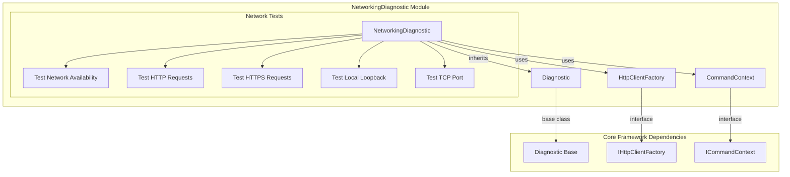
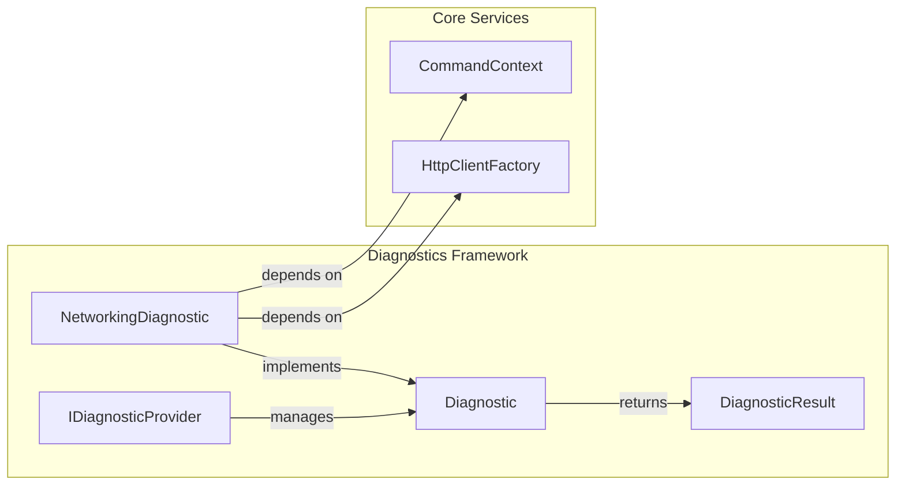
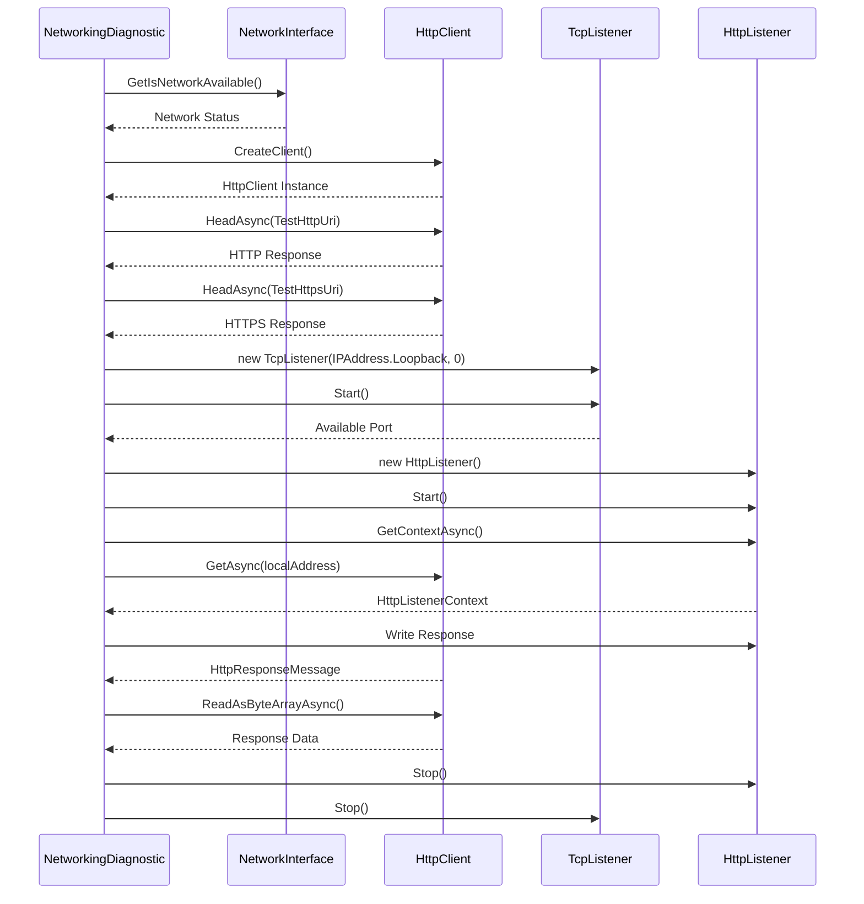
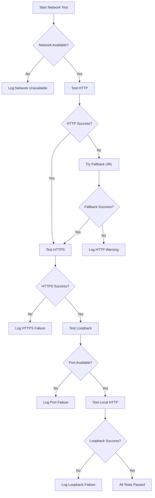

# NetworkingDiagnostic Module Documentation

## Overview

The NetworkingDiagnostic module is a specialized diagnostic component within the Git Credential Manager's diagnostics framework. It provides comprehensive network connectivity testing capabilities to help troubleshoot network-related issues that may affect Git operations and authentication processes.

## Purpose

The primary purpose of the NetworkingDiagnostic module is to:
- Verify network availability and connectivity
- Test HTTP/HTTPS stack functionality
- Validate local loopback connections
- Diagnose network-related authentication and API communication issues
- Provide detailed logging for network troubleshooting

## Architecture

### Component Structure



### Integration with Diagnostics Framework



## Core Components

### NetworkingDiagnostic Class

The `NetworkingDiagnostic` class is the main component that implements network connectivity testing functionality.

**Key Features:**
- Network availability detection
- HTTP/HTTPS connectivity testing
- Local loopback connection validation
- TCP port acquisition and testing
- Comprehensive error logging

**Constructor:**
```csharp
public NetworkingDiagnostic(ICommandContext commandContext)
```

**Main Method:**
```csharp
protected override async Task<bool> RunInternalAsync(StringBuilder log, IList<string> additionalFiles)
```

## Network Testing Process Flow



## Test Scenarios

### 1. Network Availability Test
- **Purpose**: Check if network interfaces are available
- **Method**: `NetworkInterface.GetIsNetworkAvailable()`
- **Result**: Boolean indicating network availability

### 2. HTTP Connectivity Test
- **Purpose**: Verify HTTP stack functionality
- **Test URLs**: 
  - Primary: `http://example.com`
  - Fallback: `http://httpforever.com`
- **Method**: HTTP HEAD request
- **Result**: Success/failure status with logging

### 3. HTTPS Connectivity Test
- **Purpose**: Validate HTTPS/TLS functionality
- **Test URL**: `https://example.com`
- **Method**: HTTPS HEAD request
- **Result**: Success/failure status

### 4. Local Loopback Test
- **Purpose**: Test local HTTP server/client communication
- **Process**:
  1. Acquire free TCP port
  2. Create HTTP listener on localhost
  3. Send HTTP request to local server
  4. Verify response data integrity
- **Validation**: Response content comparison

## Dependencies

### Core Framework Dependencies
- [CommandContext](Core.Application.md#command-context): Provides HTTP client factory and execution context
- [HttpClientFactory](Utilities.md#http-client-factory): Creates HTTP client instances
- [Diagnostic](Diagnostics.md#diagnostic-base): Base class for diagnostic components

### System Dependencies
- `System.Net.Http`: HTTP client functionality
- `System.Net.NetworkInformation`: Network interface detection
- `System.Net.Sockets`: TCP listener for port testing
- `System.Net`: HTTP listener for loopback testing

## Error Handling

The module implements comprehensive error handling for various network scenarios:



## Usage Examples

### Basic Usage
```csharp
var diagnostic = new NetworkingDiagnostic(commandContext);
var result = await diagnostic.RunAsync();
```

### Integration with Diagnostic Framework
```csharp
public class SystemDiagnosticProvider : IDiagnosticProvider
{
    public IEnumerable<Diagnostic> GetDiagnostics()
    {
        yield return new NetworkingDiagnostic(_commandContext);
        // Other diagnostics...
    }
}
```

## Output and Logging

The module provides detailed logging output including:
- Network availability status
- HTTP/HTTPS test results
- TCP port acquisition details
- Loopback connection validation
- Error messages and warnings

### Sample Output
```
Checking networking and HTTP stack...
Creating HTTP client... OK
IsNetworkAvailable: True
Sending HEAD request to http://example.com... OK
Sending HEAD request to https://example.com... OK
Acquiring free TCP port... OK
Testing local HTTP loopback connections...
Creating new HTTP listener for http://localhost:12345/... OK
Waiting for loopback connection... OK
Writing response... OK
Waiting for response data... OK
Loopback connection data OK
```

## Testing Considerations

### Unit Testing
- The `SendHttpRequest` method is marked as internal for testing purposes
- Mock HTTP responses for reliable testing
- Test network failure scenarios

### Integration Testing
- Test with various network configurations
- Validate proxy scenarios (see [ProxyConfiguration](Core.Application.md#proxy-configuration))
- Test firewall and security software interactions

## Related Modules

- [Diagnostics Framework](Diagnostics.md): Base diagnostic infrastructure
- [EnvironmentDiagnostic](EnvironmentDiagnostic.md): System environment diagnostics
- [GitHubApiDiagnostic](GitHubApiDiagnostic.md): GitHub-specific API diagnostics
- [MicrosoftAuthenticationDiagnostic](MicrosoftAuthenticationDiagnostic.md): Azure AD authentication diagnostics

## Configuration

The module uses the following configuration sources:
- HTTP client configuration from [HttpClientFactory](Utilities.md#http-client-factory)
- Proxy settings from [ProxyConfiguration](Core.Application.md#proxy-configuration)
- Network timeout settings from application configuration

## Security Considerations

- Uses standard HTTP methods (HEAD) for minimal data transfer
- Tests only well-known, safe endpoints
- Local loopback tests use random ports to avoid conflicts
- No sensitive data is transmitted during testing
- Follows security best practices for HTTP client usage