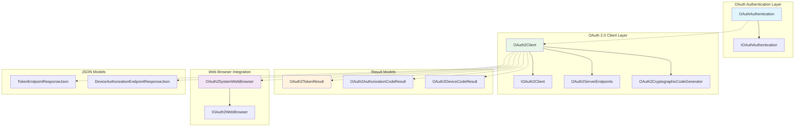
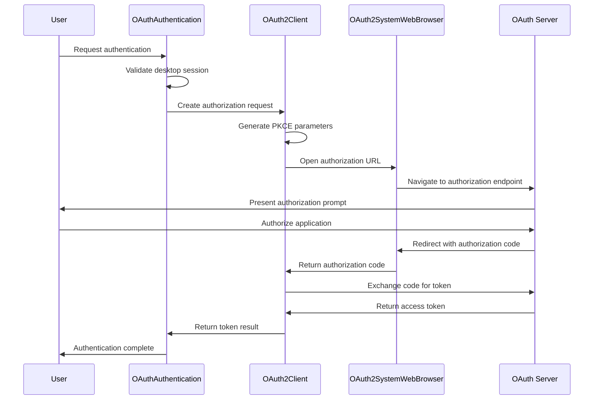
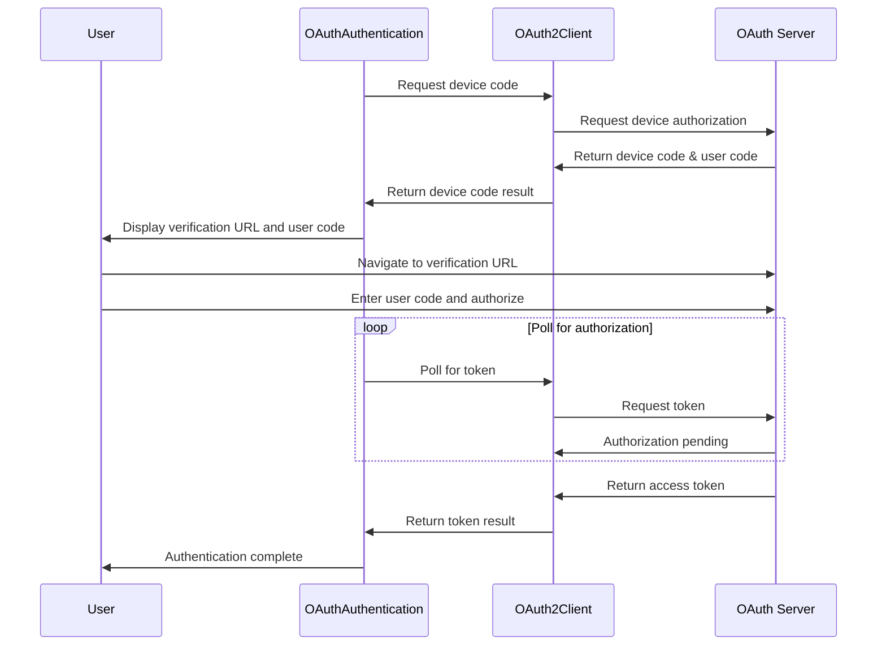
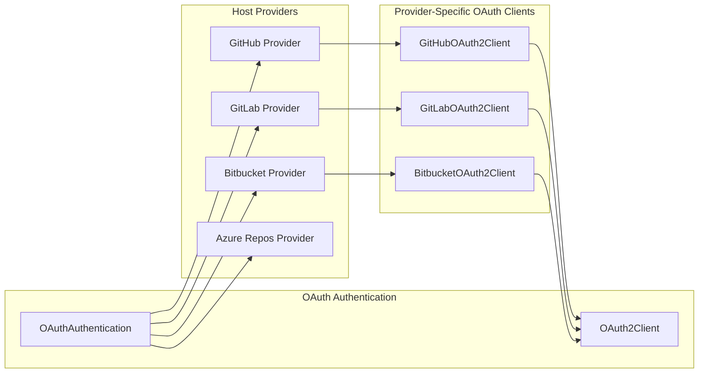

# OAuth Authentication Module

## Introduction

The OAuth Authentication module provides a comprehensive OAuth 2.0 implementation for Git Credential Manager, enabling secure authentication with various Git hosting services including GitHub, GitLab, Bitbucket, and Azure Repos. This module implements standard OAuth 2.0 flows including Authorization Code Grant with PKCE and Device Authorization Grant (RFC 8628), ensuring secure token-based authentication across different platforms and environments.

## Architecture Overview

The OAuth Authentication module is built around a layered architecture that separates concerns between authentication orchestration, OAuth protocol implementation, cryptographic operations, and user interaction management.



## Core Components

### Authentication Orchestration

#### OAuthAuthentication Class
The `OAuthAuthentication` class serves as the primary entry point for OAuth authentication operations. It inherits from `AuthenticationBase` and implements the `IOAuthAuthentication` interface, providing a unified API for different authentication modes.

**Key Responsibilities:**
- Authentication mode selection (Browser vs Device Code)
- User interaction management through multiple channels (UI, TTY, Helper)
- Integration with the broader authentication framework
- Session and environment validation

**Authentication Modes:**
```csharp
[Flags]
public enum OAuthAuthenticationModes
{
    None        = 0,
    Browser     = 1 << 0,
    DeviceCode  = 1 << 1,
    All = Browser | DeviceCode
}
```

### OAuth 2.0 Protocol Implementation

#### OAuth2Client Class
The `OAuth2Client` class implements the core OAuth 2.0 protocol logic, supporting multiple grant types and ensuring compliance with RFC 6749 and RFC 8628.

**Supported OAuth Flows:**
1. **Authorization Code Grant with PKCE**: Secure flow for applications with user interaction
2. **Device Authorization Grant**: Flow for devices with limited input capabilities
3. **Refresh Token Grant**: Token renewal mechanism

**Key Features:**
- PKCE (Proof Key for Code Exchange) support for enhanced security
- Configurable server endpoints
- Cryptographic code generation
- Comprehensive error handling with trace2 integration

#### OAuth2ServerEndpoints
Defines the OAuth 2.0 server endpoints required for authentication:
- `AuthorizationEndpoint`: URI for authorization requests
- `TokenEndpoint`: URI for token requests
- `DeviceAuthorizationEndpoint`: URI for device authorization requests (optional)

### Cryptographic Operations

#### OAuth2CryptographicCodeGenerator
Implements cryptographic operations required for secure OAuth flows:

**PKCE Implementation:**
- Code verifier generation using cryptographically secure random bytes
- Code challenge creation using SHA256 hashing
- Base64URL encoding for URL-safe transmission

**Security Features:**
- 96-byte random generation for maximum entropy
- RFC 7636 compliance for PKCE implementation
- Cryptographically secure random number generation

### User Interaction Management

#### OAuth2SystemWebBrowser
Provides system web browser integration for OAuth flows:

**Capabilities:**
- Local HTTP listener for redirect URI interception
- Automatic port selection for localhost redirects
- Customizable success/failure response pages
- HTTP listener-based request interception

**Security Considerations:**
- Loopback interface restriction for local development
- State parameter validation to prevent CSRF attacks
- Comprehensive error handling for authentication failures

### Data Models

#### OAuth2TokenResult
Represents the result of successful token acquisition:
```csharp
public class OAuth2TokenResult
{
    public string AccessToken { get; }
    public string TokenType { get; }
    public string RefreshToken { get; set; }
    public TimeSpan? ExpiresIn { get; set; }
    public string[] Scopes { get; set; }
}
```

#### OAuth2AuthorizationCodeResult
Contains authorization code and PKCE verifier for token exchange:
```csharp
public class OAuth2AuthorizationCodeResult
{
    public string Code { get; }
    public Uri RedirectUri { get; }
    public string CodeVerifier { get; }
}
```

#### OAuth2DeviceCodeResult
Represents device code authorization information:
```csharp
public class OAuth2DeviceCodeResult
{
    public string DeviceCode { get; }
    public string UserCode { get; }
    public Uri VerificationUri { get; }
    public TimeSpan PollingInterval { get; }
    public TimeSpan? ExpiresIn { get; internal set; }
}
```

## Authentication Flows

### Authorization Code Flow with PKCE



### Device Code Flow



## Integration with Host Providers

The OAuth Authentication module integrates with various Git hosting service providers:



## User Interface Integration

The module supports multiple user interaction modes:

### GUI Mode (Avalonia)
- Native desktop application UI
- OAuth mode selection dialog
- Device code display dialog
- Integration with Avalonia UI framework

### Terminal Mode (TTY)
- Command-line interface for headless environments
- Interactive menu system for mode selection
- Text-based device code display

### Helper Mode
- External helper application integration
- Command-line argument passing
- Process-based communication

## Security Features

### PKCE (Proof Key for Code Exchange)
- RFC 7636 compliant implementation
- SHA256 code challenge generation
- Protection against authorization code interception

### State Parameter Validation
- CSRF attack prevention
- Request/response correlation
- Cryptographically secure state generation

### Secure Code Generation
- Cryptographically secure random number generation
- RFC-compliant code verifier generation
- Base64URL encoding for URL safety

## Error Handling and Diagnostics

The module implements comprehensive error handling with trace2 integration:

### OAuth2Exception
- Standardized error response handling
- Detailed error information preservation
- Integration with diagnostic systems

### Trace2 Integration
- Detailed operation tracing
- Performance metrics collection
- Error context preservation

## Dependencies

The OAuth Authentication module depends on several core system components:

### Core Dependencies
- **[Core Application Framework](Core Application Framework.md)**: Provides command context, settings, and session management
- **[Authentication System](Authentication System.md)**: Base authentication functionality and interfaces
- **[UI Framework](UI Framework.md)**: User interface components for desktop interactions
- **[Cross-Platform Support](Cross-Platform Support.md)**: Platform-specific implementations

### External Dependencies
- System.Net.Http: HTTP client functionality
- System.Text.Json: JSON serialization
- System.Security.Cryptography: Cryptographic operations

## Configuration

The module supports various configuration options through the settings system:

### OAuth-Specific Settings
- Client ID and secret configuration
- Server endpoint URLs
- Redirect URI configuration
- Scope definitions

### UI Configuration
- GUI prompts enablement
- Helper application path
- Terminal prompt settings

## Platform Support

The OAuth Authentication module provides cross-platform support:

### Windows
- Integration with Windows Credential Manager
- System browser integration
- Desktop session detection

### macOS
- Keychain integration
- System browser support
- macOS-specific UI components

### Linux
- Secret Service integration
- Browser integration
- Terminal-based interactions

## Extension Points

The module provides several extension points for customization:

### Custom OAuth2Client Implementations
- Override token endpoint result creation
- Custom exception handling from responses
- Specialized HTTP request handling

### Custom Code Generators
- Alternative cryptographic implementations
- Custom nonce generation strategies
- Specialized PKCE implementations

### Custom Web Browsers
- Alternative browser implementations
- Custom redirect URI handling
- Specialized authentication flows

## Performance Considerations

### Token Caching
- Refresh token utilization
- Token lifetime management
- Automatic token renewal

### HTTP Client Management
- Connection pooling
- Request/response optimization
- Error retry mechanisms

### Cryptographic Operations
- Efficient random number generation
- Optimized hashing operations
- Memory-efficient encoding

## Best Practices

### Security Best Practices
1. Always use PKCE for authorization code flows
2. Validate state parameters in all flows
3. Use secure random number generation
4. Implement proper token storage
5. Enable comprehensive logging and monitoring

### Integration Best Practices
1. Implement proper error handling
2. Use async/await patterns consistently
3. Provide meaningful user feedback
4. Handle cancellation requests properly
5. Implement proper resource disposal

### Configuration Best Practices
1. Use environment-specific configurations
2. Implement proper secret management
3. Configure appropriate timeouts
4. Use secure redirect URIs
5. Implement proper scope management

This comprehensive documentation provides a complete understanding of the OAuth Authentication module's architecture, functionality, and integration points within the Git Credential Manager ecosystem.