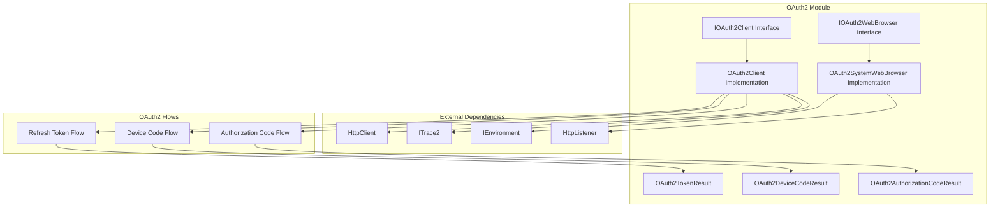
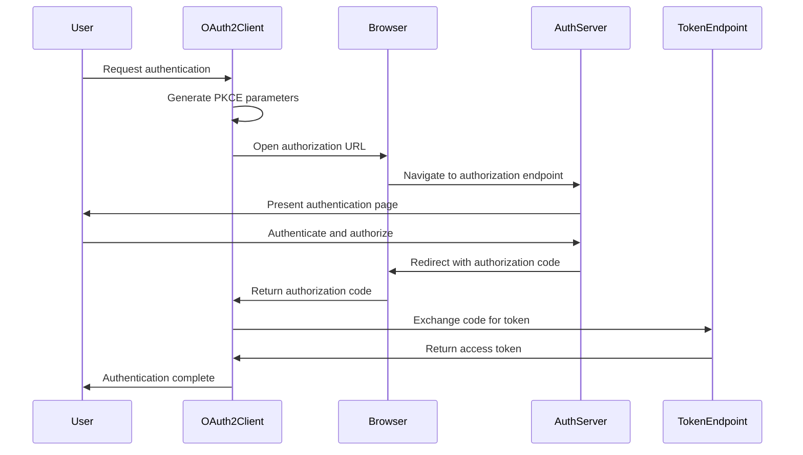
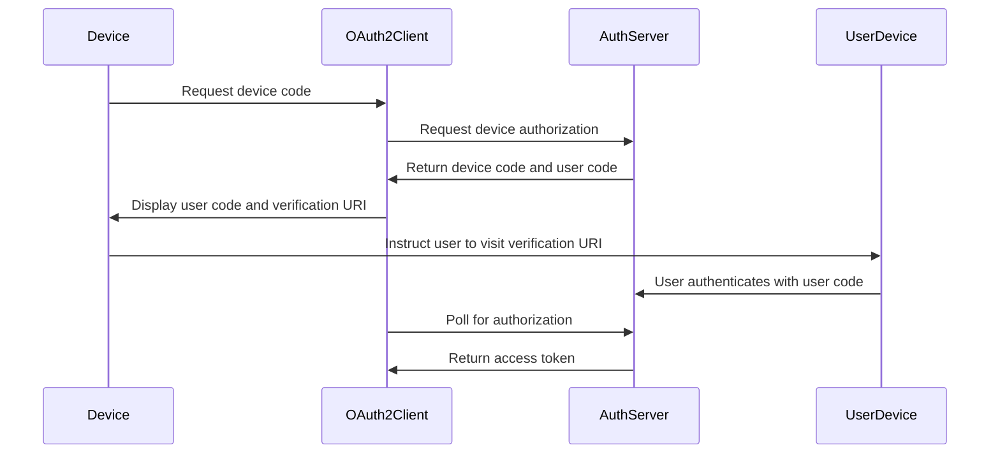
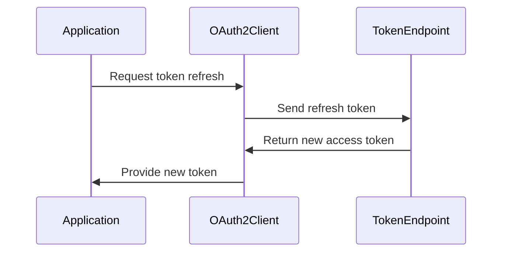
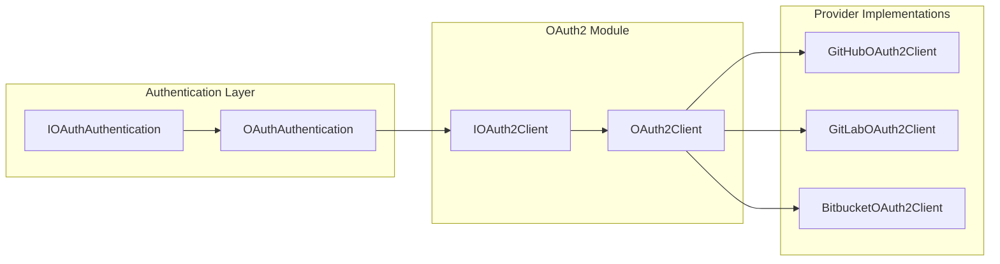

# OAuth2 Module Documentation

## Introduction

The OAuth2 module provides comprehensive OAuth 2.0 authentication capabilities for Git Credential Manager, implementing the standard OAuth 2.0 flows as defined in RFC 6749 and RFC 8628. This module enables secure authentication with Git hosting services like GitHub, GitLab, Bitbucket, and Azure Repos through standardized OAuth 2.0 protocols.

## Architecture Overview

The OAuth2 module is built around a flexible architecture that separates concerns between OAuth 2.0 protocol implementation, web browser integration, and token management. The design follows the dependency injection pattern and provides clear interfaces for extensibility.



## Core Components

### OAuth2Client

The `OAuth2Client` class is the primary implementation of the `IOAuth2Client` interface, providing the core OAuth 2.0 functionality. It supports multiple OAuth 2.0 flows including authorization code, device code, and refresh token flows.

**Key Features:**
- Implements PKCE (Proof Key for Code Exchange) for enhanced security
- Supports custom code generators for cryptographic operations
- Provides comprehensive error handling and tracing
- Configurable authentication header handling

**Dependencies:**
- [HttpClient](https://docs.microsoft.com/en-us/dotnet/api/system.net.http.httpclient) for HTTP communications
- [ITrace2](../Core.md#tracing) for diagnostic logging
- [OAuth2ServerEndpoints](OAuth2ServerEndpoints.md) for endpoint configuration

### IOAuth2WebBrowser and OAuth2SystemWebBrowser

The web browser abstraction allows the OAuth2 module to work with different browser implementations. The `OAuth2SystemWebBrowser` provides a system browser-based implementation that:

- Opens the system default browser for user authentication
- Intercepts OAuth callbacks using a local HTTP listener
- Supports custom success/failure response pages
- Handles loopback URI redirection automatically

**Key Features:**
- Automatic port selection for local HTTP listener
- Configurable response HTML pages
- Support for custom redirect URIs
- Error handling for authentication failures

### Token and Result Classes

The module defines specialized result classes for different OAuth 2.0 flows:

- **OAuth2TokenResult**: Contains access tokens, refresh tokens, and expiration information
- **OAuth2DeviceCodeResult**: Holds device code information for device authorization flow
- **OAuth2AuthorizationCodeResult**: Stores authorization codes and PKCE verification data

## OAuth 2.0 Flows Implementation

### Authorization Code Flow

The authorization code flow is the primary OAuth 2.0 flow for web applications. The implementation includes:



**Security Features:**
- PKCE implementation prevents authorization code interception
- State parameter validation prevents CSRF attacks
- Secure code verifier generation

### Device Code Flow

The device code flow (RFC 8628) enables authentication on devices with limited input capabilities:



**Features:**
- Configurable polling intervals
- Automatic retry with exponential backoff
- Support for "slow down" responses

### Refresh Token Flow

The refresh token flow allows applications to obtain new access tokens without user interaction:



## Integration with Authentication System

The OAuth2 module integrates with the broader authentication system through the [OAuthAuthentication](../Authentication.md#oauth-authentication) component, which provides a unified interface for OAuth-based authentication across different Git hosting providers.



## Error Handling and Diagnostics

The OAuth2 module implements comprehensive error handling with detailed diagnostic information:

- **OAuth2Exception**: Base exception for OAuth 2.0 errors
- **Trace2OAuth2Exception**: Integration with the tracing system for detailed error logging
- **ErrorResponseJson**: Deserialization of OAuth 2.0 error responses

Error handling includes:
- Network timeout handling with retry logic
- Invalid grant detection
- Server error responses
- State validation failures

## Security Considerations

### PKCE Implementation

The module implements PKCE (Proof Key for Code Exchange) as defined in RFC 7636:

- SHA256 code challenge method
- Cryptographically secure code verifier generation
- Automatic code challenge creation

### Secure Token Storage

Integration with the [Credential Management](../CredentialManagement.md) system ensures secure storage of:
- Access tokens
- Refresh tokens
- Client secrets

### Browser Security

The system web browser implementation includes:
- Localhost-only redirect URI support
- Automatic port selection to avoid conflicts
- Secure HTTP listener configuration
- Response validation and sanitization

## Configuration and Extensibility

### OAuth2ServerEndpoints

The module uses configurable server endpoints for different OAuth 2.0 flows:

- Authorization endpoint
- Token endpoint  
- Device authorization endpoint
- Redirect URI configuration

### Custom Code Generators

The `IOAuth2CodeGenerator` interface allows for custom cryptographic implementations:

```csharp
public interface IOAuth2CodeGenerator
{
    string CreateNonce();
    string CreatePkceCodeVerifier();
    string CreatePkceCodeChallenge(OAuth2PkceChallengeMethod method, string codeVerifier);
}
```

### Browser Extensibility

The `IOAuth2WebBrowser` interface enables custom browser implementations:

- Embedded browser integration
- Custom authentication flows
- Platform-specific browser handling

## Platform Integration

The OAuth2 module integrates with platform-specific components:

- [Environment](../Platform.md#environment) for system integration
- [Terminal](../Platform.md#terminal) for user interaction
- [Settings](../Configuration.md#settings) for configuration management

## Usage Examples

### Basic Authorization Code Flow

```csharp
var endpoints = new OAuth2ServerEndpoints
{
    AuthorizationEndpoint = new Uri("https://github.com/login/oauth/authorize"),
    TokenEndpoint = new Uri("https://github.com/login/oauth/access_token")
};

var client = new OAuth2Client(httpClient, endpoints, clientId, trace2, redirectUri);
var browser = new OAuth2SystemWebBrowser(environment, browserOptions);

var authCode = await client.GetAuthorizationCodeAsync(scopes, browser, CancellationToken.None);
var tokenResult = await client.GetTokenByAuthorizationCodeAsync(authCode, CancellationToken.None);
```

### Device Code Flow

```csharp
var deviceCode = await client.GetDeviceCodeAsync(scopes, CancellationToken.None);
// Display deviceCode.UserCode and deviceCode.VerificationUri to user
var tokenResult = await client.GetTokenByDeviceCodeAsync(deviceCode, CancellationToken.None);
```

## Related Documentation

- [Authentication Module](../Authentication.md) - Overview of authentication system
- [Credential Management](../CredentialManagement.md) - Secure credential storage
- [Core Module](../Core.md) - Core system components and tracing
- [Platform Module](../Platform.md) - Platform-specific integrations
- [Configuration Module](../Configuration.md) - System configuration and settings