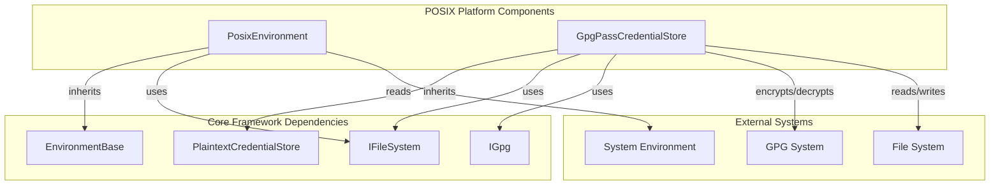
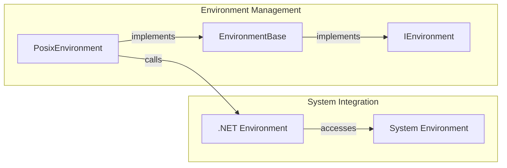
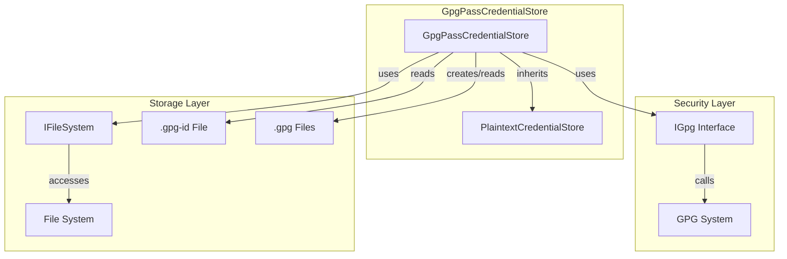
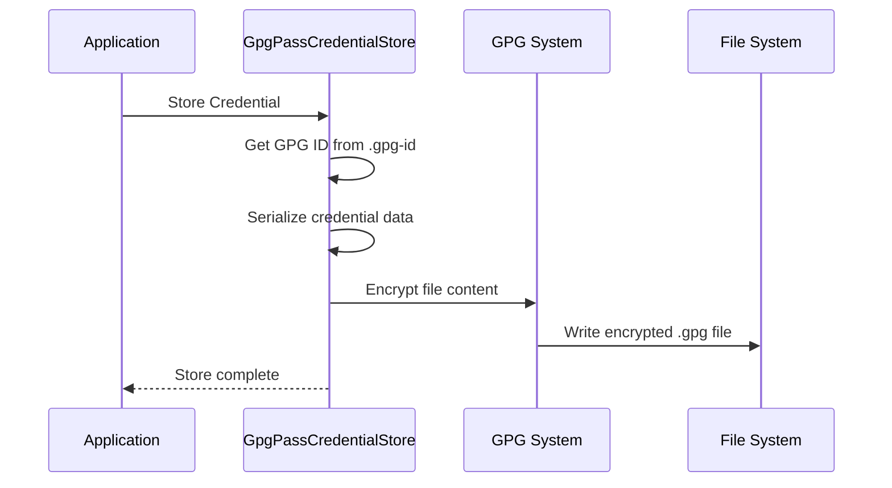
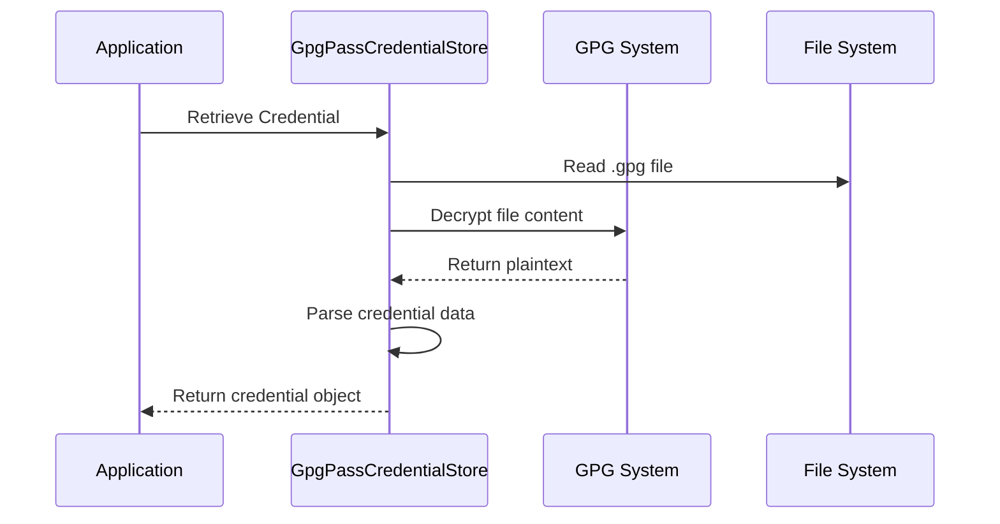
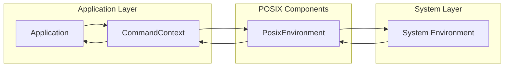
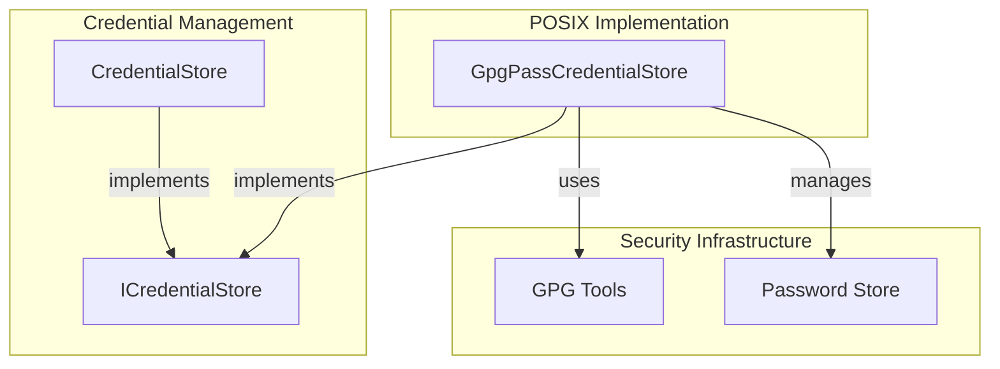
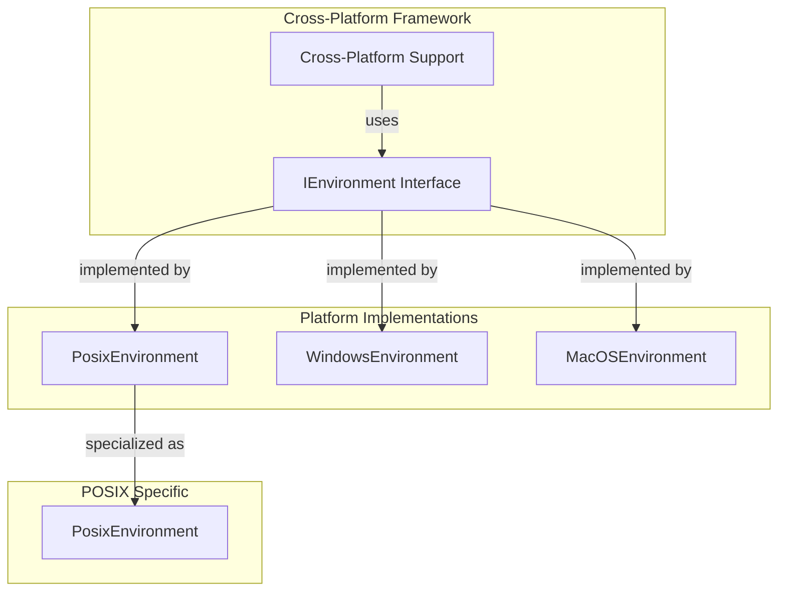
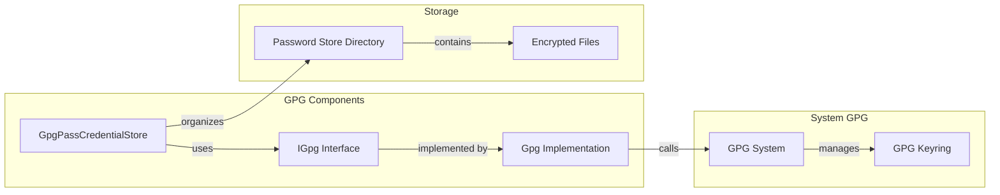

# POSIX Platform Components Module

## Introduction

The POSIX Platform Components module provides essential cross-platform functionality for Unix-like operating systems (Linux, macOS, and other POSIX-compliant systems) within the Git Credential Manager ecosystem. This module implements platform-specific abstractions for environment management and secure credential storage using GPG (GNU Privacy Guard) encryption.

The module serves as a critical bridge between the core application framework and POSIX-compliant operating systems, ensuring consistent behavior across different Unix-like platforms while leveraging native security features like GPG for credential protection.

## Architecture Overview



## Core Components

### PosixEnvironment

The `PosixEnvironment` class provides POSIX-specific environment variable management functionality. It extends the base `EnvironmentBase` class to implement Unix-like environment handling, including path variable splitting using colon separators characteristic of POSIX systems.

**Key Responsibilities:**
- Environment variable management for POSIX systems
- Path variable parsing using colon separators
- Integration with the system environment through standard .NET Environment APIs

**Architecture Integration:**


### GpgPassCredentialStore

The `GpgPassCredentialStore` class implements a secure credential storage mechanism using the standard Unix password store format (pass) with GPG encryption. This provides a highly secure method for storing credentials that integrates seamlessly with existing Unix security infrastructure.

**Key Responsibilities:**
- GPG-encrypted credential storage and retrieval
- Integration with standard Unix password store format
- Secure file-based credential management
- Password store initialization and validation

**Security Architecture:**


## Data Flow

### Credential Storage Flow


### Credential Retrieval Flow


## Component Interactions

### Environment Variable Management


### Credential Store Integration


## Platform Integration

### POSIX Environment Integration
The `PosixEnvironment` component integrates with the broader cross-platform support framework:



### GPG Integration Architecture


## Security Considerations

### GPG Encryption Security
- **Key Management**: Relies on user's GPG keyring for encryption/decryption
- **File Format**: Uses standard Unix password store format for compatibility
- **Access Control**: Inherits file system permissions for access control
- **Encryption**: All credentials are encrypted before storage

### Environment Security
- **Variable Isolation**: Environment variables are isolated per process
- **Path Security**: Path manipulation methods are currently not implemented (throw NotImplementedException)
- **System Integration**: Uses standard .NET environment APIs for security

## Dependencies

### Internal Dependencies
- **EnvironmentBase**: Base class for environment management
- **PlaintextCredentialStore**: Base class for credential storage
- **IFileSystem**: File system abstraction
- **IGpg**: GPG operations interface

### External Dependencies
- **GPG System**: Requires GPG to be installed and configured
- **File System**: Standard POSIX file system operations
- **.NET Environment**: System.Environment for environment variable access

## Usage Patterns

### Environment Variable Access
```csharp
// Typical usage through dependency injection
IEnvironment environment = new PosixEnvironment(fileSystem);
string path = environment.GetEnvironmentVariable("PATH");
```

### Credential Storage
```csharp
// GPG-based credential storage
var credentialStore = new GpgPassCredentialStore(
    fileSystem, 
    gpg, 
    storeRoot,
    namespace
);
// Credentials are automatically encrypted/decrypted using GPG
```

## Integration with Other Modules

### Authentication System Integration
The POSIX components integrate with the authentication system through the credential storage mechanism:

- [Authentication System](Authentication%20System.md) uses GPG-encrypted credential storage
- [Credential Management](Credential%20Management.md) leverages POSIX-specific storage implementations
- [Cross-Platform Support](Cross-Platform%20Support.md) provides the broader platform abstraction

### Git Integration
POSIX environment handling is crucial for Git operations:

- [Git Integration](Git%20Integration.md) relies on proper environment variable management
- Environment variables affect Git configuration and behavior
- Credential storage integrates with Git's credential helper system

## Configuration

### GPG Password Store Setup
The GPG password store requires proper initialization:

1. **GPG Key Generation**: User must have a GPG key pair
2. **Password Store Initialization**: `.gpg-id` file must exist in store root
3. **Directory Structure**: Store follows standard pass format
4. **Permissions**: Proper file system permissions must be set

### Environment Configuration
POSIX environment variables are managed through standard system mechanisms:

- **PATH Handling**: Uses colon-separated path format
- **Variable Propagation**: Follows POSIX environment variable inheritance
- **System Integration**: Respects system-level environment settings

## Error Handling

### GPG Operations
- **Missing GPG ID**: Throws exception if `.gpg-id` file is missing
- **Encryption Failures**: GPG errors are propagated to the caller
- **File Access**: File system errors are handled through IFileSystem abstraction

### Environment Operations
- **Path Operations**: Currently throws NotImplementedException for path manipulation
- **Variable Access**: Standard .NET environment exceptions are propagated

## Future Considerations

### Path Management
The current implementation does not support path manipulation operations. Future enhancements could include:

- **PATH Modification**: Implement AddDirectoryToPath and RemoveDirectoryFromPath
- **Path Validation**: Ensure path entries are valid and accessible
- **Target Support**: Implement different targets (Process, User, Machine)

### GPG Enhancements
Potential improvements to GPG integration:

- **Key Validation**: Validate GPG keys before use
- **Multiple Recipients**: Support for multiple GPG recipients
- **Key Generation**: Automated GPG key generation for new users
- **Backup/Restore**: Support for password store backup and restoration

This module provides essential POSIX platform support while maintaining security and compatibility with existing Unix infrastructure. The GPG-based credential storage offers enterprise-grade security suitable for development environments that require robust credential protection.