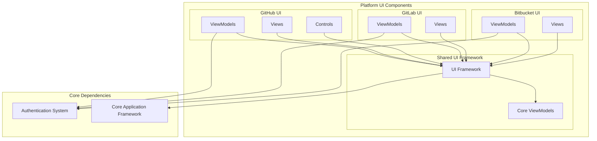
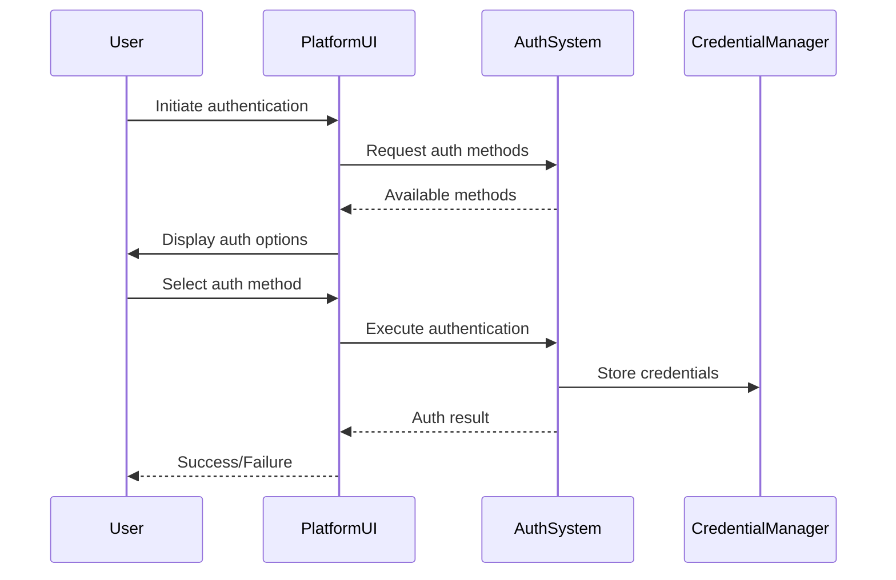

# Platform UI Components Module

## Overview

The Platform UI Components module provides user interface components for authentication and credential management across different Git hosting platforms. This module serves as the presentation layer for the Git Credential Manager, offering platform-specific UI implementations for GitHub, GitLab, and Bitbucket.

## Purpose

The module's primary purpose is to:
- Provide consistent, platform-specific authentication user interfaces
- Handle various authentication flows (OAuth, Basic Auth, Token-based, Device Code)
- Manage user interactions during credential collection
- Support multi-factor authentication scenarios
- Offer reusable UI controls for common authentication patterns

## Architecture

## Component Structure

### GitHub UI Components
The GitHub UI components provide the most comprehensive set of authentication interfaces. For detailed documentation, see [GitHub UI Components](GitHub UI Components.md).

**Key Components:**
- **ViewModels**: Handle authentication logic and user interactions
  - `CredentialsViewModel`: Main authentication interface supporting multiple auth modes
  - `DeviceCodeViewModel`: Device code authentication flow
  - `TwoFactorViewModel`: Two-factor authentication handling
  - `SelectAccountViewModel`: Account selection for multi-user scenarios

- **Views**: Avalonia-based UI implementations
  - `CredentialsView`: Main authentication view with tabbed interface
  - `DeviceCodeView`: Device code display and verification
  - `TwoFactorView`: 6-digit code input interface
  - `SelectAccountView`: Account selection list

- **Controls**: Reusable UI components
  - `SixDigitInput`: Specialized 6-digit code input control
  - `HorizontalShadowDivider`: Visual separator component

### GitLab UI Components
GitLab UI provides a streamlined authentication interface. For detailed documentation, see [GitLab UI Components](GitLab UI Components.md).

**Key Components:**
- **ViewModels**: Authentication logic for GitLab
  - `CredentialsViewModel`: Supports browser, token, and basic authentication

- **Views**: GitLab-specific UI implementations
  - `CredentialsView`: Tabbed authentication interface

### Bitbucket UI Components
Bitbucket UI components handle Atlassian's authentication requirements. For detailed documentation, see [Bitbucket UI Components](Bitbucket UI Components.md).

**Key Components:**
- **ViewModels**: Bitbucket authentication logic
  - `CredentialsViewModel`: OAuth and basic authentication support

- **Views**: Bitbucket-specific UI
  - `CredentialsView`: Authentication interface with OAuth and basic auth options

## Key Features

### Multi-Platform Authentication Support
Each platform component supports different authentication methods:

- **GitHub**: Browser OAuth, Device Code, Personal Access Token, Basic Authentication
- **GitLab**: Browser OAuth, Personal Access Token, Basic Authentication  
- **Bitbucket**: OAuth, Basic Authentication

### Consistent User Experience
All platform UIs follow consistent patterns:
- Tab-based authentication method selection
- Platform-specific branding and styling
- Responsive focus management
- Accessibility considerations

### Reusable Components
The module provides reusable controls that can be shared across platforms:
- Six-digit input control for 2FA codes
- Focus management interfaces
- Common visual elements

## Dependencies

The Platform UI Components module depends on:

1. **[UI Framework](UI Framework.md)**: Base UI infrastructure, view models, and controls
2. **[Core Application Framework](Core Application Framework.md)**: Environment, process management, and core services
3. **[Authentication System](Authentication System.md)**: Authentication logic and providers

## Integration Points

## Platform-Specific Implementations

### GitHub
- Comprehensive authentication flow support
- Enterprise GitHub URL handling
- Multi-account selection
- Advanced 2FA support with SMS/app options

### GitLab
- Simplified authentication interface
- Self-hosted GitLab support
- Token-based authentication emphasis

### Bitbucket
- Atlassian-specific OAuth implementation
- Cloud and Data Center differentiation
- Integrated help links for password reset

## UI/UX Considerations

### Focus Management
All views implement `IFocusable` to ensure proper keyboard navigation and accessibility:
- Automatic focus on first input field
- Platform-specific focus workarounds (macOS compatibility)
- Tab order optimization

### Visual Design
- Consistent styling across platforms
- Platform-specific color schemes and branding
- Responsive layout for different screen sizes
- Clear visual hierarchy and affordances

### Error Handling
- Input validation with real-time feedback
- Clear error messaging
- Recovery options (forgot password, help links)

## Security Considerations

- Secure credential input handling
- No credential storage in UI components
- Clear indication of secure connections
- Protection against credential leakage

## Testing and Quality Assurance

The module includes:
- Design-time support for XAML designers
- Platform-specific testing considerations
- Accessibility compliance testing
- Cross-platform UI consistency validation

## Future Enhancements

Potential areas for expansion:
- Additional platform support (Azure DevOps, etc.)
- Enhanced accessibility features
- Dark mode support
- Localization for multiple languages
- Biometric authentication integration