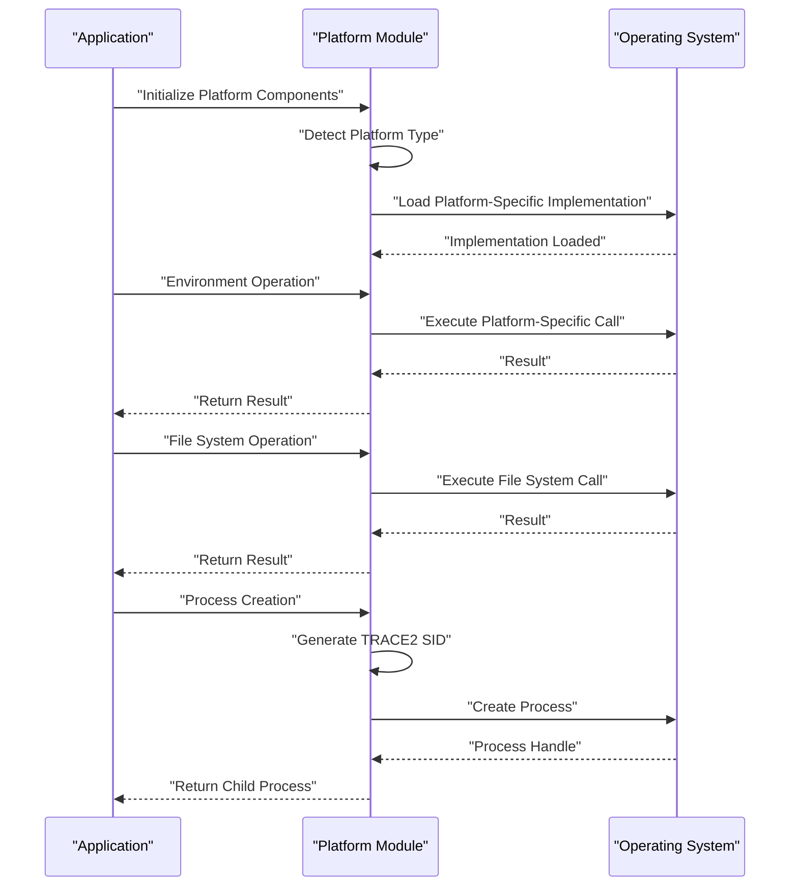
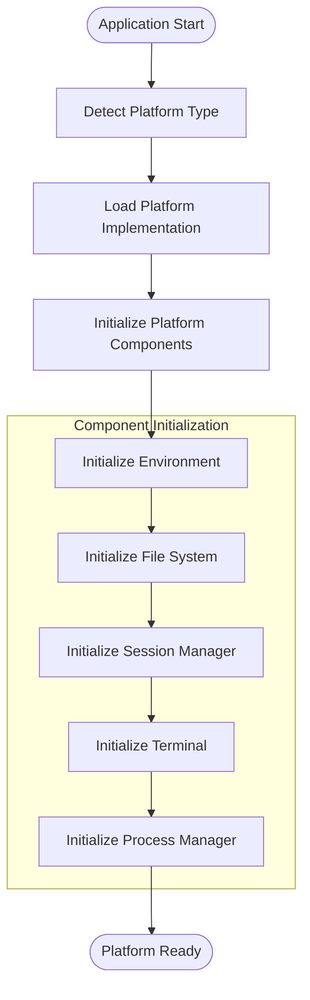

# Platform Module Documentation

## Introduction

The Platform module provides the foundational abstractions and implementations for cross-platform compatibility in the Git Credential Manager (GCM). It encapsulates platform-specific operations and provides a unified interface for environment management, file system operations, session management, terminal interactions, process management, and platform detection utilities.

This module serves as the core infrastructure layer that enables GCM to operate consistently across Windows, macOS, and Linux environments while leveraging platform-specific capabilities where needed.

## Architecture Overview

The Platform module is built around a set of core interfaces that define platform-agnostic operations, with concrete implementations provided for each supported operating system. The architecture follows the dependency inversion principle, allowing higher-level components to depend on abstractions rather than concrete implementations.

```mermaid
graph TB
    subgraph "Platform Module Core"
        IEnvironment["IEnvironment"]
        IFileSystem["IFileSystem"]
        ISessionManager["ISessionManager"]
        ITerminal["ITerminal"]
        IProcessManager["IProcessManager"]
        PlatformInformation["PlatformInformation"]
    end

    subgraph "Platform Implementations"
        WindowsEnvironment["WindowsEnvironment"]
        WindowsFileSystem["WindowsFileSystem"]
        WindowsSessionManager["WindowsSessionManager"]
        WindowsTerminal["WindowsTerminal"]
        WindowsProcessManager["WindowsProcessManager"]
        
        MacOSEnvironment["MacOSEnvironment"]
        MacOSFileSystem["MacOSFileSystem"]
        MacOSSessionManager["MacOSSessionManager"]
        MacOSTerminal["MacOSTerminal"]
        
        LinuxEnvironment["LinuxEnvironment"]
        LinuxFileSystem["LinuxFileSystem"]
        LinuxSessionManager["LinuxSessionManager"]
        LinuxTerminal["LinuxTerminal"]
    end

    subgraph "Platform Detection"
        PlatformUtils["PlatformUtils"]
    end

    IEnvironment --> WindowsEnvironment
    IEnvironment --> MacOSEnvironment
    IEnvironment --> LinuxEnvironment
    
    IFileSystem --> WindowsFileSystem
    IFileSystem --> MacOSFileSystem
    IFileSystem --> LinuxFileSystem
    
    ISessionManager --> WindowsSessionManager
    ISessionManager --> MacOSSessionManager
    ISessionManager --> LinuxSessionManager
    
    ITerminal --> WindowsTerminal
    ITerminal --> MacOSTerminal
    ITerminal --> LinuxTerminal
    
    PlatformUtils --> PlatformInformation
```

## Core Components

### Environment Management (IEnvironment)

The `IEnvironment` interface provides a comprehensive abstraction for environment variable management and executable discovery. It encapsulates platform-specific environment handling while providing a consistent API for:

- Environment variable access and modification
- PATH manipulation and executable location
- Cross-platform path resolution

Key features:
- **Lazy loading**: Environment variables are loaded on-demand and cached
- **PATH manipulation**: Add/remove directories from PATH with platform-specific handling
- **Executable discovery**: Locate executables on PATH with cross-platform compatibility
- **Environment variable targeting**: Support for Process, User, and Machine-level variables

### File System Abstraction (IFileSystem)

The `IFileSystem` interface provides a unified API for file system operations across platforms. It handles platform-specific path conventions and provides essential file operations:

- **Path comparison**: Cross-platform path equality checking with symbolic link awareness
- **User directories**: Standardized access to user home and data directories
- **File operations**: Create, read, write, and delete files and directories
- **Enumeration**: List files and directories with pattern matching support

### Session Management (ISessionManager)

The `ISessionManager` interface determines the capabilities of the current user session, particularly regarding UI and web browser availability:

- **Desktop session detection**: Determine if the session supports desktop UI
- **Web browser availability**: Check if a web browser can be launched
- **Session context**: Provide session-specific capabilities to authentication flows

### Terminal Interface (ITerminal)

The `ITerminal` interface provides a simple abstraction for terminal-based user interactions:

- **Output**: Write messages to the terminal
- **Input**: Prompt for user input with optional masking for secrets
- **Cross-platform**: Consistent behavior across Windows, macOS, and Linux terminals

### Process Management (IProcessManager)

The `IProcessManager` interface handles process creation and management with integrated tracing support:

- **Process creation**: Create child processes with configurable parameters
- **TRACE2 integration**: Automatic session ID generation and depth tracking
- **Shell execution**: Support for both direct execution and shell-based process creation

### Platform Detection and Utilities (PlatformUtils)

The `PlatformUtils` class provides comprehensive platform detection and utility functions:

- **OS detection**: Identify Windows, macOS, Linux, and POSIX compliance
- **Version information**: Retrieve detailed OS version information
- **Architecture detection**: CPU architecture identification
- **Privilege detection**: Determine if running with elevated privileges
- **Dev Box detection**: Special handling for Windows Dev Box environments
- **Entry path resolution**: Cross-platform native executable path discovery

## Platform-Specific Implementations

### Windows Implementation

The Windows platform implementation leverages Windows-specific APIs and conventions:

- **Environment**: Windows registry-based environment variable management
- **File System**: NTFS-specific path handling and case-insensitive comparisons
- **Session Management**: Windows session detection and UI capability checks
- **Terminal**: Windows console API integration
- **Process Management**: Windows process creation with proper security contexts

### macOS Implementation

The macOS platform implementation follows macOS conventions and APIs:

- **Environment**: macOS environment variable handling with launchd integration
- **File System**: HFS+/APFS path handling with case sensitivity awareness
- **Session Management**: macOS session and UI detection
- **Terminal**: macOS TTY device handling
- **Keychain Integration**: Native macOS Keychain support for credential storage

### Linux Implementation

The Linux platform implementation supports various distributions and desktop environments:

- **Environment**: Linux environment variable handling with shell integration
- **File System**: Ext4/Btrfs path handling with case sensitivity
- **Session Management**: X11/Wayland session detection
- **Terminal**: Linux TTY and PTY device handling
- **Secret Service**: D-Bus Secret Service integration for credential storage

## Data Flow and Interactions

## Integration with Other Modules

The Platform module serves as the foundation for all other modules in the Git Credential Manager:

### Authentication Module Dependencies
- **Environment**: Authentication providers use environment variables for configuration
- **Session Management**: Determines available authentication methods based on session capabilities
- **Terminal**: Provides user interaction for credential prompts

### Credential Management Dependencies
- **File System**: Credential storage and retrieval operations
- **Platform Detection**: Determines appropriate credential store implementation
- **Process Management**: Spawns helper processes for credential operations

### Configuration Dependencies
- **Environment**: Configuration sources from environment variables
- **File System**: Configuration file reading and writing
- **Platform Detection**: Platform-specific configuration defaults

## Process Flow

## Key Design Patterns

### 1. Abstract Factory Pattern
The Platform module uses the abstract factory pattern to create platform-specific implementations of core interfaces. This allows the application to work with platform-agnostic interfaces while the concrete implementations handle platform-specific details.

### 2. Strategy Pattern
Different platform implementations employ the strategy pattern to provide alternative algorithms for the same operations. For example, path comparison strategies differ between Windows (case-insensitive) and POSIX systems (case-sensitive).

### 3. Dependency Injection
All platform components are designed to be injected into dependent classes, promoting loose coupling and testability. This allows for easy mocking of platform operations in unit tests.

### 4. Extension Methods
The module provides extension methods to enhance the core interfaces with additional functionality while maintaining backward compatibility and clean API design.

## Error Handling and Resilience

The Platform module implements comprehensive error handling strategies:

- **Graceful degradation**: Platform detection failures result in safe defaults
- **Exception translation**: Platform-specific exceptions are translated to common exception types
- **Validation**: Input validation prevents platform-specific errors
- **Fallback mechanisms**: Multiple strategies for critical operations like executable discovery

## Performance Considerations

- **Lazy initialization**: Environment variables and other expensive operations are loaded on-demand
- **Caching**: Platform information is cached to avoid repeated system calls
- **Minimal allocations**: Efficient string handling and path operations
- **Native optimizations**: Platform-specific optimizations where available

## Security Considerations

- **Path traversal protection**: File system operations validate paths to prevent directory traversal
- **Environment isolation**: Sensitive environment variables are handled securely
- **Process security**: Process creation follows security best practices
- **Privilege detection**: Awareness of elevated privileges for appropriate security warnings

## Testing and Maintainability

The Platform module is designed for testability:

- **Interface-based design**: All major components are interface-based for easy mocking
- **Platform abstraction**: Test code can run on any platform by using appropriate implementations
- **Dependency injection**: Facilitates unit testing with mock implementations
- **Clear separation of concerns**: Each interface has a single, well-defined responsibility

This comprehensive platform abstraction enables the Git Credential Manager to provide consistent behavior across all supported platforms while leveraging platform-specific capabilities where beneficial.