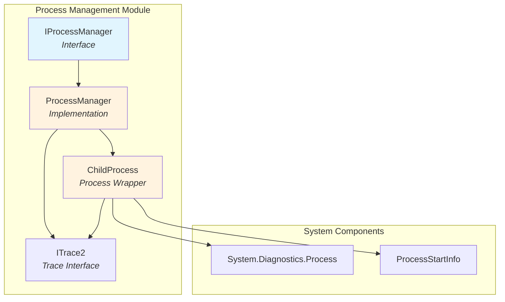
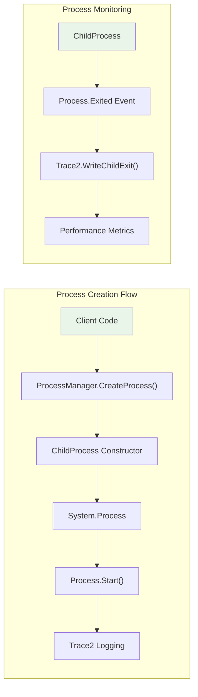
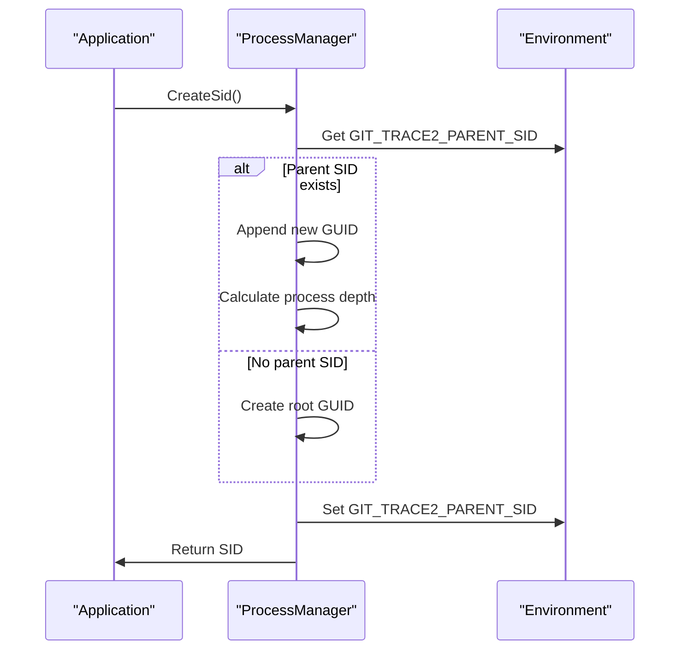
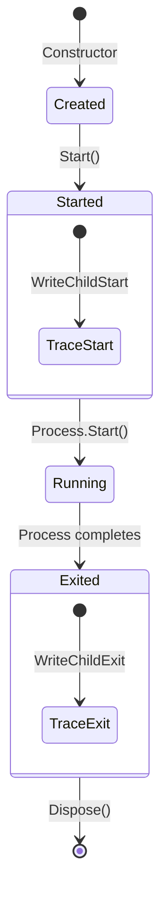
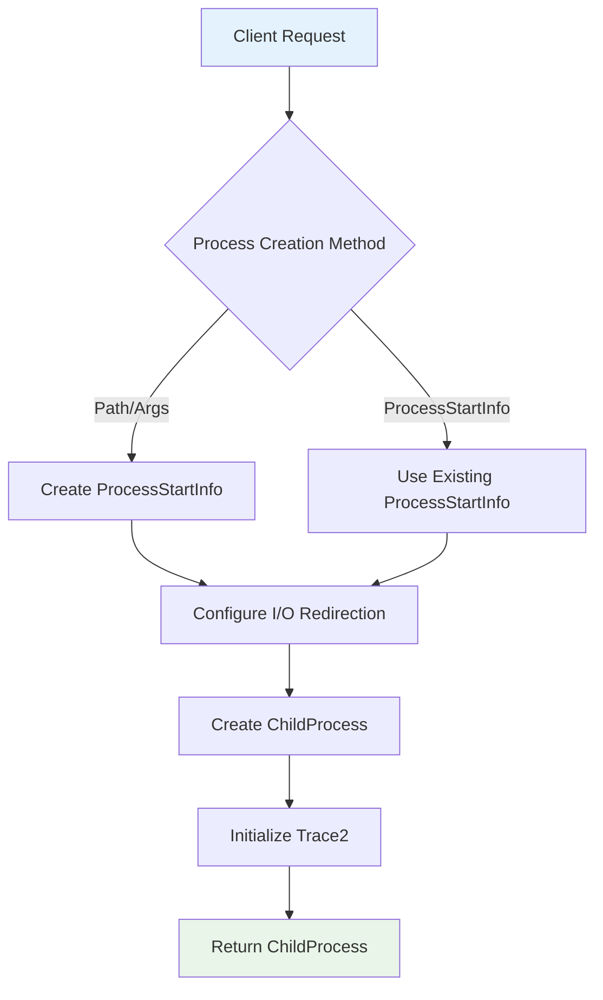
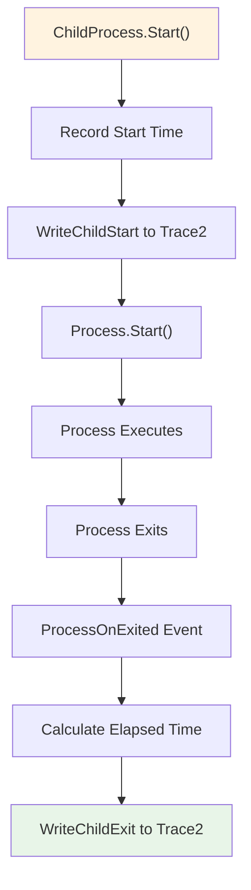

# Process Management Module

The Process Management module provides a robust framework for creating, managing, and monitoring child processes within the Git Credential Manager (GCM) system. It offers a unified interface for process creation with integrated tracing capabilities and resource management.

## Overview

The Process Management module serves as the foundation for executing external processes in a controlled and observable manner. It provides essential functionality for:

- **Process Creation**: Standardized process creation with configurable parameters
- **Process Monitoring**: Real-time tracking of process lifecycle events
- **Resource Management**: Proper cleanup and disposal of process resources
- **Trace Integration**: Seamless integration with the GCM tracing system for debugging and diagnostics

## Architecture

### Core Components



### Component Relationships



## Key Components

### IProcessManager Interface

The `IProcessManager` interface defines the contract for process creation operations:

- **CreateProcess(string, string, bool, string)**: Creates a process with specified executable path, arguments, shell execution flag, and working directory
- **CreateProcess(ProcessStartInfo)**: Creates a process using a pre-configured ProcessStartInfo object

### ProcessManager Class

The `ProcessManager` class implements `IProcessManager` and provides:

- **Trace2 Integration**: Automatic integration with the GCM tracing system
- **Session Management**: Support for TRACE2 session IDs and process depth tracking
- **Process Configuration**: Standardized process configuration with redirected I/O streams

#### Session ID Management

The ProcessManager implements a sophisticated session tracking system:



### ChildProcess Class

The `ChildProcess` class wraps the System.Process with additional functionality:

- **Lifecycle Management**: Automatic start and exit time tracking
- **Resource Disposal**: Proper cleanup of process resources
- **Event Handling**: Process exit event handling with trace logging
- **Stream Access**: Direct access to process input/output streams

#### Process Lifecycle



## Data Flow

### Process Creation Data Flow



### Process Execution and Monitoring



## Integration with Other Modules

### Trace2 Module Integration

The Process Management module has deep integration with the [Trace2](Trace2.md) module:

- **Session Tracking**: Maintains TRACE2 session IDs across process boundaries
- **Performance Metrics**: Records process start/stop times and exit codes
- **Process Hierarchy**: Tracks process depth for nested process execution

### Cross-Platform Support

The module integrates with platform-specific components:

- **Windows**: `WindowsProcessManager` extends ProcessManager for Windows-specific functionality
- **macOS**: `MacOSProcessManager` provides macOS-specific process management
- **Linux**: `LinuxProcessManager` handles Linux-specific process requirements

## Usage Patterns

### Basic Process Creation

```csharp
// Create process manager with trace2
var processManager = new ProcessManager(trace2);

// Create and start a process
var childProcess = processManager.CreateProcess(
    path: "/usr/bin/git",
    args: "version",
    useShellExecute: false,
    workingDirectory: "/tmp"
);

childProcess.Start(Trace2ProcessClass.Git);
childProcess.WaitForExit();
```

### Process with Custom Configuration

```csharp
var psi = new ProcessStartInfo
{
    FileName = "git",
    Arguments = "config --list",
    RedirectStandardInput = true,
    RedirectStandardOutput = true,
    RedirectStandardError = false,
    UseShellExecute = false,
    WorkingDirectory = Environment.CurrentDirectory
};

var childProcess = processManager.CreateProcess(psi);
childProcess.Start(Trace2ProcessClass.Git);

// Read output
string output = childProcess.StandardOutput.ReadToEnd();
childProcess.WaitForExit();
```

## Error Handling and Resource Management

### Disposal Pattern

The `ChildProcess` class implements the `DisposableObject` pattern to ensure proper cleanup:

- **Event Unsubscription**: Removes process exit event handlers
- **Process Disposal**: Properly disposes the underlying System.Process
- **Resource Cleanup**: Ensures all resources are released

### Exception Handling

The module handles various error scenarios:

- **Process Creation Failures**: Proper exception propagation
- **Invalid Arguments**: Argument validation with descriptive error messages
- **Resource Constraints**: Graceful handling of system resource limitations

## Performance Considerations

### Memory Management

- **Stream Management**: Proper handling of redirected streams to prevent memory leaks
- **Event Handler Cleanup**: Automatic removal of event handlers to prevent memory retention
- **Process Resource Cleanup**: Ensures process handles are properly released

### Trace2 Overhead

- **Minimal Performance Impact**: Trace2 logging is designed for minimal overhead
- **Async Operation**: Process exit events are handled asynchronously
- **Efficient String Operations**: Uses `AsSpan()` for string processing performance

## Security Considerations

### Process Execution

- **Shell Execution Control**: Explicit control over shell execution to prevent injection attacks
- **Working Directory Validation**: Proper handling of working directory paths
- **Argument Escaping**: Responsibility for proper argument escaping lies with the caller

### Environment Variables

- **Session ID Isolation**: Session IDs are isolated per process hierarchy
- **Environment Propagation**: Controlled propagation of environment variables

## Testing and Diagnostics

### Unit Testing

The module is designed for testability:

- **Interface-Based Design**: `IProcessManager` allows for easy mocking
- **Dependency Injection**: Trace2 dependency can be mocked for testing
- **Isolated Components**: Each component can be tested in isolation

### Diagnostic Support

Integration with the [Diagnostics](Diagnostics.md) module provides:

- **Process Execution Tracking**: Detailed logs of process creation and execution
- **Performance Monitoring**: Execution time tracking for performance analysis
- **Error Reporting**: Comprehensive error reporting for failed processes

## Future Enhancements

### Potential Improvements

- **Async Process Support**: Enhanced async/await support for process operations
- **Process Pooling**: Reusable process pools for frequently executed commands
- **Advanced Monitoring**: CPU and memory usage monitoring for child processes
- **Timeout Management**: Built-in timeout support for long-running processes

### API Evolution

The module is designed to evolve while maintaining backward compatibility:

- **Interface Stability**: `IProcessManager` interface remains stable
- **Extension Points**: Virtual methods allow for customization
- **New Features**: Additional features can be added without breaking existing code