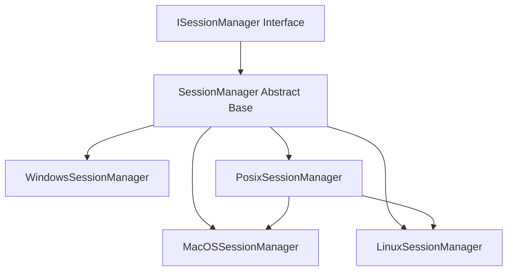
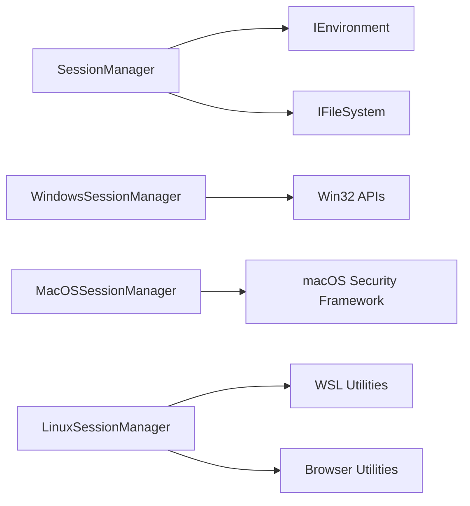
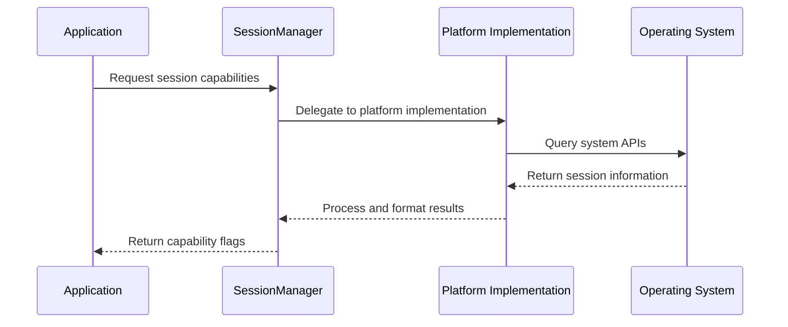
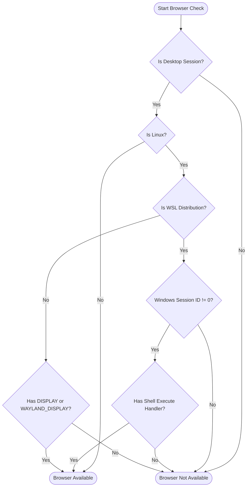

# Session Management Integration Module

## Overview

The Session Management Integration module provides a cross-platform abstraction for determining the capabilities of the current user session, particularly focusing on UI and web browser availability. This module is essential for applications that need to adapt their behavior based on the runtime environment, such as deciding whether to show interactive prompts or fall back to command-line interfaces.

## Purpose and Core Functionality

The module serves as a critical component in the Git Credential Manager ecosystem by:

- **Session Capability Detection**: Determining if the current session supports desktop UI interactions
- **Web Browser Availability**: Assessing whether a web browser can be launched for authentication flows
- **Cross-Platform Consistency**: Providing a unified interface across Windows, macOS, and Linux environments
- **Authentication Flow Optimization**: Enabling intelligent decisions about authentication methods based on session capabilities

## Architecture

### Component Hierarchy



### Core Components

#### ISessionManager Interface
The primary contract defining session management capabilities:
- `IsDesktopSession`: Determines if the session can display UI
- `IsWebBrowserAvailable`: Indicates web browser accessibility

#### SessionManager Abstract Base
Provides common functionality and dependency injection for environment and file system abstractions.

#### Platform-Specific Implementations
- **WindowsSessionManager**: Uses Win32 APIs to detect window station visibility
- **MacOSSessionManager**: Leverages macOS Security Framework for session analysis
- **LinuxSessionManager**: Checks for X11/Wayland displays and WSL-specific browser capabilities
- **PosixSessionManager**: Base class for POSIX systems with DISPLAY environment variable checks

## Dependencies and Integration

### Required Dependencies


### Integration Points
- **[Core Application Framework](Core Application Framework.md)**: Provides IEnvironment and IFileSystem abstractions
- **[Authentication System](Authentication System.md)**: Uses session capabilities to determine authentication flow
- **[UI Framework](UI Framework.md)**: Relies on session detection for UI display decisions

## Data Flow

### Session Capability Detection Flow


### Web Browser Availability Check


## Platform-Specific Implementation Details

### Windows Implementation
- **API**: Uses `GetProcessWindowStation()` and `GetUserObjectInformation()` Win32 APIs
- **Logic**: Checks if the window station has the `WSF_VISIBLE` flag
- **Fallback**: Returns true optimistically if APIs are unavailable (e.g., Windows Nano)

### macOS Implementation
- **API**: Utilizes `SecurityFramework.SessionGetInfo()` with caller security session
- **Logic**: Checks for `SessionHasGraphicAccess` flag indicating Quartz support
- **Fallback**: Falls back to X11 display detection if native graphics unavailable

### Linux Implementation
- **Environment Variables**: Checks `DISPLAY` and `WAYLAND_DISPLAY`
- **WSL Support**: Special handling for Windows Subsystem for Linux
- **Session Detection**: Validates Windows session ID for WSL browser launching
- **Shell Integration**: Requires shell execute handler for cross-OS browser launching

## Usage Patterns

### Basic Session Detection
```csharp
// Check if UI can be displayed
if (sessionManager.IsDesktopSession)
{
    // Show interactive dialog
}
else
{
    // Use command-line interface
}
```

### Authentication Flow Selection
```csharp
// Determine authentication method based on capabilities
if (sessionManager.IsWebBrowserAvailable)
{
    // Use OAuth with browser redirect
    return await PerformOAuthAuthenticationAsync();
}
else
{
    // Fall back to device code flow
    return await PerformDeviceCodeAuthenticationAsync();
}
```

## Error Handling and Edge Cases

### Windows Edge Cases
- **Windows Nano**: Limited API availability requires optimistic fallback
- **Service Sessions**: Session 0 isolation prevents UI interaction
- **Remote Desktop**: Window station visibility may vary

### Linux Edge Cases
- **WSL Complexity**: Cross-OS browser launching requires careful session validation
- **Headless Systems**: No display environment available
- **SSH Sessions**: Typically lack graphical capabilities

### macOS Edge Cases
- **SSH Sessions**: May not have graphic access even on desktop systems
- **X11 on macOS**: Legacy support for X11 applications

## Performance Considerations

### Caching Strategy
- **Linux Web Browser**: Results cached after first check to avoid repeated WSL detection
- **Environment Variables**: Display environment checks are lightweight and fast
- **API Calls**: Platform-specific APIs called only when necessary

### Resource Usage
- **Minimal Overhead**: No persistent resources or background processes
- **Lazy Evaluation**: Capabilities determined on-demand
- **Thread Safety**: Stateless design supports concurrent access

## Security Implications

### Session Isolation
- **Service Accounts**: Proper detection prevents UI attempts in non-interactive sessions
- **Remote Access**: Accurate capability detection for SSH and remote desktop scenarios
- **Privilege Context**: Respects current user session limitations

### Authentication Security
- **Browser Availability**: Ensures secure OAuth flows only when appropriate
- **Fallback Mechanisms**: Provides secure alternatives when UI unavailable
- **Cross-Platform Consistency**: Uniform security model across operating systems

## Testing Considerations

### Platform Coverage
- **Windows Variants**: Desktop, Server, Nano, WSL
- **Linux Distributions**: Ubuntu, CentOS, WSL environments
- **macOS Versions**: Different security framework behaviors

### Scenario Testing
- **SSH Sessions**: Remote access without UI capabilities
- **Service Contexts**: Background processes and system services
- **Container Environments**: Docker and other containerized scenarios

## Future Enhancements

### Potential Improvements
- **Wayland Protocol Detection**: Enhanced native Wayland support
- **Container Awareness**: Better detection of containerized environments
- **Remote Desktop Optimization**: Improved RDP session detection
- **Cloud Environment Support**: Enhanced support for cloud shell environments

### Extensibility Points
- **Plugin Architecture**: Support for custom session managers
- **Configuration Options**: Allow override of automatic detection
- **Telemetry Integration**: Session capability analytics
- **Multi-Session Support**: Handle complex multi-session scenarios

## Related Documentation
- [Core Application Framework](Core Application Framework.md) - Base abstractions and utilities
- [Authentication System](Authentication System.md) - Authentication flow integration
- [UI Framework](UI Framework.md) - User interface components and decisions
- [Cross-Platform Support](Cross-Platform Support.md) - Platform-specific implementations