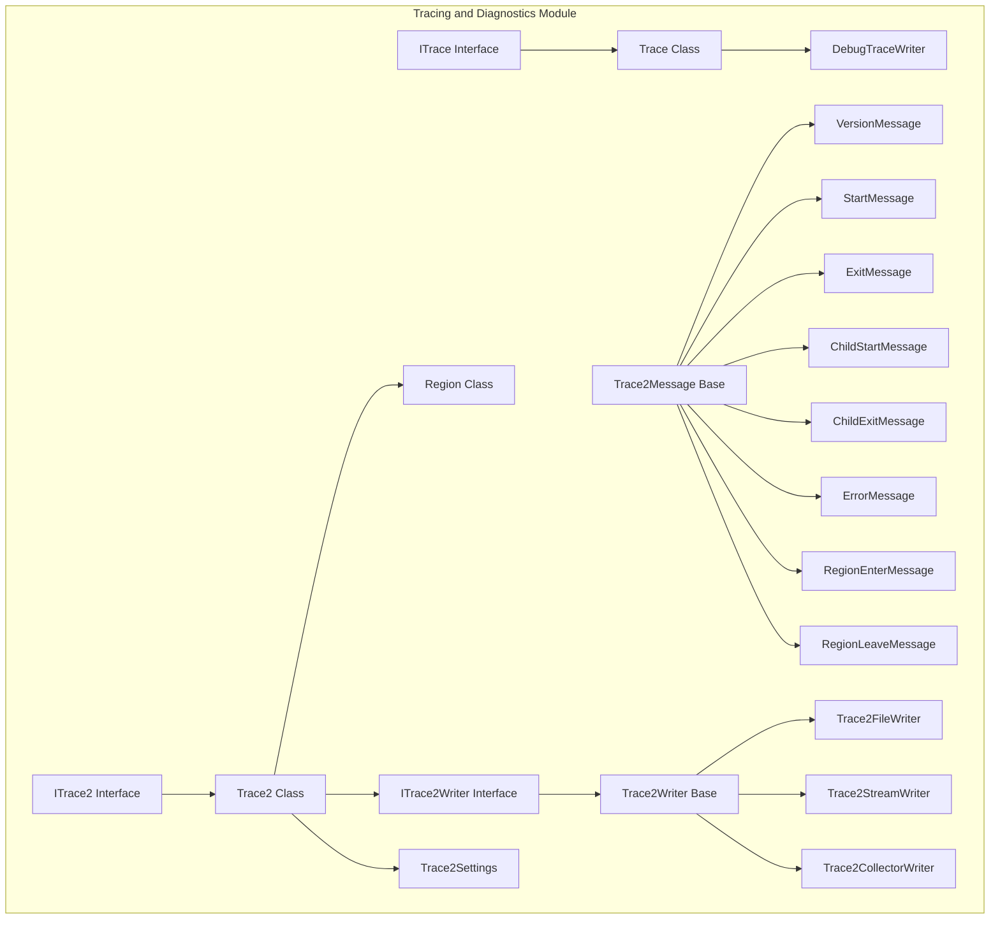
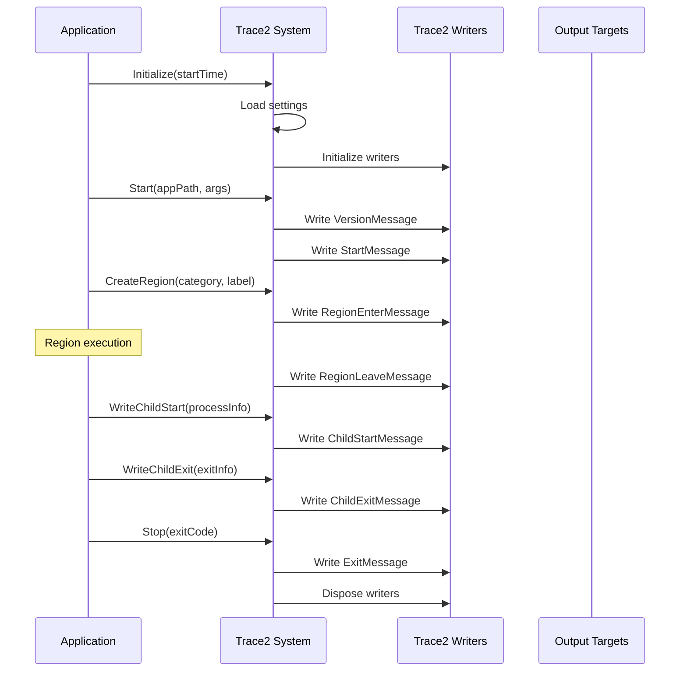
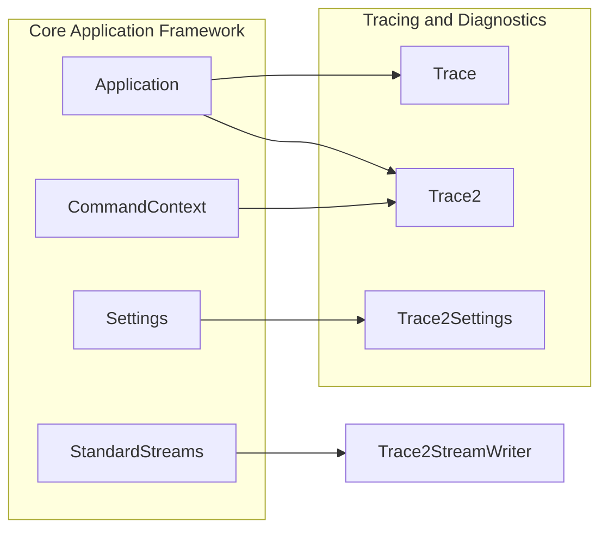

# Tracing and Diagnostics Module

## Introduction

The Tracing and Diagnostics module provides comprehensive logging, tracing, and diagnostic capabilities for the Git Credential Manager (GCM). This module implements two distinct tracing systems: the original `Trace` system for general application logging and the advanced `Trace2` system for structured event tracing compatible with Git's TRACE2 protocol.

## Architecture Overview

The module is built around two primary tracing systems that serve different purposes:

### Core Components



## Trace System (Original)

### Purpose
The original Trace system provides general application logging capabilities with support for:
- Basic message logging with caller information
- Exception tracing with inner exception expansion
- Dictionary content logging
- Secret/sensitive information masking
- Multiple output listeners

### Key Components

#### ITrace Interface
The primary interface defining the contract for the tracing system:
- `HasListeners`: Indicates if any listeners are attached
- `IsSecretTracingEnabled`: Controls whether sensitive information is output
- Methods for writing messages, exceptions, and dictionaries
- Support for caller information (file, line, member) via attributes

#### Trace Class
The main implementation of `ITrace` providing:
- Thread-safe listener management
- Message formatting with timestamps and source information
- Secret masking with `********` placeholder
- Automatic resource cleanup

#### DebugTraceWriter
A specialized `TextWriter` that forwards trace output to the system debug output.

### Usage Pattern
```csharp
ITrace trace = new Trace();
trace.AddListener(Console.Out);
trace.WriteLine("Application started");
trace.WriteException(exception);
```

## Trace2 System (Advanced)

### Purpose
The Trace2 system implements Git's TRACE2 protocol for structured event tracing, providing:
- Structured event-based tracing
- Multiple output formats (JSON, Normal, Performance)
- Process hierarchy tracking
- Performance region profiling
- Named pipe and file output support

### Key Components

#### ITrace2 Interface
Defines the advanced tracing contract:
- Application lifecycle events (Start, Exit, Version)
- Child process tracking (ChildStart, ChildExit)
- Error reporting
- Region-based performance profiling
- Thread-safe operation

#### Trace2 Class
Main implementation providing:
- Multi-format output support
- Session ID management
- Thread name resolution
- Automatic writer initialization based on settings

#### Trace2Message Hierarchy
Structured message types for different events:
- `VersionMessage`: Application version information
- `StartMessage`: Application startup with arguments
- `ExitMessage`: Application exit with code and timing
- `ChildStartMessage/ChildExitMessage`: Child process lifecycle
- `ErrorMessage`: Error events
- `RegionEnterMessage/RegionLeaveMessage`: Performance regions

#### Trace2 Writers
Specialized writers for different output targets:
- `Trace2FileWriter`: File-based output with error handling
- `Trace2StreamWriter`: Stream-based output (e.g., stderr)
- `Trace2CollectorWriter`: Named pipe output with background threading

### Output Formats

#### JSON Format
Machine-readable structured data with snake_case property names.

#### Normal Format
Human-readable format: `[time source] event_name [message]`

#### Performance Format
Column-aligned format with timing and performance metrics.

## Data Flow



## Integration with Core Application



## Configuration and Settings

The Trace2 system is configured through the `Trace2Settings` class, which supports:
- Multiple format targets (Event, Normal, Performance)
- Output destination configuration (files, streams, named pipes)
- Environment-based configuration

## Security Considerations

### Secret Masking
Both tracing systems implement secret masking:
- The original Trace system uses `IsSecretTracingEnabled` flag
- Secrets are masked with `********` placeholder when disabled
- Dictionary-based secret handling with configurable secret keys

### Safe Output
- Writers include error handling to prevent application crashes
- File writers handle permission and locking issues gracefully
- Named pipe writers include timeout and connection failure handling

## Performance Considerations

### Thread Safety
- All trace operations are thread-safe using lock-based synchronization
- Background threading for named pipe operations
- Non-blocking queue operations where possible

### Resource Management
- Proper disposal of resources via `IDisposable` pattern
- Automatic writer cleanup on application exit
- Bounded queue sizes to prevent memory growth

## Error Handling

The tracing systems are designed to be resilient:
- Trace failures don't affect application execution
- Writers can be marked as "Failed" and skipped
- Exception squelching prevents trace-related crashes
- Graceful degradation when output targets are unavailable

## Dependencies

This module depends on:
- [Core Application Framework](Core%20Application%20Framework.md) for application context and settings
- [Configuration and Settings](Configuration%20and%20Settings.md) for trace configuration
- [I/O and Communication](I%2FO%20and%20Communication.md) for stream handling

## Related Modules

- [Diagnostics](Diagnostics.md) - Extended diagnostic capabilities
- [Cross-Platform Support](Cross-Platform%20Support.md) - Platform-specific implementations
- [Utilities](Utilities.md) - Supporting utility functions

## Usage Examples

### Basic Trace Usage
```csharp
using (var trace = new Trace())
{
    trace.AddListener(Console.Out);
    trace.WriteLine("Operation started");
    
    try
    {
        // Perform operation
    }
    catch (Exception ex)
    {
        trace.WriteException(ex);
    }
}
```

### Trace2 Region Profiling
```csharp
using (var trace2 = new Trace2(commandContext))
{
    trace2.Initialize(DateTimeOffset.UtcNow);
    trace2.Start(applicationPath, args);
    
    using (trace2.CreateRegion("performance", "database_query"))
    {
        // Perform database operation
    }
    
    trace2.Stop(exitCode);
}
```

### Multi-format Output
```csharp
var settings = new Trace2Settings
{
    FormatTargetsAndValues = new Dictionary<Trace2FormatTarget, string>
    {
        { Trace2FormatTarget.Json, "trace2.json" },
        { Trace2FormatTarget.Normal, "1" }, // stderr
        { Trace2FormatTarget.Performance, "\\.\pipe\trace2" }
    }
};
```