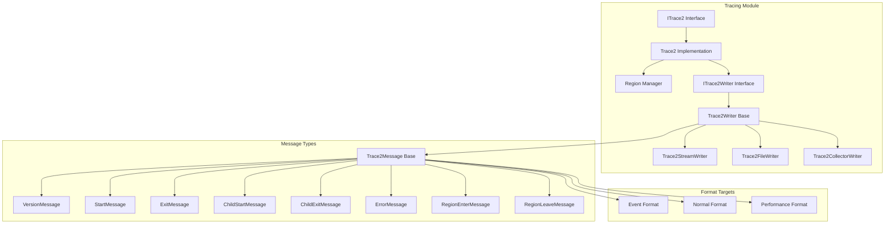
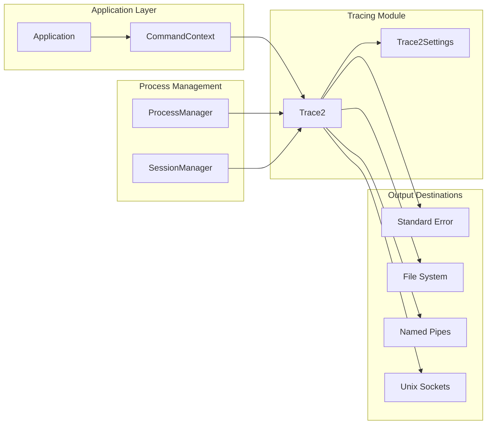
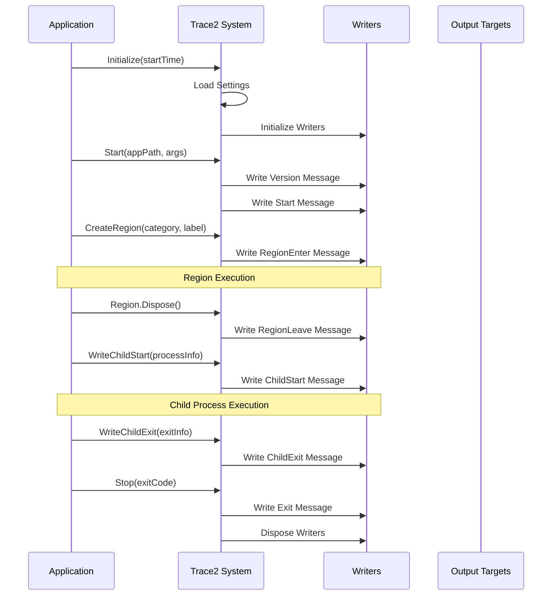

# Tracing Module Documentation

## Introduction

The Tracing module provides a comprehensive tracing and performance monitoring system for Git Credential Manager (GCM). Based on Git's TRACE2 protocol, this module enables detailed tracking of application execution, performance metrics, and system behavior across multiple output formats and destinations.

## Overview

The Tracing module implements a sophisticated event-based tracing system that captures:
- Application lifecycle events (start, exit, version)
- Performance regions with timing information
- Child process execution tracking
- Error events and diagnostics
- Thread-level execution context

## Architecture

### Core Components



### System Integration



## Key Components

### ITrace2 Interface
The primary interface for the tracing system, providing methods for:
- Application lifecycle tracking (`Start`, `Stop`)
- Region-based performance monitoring (`CreateRegion`, `WriteRegionEnter/Leave`)
- Child process tracking (`WriteChildStart`, `WriteChildExit`)
- Error reporting (`WriteError`)

### Trace2 Implementation
The main implementation that:
- Manages multiple output writers simultaneously
- Handles different format targets (Event, Normal, Performance)
- Provides thread-safe message writing
- Supports various output destinations (files, pipes, stderr)

### Region Management
The `Region` class implements the disposable pattern for automatic region tracking:
- Captures entry and exit timing
- Provides hierarchical performance analysis
- Supports categorization and labeling
- Automatically calculates execution time

### Writer Architecture
Multiple writer implementations for different output targets:
- **Trace2StreamWriter**: Writes to text streams (stderr)
- **Trace2FileWriter**: Writes to files with proper file handling
- **Trace2CollectorWriter**: Writes to named pipes and Unix sockets

## Data Flow



## Event Types

The tracing system supports eight distinct event types:

| Event Type | Description | Use Case |
|------------|-------------|----------|
| Version | Application version information | Startup identification |
| Start | Application startup with arguments | Execution context |
| Exit | Application termination with exit code | Completion tracking |
| ChildStart | Child process initiation | Process tree tracking |
| ChildExit | Child process completion | Resource monitoring |
| Error | Error events and messages | Problem diagnosis |
| RegionEnter | Performance region entry | Timing analysis |
| RegionLeave | Performance region exit | Performance metrics |

## Format Targets

### Event Format
JSON-based structured logging for machine processing:
- Complete event metadata
- Timestamp and timing information
- Thread and process context
- Suitable for log aggregation systems

### Normal Format
Human-readable text format:
- Simplified event representation
- Easy debugging and monitoring
- Console-friendly output

### Performance Format
Specialized format for performance analysis:
- Time-aligned columns
- Execution duration tracking
- Hierarchical region visualization
- Performance profiling support

## Configuration

The tracing system is configured through `Trace2Settings` which supports:
- Multiple simultaneous output targets
- Environment variable-based configuration
- File path, pipe, and socket destinations
- Format target selection per destination

### Output Destinations

1. **Standard Error**: Real-time console output
2. **File System**: Persistent log files with automatic path resolution
3. **Named Pipes**: Windows inter-process communication
4. **Unix Sockets**: Linux/macOS inter-process communication

## Process Classification

Child processes are classified into categories:
- **None**: Unclassified processes
- **UIHelper**: User interface helper applications
- **Git**: Git executable processes
- **Other**: Miscellaneous processes

## Thread Management

The system provides intelligent thread naming:
- Main thread identification
- Thread pool thread detection
- Custom thread name preservation
- Empty name handling for unknown threads

## Integration Points

### Command Context Integration
The tracing system integrates with the [CommandContext](CommandContext.md) to access:
- Application settings and configuration
- Standard streams for output
- Process management information

### Settings Integration
Works with the [Configuration](Configuration.md) module to:
- Load trace settings from configuration
- Support environment-based configuration
- Provide runtime configuration updates

### Process Management Integration
Coordinates with [Platform](Platform.md) components for:
- Session ID management
- Process depth tracking
- Child process monitoring

## Usage Patterns

### Basic Region Tracking
```csharp
using (var region = trace2.CreateRegion("category", "operation_name"))
{
    // Operation code here
    // Region automatically tracks timing
}
```

### Manual Event Writing
```csharp
trace2.WriteError("Error message", "Formatted message");
trace2.WriteChildStart(startTime, processClass, useShell, appName, argv);
```

### Application Lifecycle
```csharp
trace2.Start(appPath, args);
// Application execution
trace2.Stop(exitCode);
```

## Performance Considerations

- **Lazy Initialization**: Writers are initialized only when needed
- **Thread Safety**: Lock-free operations where possible
- **Resource Management**: Automatic writer disposal
- **Error Handling**: Graceful degradation on write failures
- **Memory Efficiency**: Minimal object allocation during tracing

## Error Handling

The tracing system implements robust error handling:
- Writer failure detection and isolation
- Graceful degradation on initialization failures
- Exception squelching to prevent tracing errors from affecting application
- Failed writer exclusion from subsequent writes

## Security Considerations

- **Path Validation**: Secure file path handling
- **Pipe Security**: Named pipe access control
- **Data Sanitization**: Safe argument and message handling
- **Resource Cleanup**: Proper disposal of system resources

## Dependencies

- [CommandContext](CommandContext.md): For settings and stream access
- [Platform](Platform.md): For process and session management
- [Settings](Settings.md): For configuration management
- Standard .NET libraries for I/O and threading

## Related Documentation

- [Application](Application.md) - Application lifecycle management
- [Diagnostics](Diagnostics.md) - System diagnostics and health monitoring
- [Platform](Platform.md) - Platform-specific services and process management