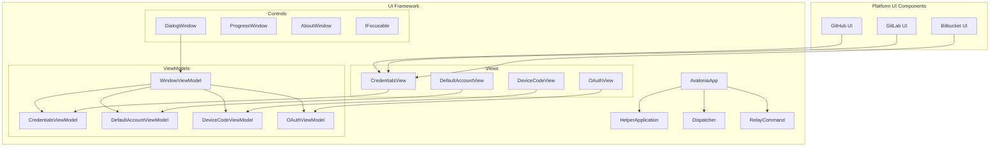
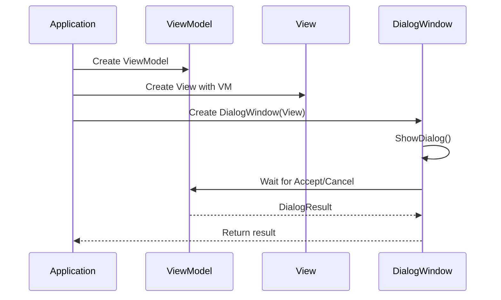
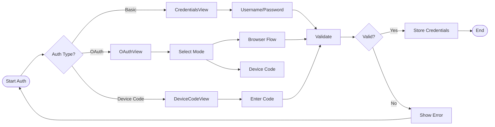

# UI Framework

## Overview

The UI Framework module provides a comprehensive user interface system for Git Credential Manager, built on the Avalonia UI framework. It handles authentication dialogs, credential collection, and user interactions across multiple Git hosting platforms including GitHub, GitLab, Bitbucket, and Azure Repos.

## Architecture

The UI Framework is organized into several key sub-modules that work together to provide a cohesive user experience:

## Core Components

### Application Layer
- **AvaloniaApp**: Main application class that initializes the Avalonia UI framework and manages the application lifecycle
- **HelperApplication**: Command-line application wrapper for UI operations, handling command registration and execution
- **Dispatcher**: Thread-safe message dispatching system for UI operations, ensuring proper thread affinity

For detailed information about the application management components, see [Application Management](Application Management.md).

### Command System
- **RelayCommand**: MVVM command implementation that facilitates binding between UI actions and view model methods

### ViewModels
- **WindowViewModel**: Base view model for all dialog windows, handling window chrome, titles, and dialog results
- **CredentialsViewModel**: Manages basic authentication credential collection (username/password)
- **DefaultAccountViewModel**: Handles default account selection and switching scenarios
- **DeviceCodeViewModel**: Manages device code authentication flow UI
- **OAuthViewModel**: Handles OAuth authentication mode selection (browser vs device code)

For detailed information about the view models and their responsibilities, see [ViewModels](ViewModels.md).

### Views
- **CredentialsView**: UI for basic credential input with platform-specific focus management
- **DefaultAccountView**: Interface for default account selection
- **DeviceCodeView**: Display for device code authentication information
- **OAuthView**: OAuth authentication method selection interface

For detailed information about the view components and their implementation, see [Views](Views.md).

### Controls
- **DialogWindow**: Base window class with custom chrome support, drag handling, and debug features
- **ProgressWindow**: Progress indication window with platform handle access
- **AboutWindow**: Application information and project links
- **IFocusable**: Interface for focus management in custom controls

For detailed information about the control components and their functionality, see [Controls](Controls.md).

## Key Features

### Cross-Platform Support
The UI Framework provides native-looking interfaces across Windows, macOS, and Linux through Avalonia's cross-platform capabilities, with platform-specific optimizations for window chrome and focus management.

### Authentication Flows
Supports multiple authentication methods:
- Basic username/password authentication
- OAuth 2.0 browser-based authentication
- OAuth 2.0 device code flow
- Default account selection
- Multi-factor authentication prompts

### Thread Safety
The Dispatcher system ensures all UI operations occur on the main thread, preventing cross-thread access violations while allowing background operations to safely update the UI.

### Platform Integration
Each hosting platform (GitHub, GitLab, Bitbucket, Azure Repos) can extend the base UI components with platform-specific authentication flows and visual customizations.

## Dependencies

The UI Framework integrates with several other system modules:

- **[Core Application Framework](Core Application Framework.md)**: Provides application context, settings, and command infrastructure
- **[Authentication System](Authentication System.md)**: Supplies authentication logic and token management
- **[Cross-Platform Support](Cross-Platform Support.md)**: Offers platform-specific implementations for file system, environment, and system prompts
- **[Host Provider Framework](Host Provider Framework.md)**: Manages different Git hosting platform integrations

## Usage Patterns

### Dialog Creation

### Authentication Flow

## Platform-Specific UI Components

The UI Framework is extended by platform-specific UI components that provide tailored authentication experiences:

- **GitHub UI Components**: Specialized views for GitHub authentication flows including 2FA and account selection
- **GitLab UI Components**: GitLab-specific credential collection interfaces
- **Bitbucket UI Components**: Bitbucket authentication dialogs and workflows

These platform-specific components inherit from the base UI Framework classes and add custom logic, validation, and visual elements specific to their respective platforms.

## Threading Model

The UI Framework implements a strict threading model to ensure UI consistency:

1. **Main Thread**: All UI creation and updates occur on the main thread via the Dispatcher
2. **Background Operations**: Long-running operations (network calls, file I/O) run on background threads
3. **Thread Marshaling**: The Dispatcher marshals calls from background threads to the UI thread
4. **Cancellation**: All async operations support cancellation through CancellationToken

This model ensures responsive UI while preventing cross-thread access violations that could crash the application.