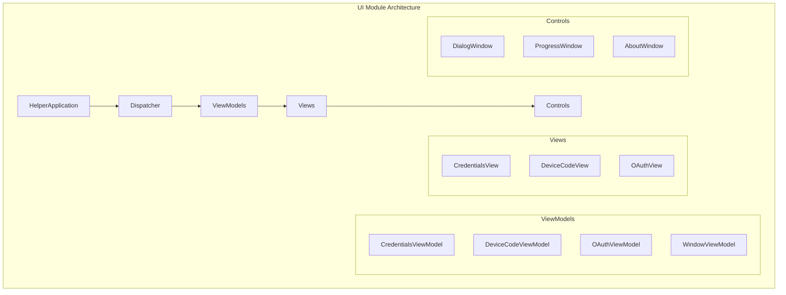
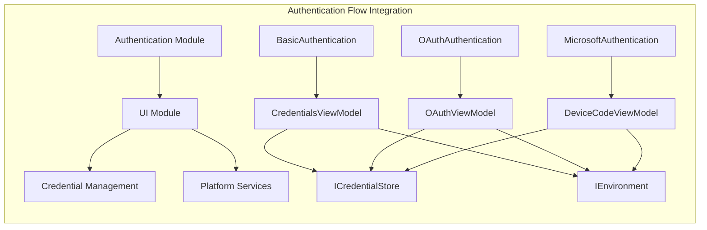
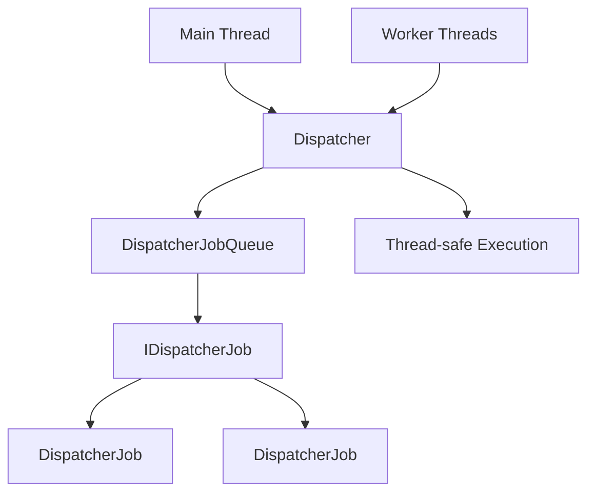
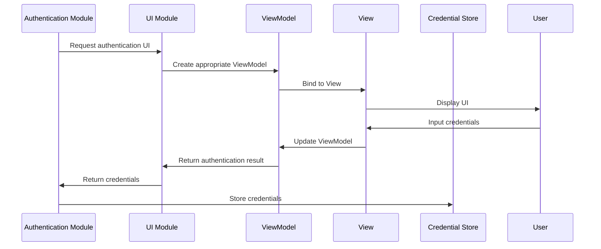
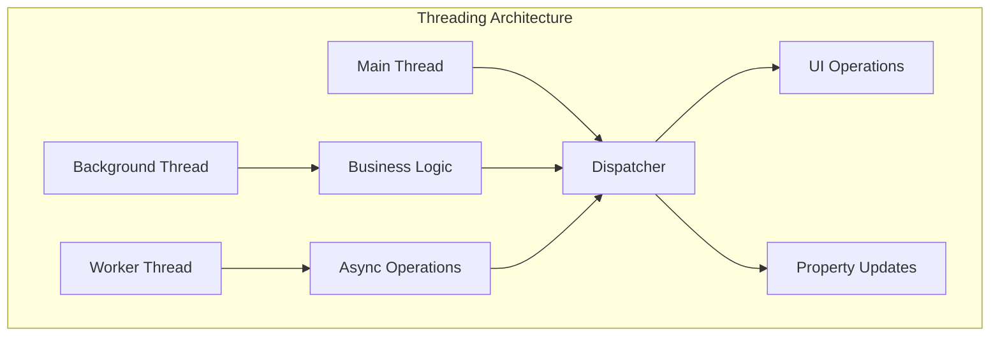

# UI Module Documentation

## Introduction

The UI module provides the user interface components for the Git Credential Manager, handling authentication prompts, credential collection, and user interactions across different authentication methods. Built on Avalonia UI framework, it offers cross-platform graphical interfaces for credential management operations.

## Architecture Overview

The UI module follows the Model-View-ViewModel (MVVM) pattern and consists of several key architectural layers:

### Core Components



### Component Relationships



## Component Details

### HelperApplication

The `HelperApplication` class serves as the entry point for UI-based credential operations. It extends `ApplicationBase` and provides command-line interface capabilities for UI operations.

**Key Features:**
- Command registration and execution
- Exception handling with structured error output
- Integration with the command context for I/O operations

**Dependencies:**
- `ICommandContext` - Provides access to standard streams and command context
- `System.CommandLine` - For command-line parsing and execution

### Dispatcher

The `Dispatcher` class manages thread-safe UI operations and ensures proper thread affinity for UI updates. It implements a custom message queue system for cross-thread communication.

**Key Features:**
- Thread-safe UI operation dispatching
- Main thread association and verification
- Asynchronous work execution with cancellation support
- Job queue management with proper shutdown semantics

**Architecture:**


### ViewModels

The ViewModels implement the MVVM pattern and provide data binding capabilities for the UI views:

#### WindowViewModel
Base class for all view models, providing:
- Property change notification
- Accept/Cancel dialog operations
- Debug control visibility (debug builds)

#### CredentialsViewModel
Handles basic authentication scenarios:
- Username and password collection
- Validation logic (allows empty credentials for compatibility)
- Product header visibility control

#### DeviceCodeViewModel
Manages device code authentication flow:
- User code and verification URL display
- Browser integration for URL opening
- Environment-based browser launching

#### OAuthViewModel
Handles OAuth authentication mode selection:
- Browser-based vs device code authentication options
- Authentication mode selection and propagation
- Product header and description management

### Views and Controls

#### DialogWindow
The main window container for authentication dialogs:
- Window dragging support
- Keyboard shortcut handling (Alt+D for debug controls)
- View model integration with accept/cancel operations
- Focus management for child controls

#### ProgressWindow and AboutWindow
Specialized windows for:
- Operation progress indication
- Application information display

## Data Flow

### Authentication UI Flow



### Threading Model



## Integration Points

### Platform Integration
The UI module integrates with platform-specific services:
- **Environment Services**: Browser launching, system integration
- **Platform Utils**: Cross-platform UI considerations
- **Session Management**: User session state handling

### Authentication Integration
The UI module works with various authentication providers:
- **Basic Authentication**: Username/password prompts via `CredentialsViewModel`
- **OAuth Authentication**: Mode selection via `OAuthViewModel`
- **Device Code Authentication**: Code display via `DeviceCodeViewModel`
- **Microsoft Authentication**: Integration with device code flow

### Credential Management Integration
UI components interact with the credential management system:
- Credential collection and validation
- Secure storage integration
- Credential retrieval for UI pre-population

## Cross-Platform Considerations

The UI module is designed for cross-platform compatibility:
- **Avalonia UI Framework**: Provides consistent UI across Windows, macOS, and Linux
- **Platform-Specific Services**: Integration with platform credential stores
- **Threading Model**: Consistent dispatcher pattern across platforms
- **Browser Integration**: Platform-aware browser launching

## Error Handling

The UI module implements comprehensive error handling:
- **Exception Management**: Centralized exception handling in `HelperApplication`
- **User Feedback**: Structured error display to users
- **Validation**: Input validation in ViewModels
- **Cancellation**: Proper cancellation token propagation

## Security Considerations

Security is paramount in the UI module:
- **Secure Input**: Password fields with masking
- **Memory Management**: Proper cleanup of sensitive data
- **Thread Safety**: Secure cross-thread operations
- **Credential Handling**: Integration with secure storage systems

## Usage Patterns

### Basic Authentication Flow
```csharp
// Create and show credentials dialog
var viewModel = new CredentialsViewModel
{
    Description = "Enter your credentials",
    ShowProductHeader = true
};

// Show dialog and get result
var result = await ShowDialogAsync(viewModel);
if (result.Accepted)
{
    var credentials = new GitCredential(viewModel.UserName, viewModel.Password);
    // Store credentials
}
```

### OAuth Authentication Flow
```csharp
// Create OAuth selection dialog
var viewModel = new OAuthViewModel
{
    Description = "Choose authentication method",
    ShowBrowserLogin = true,
    ShowDeviceCodeLogin = true
};

// Show dialog and get selected mode
var result = await ShowDialogAsync(viewModel);
if (result.Accepted)
{
    var selectedMode = viewModel.SelectedMode;
    // Proceed with selected OAuth flow
}
```

## Related Documentation

- [Authentication Module](Authentication.md) - Authentication providers and methods
- [Credential Management](CredentialManagement.md) - Secure credential storage
- [Platform Services](Platform.md) - Cross-platform service integration
- [Core Application](Core.md) - Application framework and command handling