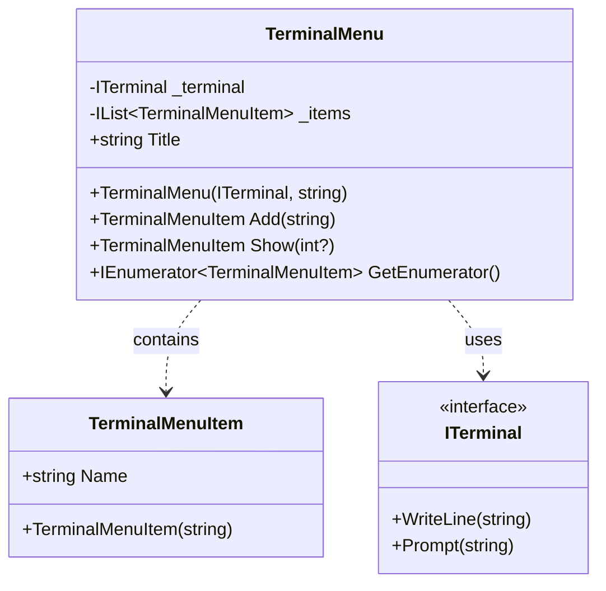
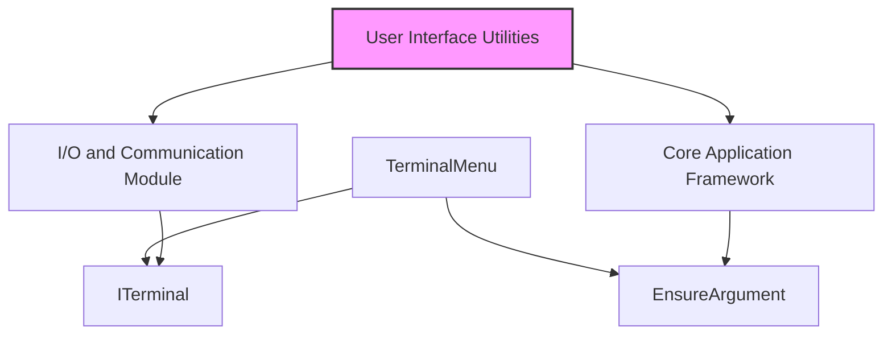
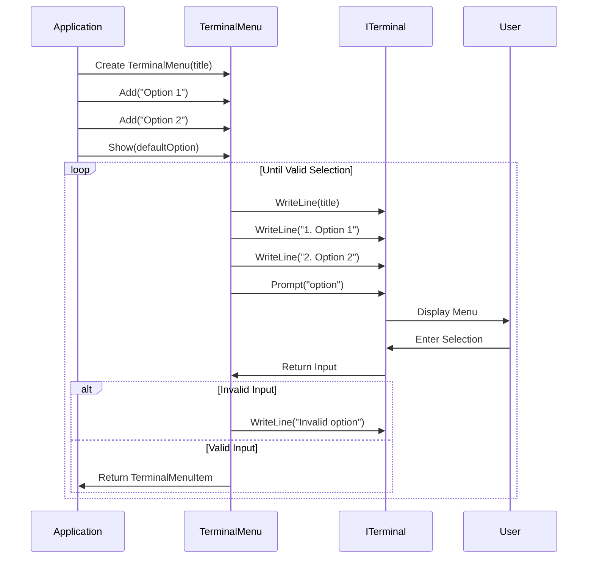
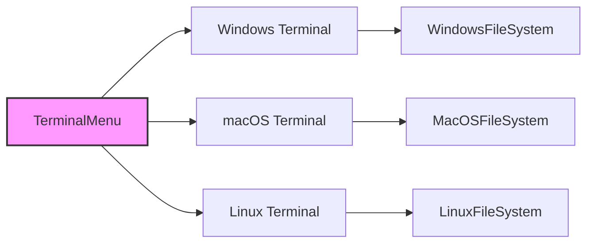
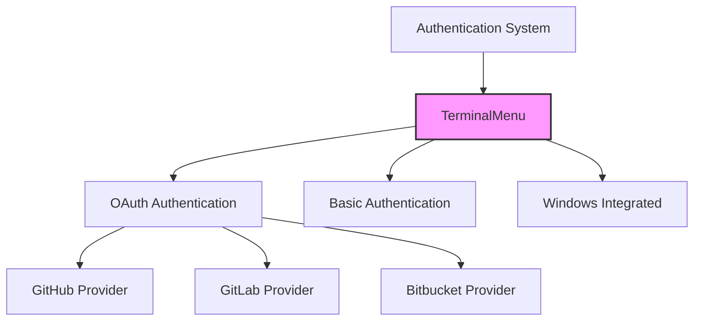
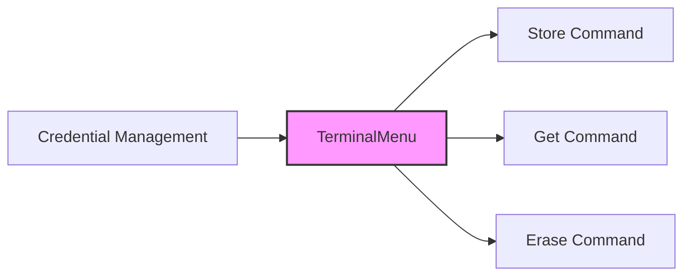
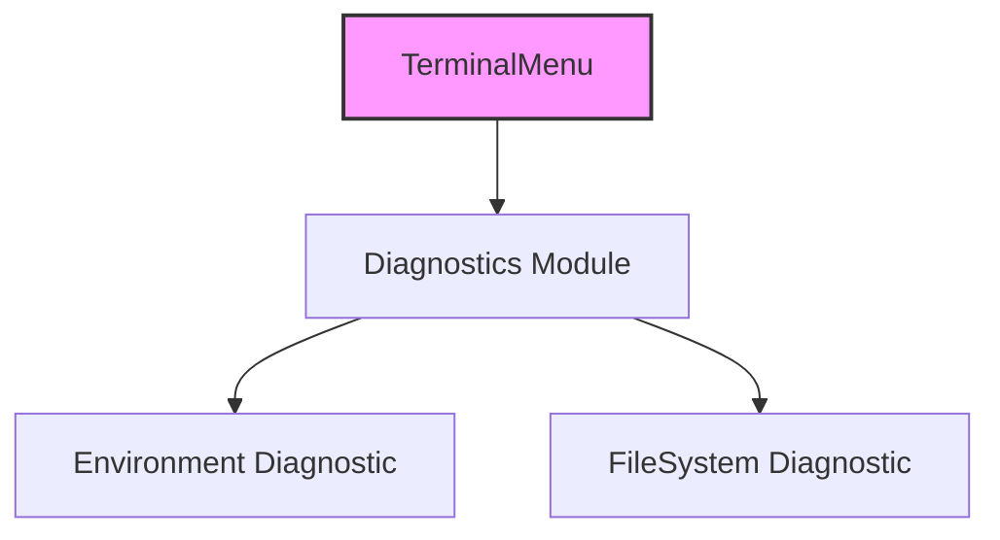

# User Interface Utilities Module

## Introduction

The User Interface Utilities module provides essential terminal-based user interface components for Git Credential Manager. This module focuses on creating interactive command-line interfaces that enable users to make selections and interact with the credential management system through terminal prompts. The module is designed to be lightweight, cross-platform compatible, and integrates seamlessly with the broader Git Credential Manager ecosystem.

## Core Components

### TerminalMenu
The `TerminalMenu` class is the primary component that creates interactive text-based menus in the terminal. It provides a simple yet powerful interface for presenting options to users and capturing their selections.

**Key Features:**
- Interactive menu display with numbered options
- Support for default option selection
- Input validation and error handling
- Customizable menu titles
- Integration with the `ITerminal` interface for cross-platform compatibility

### TerminalMenuItem
The `TerminalMenuItem` class represents individual menu options within a `TerminalMenu`. Each item contains a display name and can be selected by users during menu interaction.

## Architecture

### Component Structure



### Module Dependencies



## Data Flow

### Menu Display and Selection Process



## Component Interactions

### Integration with Core Framework

The User Interface Utilities module integrates with several core components:

1. **ITerminal Interface**: Provides cross-platform terminal I/O capabilities
2. **EnsureArgument**: Validates input parameters for robust error handling
3. **Core Application Framework**: Manages the overall application lifecycle

### Cross-Platform Compatibility



## Usage Patterns

### Basic Menu Creation

```csharp
// Create a menu with a title
var menu = new TerminalMenu(terminal, "Select Authentication Method");

// Add menu options
menu.Add("Username/Password");
menu.Add("OAuth Token");
menu.Add("Windows Integrated");

// Display menu and get selection
var selection = menu.Show(defaultOption: 0);

// Process selection
Console.WriteLine($"User selected: {selection.Name}");
```

### Menu with Default Option

```csharp
// Create menu with default selection
var menu = new TerminalMenu(terminal);
menu.Add("Option 1");
menu.Add("Option 2");
menu.Add("Option 3");

// Show with default option (0-based index)
var selection = menu.Show(defaultOption: 1); // "Option 2" is default
```

## Error Handling

The module implements comprehensive error handling:

1. **Input Validation**: Validates user input for numeric format and range
2. **Default Option Validation**: Ensures default option is within valid range
3. **Empty Input Handling**: Manages cases where user presses enter without input
4. **Error Messaging**: Provides clear, user-friendly error messages

## Integration Points

### Authentication Flow Integration

The User Interface Utilities module is commonly used in authentication workflows:



### Credential Management Integration



## Platform-Specific Considerations

### Windows Platform
- Integrates with `WindowsTerminal` for native Windows console support
- Supports Windows-specific terminal features and behaviors

### macOS Platform  
- Works with `MacOSTerminal` for macOS terminal compatibility
- Handles macOS-specific terminal characteristics

### Linux Platform
- Utilizes `LinuxTerminal` for Linux console environments
- Supports various Linux terminal emulators

## Testing and Diagnostics

### Diagnostic Integration

The module can be integrated with diagnostic systems for troubleshooting:



## Best Practices

### Menu Design Guidelines

1. **Clear Titles**: Use descriptive titles that explain the menu's purpose
2. **Logical Ordering**: Arrange options in order of likelihood or importance
3. **Default Options**: Provide sensible defaults when appropriate
4. **Error Messages**: Ensure error messages are helpful and guide users
5. **Input Validation**: Always validate user input before processing

### Performance Considerations

- Menu creation is lightweight and suitable for frequent use
- No persistent state between menu instances
- Minimal memory footprint for menu items

## Related Documentation

- [Core Application Framework](Core-Application-Framework.md) - Core application lifecycle and command context
- [I/O and Communication](I-O-and-Communication.md) - Terminal interface and standard streams
- [Cross-Platform Support](Cross-Platform-Support.md) - Platform-specific terminal implementations
- [Authentication System](Authentication-System.md) - Authentication workflows that use terminal menus
- [Credential Management](Credential-Management.md) - Credential operations that may use menu selection

## API Reference

### TerminalMenu Class

| Member | Type | Description |
|--------|------|-------------|
| `TerminalMenu(ITerminal, string)` | Constructor | Creates a new menu instance |
| `Title` | Property | Gets or sets the menu title |
| `Add(string)` | Method | Adds a new menu item |
| `Show(int?)` | Method | Displays menu and returns selection |
| `GetEnumerator()` | Method | Returns enumerator for menu items |

### TerminalMenuItem Class

| Member | Type | Description |
|--------|------|-------------|
| `Name` | Property | Gets the menu item name |
| `TerminalMenuItem(string)` | Constructor | Creates a new menu item |