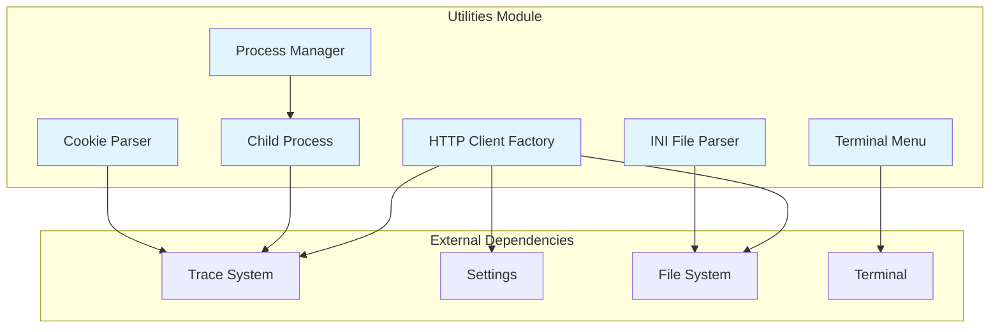
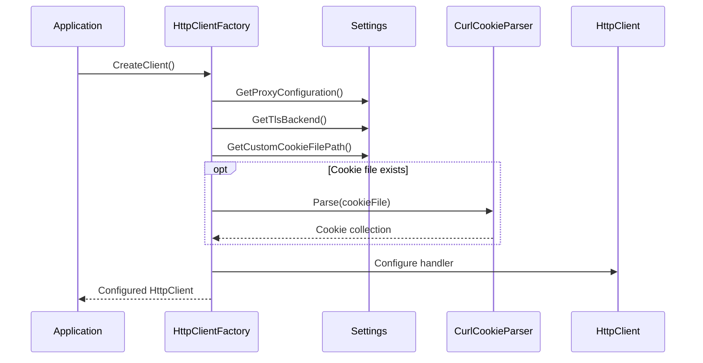

# Utilities Module Documentation

## Overview

The Utilities module provides essential cross-cutting functionality and infrastructure services for the Git Credential Manager system. It serves as a foundational layer that supports HTTP communication, process management, configuration parsing, and user interaction capabilities across all other modules.

## Architecture

## Core Components

### HTTP Communication Infrastructure

The HTTP communication components provide a robust foundation for web requests with advanced proxy support, TLS configuration, and cookie management. For detailed documentation, see [HTTP Communication](HTTP-Communication.md).

**Key Components**:
- **HttpClientFactory**: Creates and configures HttpClient instances for use throughout the application
- **CurlCookieParser**: Parses curl cookie files for HTTP request automation

**Key Features**:
- Proxy configuration from Git settings and environment variables
- TLS/SSL certificate verification with custom certificate bundle support
- Cookie management from curl cookie files
- Automatic client certificate handling for Windows schannel backend

### Process Management

Process management components handle the creation and lifecycle of external processes, particularly for Git operations. For detailed documentation, see [Process Management](Process-Management.md).

**Key Components**:
- **ProcessManager**: Factory for creating and managing child processes
- **ChildProcess**: Wrapper around System.Process with enhanced tracing capabilities

**Key Features**:
- Creates ChildProcess instances with proper configuration
- Manages TRACE2 session IDs for process tracking
- Automatic TRACE2 event generation for process lifecycle
- Resource management with proper disposal

### Configuration Parsing

Configuration parsing utilities handle various file formats used by Git and the credential manager. For detailed documentation, see [Configuration Parsing](Configuration-Parsing.md).

**Key Components**:
- **IniFile**: Container for configuration sections
- **IniSection**: Represents a configuration section with properties
- **IniProperty**: Individual configuration key-value pairs
- **IniSectionName**: Handles section naming with optional subsections

**Key Features**:
- Case-insensitive section names
- Case-sensitive subsection names
- Comment handling and quote processing
- Multi-property support for duplicate keys

### User Interface Utilities

Terminal-based user interaction components for command-line environments. For detailed documentation, see [User Interface Utilities](User-Interface-Utilities.md).

**Key Components**:
- **TerminalMenu**: Creates interactive text-based menus in terminal environments
- **TerminalMenuItem**: Represents individual menu options

**Key Features**:
- Numbered option selection
- Default option support
- Input validation and error handling
- Customizable titles and prompts

## Data Flow

## Module Relationships

The Utilities module serves as a foundational layer that other modules depend upon:

- **[Authentication System](Authentication-System.md)**: Uses HttpClientFactory for OAuth token requests
- **[Git Integration](Git-Integration.md)**: Uses ProcessManager and ChildProcess for Git command execution
- **[Core Application Framework](Core-Application-Framework.md)**: Integrates with tracing and settings systems
- **[Host Provider Framework](Host-Provider-Framework.md)**: Uses HTTP infrastructure for API communications

## Key Design Patterns

### Factory Pattern
- `HttpClientFactory` creates configured HttpClient instances
- `ProcessManager` creates ChildProcess instances with proper initialization

### Wrapper Pattern
- `ChildProcess` wraps System.Process with additional functionality
- `TerminalMenu` wraps terminal interaction logic

### Parser Pattern
- `IniFile` system provides structured parsing of configuration files
- `CurlCookieParser` handles cookie file format conversion

## Security Considerations

### TLS/SSL Configuration
- Certificate verification can be disabled (with warnings) for development
- Custom certificate bundles are supported for enterprise environments
- Client certificate handling follows Git's security model

### Proxy Support
- Proxy credentials are handled securely through settings
- No-proxy lists support both domain and IP patterns
- Authentication methods include basic and integrated Windows authentication

### Process Security
- Process execution parameters are validated
- Working directory can be specified for security isolation
- Shell execution is optional and disabled by default

## Performance Considerations

### HTTP Client Management
- HttpClient instances should be reused to avoid socket exhaustion
- Connection pooling is handled by the .NET HttpClient implementation
- Proxy configuration is cached per factory instance

### Process Lifecycle
- Child processes are properly disposed to release system resources
- TRACE2 events are generated asynchronously to minimize performance impact
- Process depth tracking helps prevent infinite recursion

## Error Handling

### HTTP Communication
- Proxy configuration errors are logged with detailed information
- Certificate validation failures provide specific error messages
- Cookie parsing errors are traced but don't fail the request

### Process Management
- Process creation failures throw descriptive exceptions
- Exit codes are captured and traced for debugging
- Resource cleanup is guaranteed through disposal patterns

### Configuration Parsing
- Malformed INI files throw exceptions with line numbers
- Missing sections are handled gracefully with TryGet methods
- Property parsing preserves original values for debugging