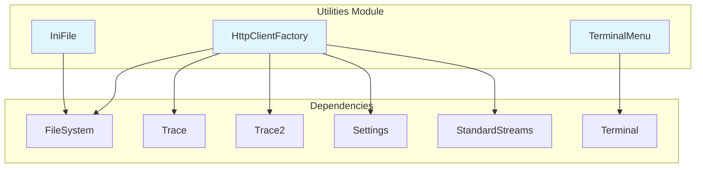
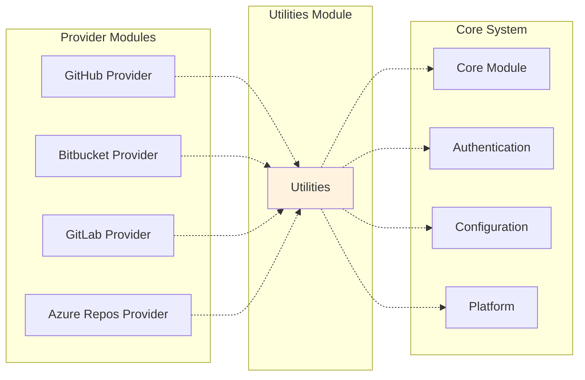
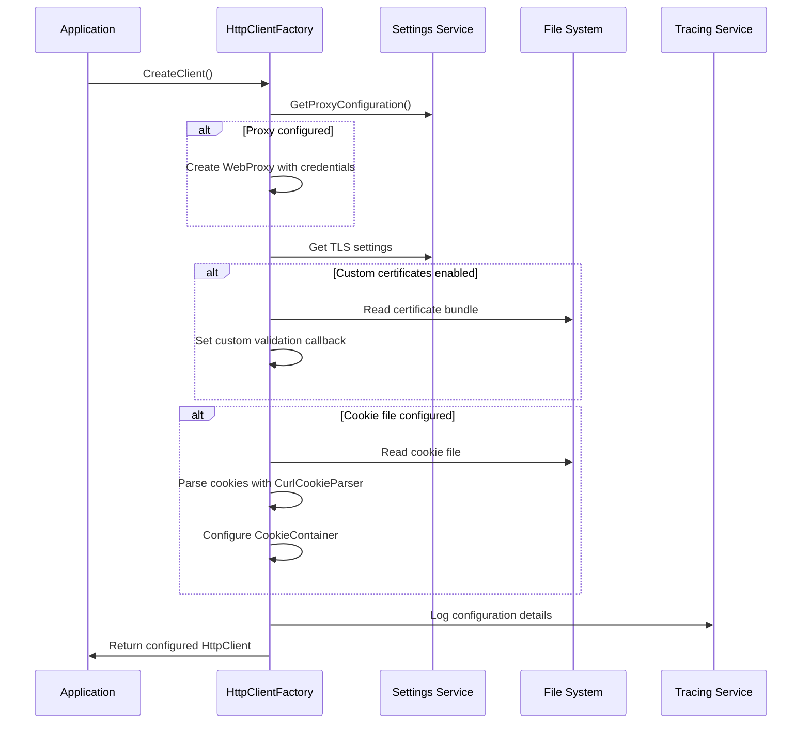
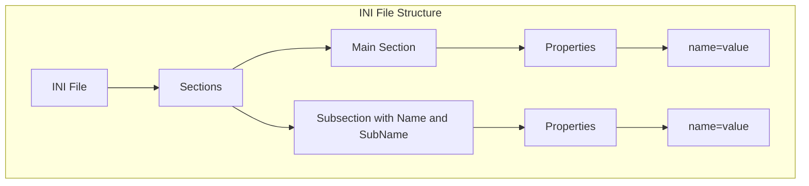
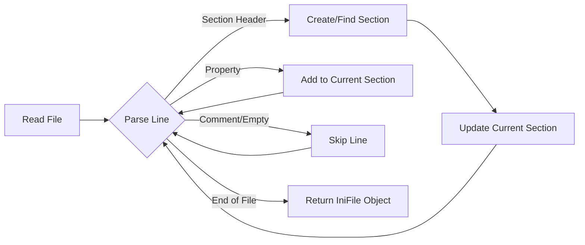
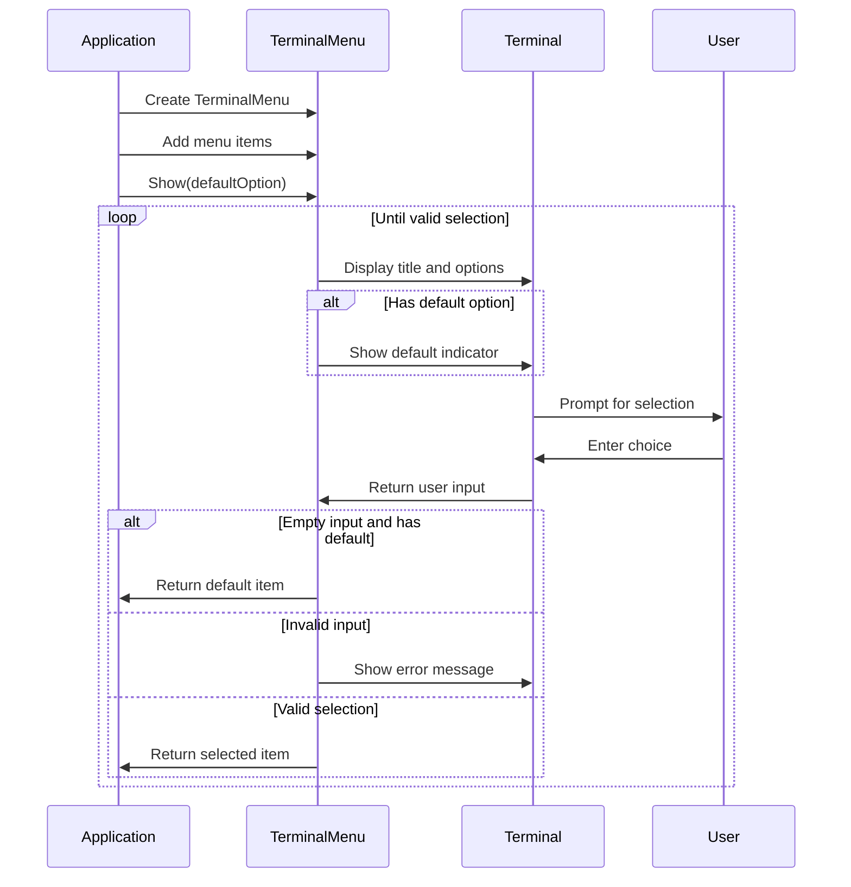

# Utilities Module Documentation

## Introduction

The Utilities module provides essential helper services and utilities that support the core functionality of Git Credential Manager. This module contains cross-cutting concerns that are used throughout the application, including HTTP client management, configuration file parsing, and terminal user interface components.

## Module Overview

The Utilities module serves as a foundational layer that provides:

- **HTTP Client Factory**: Configurable HTTP client creation with proxy support, TLS/SSL configuration, and cookie handling
- **INI File Parser**: Configuration file parsing and manipulation for Git configuration files
- **Terminal Menu System**: Interactive command-line menu interface for user interactions

These utilities are designed to be reusable across different parts of the application and provide consistent behavior for common operations.

## Architecture

### Component Architecture


```mermaid
graph TB
    subgraph "Utilities Module"
        HCF[HttpClientFactory]
        INI[IniFile]
        TM[TerminalMenu]
    end
    
    subgraph "Dependencies"
        FS[FileSystem]
        TR[Trace]
        TR2[Trace2]
        ST[Settings]
        SS[StandardStreams]
        TE[Terminal]
    end
    
    HCF --> FS
    HCF --> TR
    HCF --> TR2
    HCF --> ST
    HCF --> SS
    TM --> TE
    INI --> FS
    
    style HCF fill:#e1f5fe
    style INI fill:#e1f5fe
    style TM fill:#e1f5fe
```

### Module Dependencies


```mermaid
graph LR
    subgraph "Core System"
        CORE[Core Module]
        AUTH[Authentication]
        CONFIG[Configuration]
        PLATFORM[Platform]
    end
    
    subgraph "Utilities Module"
        UTILS[Utilities]
    end
    
    subgraph "Provider Modules"
        GH[GitHub Provider]
        BB[Bitbucket Provider]
        GL[GitLab Provider]
        AZ[Azure Repos Provider]
    end
    
    UTILS -.-> CORE
    UTILS -.-> AUTH
    UTILS -.-> CONFIG
    UTILS -.-> PLATFORM
    GH -.-> UTILS
    BB -.-> UTILS
    GL -.-> UTILS
    AZ -.-> UTILS
    
    style UTILS fill:#fff3e0
```

## Core Components

### HttpClientFactory

The `HttpClientFactory` is responsible for creating properly configured HTTP clients that comply with Git's configuration and security settings.

#### Key Features:
- **Proxy Configuration**: Automatic proxy detection and configuration from Git settings
- **TLS/SSL Handling**: Custom certificate validation and client certificate support
- **Cookie Management**: Integration with Git's cookie files
- **Security Warnings**: User notifications for security-related configurations

#### Configuration Flow:


```mermaid
sequenceDiagram
    participant App as Application
    participant HCF as HttpClientFactory
    participant Settings as Settings Service
    participant FS as File System
    participant Trace as Tracing Service
    
    App->>HCF: CreateClient()
    HCF->>Settings: GetProxyConfiguration()
    alt Proxy configured
        HCF->>HCF: Create WebProxy with credentials
    end
    
    HCF->>Settings: Get TLS settings
    alt Custom certificates enabled
        HCF->>FS: Read certificate bundle
        HCF->>HCF: Set custom validation callback
    end
    
    alt Cookie file configured
        HCF->>FS: Read cookie file
        HCF->>HCF: Parse cookies with CurlCookieParser
        HCF->>HCF: Configure CookieContainer
    end
    
    HCF->>Trace: Log configuration details
    HCF->>App: Return configured HttpClient
```

#### Security Considerations:
- Warns users when TLS certificate verification is disabled
- Supports custom certificate bundles for enterprise environments
- Integrates with Windows Certificate Store via schannel
- Handles proxy authentication securely

### IniFile

The `IniFile` component provides parsing and manipulation capabilities for Git configuration files, which follow the INI file format with specific conventions.

#### Key Features:
- **Section Management**: Support for main sections and subsections
- **Property Access**: Case-insensitive property names with case-sensitive values
- **Git Compatibility**: Handles Git-specific INI format variations
- **Comment Support**: Preserves and handles inline comments

#### INI File Structure:


```mermaid
graph TD
    subgraph "INI File Structure"
        A[INI File] --> B[Sections]
        B --> C[Main Section]
        B --> D[Subsection with Name and SubName]
        C --> E[Properties]
        D --> F[Properties]
        E --> G[name=value]
        F --> H[name=value]
    end
```

#### Parsing Process:


```mermaid
flowchart LR
    Start[Read File] --> ParseLine{Parse Line}
    ParseLine -->|Section Header| CreateSection[Create/Find Section]
    ParseLine -->|Property| AddProperty[Add to Current Section]
    ParseLine -->|Comment/Empty| Skip[Skip Line]
    
    CreateSection --> UpdateCurrent[Update Current Section]
    AddProperty --> ParseLine
    Skip --> ParseLine
    UpdateCurrent --> ParseLine
    
    ParseLine -->|End of File| Return[Return IniFile Object]
```

### TerminalMenu

The `TerminalMenu` component provides an interactive command-line menu system for user interactions in terminal environments.

#### Key Features:
- **Interactive Selection**: Numbered menu options with user input validation
- **Default Options**: Support for default selections
- **Input Validation**: Robust error handling for invalid inputs
- **Reusable Design**: Can be used for various selection scenarios

#### Menu Flow:


```mermaid
sequenceDiagram
    participant App as Application
    participant TM as TerminalMenu
    participant TE as Terminal
    participant User as User
    
    App->>TM: Create TerminalMenu
    App->>TM: Add menu items
    App->>TM: Show(defaultOption)
    
    loop Until valid selection
        TM->>TE: Display title and options
        alt Has default option
            TM->>TE: Show default indicator
        end
        
        TE->>User: Prompt for selection
        User->>TE: Enter choice
        TE->>TM: Return user input
        
        alt Empty input and has default
            TM->>App: Return default item
        else Invalid input
            TM->>TE: Show error message
        else Valid selection
            TM->>App: Return selected item
        end
    end
```

## Integration with Other Modules

### Configuration Module Integration

The Utilities module works closely with the [Configuration](Configuration.md) module:

- **HttpClientFactory** uses settings from the Configuration service for proxy, TLS, and cookie settings
- **IniFile** is used by GitConfiguration to parse Git config files
- Settings are retrieved through the ISettings interface

### Platform Module Integration

Integration with the [Platform](Platform.md) module includes:

- **FileSystem** abstraction for cross-platform file operations
- **Terminal** interface for console interactions
- **StandardStreams** for error and output handling

### Authentication Module Integration

The Utilities module supports the [Authentication](Authentication.md) module:

- **HttpClientFactory** provides HTTP clients for OAuth and REST API calls
- Cookie handling for authentication sessions
- Proxy support for corporate environments

## Usage Examples

### Creating an HTTP Client

```csharp
// Dependencies are injected via constructor
var httpClientFactory = new HttpClientFactory(
    fileSystem,
    trace,
    trace2,
    settings,
    standardStreams
);

// Create a configured HTTP client
var httpClient = httpClientFactory.CreateClient();

// Use the client for API calls
var response = await httpClient.GetAsync("https://api.github.com/user");
```

### Parsing an INI File

```csharp
// Read and parse a Git configuration file
var iniFile = IniSerializer.Deserialize(fileSystem, "/path/to/.gitconfig");

// Access sections and properties
if (iniFile.TryGetSection("user", out var userSection))
{
    if (userSection.TryGetProperty("name", out var userName))
    {
        Console.WriteLine($"User name: {userName}");
    }
}
```

### Creating a Terminal Menu

```csharp
// Create a menu for credential selection
var menu = new TerminalMenu(terminal, "Select authentication method:");
menu.Add("Personal Access Token");
menu.Add("OAuth");
menu.Add("Windows Integrated Authentication");

// Show menu with default option
var selection = menu.Show(defaultOption: 0);
Console.WriteLine($"Selected: {selection.Name}");
```

## Error Handling

### HttpClientFactory Error Handling

- **File Not Found**: Custom certificate bundles must exist or exception is thrown
- **Invalid Configuration**: Malformed proxy settings are handled gracefully
- **Security Warnings**: Users are warned about disabled certificate verification

### IniFile Error Handling

- **Missing Sections**: Properties cannot exist without a section header
- **Parse Errors**: Invalid INI format throws descriptive exceptions
- **File Access**: File system errors are propagated to the caller

### TerminalMenu Error Handling

- **Invalid Input**: Non-numeric input shows error and re-prompts
- **Out of Range**: Selection outside valid range shows error and re-prompts
- **No Default**: Empty input without default shows error and re-prompts

## Performance Considerations

### HttpClientFactory

- **Client Reuse**: Encourages reuse of HttpClient instances to avoid socket exhaustion
- **Lazy Initialization**: Proxy and certificate validation only when needed
- **Resource Cleanup**: Proper disposal of certificate collections

### IniFile

- **Efficient Parsing**: Single-pass parsing with regex compilation
- **Memory Usage**: Minimal memory footprint for large configuration files
- **Case Sensitivity**: Optimized string comparison for Git conventions

### TerminalMenu

- **Minimal Overhead**: Simple list-based storage for menu items
- **Input Validation**: Efficient parsing and validation loops
- **Resource Management**: No external resource dependencies

## Security Considerations

### HttpClientFactory Security

- **Certificate Validation**: Strong warnings when disabled
- **Proxy Credentials**: Secure handling of authentication credentials
- **TLS Configuration**: Respects Git's security settings
- **Cookie Security**: Honors secure cookie flags

### Configuration Security

- **Sensitive Data**: Tracing excludes passwords from logs
- **File Permissions**: Respects system file access controls
- **Validation**: Input validation prevents injection attacks

## Testing Considerations

### Unit Testing

- **Interface-based Design**: All components implement interfaces for easy mocking
- **Dependency Injection**: Facilitates test dependency substitution
- **Isolated Components**: Minimal cross-component dependencies

### Integration Testing

- **File System**: Test with real and mock file systems
- **Network**: HTTP client behavior with various proxy configurations
- **Terminal**: Menu interaction testing with simulated input

## Future Enhancements

### Potential Improvements

1. **HttpClientFactory**
   - Support for HTTP/2 and HTTP/3 protocols
   - Advanced retry policies with exponential backoff
   - Circuit breaker pattern for resilient connections

2. **IniFile**
   - Support for INI file writing and serialization
   - Preserving comments and formatting during modifications
   - Validation against Git configuration schemas

3. **TerminalMenu**
   - Support for multi-select menus
   - Search/filter functionality for large menus
   - Themed/color output support

### Extensibility Points

- **Custom Validators**: Plugin system for certificate validation
- **Format Support**: Extensible INI format variations
- **UI Themes**: Customizable terminal menu appearance

## Related Documentation

- [Core Module](Core.md) - Foundation services and interfaces
- [Configuration Module](Configuration.md) - Settings and configuration management
- [Platform Module](Platform.md) - Cross-platform abstractions
- [Authentication Module](Authentication.md) - Authentication services that use HTTP clients
- [Git Integration Module](GitIntegration.md) - Git operations that use INI file parsing