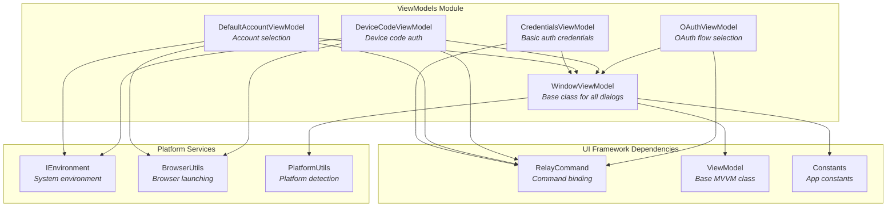
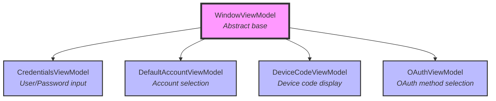
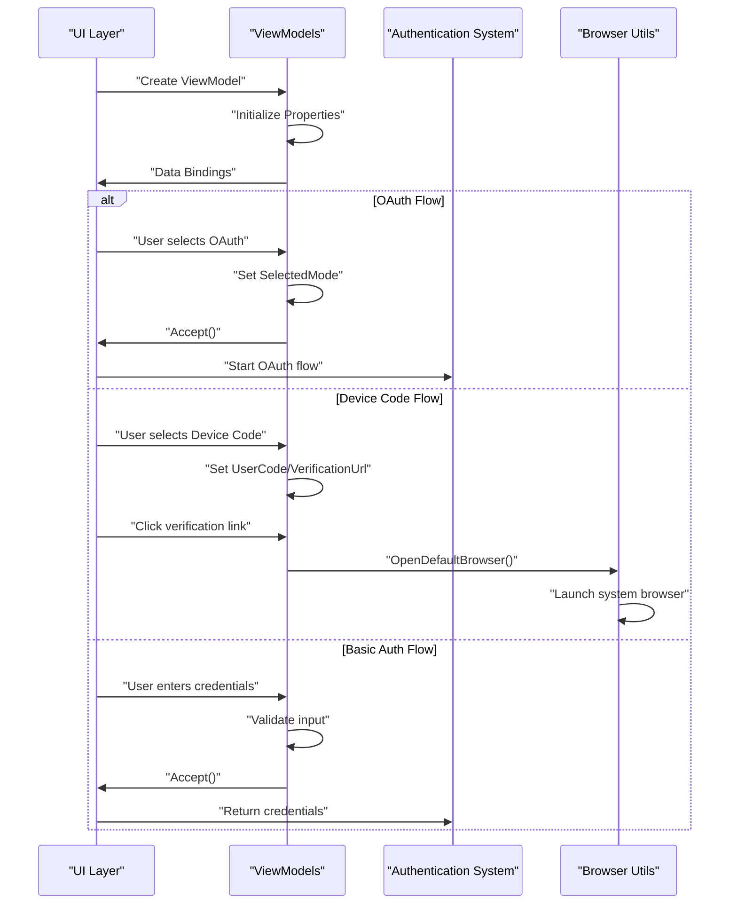
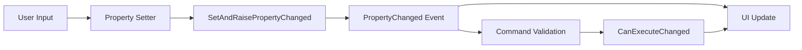

# ViewModels Module Documentation

## Overview

The ViewModels module is a core component of the Git Credential Manager's UI Framework, providing the data binding and business logic layer for authentication dialogs and user interface interactions. Built on the Model-View-ViewModel (MVVM) pattern, this module serves as the bridge between the application's business logic and the Avalonia-based user interface.

The module handles various authentication scenarios including basic credentials, OAuth flows, device code authentication, and default account selection, providing a unified and platform-consistent user experience across Windows, macOS, and Linux.

## Architecture

### Core Components



### Component Hierarchy



## Component Details

### WindowViewModel

The abstract base class for all dialog ViewModels, providing common functionality for window management, custom chrome handling, and dialog results.

**Key Responsibilities:**
- Window chrome customization based on platform
- Dialog result management (Accept/Cancel)
- Custom border and styling control
- Debug controls visibility

**Platform-Specific Features:**
- Extends client area on Windows and macOS
- Shows custom chrome on Windows (native traffic lights on macOS)
- Custom window borders on Windows only

### CredentialsViewModel

Handles basic authentication scenarios where users need to input username and password credentials.

**Key Features:**
- Username and password property binding
- Sign-in command with validation
- Product header visibility control
- Description text for context

**Validation Logic:**
- Permits empty username, password, or both (maintains compatibility with Windows CredUI)
- No restrictive validation to support various authentication scenarios

### DefaultAccountViewModel

Manages the default account selection flow, allowing users to choose between using a detected default account or selecting a different one.

**Key Features:**
- Default account detection and display
- Continue with default account option
- Use different account option
- Learn more link functionality

**Dependencies:**
- Requires `IEnvironment` for browser operations
- Integrates with system browser for help links

### DeviceCodeViewModel

Handles device code authentication flow, displaying verification codes and URLs for devices with limited input capabilities.

**Key Features:**
- User code display with proper formatting
- Verification URL display and clickable link
- Browser integration for opening verification URLs
- Product header visibility control

**User Experience:**
- Simplifies device code entry process
- Provides direct link to verification page
- Maintains clean, focused interface

### OAuthViewModel

Manages OAuth authentication method selection, allowing users to choose between browser-based or device code authentication flows.

**Key Features:**
- Authentication mode selection (Browser vs Device Code)
- Dynamic visibility of authentication options
- Description text for context
- Product header control

**Flow Management:**
- Sets `SelectedMode` property based on user choice
- Triggers appropriate authentication flow
- Integrates with [Authentication System](AuthenticationSystem.md) module

## Data Flow

### Authentication Flow Sequence



### Property Change Notification



## Integration Points

### UI Framework Integration

The ViewModels module integrates closely with the [UI Framework](UIFramework.md) through:

- **Avalonia Data Binding**: Property change notifications update UI automatically
- **RelayCommand Pattern**: Command binding for user interactions
- **Window Management**: Integration with Avalonia windowing system
- **Platform Services**: Cross-platform browser and environment access

### Authentication System Integration

ViewModels work with the [Authentication System](AuthenticationSystem.md) to:

- **OAuth Flow Selection**: `OAuthViewModel` determines authentication method
- **Credential Collection**: `CredentialsViewModel` gathers user credentials
- **Device Code Flow**: `DeviceCodeViewModel` manages device authentication
- **Account Selection**: `DefaultAccountViewModel` handles account choice

### Platform Integration

The module leverages platform-specific features through:

- **Platform Detection**: `PlatformUtils` for OS-specific behavior
- **Browser Integration**: `BrowserUtils` for cross-platform URL opening
- **Environment Access**: `IEnvironment` for system interaction

## Usage Patterns

### Creating a Dialog

```csharp
// Basic credentials dialog
var viewModel = new CredentialsViewModel
{
    Description = "Enter your GitHub credentials",
    ShowProductHeader = true
};

// Default account selection
var env = serviceProvider.GetService<IEnvironment>();
var viewModel = new DefaultAccountViewModel(env)
{
    UserName = "john.doe@example.com",
    ShowProductHeader = true
};
```

### Handling Dialog Results

```csharp
// Accept/Cancel pattern
viewModel.Accepted += (s, e) => 
{
    // Handle successful completion
    var credentials = viewModel.UserName + ":" + viewModel.Password;
};

viewModel.Canceled += (s, e) => 
{
    // Handle cancellation
    throw new OperationCanceledException();
};
```

### Command Binding

```csharp
// RelayCommand usage
public RelayCommand SignInCommand { get; }

// In constructor
SignInCommand = new RelayCommand(Accept, CanSignIn);

// Validation logic
private bool CanSignIn()
{
    return !string.IsNullOrEmpty(UserName) && !string.IsNullOrEmpty(Password);
}
```

## Platform Considerations

### Windows
- Custom window chrome with full border control
- Native credential dialog compatibility
- Windows-specific browser integration

### macOS
- Respects native traffic light controls
- Limited custom chrome to maintain native appearance
- macOS-specific browser handling

### Linux
- Standard window decorations
- Cross-desktop environment compatibility
- Special handling for browser process isolation

## Security Considerations

### Credential Handling
- Password properties use secure binding patterns
- No credential persistence in ViewModels
- Immediate disposal after use

### Browser Integration
- URL validation before opening
- HTTPS enforcement for sensitive operations
- Platform-specific security measures

### UI Security
- Debug controls hidden by default
- Product header visibility control
- Consistent security messaging

## Testing and Development

### Design-Time Support
- Parameterless constructors for XAML designer
- Mock data for visual development
- Platform detection for designer scenarios

### Debug Features
- Debug controls visibility toggle
- Window chrome override for testing
- Extended client area debugging

## Related Documentation

- [UI Framework](UIFramework.md) - Core UI infrastructure and controls
- [Authentication System](AuthenticationSystem.md) - Authentication providers and flows
- [Cross-Platform Support](CrossPlatformSupport.md) - Platform-specific implementations
- [Core Application Framework](CoreApplicationFramework.md) - Base services and utilities

## Future Considerations

### Extensibility
- Base ViewModel classes for custom authentication flows
- Plugin architecture for provider-specific ViewModels
- Theming and customization support

### Accessibility
- Screen reader compatibility
- Keyboard navigation enhancement
- High contrast mode support

### Performance
- ViewModel pooling for frequent dialogs
- Lazy initialization patterns
- Memory usage optimization