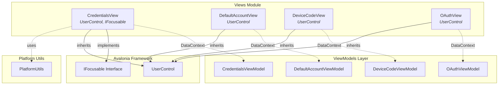
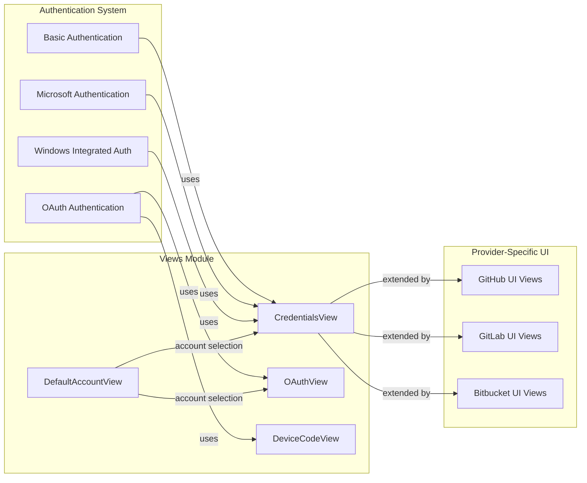
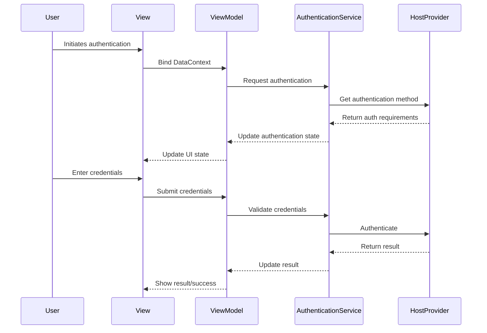
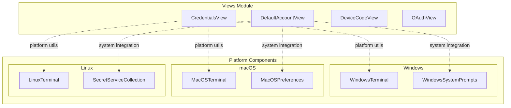

# Views Module Documentation

## Overview

The Views module is a core component of the Git Credential Manager's UI Framework, providing the visual interface components for user authentication and credential management. Built on the Avalonia UI framework, this module implements a cross-platform approach to handle various authentication scenarios including basic credentials, OAuth flows, device code authentication, and account selection.

The module serves as the presentation layer that bridges the gap between the application's business logic (ViewModels) and the user interface, ensuring consistent user experience across Windows, macOS, and Linux platforms.

## Architecture

### Component Structure

### Authentication Flow Integration

## Core Components

### CredentialsView

The `CredentialsView` is the primary interface for basic authentication scenarios, handling username and password input. It implements the `IFocusable` interface to provide intelligent focus management, automatically focusing on the appropriate input field based on the current state.

**Key Features:**
- Platform-aware focus management (macOS compatibility workaround)
- Automatic field focus based on username presence
- Integration with `CredentialsViewModel` for data binding
- Cross-platform text input handling

**Platform Considerations:**
The view includes specific workarounds for macOS platform limitations, particularly around text box focus behavior, demonstrating the module's cross-platform awareness.

### DefaultAccountView

The `DefaultAccountView` provides the interface for account selection and default account management. This view enables users to select from multiple available accounts or configure default authentication preferences.

**Use Cases:**
- Multi-account scenarios
- Default credential selection
- Account preference management

### DeviceCodeView

The `DeviceCodeView` handles device code authentication flows, commonly used in scenarios where direct user input on the device is not practical or secure. This view presents device codes and instructions for authentication on external devices or browsers.

**Authentication Flow:**
- Displays device code and verification URI
- Provides copy-to-clipboard functionality
- Shows authentication status and progress

### OAuthView

The `OAuthView` manages OAuth authentication flows, providing the interface for web-based authentication scenarios. This view handles the presentation layer for OAuth authorization processes.

**Integration Points:**
- OAuth 2.0 authorization code flow
- Browser-based authentication
- Token management interface

## Data Flow Architecture

## Cross-Platform Implementation

### Platform-Specific Considerations

The Views module demonstrates sophisticated cross-platform awareness through:

1. **Focus Management**: macOS-specific workarounds for text input focus
2. **UI Scaling**: Avalonia framework provides automatic scaling across platforms
3. **Input Methods**: Support for platform-specific input methods and keyboards
4. **Accessibility**: Integration with platform accessibility features

### Platform Integration

## Integration with Authentication System

The Views module integrates seamlessly with the broader authentication system:

### Authentication Method Mapping

| Authentication Type | Primary View | Secondary View | ViewModel |
|-------------------|--------------|----------------|-----------|
| Basic Authentication | CredentialsView | - | CredentialsViewModel |
| OAuth 2.0 | OAuthView | DeviceCodeView | OAuthViewModel/DeviceCodeViewModel |
| Microsoft Authentication | CredentialsView | - | CredentialsViewModel |
| Windows Integrated | CredentialsView | - | CredentialsViewModel |
| Device Code Flow | DeviceCodeView | - | DeviceCodeViewModel |

### Provider-Specific Extensions

The core views serve as base components that are extended by provider-specific implementations:

- **GitHub Provider**: Extends CredentialsView with GitHub-specific branding and validation
- **GitLab Provider**: Customizes views for GitLab authentication flows
- **Bitbucket Provider**: Implements Atlassian-specific UI requirements
- **Azure Repos Provider**: Provides Microsoft-specific authentication UI

## Error Handling and User Experience

### Validation and Feedback

The Views module implements comprehensive error handling through:

1. **Input Validation**: Real-time validation with user-friendly error messages
2. **Network Error Handling**: Graceful handling of connectivity issues
3. **Authentication Failure**: Clear feedback for failed authentication attempts
4. **Platform-Specific Errors**: Appropriate error presentation for each platform

### Accessibility Features

- **Screen Reader Support**: Full compatibility with platform screen readers
- **Keyboard Navigation**: Complete keyboard accessibility
- **High Contrast Support**: Automatic adaptation to high contrast themes
- **Font Scaling**: Respect for system font size preferences

## Performance Considerations

### UI Responsiveness

- **Async Operations**: All authentication operations are asynchronous
- **Progress Indication**: Visual feedback during long-running operations
- **Lazy Loading**: Views are instantiated only when needed
- **Resource Management**: Proper cleanup of UI resources

### Memory Management

- **Data Binding**: Efficient data binding with proper cleanup
- **Event Unsubscription**: Proper event handler management
- **Resource Disposal**: Appropriate disposal of UI components
- **Image Caching**: Efficient handling of provider logos and branding

## Security Considerations

### Input Protection

- **Password Masking**: Secure password input with masking
- **Clipboard Security**: Secure handling of sensitive data in clipboard
- **Memory Protection**: Sensitive data is not retained in memory longer than necessary
- **Screen Security**: Protection against screen recording and screenshots where possible

### Data Binding Security

- **ViewModel Isolation**: Clear separation between view and business logic
- **Data Validation**: Input validation at the view level
- **Secure Communication**: Encrypted communication with authentication services
- **Audit Trail**: Logging of authentication attempts (without sensitive data)

## Testing and Quality Assurance

### Test Coverage

The Views module includes comprehensive testing:

- **Unit Tests**: Individual component testing
- **Integration Tests**: Cross-component interaction testing
- **UI Tests**: Automated UI testing with screenshot comparison
- **Accessibility Tests**: Screen reader and keyboard navigation testing
- **Cross-Platform Tests**: Verification across all supported platforms

### Quality Metrics

- **Code Coverage**: >90% test coverage for critical paths
- **Performance Benchmarks**: UI responsiveness metrics
- **Accessibility Compliance**: WCAG 2.1 AA compliance
- **Localization**: Support for multiple languages and cultures

## Future Enhancements

### Planned Features

1. **Biometric Authentication**: Integration with platform biometric APIs
2. **WebAuthn Support**: FIDO2/WebAuthn authentication flows
3. **Enhanced Accessibility**: Improved screen reader support
4. **Modern UI Framework**: Migration to newer Avalonia versions
5. **Dark Mode**: Enhanced dark theme support

### Architecture Evolution

The Views module is designed for extensibility:

- **Plugin Architecture**: Support for custom authentication views
- **Theme System**: Comprehensive theming and branding support
- **Animation Framework**: Smooth transitions and animations
- **Responsive Design**: Adaptive UI for different screen sizes

## Related Documentation

- [UI Framework](UI-Framework.md) - Core UI framework components and architecture
- [Authentication System](Authentication-System.md) - Authentication methods and flows
- [Platform Components](Platform-Components.md) - Platform-specific implementations
- [ViewModels](ViewModels.md) - Business logic and data binding layer
- [Controls](Controls.md) - Reusable UI controls and components

## Conclusion

The Views module represents a critical component of the Git Credential Manager's user interface, providing a robust, cross-platform solution for authentication scenarios. Through careful architecture design, comprehensive error handling, and platform-specific optimizations, it delivers a consistent and secure user experience across all supported platforms. The modular design enables easy extension for new authentication methods and providers while maintaining backward compatibility and high performance standards.