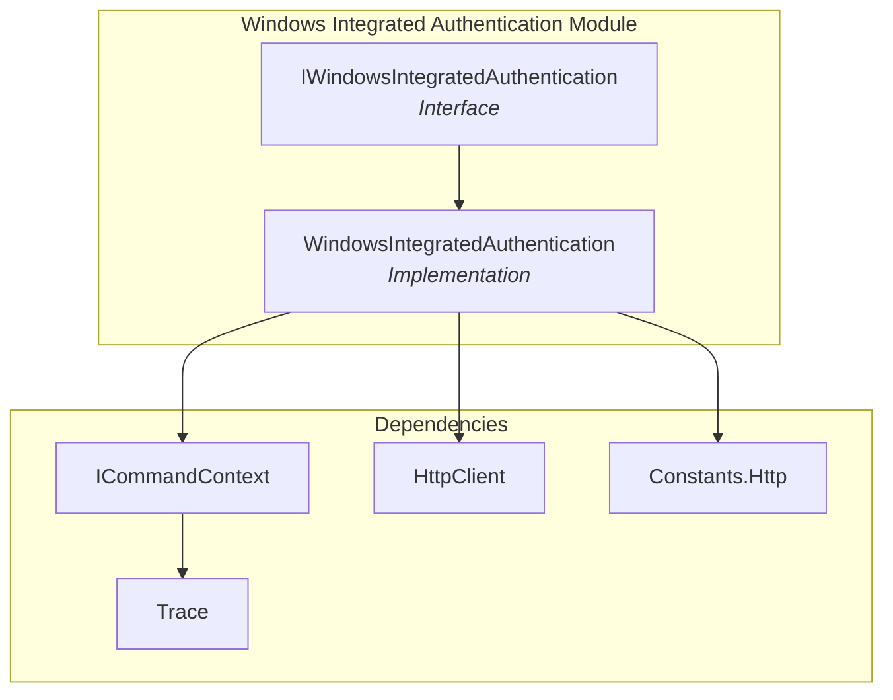
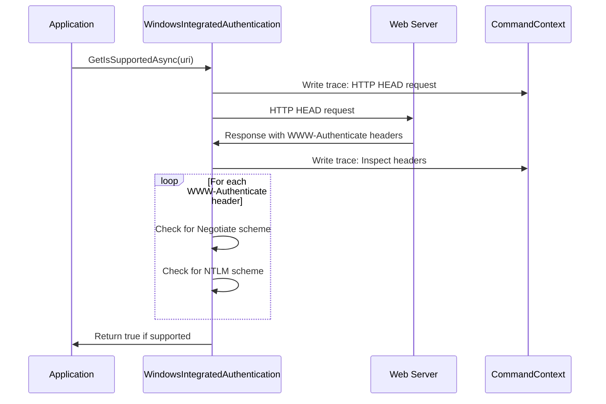
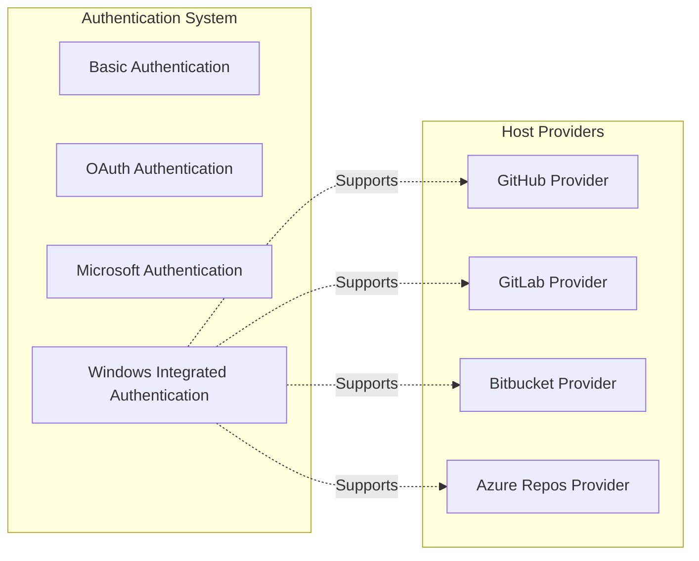

# Windows Integrated Authentication Module

## Introduction

The Windows Integrated Authentication module provides seamless authentication capabilities for Windows-based environments by leveraging native Windows authentication protocols. This module enables applications to authenticate users automatically using their current Windows credentials without requiring explicit username/password input, supporting both NTLM and Kerberos authentication schemes.

## Overview

Windows Integrated Authentication is a crucial component of the authentication system that enables automatic authentication using the user's current Windows credentials. The module detects server support for Windows authentication protocols and provides the foundation for seamless single sign-on (SSO) experiences in enterprise environments.

## Architecture

### Component Structure



### Authentication Flow



## Core Components

### IWindowsIntegratedAuthentication Interface

The `IWindowsIntegratedAuthentication` interface defines the contract for Windows integrated authentication functionality:

- **Purpose**: Provides a standardized interface for detecting Windows authentication support
- **Key Method**: `GetIsSupportedAsync(Uri uri)` - Determines if a URI supports Windows integrated authentication
- **Inheritance**: Extends `IDisposable` for proper resource management

### WindowsIntegratedAuthentication Class

The `WindowsIntegratedAuthentication` class implements the interface and provides the actual functionality:

#### Key Features

- **Authority IDs**: Defines supported authentication schemes including:
  - `integrated` - Generic integrated authentication
  - `windows` - Windows-specific authentication
  - `kerberos` - Kerberos protocol
  - `ntlm` - NTLM protocol
  - `tfs` - Team Foundation Server
  - `sso` - Single Sign-On

- **HTTP Client Management**: Lazy-initialized HTTP client for making authentication detection requests
- **Trace Logging**: Comprehensive logging of authentication detection process

#### Core Method: GetIsSupportedAsync

```csharp
public async Task<bool> GetIsSupportedAsync(Uri uri)
```

**Purpose**: Determines if a given URI supports Windows integrated authentication

**Process**:
1. Validates the URI parameter
2. Sends an HTTP HEAD request to the target URI
3. Inspects WWW-Authenticate headers in the response
4. Checks for Negotiate or NTLM authentication schemes
5. Returns true if either scheme is supported

## Dependencies

### Core Framework Dependencies

- **[CommandContext](Core%20Application%20Framework.md#commandcontext)**: Provides execution context, HTTP client factory, and tracing capabilities
- **[Trace System](Core%20Application%20Framework.md#tracing-and-diagnostics)**: Enables detailed logging of authentication detection process
- **[HTTP Constants](Core%20Application%20Framework.md)**: Defines authentication scheme constants

### External Dependencies

- **System.Net.Http**: For HTTP client functionality
- **System.Net.Http.Headers**: For authentication header processing

## Integration with Authentication System

### Position in Authentication Hierarchy



### Usage Patterns

The Windows Integrated Authentication module is typically used by:

1. **Host Providers**: To determine if Windows authentication is available for a given service
2. **Authentication Orchestrators**: To select appropriate authentication methods
3. **Enterprise Applications**: To enable seamless authentication in Windows domain environments

## Configuration and Settings

### Supported Authentication Schemes

The module recognizes the following authentication schemes in HTTP WWW-Authenticate headers:

- **Negotiate**: A Microsoft extension that allows selection between Kerberos and NTLM
- **NTLM**: Windows NT LAN Manager authentication protocol

### Environment Requirements

- Windows operating system (Windows 7 or later)
- Active Directory domain membership (for Kerberos)
- Network connectivity to authentication servers
- Appropriate Windows credentials

## Security Considerations

### Authentication Detection

- Uses HTTP HEAD requests to minimize data transfer
- Does not transmit credentials during detection phase
- Only reads server authentication requirements

### Resource Management

- Implements `IDisposable` for proper HTTP client cleanup
- Uses lazy initialization for HTTP client creation
- Provides thread-safe operation

## Error Handling

The module handles various error scenarios:

- **Network Errors**: HTTP request failures are logged but don't throw exceptions
- **Invalid URIs**: Parameter validation ensures only absolute URIs are accepted
- **Resource Cleanup**: Proper disposal of HTTP client resources

## Performance Characteristics

- **Detection Time**: Typically completes within 1-2 seconds
- **Network Usage**: Minimal (HEAD request only)
- **Memory Usage**: Low (single HTTP client instance)
- **Caching**: No caching - detection performed fresh each time

## Platform Support

### Windows Integration

The module is designed specifically for Windows environments and integrates with:

- Windows Authentication APIs
- Active Directory services
- Kerberos ticket management
- NTLM authentication

### Cross-Platform Considerations

While the module is primarily Windows-focused, the detection logic can work on any platform that supports the required HTTP protocols. However, actual Windows authentication would require platform-specific implementations.

## Future Enhancements

Potential areas for enhancement include:

- **Caching Mechanism**: Cache authentication detection results
- **Extended Protocol Support**: Additional Windows authentication protocols
- **Performance Optimization**: Parallel detection for multiple URIs
- **Enhanced Logging**: More detailed authentication failure analysis

## Related Documentation

- [Core Application Framework](Core%20Application%20Framework.md) - For CommandContext and tracing systems
- [Authentication System](Authentication%20System.md) - Overview of the complete authentication framework
- [OAuth Authentication](OAuth%20Authentication.md) - Alternative authentication method
- [Basic Authentication](Basic%20Authentication.md) - Simple username/password authentication