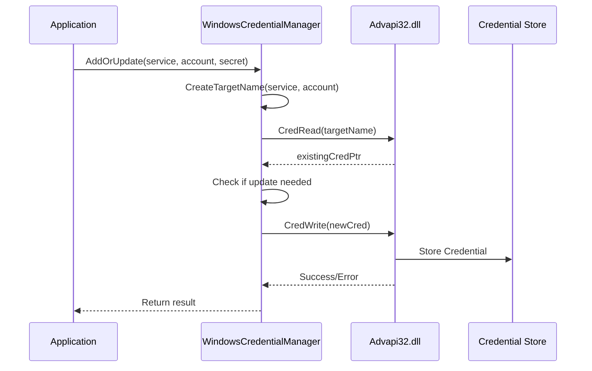
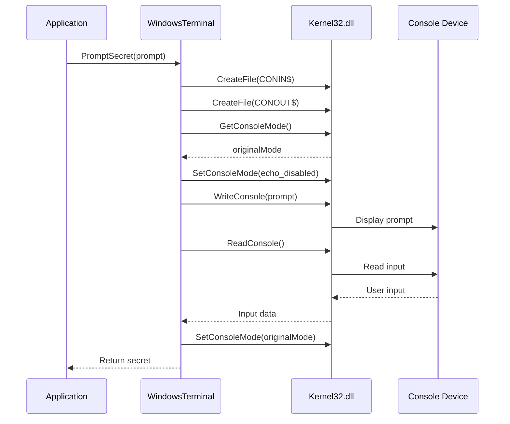
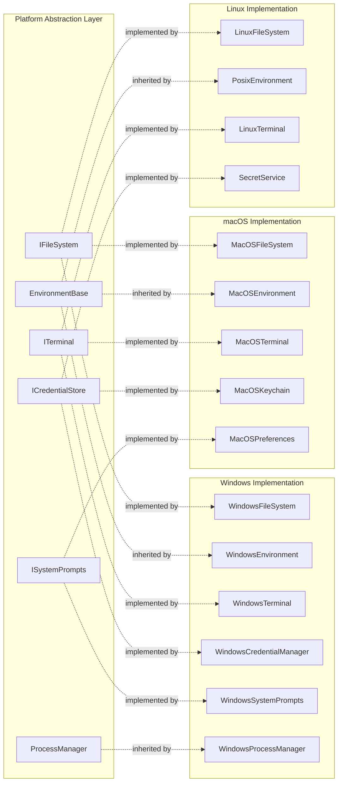

# Windows Platform Components

## Introduction

The Windows Platform Components module provides Windows-specific implementations of core system interfaces, enabling the Git Credential Manager to integrate seamlessly with Windows operating system features and services. This module serves as the Windows-specific layer in the cross-platform architecture, abstracting Windows APIs and services behind common interfaces.

## Overview

The Windows Platform Components module implements platform-specific functionality for:
- File system operations with Windows path handling
- Environment variable management with Windows-specific behaviors
- Session management and desktop detection
- Terminal/console interactions using Windows Console APIs
- Credential storage via Windows Credential Manager
- DPAPI-encrypted file-based credential storage
- System credential prompts using Windows dialog APIs
- Process management with WSL (Windows Subsystem for Linux) support

## Architecture

### Component Structure

```mermaid
graph TB
    subgraph "Windows Platform Components"
        WF[WindowsFileSystem]
        WE[WindowsEnvironment]
        WSM[WindowsSessionManager]
        WT[WindowsTerminal]
        WCM[WindowsCredentialManager]
        DCS[DpapiCredentialStore]
        WSP[WindowsSystemPrompts]
        WPM[WindowsProcessManager]
    end
    
    subgraph "Core Interfaces"
        FS[IFileSystem]
        EB[EnvironmentBase]
        SM[SessionManager]
        IT[ITerminal]
        ICS[ICredentialStore]
        PCS[PlaintextCredentialStore]
        ISP[ISystemPrompts]
        PM[ProcessManager]
    end
    
    WF -->|inherits| FS
    WE -->|inherits| EB
    WSM -->|inherits| SM
    WT -->|implements| IT
    WCM -->|implements| ICS
    DCS -->|inherits| PCS
    WSP -->|implements| ISP
    WPM -->|inherits| PM
    
    subgraph "Windows Native APIs"
        KERNEL32[Kernel32.dll]
        ADVAPI32[Advapi32.dll]
        USER32[User32.dll]
        CREDUI[Credui.dll]
    end
    
    WT -->|uses| KERNEL32
    WCM -->|uses| ADVAPI32
    WSM -->|uses| USER32
    WSP -->|uses| CREDUI
    DCS -->|uses| DPAPI
```

### Dependencies

The Windows Platform Components module depends on several core modules:

- **[Core Application Framework](Core Application Framework.md)**: Provides base classes like `EnvironmentBase`, `SessionManager`, and `ProcessManager`
- **[Credential Management](Credential Management.md)**: Defines `ICredentialStore` interface and `PlaintextCredentialStore` base class
- **[Cross-Platform Support](Cross-Platform Support.md)**: Contains shared interfaces like `IFileSystem`, `ITerminal`, and `ISystemPrompts`

## Components

### WindowsFileSystem

Provides Windows-specific file system operations with case-insensitive path comparison.

**Key Features:**
- Case-insensitive path comparison using `StringComparer.OrdinalIgnoreCase`
- Handles Windows-specific path resolution without symlink support (requires admin permissions)
- Inherits from base `FileSystem` class

**Implementation Details:**
- Uses `Path.GetFullPath()` for path normalization
- Returns `false` for empty or whitespace paths
- Optimistically handles cases where symlinks are not supported

### WindowsEnvironment

Manages Windows environment variables with platform-specific behaviors.

**Key Features:**
- Case-insensitive environment variable handling
- PATH variable management with semicolon delimiter
- Handles Windows-specific environment variable duplication issues
- Supports both process and system-level environment variable targets

**Implementation Details:**
- Uses `StringComparer.OrdinalIgnoreCase` for variable deduplication
- Splits PATH variables using semicolon (`;`) delimiter
- Removes empty entries to prevent current directory resolution issues
- Immediately updates system environment variables via `Environment.SetEnvironmentVariable()`

### WindowsSessionManager

Detects Windows desktop sessions and interactive environments.

**Key Features:**
- Determines if running in a visible desktop session
- Uses Windows Window Station APIs for session detection
- Handles Windows Nano and headless scenarios

**Implementation Details:**
- Calls `User32.GetProcessWindowStation()` to get window station handle
- Uses `User32.GetUserObjectInformation()` with `WSF_VISIBLE` flag
- Returns `true` optimistically when detection fails (includes Windows Nano)

### WindowsTerminal

Provides Windows Console API-based terminal operations.

**Key Features:**
- Direct console input/output using Windows Console APIs
- Secure password prompting with echo control
- TTY detection and fallback handling
- Console mode management for secure input

**Implementation Details:**
- Uses `Kernel32.CreateFile()` with `CONIN$` and `CONOUT$` special files
- Implements `TtyContext` class for console mode management
- Handles buffer sizes up to 16KB for console operations
- Provides both regular and secret (no-echo) prompting modes

### WindowsCredentialManager

Integrates with Windows Credential Manager for secure credential storage.

**Key Features:**
- Full CRUD operations on Windows Credential Manager
- Namespace support for credential scoping
- URI-based credential matching with userinfo stripping
- Legacy credential format support

**Implementation Details:**
- Uses `Advapi32.CredRead()`, `CredWrite()`, and `CredDelete()` APIs
- Implements complex target name creation with account information
- Supports both exact and URI-based credential matching
- Handles credential persistence checking via `CredGetSessionTypes()`

### DpapiCredentialStore

Provides DPAPI-encrypted file-based credential storage.

**Key Features:**
- DPAPI encryption for credential secrets
- File-based storage with metadata attributes
- Inherits from `PlaintextCredentialStore` for base functionality
- Current user scope protection

**Implementation Details:**
- Uses `ProtectedData.Protect()` and `ProtectedData.Unprotect()` APIs
- Stores encrypted data as base64-encoded strings
- Includes service and account metadata in plaintext
- Creates parent directories as needed

### WindowsSystemPrompts

Displays Windows system credential dialogs.

**Key Features:**
- Native Windows credential UI dialogs
- Parent window support for proper dialog positioning
- Pre-population of username fields
- Secure credential packing and unpacking

**Implementation Details:**
- Uses `Credui.dll` APIs for dialog display
- Implements `CredUIPromptForWindowsCredentials()` for standard dialogs
- Handles credential packing with `CredPackAuthenticationBuffer()`
- Supports both generic and domain credential types

### WindowsProcessManager

Manages process creation with Windows-specific features.

**Key Features:**
- WSL (Windows Subsystem for Linux) support
- Automatic WSL path detection and conversion
- Distro-specific WSL process creation

**Implementation Details:**
- Detects WSL paths using `WslUtils.IsWslPath()`
- Converts Windows paths to WSL distro paths
- Creates WSL processes via `wsl.exe` command tool
- Falls back to standard process creation for non-WSL paths

## Data Flow

### Credential Storage Flow

### Terminal Interaction Flow

## Integration Points

### Cross-Platform Architecture

The Windows Platform Components module integrates with the broader cross-platform architecture:

## Security Considerations

### DPAPI Encryption
- The `DpapiCredentialStore` uses Windows DPAPI for encrypting credential secrets
- Encryption is scoped to the current user (`DataProtectionScope.CurrentUser`)
- Secrets are encrypted before being written to disk

### Windows Credential Manager
- Credentials are stored in the Windows Credential Manager vault
- Access is controlled by Windows security mechanisms
- Credentials can be persisted based on session type and security policy

### Secure Terminal Input
- The `WindowsTerminal` component disables console echo for password input
- Console modes are properly restored after secure input operations
- Input is read directly from the console device, bypassing standard streams

### Process Isolation
- WSL processes are launched through the official `wsl.exe` interface
- Process creation follows Windows security best practices
- No direct execution of WSL binaries from Windows paths

## Error Handling

### Win32 Error Handling
All Windows API calls use consistent error handling patterns:
- Errors are captured using `Marshal.GetLastWin32Error()`
- Custom `Win32Error` class provides structured error handling
- Detailed error messages are logged via the tracing system

### Fallback Behaviors
- Desktop session detection falls back to `true` when APIs fail
- Terminal operations gracefully handle non-TTY environments
- Credential operations provide meaningful error messages for common failures

## Performance Considerations

### API Efficiency
- Windows Credential Manager enumeration is lazy-loaded using `yield return`
- Console operations use appropriate buffer sizes (16KB) for optimal performance
- Environment variable operations cache results to minimize system calls

### Resource Management
- All native handles are properly disposed using `SafeFileHandle`
- Marshal allocations are explicitly freed in `finally` blocks
- Credential enumeration results are streamed rather than buffered

## Platform-Specific Features

### Windows-Only Capabilities
- Integration with Windows Credential Manager
- DPAPI encryption support
- WSL process management
- Windows-specific environment variable handling
- Desktop session detection via Window Stations

### Windows Version Compatibility
- Supports Windows 7 and later
- Handles Windows Nano Server limitations
- Compatible with both client and server Windows editions
- Works with Windows Subsystem for Linux (WSL)

## Testing and Diagnostics

### Platform Detection
- Uses `PlatformUtils.EnsureWindows()` for runtime platform verification
- Provides clear error messages when components are used on non-Windows platforms
- Component constructors validate platform compatibility

### Diagnostic Support
- All components integrate with the tracing system for debugging
- Windows API failures include detailed error codes and descriptions
- Credential operations provide audit trails for security analysis

## Future Considerations

### Potential Enhancements
- Support for Windows Hello biometric authentication
- Integration with Windows 10/11 modern credential providers
- Enhanced WSL2 support and performance optimizations
- Windows Terminal integration for improved UI experiences

### Compatibility Notes
- Components are designed to work across Windows versions
- Graceful degradation for features not available in older Windows versions
- Future Windows API changes can be accommodated through interface abstraction