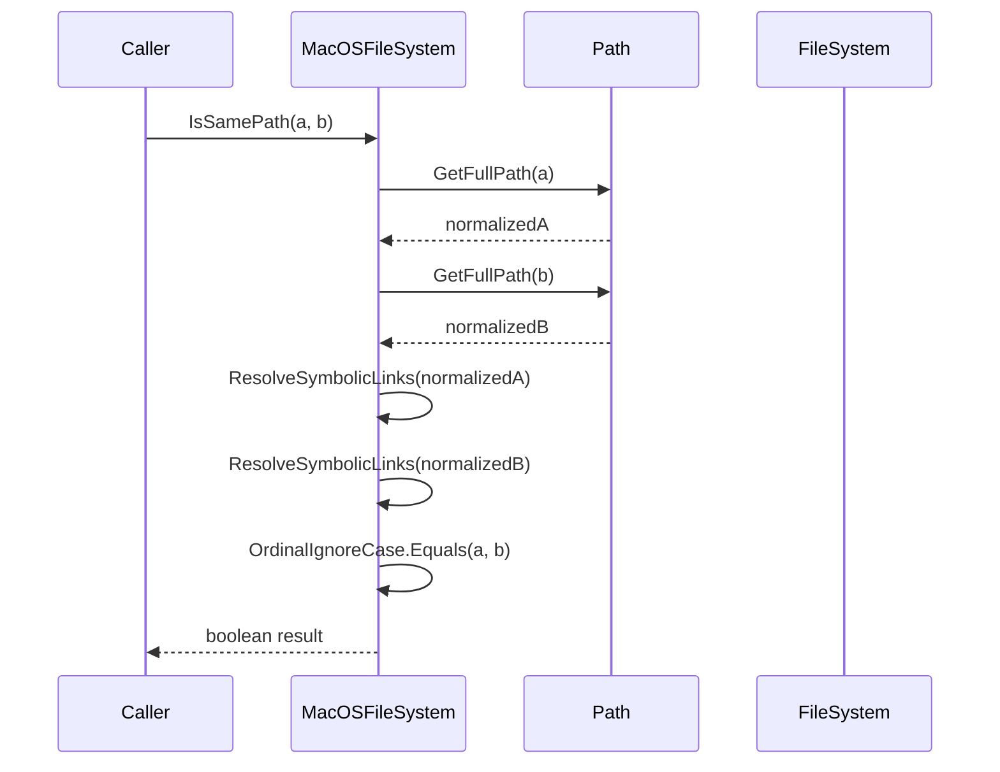
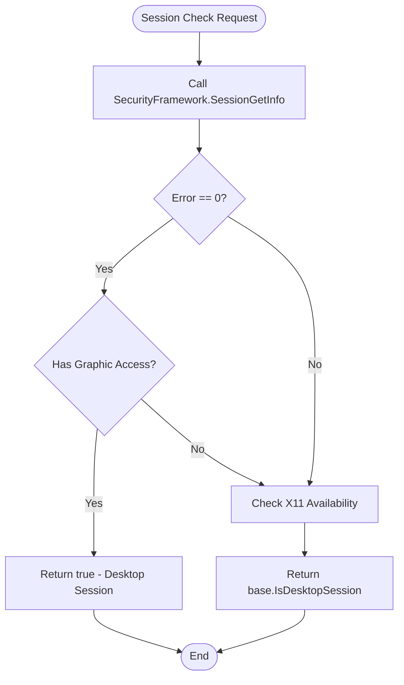
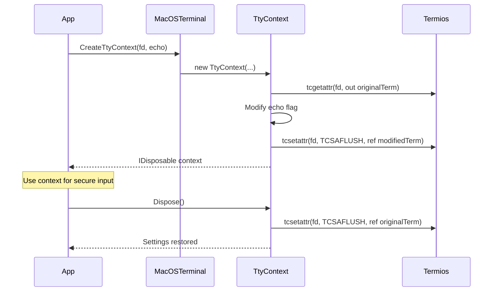
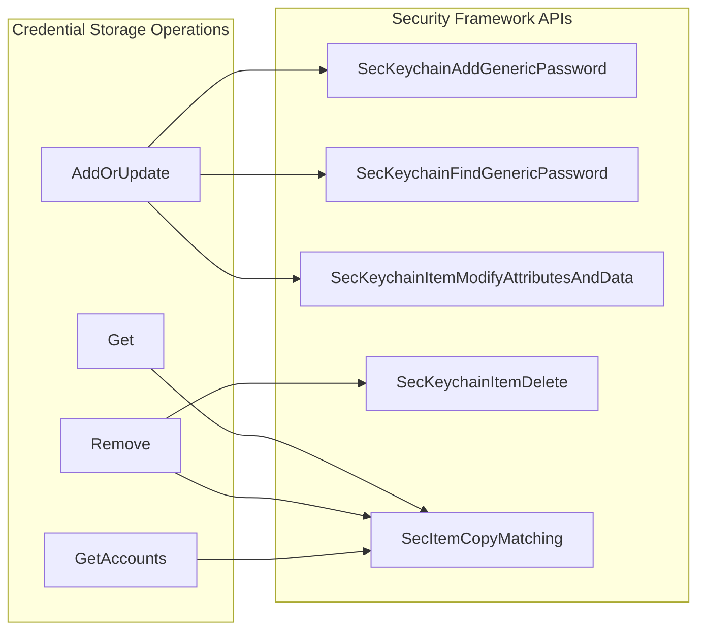
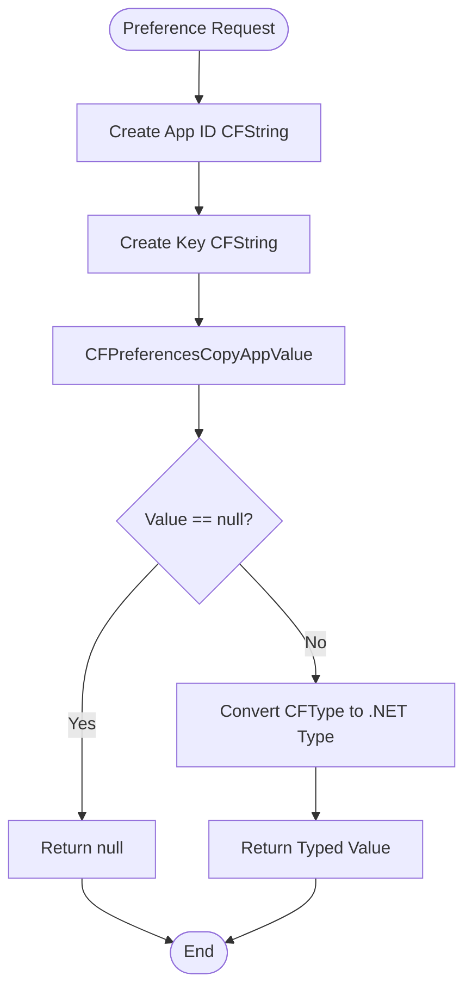

# macOS Platform Components Module

## Introduction

The macOS Platform Components module provides macOS-specific implementations of cross-platform abstractions within the Git Credential Manager (GCM) system. This module serves as the bridge between the core GCM functionality and macOS-specific system services, enabling seamless credential management and authentication workflows on Apple platforms.

The module leverages native macOS frameworks including Security Framework, Core Foundation, and system preferences to provide secure credential storage, terminal management, file system operations, and environment handling that align with macOS conventions and security best practices.

## Architecture Overview

The macOS Platform Components module implements a layered architecture that extends POSIX-compliant base classes while integrating with macOS-specific native APIs:

```mermaid
graph TB
    subgraph "macOS Platform Components"
        MacOSFileSystem["MacOSFileSystem"]
        MacOSEnvironment["MacOSEnvironment"]
        MacOSSessionManager["MacOSSessionManager"]
        MacOSTerminal["MacOSTerminal"]
        MacOSKeychain["MacOSKeychain"]
        MacOSPreferences["MacOSPreferences"]
        MacOSSettings["MacOSSettings"]
    end
    
    subgraph "POSIX Base Classes"
        PosixFileSystem["PosixFileSystem"]
        PosixEnvironment["PosixEnvironment"]
        PosixSessionManager["PosixSessionManager"]
        PosixTerminal["PosixTerminal"]
    end
    
    subgraph "Native macOS APIs"
        SecurityFramework["Security Framework"]
        CoreFoundation["Core Foundation"]
        SystemPreferences["System Preferences"]
        TerminalAPIs["Terminal APIs"]
    end
    
    subgraph "Core Interfaces"
        IFileSystem["IFileSystem"]
        IEnvironment["IEnvironment"]
        ISessionManager["ISessionManager"]
        ITerminal["ITerminal"]
        ICredentialStore["ICredentialStore"]
        ISettings["ISettings"]
    end
    
    MacOSFileSystem --> PosixFileSystem
    MacOSFileSystem --> IFileSystem
    
    MacOSEnvironment --> PosixEnvironment
    MacOSEnvironment --> IEnvironment
    
    MacOSSessionManager --> PosixSessionManager
    MacOSSessionManager --> ISessionManager
    MacOSSessionManager --> SecurityFramework
    
    MacOSTerminal --> PosixTerminal
    MacOSTerminal --> ITerminal
    MacOSTerminal --> TerminalAPIs
    
    MacOSKeychain --> ICredentialStore
    MacOSKeychain --> SecurityFramework
    MacOSKeychain --> CoreFoundation
    
    MacOSPreferences --> CoreFoundation
    MacOSPreferences --> SystemPreferences
    
    MacOSSettings --> ISettings
    MacOSSettings --> MacOSPreferences
```

## Component Details

### File System Operations (MacOSFileSystem)

The `MacOSFileSystem` class extends `PosixFileSystem` to provide macOS-specific file system operations, particularly focusing on path comparison logic that accounts for macOS file system characteristics.

**Key Features:**
- **Symbolic Link Resolution**: Automatically resolves symbolic links before path comparison
- **Case-Insensitive Comparison**: Implements case-insensitive path comparison by default, reflecting the typical configuration of HFS+ and APFS file systems
- **Path Normalization**: Uses `Path.GetFullPath()` to normalize paths before comparison

**Implementation Details:**

### Environment Management (MacOSEnvironment)

The `MacOSEnvironment` class handles macOS-specific environment variable management and executable location, with special consideration for Homebrew installations.

**Key Features:**
- **Homebrew Integration**: Identifies and ignores Homebrew's Git shim to prevent conflicts
- **Executable Location**: Extends POSIX executable location with macOS-specific paths
- **Environment Variable Management**: Inherits comprehensive environment handling from `PosixEnvironment`

**Homebrew Integration Logic:**
The component automatically detects Homebrew installations by checking the `HOMEBREW_PREFIX` environment variable and excludes Homebrew's Git shim from executable searches, preventing potential conflicts with system Git installations.

### Session Management (MacOSSessionManager)

The `MacOSSessionManager` determines whether the current session supports graphical user interfaces by integrating with macOS Security Framework.

**Key Features:**
- **Security Framework Integration**: Uses `SessionGetInfo` to query session attributes
- **Graphics Capability Detection**: Checks for `SessionHasGraphicAccess` flag to determine GUI support
- **Desktop Session Detection**: Falls back to X11 detection for completeness

**Session Detection Process:**

### Terminal Management (MacOSTerminal)

The `MacOSTerminal` class provides macOS-specific terminal control, particularly for managing echo settings during password input.

**Key Features:**
- **TTY Context Management**: Creates disposable contexts for terminal state changes
- **Echo Control**: Safely enables/disables terminal echo for secure password input
- **State Restoration**: Automatically restores original terminal settings on disposal
- **Native Integration**: Uses macOS-specific `termios_MacOS` structures

**Terminal State Management:**

### Credential Storage (MacOSKeychain)

The `MacOSKeychain` class provides secure credential storage by integrating with macOS's native Keychain Services, offering enterprise-grade security and user consent management.

**Key Features:**
- **Native Keychain Integration**: Uses Security Framework's `SecKeychain*` APIs
- **Service Namespacing**: Supports optional namespace scoping for credential isolation
- **CRUD Operations**: Full Create, Read, Update, Delete operations for credentials
- **Error Handling**: Comprehensive error handling with macOS-specific error codes
- **Memory Management**: Proper Core Foundation memory management with `CFRelease`

**Credential Operations Flow:**

**Memory Management Pattern:**
All operations follow a consistent pattern of creating Core Foundation objects, using them, and properly releasing them in `finally` blocks to prevent memory leaks.

### System Preferences (MacOSPreferences)

The `MacOSPreferences` class provides read-only access to macOS application preferences stored in the system's preferences database.

**Key Features:**
- **Core Foundation Integration**: Uses `CFPreferencesCopyAppValue` for preference retrieval
- **Type-Safe Access**: Provides typed accessors for strings, integers, and dictionaries
- **Application Scoping**: Preferences are scoped to specific application bundle IDs
- **Enterprise Support**: Supports configuration profiles deployed via device management

**Preference Retrieval Process:**

### Settings Integration (MacOSSettings)

The `MacOSSettings` class extends the base `Settings` class to include macOS-specific configuration sources, particularly application preferences and system defaults.

**Key Features:**
- **Preference Integration**: Reads defaults from macOS application preferences
- **Enterprise Configuration**: Supports administrator-deployed configuration profiles
- **Git Configuration Compatibility**: Uses Git's configuration key comparison rules
- **Fallback Chain**: Integrates with existing environment variable and Git configuration sources

**Configuration Resolution Order:**
1. Environment variables (highest priority)
2. Git configuration files
3. macOS application preferences (lowest priority)

## Dependencies and Integration

### Internal Dependencies
The macOS Platform Components module depends on several core modules within the GCM system:

- **[Core Application Framework](Core Application Framework.md)**: Provides base interfaces like `IFileSystem`, `IEnvironment`, `ITerminal`, and `ISettings`
- **[POSIX Platform Components](POSIX Platform Components.md)**: Supplies base implementations that macOS components extend
- **[Credential Management](Credential Management.md)**: Defines `ICredentialStore` interface implemented by `MacOSKeychain`

### External Dependencies
The module integrates with native macOS frameworks:

- **Security Framework**: For Keychain Services and session management
- **Core Foundation**: For preference management and memory handling
- **System Terminal APIs**: For TTY control and terminal state management

## Security Considerations

### Keychain Security
- **User Consent**: Respects macOS Keychain's user consent requirements
- **Access Control**: Leverages macOS's built-in access control mechanisms
- **Secure Storage**: Credentials are encrypted using the system's keychain encryption
- **Memory Protection**: Sensitive data is properly cleared from memory after use

### Terminal Security
- **State Isolation**: Terminal state changes are isolated in disposable contexts
- **Automatic Restoration**: Original terminal settings are always restored
- **Error Handling**: Secure handling of terminal operation failures

## Error Handling

The module implements comprehensive error handling specific to macOS operations:

- **Security Framework Errors**: Maps macOS security error codes to meaningful exceptions
- **Core Foundation Errors**: Handles CF-specific error conditions
- **Memory Management Errors**: Ensures proper cleanup even in error conditions
- **Permission Errors**: Gracefully handles permission-denied scenarios

## Performance Considerations

- **Native API Efficiency**: Uses direct native API calls for optimal performance
- **Memory Management**: Minimizes allocations in hot paths
- **Caching**: Leverages system-level caching where appropriate
- **Lazy Initialization**: Defers expensive operations until needed

## Platform-Specific Features

### macOS Integration Points
- **Spotlight Integration**: File system operations respect Spotlight indexing
- **Gatekeeper Compatibility**: Operations work within Gatekeeper security constraints
- **System Integrity Protection**: Respects SIP-protected system locations
- **Dark Mode Support**: Terminal operations work correctly in all appearance modes

### Enterprise Features
- **Configuration Profiles**: Supports MDM-deployed configuration profiles
- **Keychain Policies**: Respects enterprise Keychain policies
- **Audit Compliance**: Operations are auditable through system logs

This module ensures that Git Credential Manager operates seamlessly within the macOS ecosystem while maintaining the security and usability standards expected by macOS users.