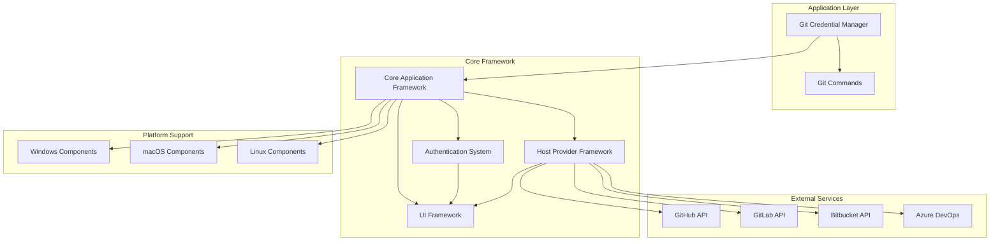
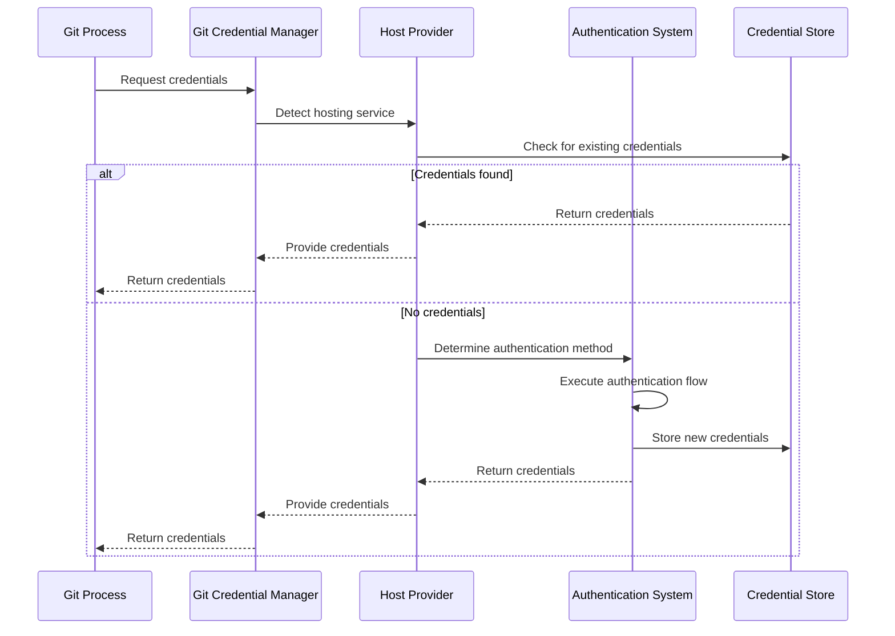

# Git Credential Manager (GCM) Repository Overview

## Purpose

Git Credential Manager (GCM) is a secure, cross-platform credential management system for Git that eliminates the need to manually enter credentials for every Git operation. It provides seamless authentication to Git hosting services including GitHub, GitLab, Bitbucket, and Azure Repos while maintaining enterprise-grade security and compliance requirements.

## Architecture

The repository follows a modular, layered architecture with clear separation of concerns:

## Core Modules

### 1. Core Application Framework
The foundational infrastructure providing:
- Application lifecycle management and command execution
- Cross-platform system integration and interoperability
- Configuration management and settings resolution
- Comprehensive tracing and diagnostics system
- Standard I/O and terminal communication

**Key Components:**
- `Application` - Main application orchestrator
- `CommandContext` - Execution environment abstraction
- `Settings` - Hierarchical configuration management
- `Trace/Trace2` - Multi-level diagnostic logging

### 2. Authentication System
Comprehensive authentication framework supporting multiple protocols:
- **Basic Authentication** - Traditional username/password
- **OAuth 2.0** - Authorization code and device code flows
- **Microsoft Authentication** - Azure AD and Microsoft Account integration
- **Windows Integrated Authentication** - Kerberos/NTLM support

**Key Components:**
- `OAuth2Client` - OAuth 2.0 protocol implementation
- `MicrosoftAuthentication` - MSAL integration
- `BasicAuthentication` - Credential prompt management

### 3. Host Provider Framework
Pluggable architecture for Git hosting service support:
- **GitHub Provider** - GitHub.com and Enterprise support
- **GitLab Provider** - GitLab.com and self-hosted instances
- **Bitbucket Provider** - Cloud and Data Center support
- **Azure Repos Provider** - Azure DevOps integration
- **Generic Provider** - Universal authentication support

**Key Components:**
- `HostProviderRegistry` - Provider discovery and selection
- `GenericHostProvider` - Fallback authentication support

### 4. Credential Management
Secure credential storage and retrieval:
- Platform-native credential stores (Windows Credential Manager, macOS Keychain, Linux Secret Service)
- Encrypted file-based storage options
- In-memory credential caching
- Cross-platform credential migration

**Key Components:**
- `ICredentialStore` - Unified credential storage interface
- `CredentialStore` - Factory for platform-specific implementations

### 5. UI Framework
Cross-platform user interface built on Avalonia:
- Authentication dialogs and credential collection
- OAuth browser integration and device code display
- Multi-factor authentication support
- Terminal-based fallback interfaces

**Key Components:**
- `AvaloniaApp` - Main UI application
- `CredentialsViewModel` - Authentication view models
- `TerminalMenu` - Command-line interface utilities

### 6. Cross-Platform Support
Platform-specific implementations for consistent behavior:
- **Windows** - Credential Manager, DPAPI, Console API
- **macOS** - Keychain Services, Core Foundation
- **Linux** - Secret Service, D-Bus integration
- **POSIX** - Standard Unix APIs and GPG support

**Key Components:**
- `IFileSystem` - Platform-agnostic file operations
- `ITerminal` - Cross-platform terminal management
- `ICredentialStore` - Native credential storage

### 7. Git Integration
Git-specific functionality and protocol support:
- Git configuration management
- Remote repository detection
- Git process execution and communication
- GPG integration for encrypted storage

**Key Components:**
- `IGit` - Git operations interface
- `GitProcessConfiguration` - Git config management
- `Gpg` - Encryption/decryption services

### 8. Diagnostics
Comprehensive system health checking:
- Environment validation
- Network connectivity testing
- Credential store verification
- Platform-specific diagnostics

**Key Components:**
- `IDiagnostic` - Diagnostic test interface
- `EnvironmentDiagnostic` - System environment checks
- `NetworkingDiagnostic` - Connectivity validation

## Data Flow

## Security Features

- **Secure Storage**: Platform-native encrypted credential storage
- **Secret Masking**: Automatic masking of sensitive data in logs
- **HTTPS Enforcement**: Warnings for insecure HTTP connections
- **Certificate Validation**: TLS/SSL certificate verification
- **Input Sanitization**: Comprehensive input validation and cleaning

## Platform Support

| Feature | Windows | macOS | Linux |
|---------|---------|--------|--------|
| Basic Authentication | ✓ | ✓ | ✓ |
| OAuth 2.0 | ✓ | ✓ | ✓ |
| Microsoft Auth | ✓ | ✓ | ✓ |
| Windows Integrated | ✓ | ✗ | ✗ |
| Native UI | ✓ | ✓ | ✓ |
| Terminal UI | ✓ | ✓ | ✓ |

## Configuration

The system supports extensive configuration through:
- **Git Configuration** - Repository and user-level settings
- **Environment Variables** - Runtime configuration overrides
- **Command-Line Arguments** - Immediate configuration changes
- **Platform Defaults** - OS-specific default settings

## References

For detailed documentation of core modules, see:
- [Core Application Framework](Core%20Application%20Framework.md)
- [Authentication System](Authentication%20System.md)
- [Host Provider Framework](Host%20Provider%20Framework.md)
- [Credential Management](Credential%20Management.md)
- [UI Framework](UI%20Framework.md)
- [Cross-Platform Support](Cross-Platform%20Support.md)
- [Git Integration](Git%20Integration.md)
- [Diagnostics](Diagnostics.md)