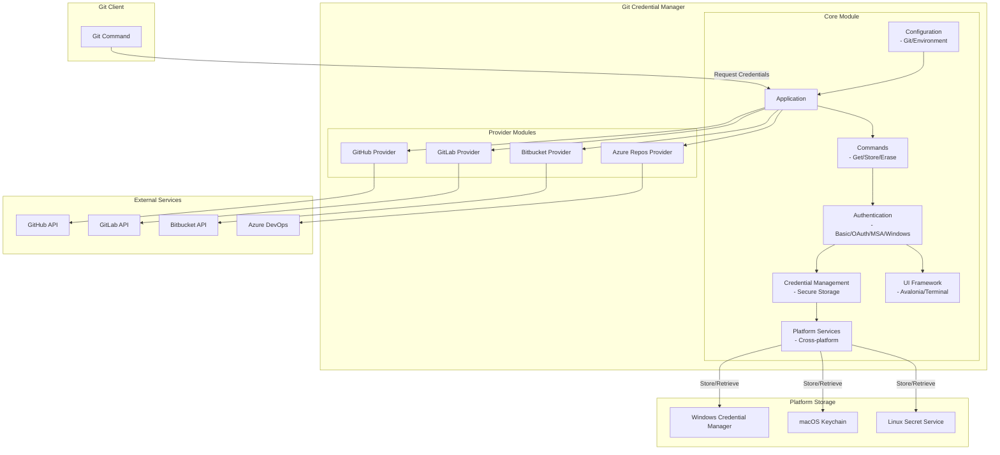

# Git Credential Manager Repository Overview

## Purpose

The Git Credential Manager (GCM) repository provides a secure, cross-platform credential management solution for Git operations. It serves as a Git credential helper that automates authentication with Git hosting services, eliminating the need for users to repeatedly enter credentials while maintaining security through platform-native credential storage.

## End-to-End Architecture


```mermaid
graph TB
    subgraph "Git Client"
        GIT[Git Command]
    end
    
    subgraph "Git Credential Manager"
        subgraph "Core Module"
            APP[Application]
            CMD[Commands<br/>- Get/Store/Erase]
            AUTH[Authentication<br/>- Basic/OAuth/MSA/Windows]
            CRED[Credential Management<br/>- Secure Storage]
            CONFIG[Configuration<br/>- Git/Environment]
            PLATFORM[Platform Services<br/>- Cross-platform]
            UI[UI Framework<br/>- Avalonia/Terminal]
        end
        
        subgraph "Provider Modules"
            GH[GitHub Provider]
            GL[GitLab Provider]
            BB[Bitbucket Provider]
            AZ[Azure Repos Provider]
        end
    end
    
    subgraph "External Services"
        GHS[GitHub API]
        GLS[GitLab API]
        BBS[Bitbucket API]
        AZS[Azure DevOps]
    end
    
    subgraph "Platform Storage"
        WIN[Windows Credential Manager]
        MAC[macOS Keychain]
        LIN[Linux Secret Service]
    end
    
    GIT -->|Request Credentials| APP
    APP --> CMD
    CMD --> AUTH
    AUTH --> CRED
    CRED --> PLATFORM
    PLATFORM -->|Store/Retrieve| WIN
    PLATFORM -->|Store/Retrieve| MAC
    PLATFORM -->|Store/Retrieve| LIN
    
    APP --> GH
    APP --> GL
    APP --> BB
    APP --> AZ
    
    GH --> GHS
    GL --> GLS
    BB --> BBS
    AZ --> AZS
    
    AUTH --> UI
    CONFIG --> APP
```

## Core Modules Documentation

The repository is organized into several key modules, each documented separately:

### [Core Module](Core.md)
The foundational infrastructure providing authentication frameworks, credential storage mechanisms, platform abstractions, and shared services used by all provider modules.

### [GitHub Provider](GitHubProvider.md)
Specialized provider for GitHub and GitHub Enterprise Server, supporting OAuth2, personal access tokens, multi-factor authentication, and intelligent account management.

### [GitLab Provider](GitLabProvider.md)
Provider for GitLab repositories supporting OAuth2 browser/device flows, personal access tokens, and basic authentication with cross-platform UI support.

### [Bitbucket Provider](BitbucketProvider.md)
Provider for Bitbucket Cloud and Data Center instances, offering OAuth2 and basic authentication with specialized UI components for Atlassian services.

### [Azure Repos Provider](AzureReposProvider.md)
Provider for Azure DevOps repositories supporting personal access tokens, Azure AD authentication, managed identity, and service principal authentication.

## Key Features

- **Cross-Platform Support**: Native implementations for Windows, macOS, and Linux
- **Secure Storage**: Platform-native credential stores with encryption
- **Multiple Authentication Methods**: OAuth2, PAT, Basic Auth, Windows Integrated Auth, Azure AD
- **Modern UI**: Avalonia-based graphical interface with terminal fallback
- **Enterprise Ready**: Proxy support, certificate management, comprehensive diagnostics
- **Extensible Architecture**: Plugin-based provider system for different Git hosts
- **Git Integration**: Seamless integration with Git's credential helper protocol

## Repository Structure

```
src/shared/
├── Core/                          # Core framework and shared services
│   ├── Application/              # Main application entry point
│   ├── Authentication/           # Authentication frameworks
│   ├── Commands/                 # Git credential helper commands
│   ├── CredentialManagement/     # Secure credential storage
│   ├── Interop/                  # Platform-specific implementations
│   ├── UI/                       # User interface components
│   └── ...
├── GitHub/                       # GitHub provider implementation
├── GitLab/                       # GitLab provider implementation
├── Atlassian.Bitbucket/          # Bitbucket provider implementation
└── Microsoft.AzureRepos/         # Azure Repos provider implementation
```

## Getting Started

Git Credential Manager is automatically invoked by Git when configured as a credential helper. It supports various authentication scenarios:

- **Personal Repositories**: OAuth or PAT authentication
- **Enterprise Repositories**: Windows Integrated Auth, Azure AD, or PAT
- **CI/CD Environments**: Service principal or managed identity authentication

For detailed configuration options and advanced usage, refer to the individual module documentation linked above.