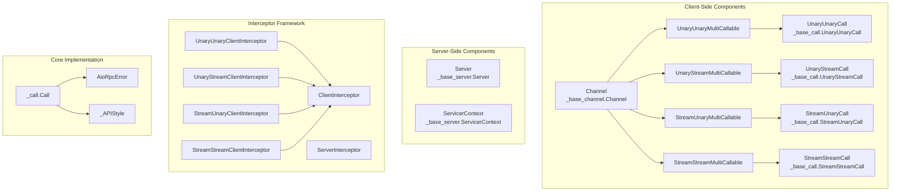
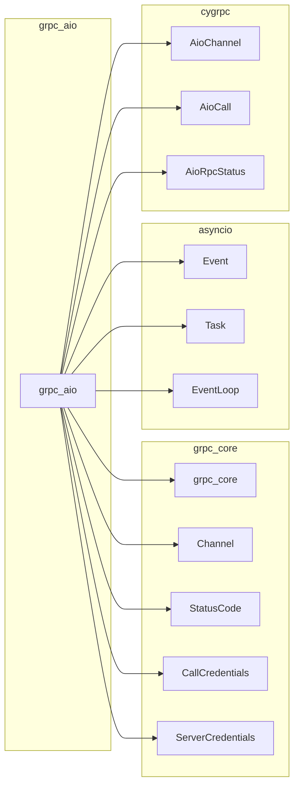
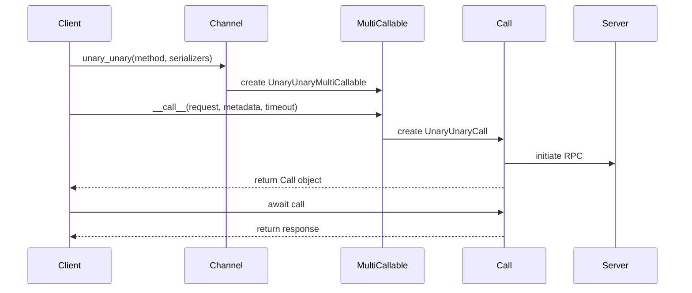
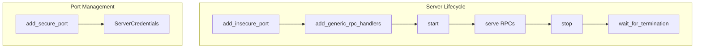
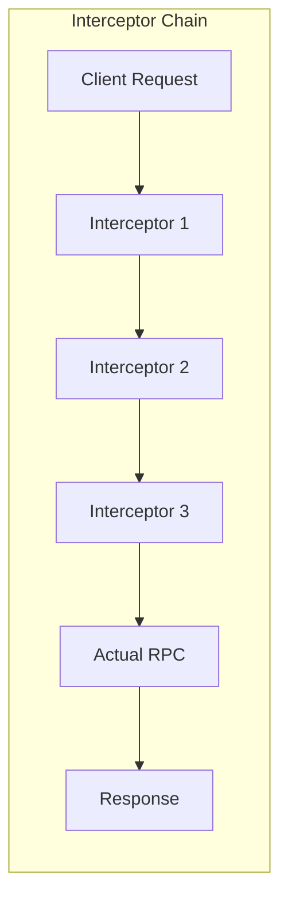
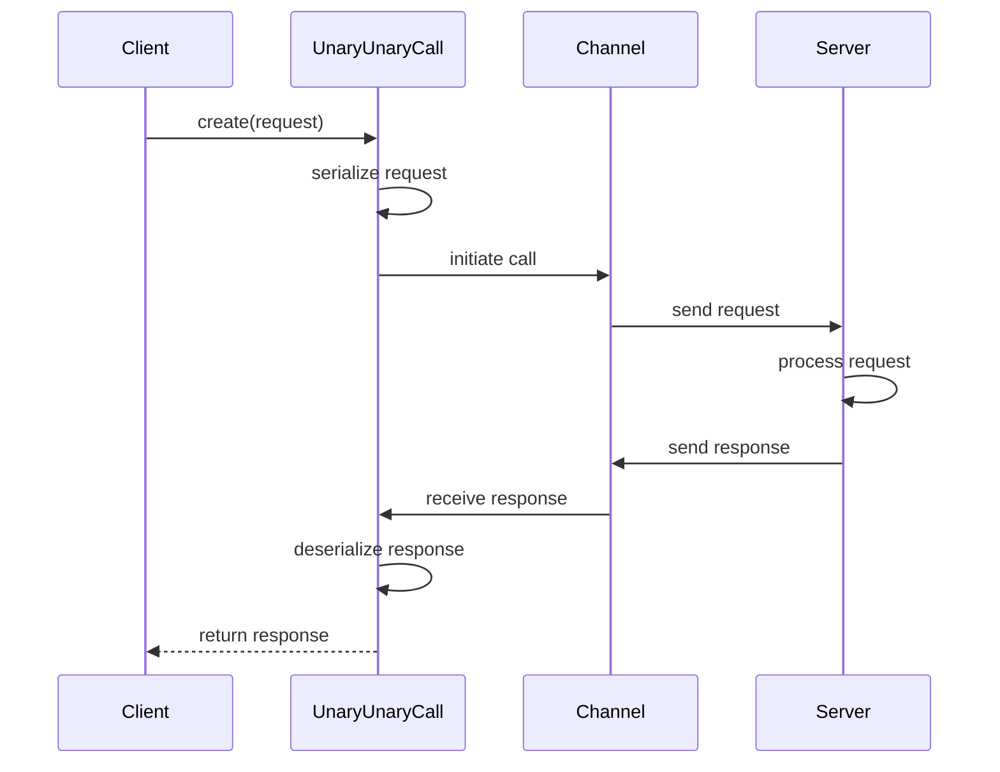
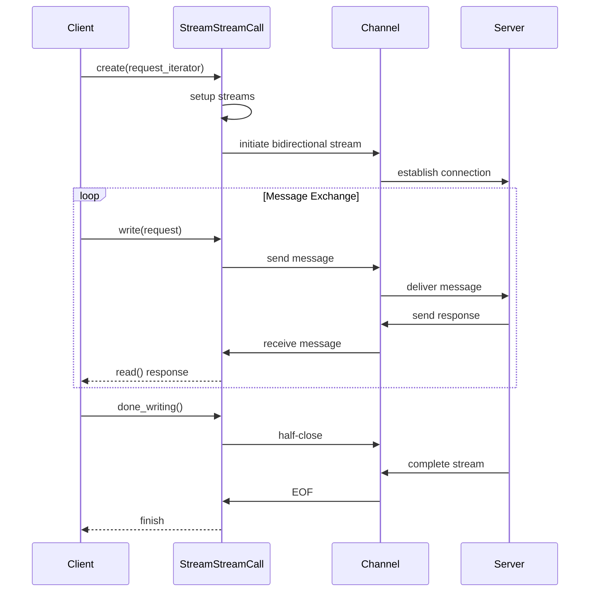
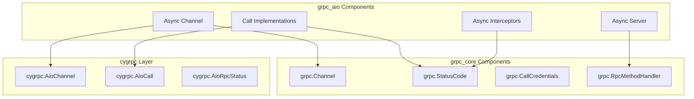
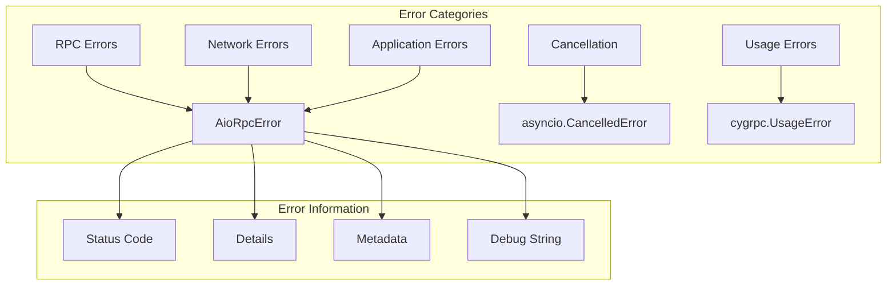

# gRPC AsyncIO Module Documentation

## Introduction

The `grpc_aio` module provides the asynchronous I/O implementation of gRPC for Python, built on top of Python's asyncio framework. This module enables developers to create high-performance, non-blocking gRPC services and clients that can handle thousands of concurrent connections efficiently.

The async implementation offers significant advantages over the synchronous version, including better resource utilization, improved scalability, and the ability to handle multiple RPCs concurrently within a single thread. This makes it particularly suitable for I/O-intensive applications and microservices architectures.

## Architecture Overview

The grpc_aio module is structured around several key architectural components that work together to provide a complete asynchronous RPC framework:

### Core Architecture Components



### Module Dependencies



## Core Components

### 1. Call Abstractions (_base_call.py)

The call abstractions form the foundation of the async RPC system, providing the interface for different types of RPC interactions:

#### RpcContext
The base interface providing RPC lifecycle management capabilities:
- **Cancellation**: `cancel()`, `cancelled()` - Allows applications to cancel ongoing RPCs
- **Completion**: `done()` - Indicates whether the RPC has completed
- **Time Management**: `time_remaining()` - Provides timeout information
- **Callbacks**: `add_done_callback()` - Enables registration of completion callbacks

#### Call
Extends RpcContext with metadata and status access methods:
- **Metadata Access**: `initial_metadata()`, `trailing_metadata()` - Access server-sent metadata
- **Status Information**: `code()`, `details()` - Retrieve RPC completion status
- **Connection Management**: `wait_for_connection()` - Ensures connection before proceeding

#### RPC Type-Specific Calls

**UnaryUnaryCall**: For single request → single response RPCs
- Implements `__await__()` to integrate with Python's async/await syntax
- Provides synchronous-style programming model for unary calls

**UnaryStreamCall**: For single request → stream of responses RPCs
- Implements `__aiter__()` and `read()` for streaming responses
- Supports both iterator and manual read patterns

**StreamUnaryCall**: For stream of requests → single response RPCs
- Provides `write()` and `done_writing()` methods for request streaming
- Implements `__await__()` for response retrieval

**StreamStreamCall**: For bidirectional streaming RPCs
- Combines read and write capabilities
- Supports full-duplex communication patterns

### 2. Channel and MultiCallable Interfaces (_base_channel.py)

#### Channel
The Channel interface provides the client-side entry point for RPC invocation:



**Key Features**:
- **Async Context Manager**: Supports `async with` for automatic resource management
- **Connection Management**: `get_state()`, `wait_for_state_change()`, `channel_ready()`
- **Method Creation**: Factory methods for all RPC types (unary_unary, unary_stream, etc.)
- **Graceful Shutdown**: `close()` with optional grace period

#### MultiCallable Classes
Each MultiCallable class corresponds to an RPC type and provides the invocation interface:

**Common Parameters**:
- `timeout`: RPC deadline in seconds
- `metadata`: Optional metadata to send to server
- `credentials`: Call credentials for secure channels
- `wait_for_ready`: Enables wait-for-ready mechanism
- `compression`: Compression algorithm selection

### 3. Server Components (_base_server.py)

#### Server
The Server interface manages the service-side RPC handling:



**Capabilities**:
- **Port Management**: Secure and insecure port binding
- **Handler Registration**: Generic RPC handler registration
- **Lifecycle Control**: Start, stop, and termination waiting
- **Graceful Shutdown**: Configurable grace periods for active RPCs

#### ServicerContext
Provides the server-side RPC execution context:

**Message Handling**:
- `read()`: Read requests from client
- `write()`: Send responses to client
- `send_initial_metadata()`: Send initial metadata

**RPC Control**:
- `abort()`: Terminate RPC with error status
- `set_code()`, `set_details()`: Set RPC completion status
- `set_trailing_metadata()`: Send trailing metadata

**Security and Compression**:
- `peer()`, `auth_context()`: Security information
- `set_compression()`, `disable_next_message_compression()`: Compression control

### 4. Call Implementation (_call.py)

The call implementation provides the concrete realization of the abstract call interfaces:

#### AioRpcError
A specialized exception class for async RPC errors:
- **Immutable Status**: Captures final RPC status at creation time
- **Metadata Access**: Provides access to initial and trailing metadata
- **Debug Information**: Includes debug error strings for troubleshooting

#### Call Base Class
Implements common functionality for all call types:
- **Lifecycle Management**: Cancellation, completion tracking
- **Metadata Handling**: Async access to server metadata
- **Error Handling**: Automatic RPC error conversion
- **Resource Management**: Proper cleanup on garbage collection

#### API Style Management
The `_APIStyle` enum ensures consistent API usage:
- **ASYNC_GENERATOR**: Iterator-based message processing
- **READER_WRITER**: Manual read/write operations
- **Style Validation**: Prevents mixing of API styles within a single RPC

#### Call Type Implementations

**UnaryUnaryCall**: 
- Single request serialization and response deserialization
- Direct integration with asyncio task system
- Simplified error handling for unary operations

**UnaryStreamCall**:
- Request transmission followed by response streaming
- Async iterator support for response consumption
- Connection establishment before streaming begins

**StreamUnaryCall**:
- Request streaming with single response
- Iterator consumption with proper error handling
- Graceful handling of client-side iterator exceptions

**StreamStreamCall**:
- Full bidirectional streaming support
- Independent read/write operation management
- Complex state coordination between streams

### 5. Interceptor Framework (_interceptor.py)

The interceptor framework enables cross-cutting concerns like authentication, logging, and metrics:

#### Client Interceptors



**Types**:
- **UnaryUnaryClientInterceptor**: Intercepts unary-unary calls
- **UnaryStreamClientInterceptor**: Intercepts unary-stream calls  
- **StreamUnaryClientInterceptor**: Intercepts stream-unary calls
- **StreamStreamClientInterceptor**: Intercepts stream-stream calls

#### Server Interceptors
- **ServerInterceptor**: Intercepts incoming RPCs before handler execution
- **Context Propagation**: Supports contextvars for state passing
- **Handler Modification**: Can modify or replace RPC handlers

#### InterceptedCall Architecture
The InterceptedCall classes provide transparent proxying:
- **Lazy Initialization**: Actual call creation deferred until needed
- **Method Forwarding**: Transparent proxying of call methods
- **Error Handling**: Consistent error handling across intercepted calls
- **Resource Management**: Proper cleanup of interceptor tasks

## Data Flow Patterns

### Unary-Unary RPC Flow



### Stream-Stream RPC Flow



## Integration with gRPC Core

The grpc_aio module builds upon the synchronous gRPC core while providing async capabilities:

### Dependency Relationships



### Key Integration Points

1. **Status Code Mapping**: Conversion between cygrpc status codes and grpc.StatusCode
2. **Metadata Handling**: Translation between tuple-based and object-based metadata
3. **Credential Integration**: Support for grpc.CallCredentials and grpc.ServerCredentials
4. **Handler Compatibility**: Integration with grpc.RpcMethodHandler for server-side processing

## Error Handling and Resilience

### Error Types and Handling



### Cancellation Handling
- **Local Cancellation**: Application-initiated cancellation
- **Remote Cancellation**: Server-initiated cancellation  
- **Timeout Cancellation**: Deadline-exceeded cancellation
- **Garbage Collection**: Automatic cleanup of unreferenced calls

### Retry and Recovery
- **Connection Management**: Automatic reconnection on connection failures
- **Wait-for-Ready**: Optional blocking until connection establishment
- **Graceful Degradation**: Continued operation during partial failures

## Performance Characteristics

### Concurrency Model
- **Single-Threaded**: All operations within a single event loop
- **Non-Blocking**: No thread blocking during I/O operations
- **Task-Based**: Leverages asyncio tasks for concurrent operation handling

### Memory Management
- **Streaming Support**: Constant memory usage regardless of message size
- **Backpressure**: Built-in flow control for streaming RPCs
- **Resource Cleanup**: Automatic cleanup of completed calls

### Scalability Features
- **Connection Pooling**: Efficient connection reuse
- **Load Balancing**: Integration with gRPC's load balancing policies
- **Compression**: Configurable compression for bandwidth optimization

## Best Practices and Usage Patterns

### Client-Side Patterns

1. **Channel Lifecycle Management**:
```python
async with grpc.aio.insecure_channel('localhost:50051') as channel:
    stub = helloworld_pb2_grpc.GreeterStub(channel)
    response = await stub.SayHello(helloworld_pb2.HelloRequest(name='world'))
```

2. **Streaming RPC Handling**:
```python
# Server streaming
async for response in stub.StreamingCall(request):
    process_response(response)

# Client streaming
async def request_generator():
    for item in data:
        yield create_request(item)

response = await stub.ClientStreamingCall(request_generator())
```

3. **Error Handling**:
```python
try:
    response = await stub.UnaryCall(request)
except grpc.aio.AioRpcError as e:
    if e.code() == grpc.StatusCode.NOT_FOUND:
        handle_not_found()
    else:
        handle_other_error(e)
```

### Server-Side Patterns

1. **Async Service Implementation**:
```python
class Greeter(helloworld_pb2_grpc.GreeterServicer):
    async def SayHello(self, request, context):
        return helloworld_pb2.HelloReply(message=f'Hello {request.name}')
    
    async def StreamingCall(self, request, context):
        for i in range(10):
            yield helloworld_pb2.StreamResponse(count=i)
```

2. **Context Management**:
```python
async def ProcessStream(self, request_iterator, context):
    async for request in request_iterator:
        if context.cancelled():
            break
        response = await process_request(request)
        await context.write(response)
```

### Interceptor Usage

1. **Authentication Interceptor**:
```python
class AuthenticationInterceptor(grpc.aio.UnaryUnaryClientInterceptor):
    async def intercept_unary_unary(self, continuation, client_call_details, request):
        metadata = list(client_call_details.metadata or [])
        metadata.append(('authorization', get_auth_token()))
        new_details = client_call_details._replace(metadata=metadata)
        return await continuation(new_details, request)
```

2. **Logging Interceptor**:
```python
class LoggingInterceptor(grpc.aio.ServerInterceptor):
    async def intercept_service(self, continuation, handler_call_details):
        logger.info(f'Received RPC: {handler_call_details.method}')
        handler = await continuation(handler_call_details)
        return handler
```

## Module Relationships

The grpc_aio module integrates with several other gRPC modules to provide a complete solution:

- **[grpc_core](grpc_core.md)**: Provides the foundational RPC primitives and status codes
- **[grpc_framework](grpc_framework.md)**: Offers framework-level abstractions and utilities
- **[grpc_observability](grpc_observability.md)**: Enables monitoring, tracing, and metrics collection
- **[grpc_health_checking](grpc_health_checking.md)**: Provides health checking capabilities for async services
- **[grpc_reflection](grpc_reflection.md)**: Supports service reflection for dynamic service discovery

## Conclusion

The grpc_aio module represents a comprehensive asynchronous implementation of gRPC for Python, providing high-performance, scalable RPC capabilities built on Python's asyncio framework. Through its well-designed abstractions, comprehensive interceptor framework, and robust error handling, it enables developers to build efficient, maintainable distributed systems that can handle thousands of concurrent RPCs with minimal resource overhead.

The module's architecture ensures that async best practices are followed throughout, from the low-level call implementations to the high-level service abstractions, making it an ideal choice for modern Python applications requiring high-performance RPC capabilities.