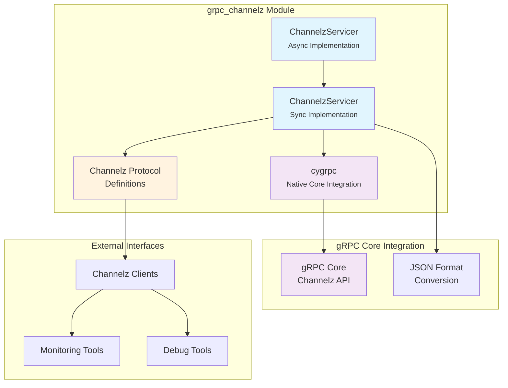
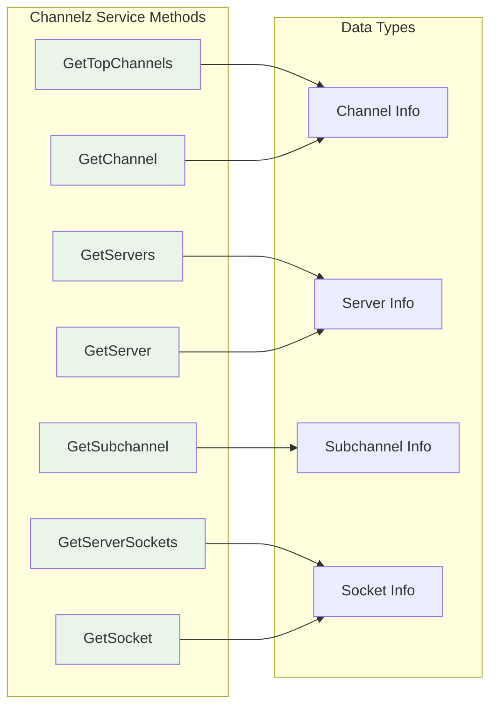
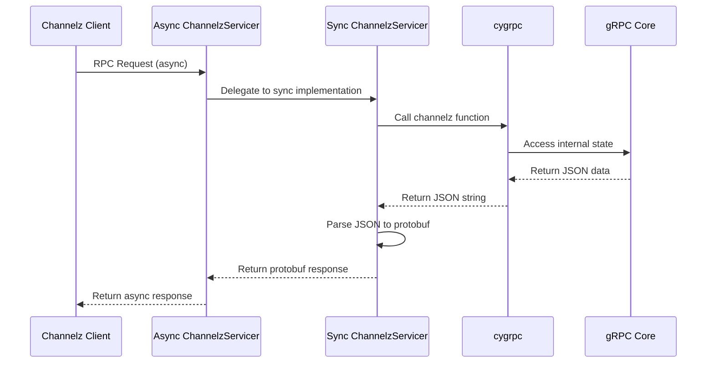
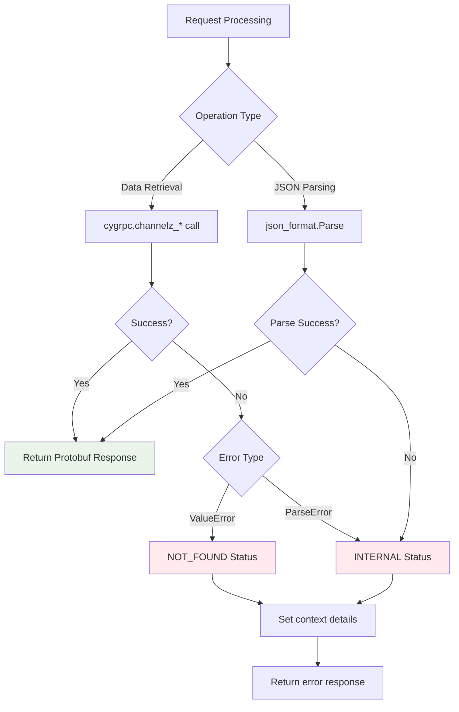
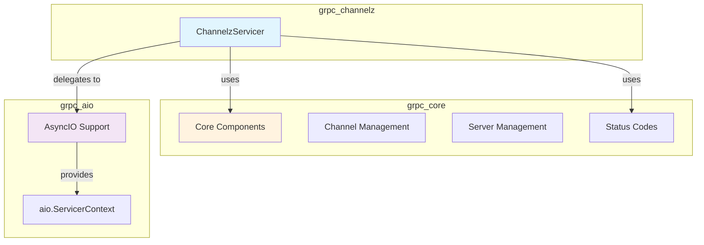

# grpc_channelz Module Documentation

## Introduction

The grpc_channelz module provides runtime introspection and debugging capabilities for gRPC applications. It implements the gRPC Channelz protocol, which allows developers to inspect the internal state of gRPC channels, servers, subchannels, and sockets at runtime. This module is essential for monitoring, debugging, and understanding the behavior of gRPC applications in production environments.

## Module Overview

The grpc_channelz module is part of the gRPC Python ecosystem and provides both synchronous and asynchronous implementations of the Channelz service. The module exposes detailed information about:

- **Top-level channels**: Client-side channels and their states
- **Servers**: Server-side listeners and their configurations
- **Subchannels**: Individual connections within channels
- **Sockets**: Low-level socket information and statistics

## Architecture

### Component Architecture



### Service Interface Architecture



## Core Components

### ChannelzServicer (Async Implementation)

The `ChannelzServicer` class in `src.python.grpcio_channelz.grpc_channelz.v1._async` provides the asynchronous implementation of the Channelz service. This component:

- **Purpose**: Handles Channelz RPC requests in async/await style
- **Inheritance**: Extends `_channelz_pb2_grpc.ChannelzServicer`
- **Integration**: Delegates to synchronous implementation for core functionality

#### Key Methods:

| Method | Purpose | Request Type | Response Type |
|--------|---------|--------------|---------------|
| `GetTopChannels` | Retrieves top-level channels | `GetTopChannelsRequest` | `GetTopChannelsResponse` |
| `GetServers` | Lists all servers | `GetServersRequest` | `GetServersResponse` |
| `GetServer` | Gets specific server details | `GetServerRequest` | `GetServerResponse` |
| `GetServerSockets` | Gets server's active sockets | `GetServerSocketsRequest` | `GetServerSocketsResponse` |
| `GetChannel` | Gets specific channel details | `GetChannelRequest` | `GetChannelResponse` |
| `GetSubchannel` | Gets subchannel information | `GetSubchannelRequest` | `GetSubchannelResponse` |
| `GetSocket` | Gets socket details and stats | `GetSocketRequest` | `GetSocketResponse` |

### ChannelzServicer (Sync Implementation)

The synchronous implementation provides the core functionality by interfacing with the gRPC C-core through `cygrpc`. This component:

- **Purpose**: Provides the actual Channelz data retrieval functionality
- **Integration**: Uses `cygrpc` to access internal gRPC core state
- **Error Handling**: Implements proper gRPC status codes for different error conditions

## Data Flow

### Request Processing Flow



### Error Handling Flow



## Dependencies

### Internal Dependencies

The grpc_channelz module depends on several key components within the gRPC ecosystem:

- **[grpc_core](grpc_core.md)**: Core gRPC functionality and channel management
- **[grpc_aio](grpc_aio.md)**: AsyncIO support for asynchronous operations
- **Protocol Buffers**: Generated service definitions and message types

### External Dependencies

- **cygrpc**: Python bindings for gRPC C-core library
- **json_format**: Protocol buffer JSON formatting utilities

## Integration with gRPC Ecosystem

### Relationship to Core Components



## Usage Patterns

### Basic Integration

The Channelz service is typically registered with a gRPC server to expose runtime introspection capabilities:

```python
# Synchronous server
server = grpc.server(thread_pool)
channelz_pb2_grpc.add_ChannelzServicer_to_server(
    ChannelzServicer(), server
)

# Asynchronous server  
server = aio.server()
channelz_pb2_grpc.add_ChannelzServicer_to_server(
    ChannelzServicer(), server
)
```

### Client Usage

Clients can query the Channelz service to obtain runtime information:

```python
# Create Channelz client stub
channel = grpc.insecure_channel('localhost:50051')
stub = channelz_pb2_grpc.ChannelzStub(channel)

# Query top-level channels
response = stub.GetTopChannels(
    channelz_pb2.GetTopChannelsRequest()
)
```

## Error Handling

The module implements comprehensive error handling with appropriate gRPC status codes:

- **NOT_FOUND (5)**: Requested resource (server, channel, subchannel, socket) does not exist
- **INTERNAL (13)**: JSON parsing errors or other internal processing failures
- **INVALID_ARGUMENT (3)**: Invalid request parameters

## Performance Considerations

### Scalability

- **Async Support**: Full async/await support for high-concurrency scenarios
- **Efficient Data Access**: Direct integration with gRPC C-core for minimal overhead
- **Streaming Support**: Supports pagination for large result sets

### Resource Usage

- **Memory**: Minimal memory footprint as data is retrieved on-demand from core
- **CPU**: Efficient JSON parsing and protobuf conversion
- **Network**: Optimized response sizes with selective field inclusion

## Security Considerations

### Access Control

- Channelz service should be protected with appropriate authentication
- Consider exposing Channelz only in development/debugging environments
- Implement service-level authorization for production deployments

### Information Disclosure

- Channelz exposes internal implementation details
- May reveal service topology and connection patterns
- Consider security implications before enabling in production

## Monitoring and Debugging

### Integration with Observability

The Channelz module complements other gRPC observability features:

- **[grpc_observability](grpc_observability.md)**: Metrics and tracing integration
- **Logging**: Structured logging for debugging Channelz operations
- **Health Checking**: Integration with [grpc_health_checking](grpc_health_checking.md)

### Best Practices

1. **Development**: Enable Channelz for comprehensive debugging
2. **Staging**: Use for performance analysis and optimization
3. **Production**: Carefully evaluate security implications
4. **Monitoring**: Combine with metrics for complete visibility

## Future Enhancements

### Potential Improvements

- Enhanced filtering and search capabilities
- Real-time streaming updates
- Integration with service mesh observability
- Extended metadata and annotations support

### Protocol Evolution

The Channelz protocol continues to evolve with new features:

- Additional socket-level metrics
- Enhanced connection state information
- Support for new gRPC features and transports

## References

- [gRPC Channelz Protocol Specification](https://github.com/grpc/grpc-proto/blob/master/grpc/channelz/v1/channelz.proto)
- [grpc_core](grpc_core.md) - Core gRPC functionality
- [grpc_aio](grpc_aio.md) - AsyncIO support
- [grpc_observability](grpc_observability.md) - Observability integration