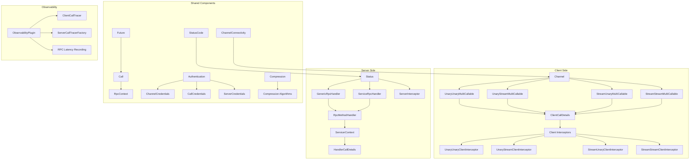
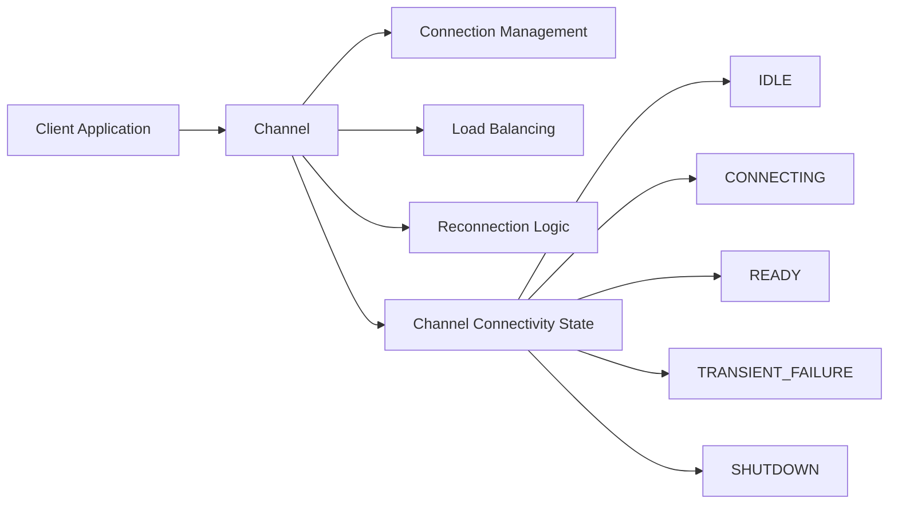
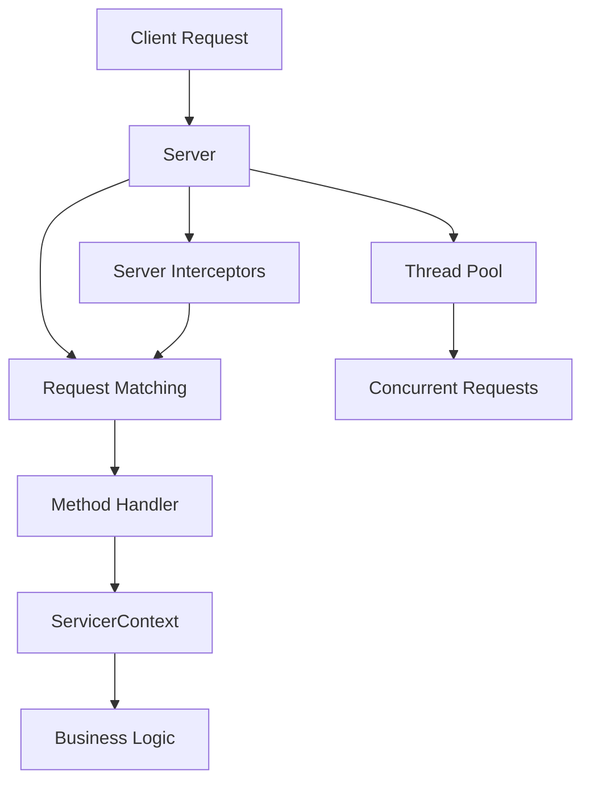
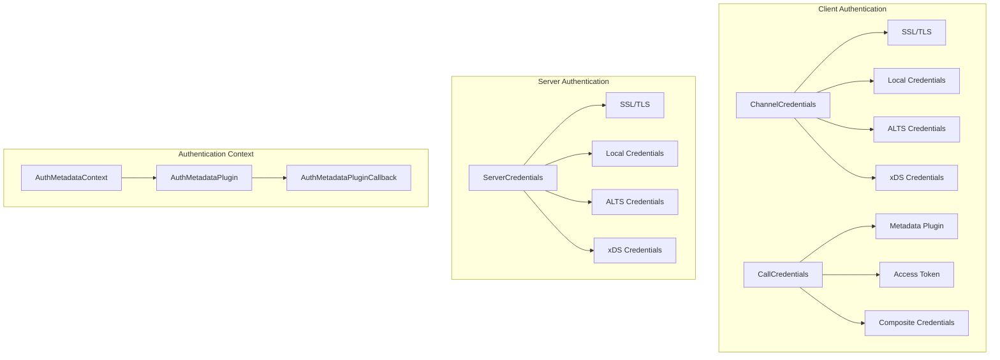
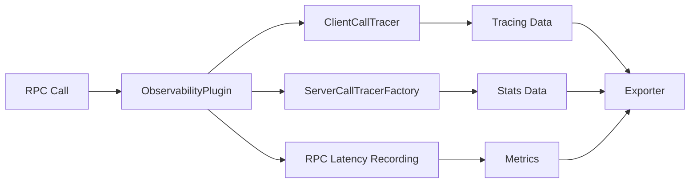
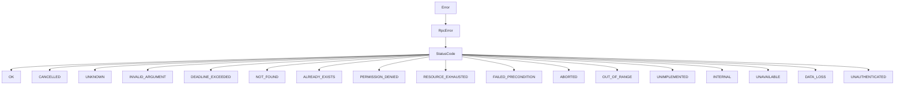

# gRPC Core Module Documentation

## Overview

The `grpc_core` module is the foundational component of the gRPC Python library, providing the essential interfaces and implementations for building high-performance, distributed systems. This module serves as the backbone for all gRPC operations, offering both client-side and server-side functionality with support for various RPC patterns, authentication mechanisms, and transport protocols.

## Purpose and Scope

The grpc_core module implements the core gRPC specification, providing:

- **RPC Communication Patterns**: Support for all four fundamental RPC patterns (unary-unary, unary-stream, stream-unary, stream-stream)
- **Channel Management**: Client-side connection management with automatic reconnection and load balancing
- **Server Implementation**: Server-side request handling with concurrent request processing
- **Authentication & Security**: Comprehensive authentication mechanisms including SSL/TLS, token-based auth, and custom authentication plugins
- **Interceptors**: Middleware support for both client and server-side request/response manipulation
- **Observability**: Built-in support for metrics, tracing, and monitoring
- **Compression**: Configurable compression algorithms for efficient data transmission

## Architecture Overview

## Core Components

### 1. RPC Communication Patterns

The module supports four fundamental RPC patterns through specialized multi-callable interfaces:

#### Unary-Unary RPC
- **Interface**: `UnaryUnaryMultiCallable`
- **Pattern**: Single request → Single response
- **Use Case**: Simple request-response operations like database queries

#### Unary-Stream RPC  
- **Interface**: `UnaryStreamMultiCallable`
- **Pattern**: Single request → Stream of responses
- **Use Case**: Server-sent events, data streaming

#### Stream-Unary RPC
- **Interface**: `StreamUnaryMultiCallable`
- **Pattern**: Stream of requests → Single response
- **Use Case**: Batch operations, file uploads

#### Stream-Stream RPC
- **Interface**: `StreamStreamMultiCallable`
- **Pattern**: Stream of requests → Stream of responses
- **Use Case**: Real-time bidirectional communication, chat applications

### 2. Channel Management

The `Channel` class provides the client-side abstraction for managing connections to gRPC servers:

Key features:
- **Connectivity State Management**: Tracks connection state transitions
- **Automatic Reconnection**: Handles connection failures transparently
- **Load Balancing**: Supports various load balancing strategies
- **Channel Options**: Configurable timeouts, compression, and other parameters

### 3. Server Implementation

The `Server` class provides the server-side framework for handling RPC requests:

Features:
- **Concurrent Request Handling**: Thread pool-based request processing
- **Method Registration**: Dynamic method handler registration
- **Request Interception**: Server-side middleware support
- **Graceful Shutdown**: Clean server termination with request draining

### 4. Authentication and Security

Comprehensive authentication framework supporting multiple mechanisms:

### 5. Interceptor Framework

Powerful middleware system for cross-cutting concerns:

#### Client-Side Interceptors
- **UnaryUnaryClientInterceptor**: Intercepts unary-unary calls
- **UnaryStreamClientInterceptor**: Intercepts unary-stream calls  
- **StreamUnaryClientInterceptor**: Intercepts stream-unary calls
- **StreamStreamClientInterceptor**: Intercepts stream-stream calls

#### Server-Side Interceptors
- **ServerInterceptor**: Intercepts incoming RPC requests

### 6. Observability and Monitoring

Built-in support for system observability:

Features:
- **Distributed Tracing**: Request tracing across service boundaries
- **Metrics Collection**: Performance and error metrics
- **Latency Recording**: RPC timing information
- **Custom Exporters**: Pluggable observability backends

## Sub-modules

The grpc_core module is organized into several specialized sub-modules:

### [grpc_aio](grpc_aio.md)
Asynchronous gRPC implementation providing asyncio support for non-blocking RPC operations. This module extends the core functionality with Python's asyncio framework, enabling high-performance asynchronous RPC patterns.

### [grpc_framework](grpc_framework.md)  
Low-level framework components including protocol abstractions and utility classes. Provides the foundational building blocks for gRPC protocol implementation and stream processing.

### [grpc_health_checking](grpc_health_checking.md)
Health checking service implementation for service discovery and load balancing. Implements the standard gRPC health checking protocol for monitoring service availability.

### [grpc_reflection](grpc_reflection.md)
Service reflection capabilities for runtime service discovery and introspection. Allows clients to discover service definitions and methods at runtime without pre-compiled stubs.

### [grpc_channelz](grpc_channelz.md)
Channel introspection and debugging utilities for runtime channel state examination. Provides detailed visibility into channel internals for debugging and monitoring.

### [grpc_testing](grpc_testing.md)
Testing utilities and mock implementations for unit testing gRPC services. Offers comprehensive testing framework for both client and server-side gRPC components.

### [grpc_observability](grpc_observability.md)
Advanced observability features including OpenCensus and OpenTelemetry integration. Provides enterprise-grade monitoring, tracing, and metrics collection capabilities.

### [grpc_csharp_tools](grpc_csharp_tools.md)
C# code generation tools and utilities for creating gRPC service stubs and client code from Protocol Buffer definitions.

## Key Design Patterns

### 1. Abstract Base Classes
The module extensively uses ABC (Abstract Base Classes) to define interfaces that can be implemented by different backends while maintaining API consistency.

### 2. Multi-Callable Pattern
RPC methods are represented as multi-callable objects that support different invocation styles (blocking, future-based, streaming).

### 3. Context Managers
Channel and server resources are managed using context managers for proper resource cleanup.

### 4. Observer Pattern
Connectivity state changes and RPC events are communicated through callback mechanisms.

### 5. Strategy Pattern
Different authentication mechanisms and compression algorithms are pluggable through strategy interfaces.

## Thread Safety and Concurrency

The grpc_core module is designed with thread safety in mind:

- **Channel Operations**: Thread-safe for concurrent RPC invocations
- **Server Operations**: Thread pool-based request handling
- **State Management**: Proper synchronization for shared state
- **Resource Management**: Safe resource cleanup and lifecycle management

## Error Handling

Comprehensive error handling with detailed status codes:

## Integration Points

The grpc_core module serves as the foundation for higher-level gRPC features:

- **Service Code Generation**: Generated service stubs build upon core interfaces
- **Load Balancing**: Integration with various load balancing strategies
- **Service Mesh**: Support for service mesh architectures
- **Cloud Platforms**: Native integration with cloud provider services

## Performance Considerations

- **Connection Pooling**: Efficient connection reuse
- **Streaming Support**: Memory-efficient streaming for large data transfers
- **Compression**: Configurable compression for bandwidth optimization
- **Thread Pool Tuning**: Configurable thread pools for optimal concurrency
- **Zero-Copy Operations**: Minimized data copying where possible

This documentation provides a comprehensive overview of the grpc_core module. For detailed information about specific sub-modules, refer to their individual documentation files.