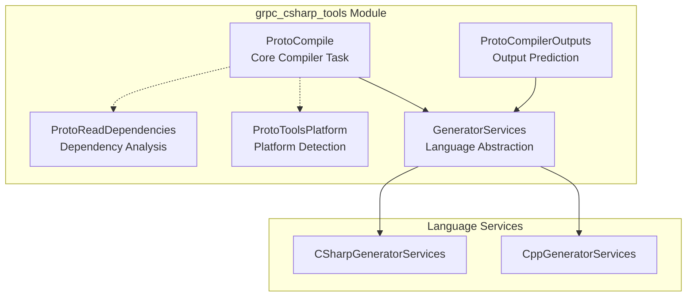
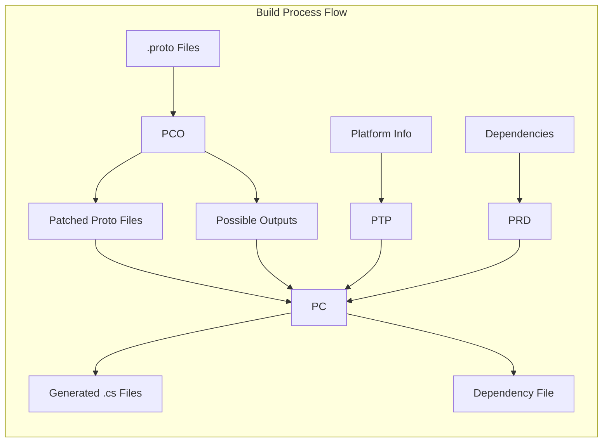
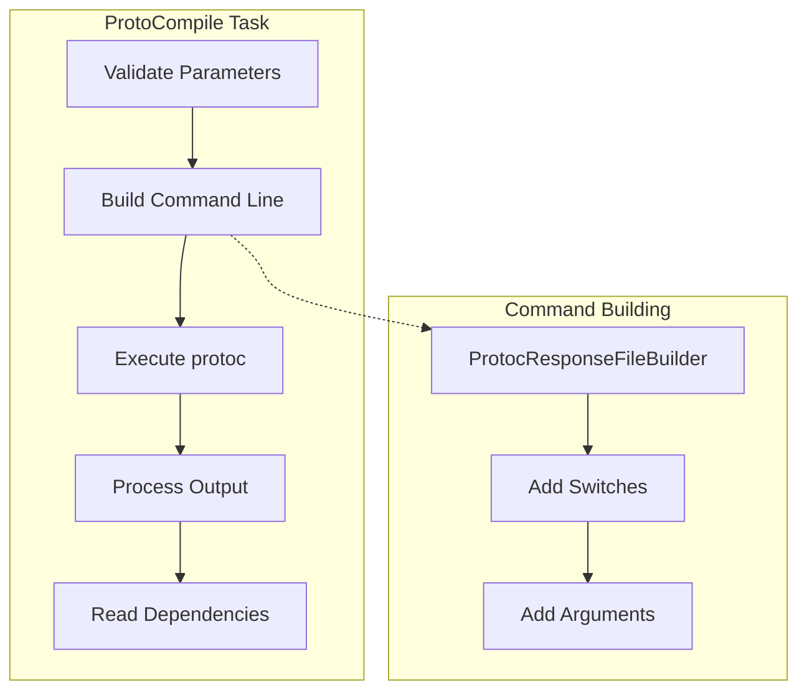
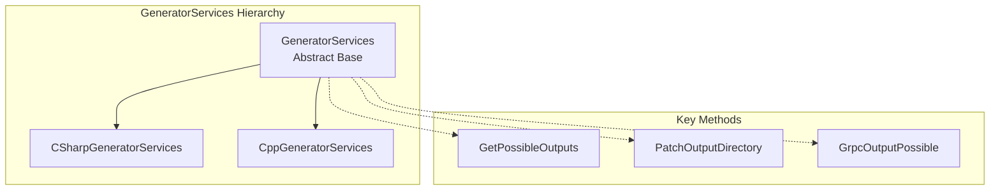
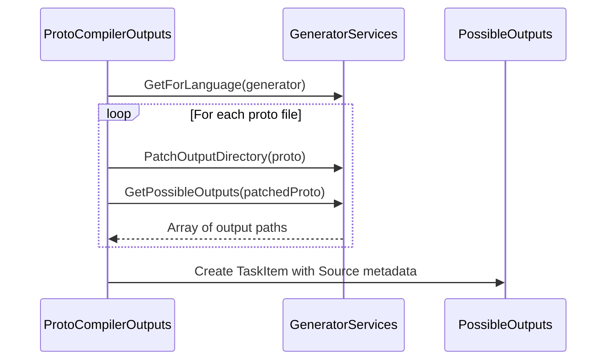
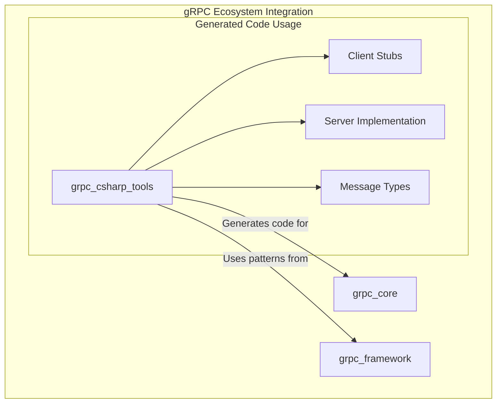
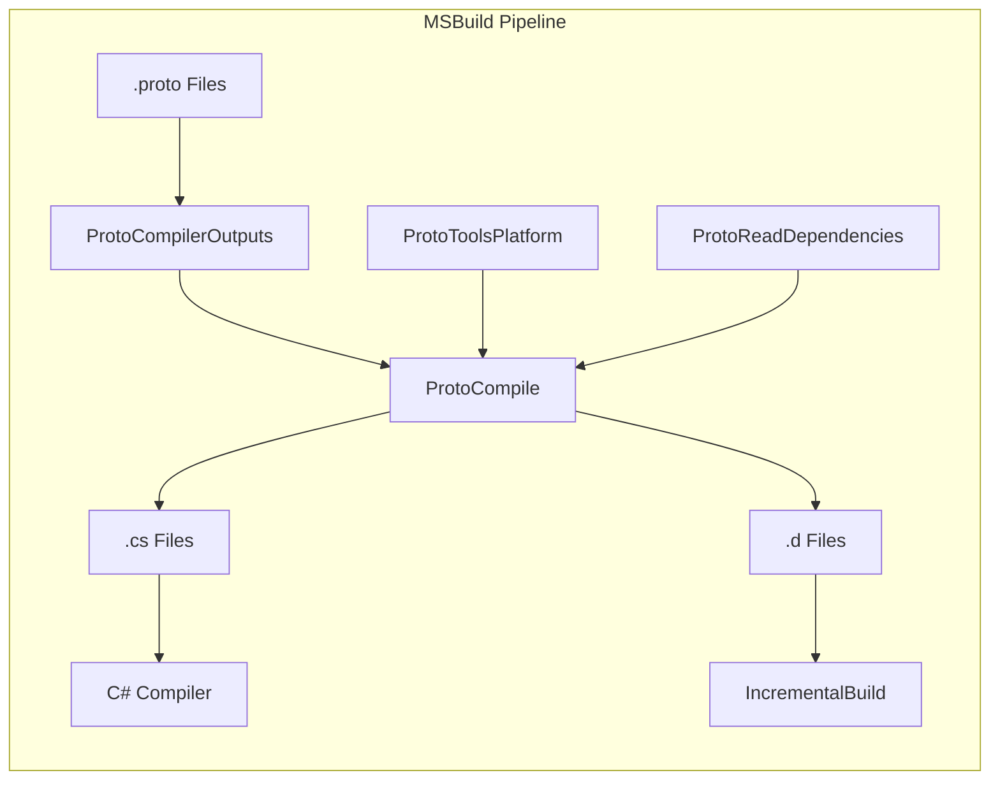

# gRPC C# Tools Module Documentation

## Introduction

The `grpc_csharp_tools` module provides essential build-time tooling for gRPC C# projects, enabling Protocol Buffer compilation and gRPC service code generation within MSBuild environments. This module bridges the gap between Protocol Buffer definitions (`.proto` files) and generated C# code, supporting both standard protobuf messages and gRPC service stubs.

## Module Architecture

### Core Components Overview

The module consists of five primary components that work together to provide a complete build-time solution for gRPC C# projects:

### Component Relationships

## Core Components

### 1. ProtoCompile - The Main Compiler Task

**Purpose**: Executes the Protocol Buffer compiler (`protoc`) with gRPC plugin support to generate C# code from `.proto` files.

**Key Responsibilities**:
- Orchestrates the protoc execution process
- Handles command-line argument construction
- Manages gRPC plugin integration
- Processes compiler output and error reporting
- Tracks generated file dependencies

**Architecture**:

**Error Handling**: Implements sophisticated error parsing with regex patterns to handle various protoc output formats, including location-specific errors and warnings.

### 2. GeneratorServices - Language Abstraction Layer

**Purpose**: Provides language-specific code generation behavior and output file prediction.

**Design Pattern**: Template Method pattern with language-specific implementations

**C# Specific Features**:
- Implements protoc's filename conversion: `lower_underscore.proto` → `LowerUnderscore.cs`
- Implements gRPC's filename conversion: `lower_underscore.proto` → `LowerUnderscoreGrpc.cs`
- Supports separate output directories for protobuf and gRPC generated files

### 3. ProtoCompilerOutputs - Output Prediction

**Purpose**: Predicts all possible output files that could be generated from proto files before compilation.

**Key Features**:
- Pre-computes potential output file paths
- Applies language-specific naming conventions
- Handles gRPC service detection
- Patches output directory metadata

**Process Flow**:

### 4. ProtoReadDependencies - Dependency Analysis

**Purpose**: Reads and analyzes dependency information from protoc-generated dependency files.

**Functionality**:
- Reads `.d` dependency files generated by protoc
- Extracts transitive dependencies
- Provides dependency information for incremental builds
- Associates dependencies with their source proto files

### 5. ProtoToolsPlatform - Platform Detection

**Purpose**: Detects the current platform and CPU architecture to select appropriate native tools.

**Platform Support**:
- **Operating Systems**: Linux, macOS, Windows
- **Architectures**: x86, x64, ARM64 (with fallbacks)

**Special Handling**:
- macOS ARM64 falls back to x64 until native protoc is available
- Windows ARM64 falls back to x86 until native protoc is available

## Integration with gRPC Core

The grpc_csharp_tools module integrates with the broader gRPC ecosystem:

## Build Process Integration

### MSBuild Integration

The module is designed as MSBuild tasks that integrate seamlessly with .csproj files:

### Typical Build Sequence

1. **Preparation Phase**: `ProtoCompilerOutputs` predicts required outputs
2. **Platform Detection**: `ProtoToolsPlatform` determines tool paths
3. **Dependency Analysis**: `ProtoReadDependencies` reads existing dependencies
4. **Compilation Phase**: `ProtoCompile` executes protoc with gRPC plugin
5. **Output Processing**: Generated files are integrated into C# compilation

## Error Handling and Diagnostics

### Error Parsing System

The module implements a sophisticated error parsing system with multiple regex patterns:

- **Location-specific errors**: `filename(line) : error in column=col : message`
- **Location-specific warnings**: `filename(line) : warning in column=col : message`
- **General errors**: `filename: message`
- **Plugin errors**: `[libprotobuf LEVEL filename:line] message`

### Logging Integration

All components integrate with MSBuild's logging system, providing:
- Detailed error messages with file locations
- Warning messages for potential issues
- Informational messages for build progress

## Configuration and Customization

### Supported Generators

- **C#**: Primary target language with full gRPC support
- **C++**: Secondary support for mixed-language projects

### Output Options

- **Output Directory**: Base directory for generated files
- **gRPC Output Directory**: Separate directory for gRPC-specific files
- **Generator Options**: Language-specific compilation options
- **Additional Arguments**: Direct protoc argument passthrough

## Platform Compatibility

### Cross-Platform Support

The module supports all major platforms with appropriate tool selection:

| Platform | Architecture | Tool Selection |
|----------|-------------|----------------|
| Linux | x64 | Native x64 protoc |
| Linux | x86 | Native x86 protoc |
| Linux | ARM64 | Native ARM64 protoc |
| macOS | x64 | Native x64 protoc |
| macOS | ARM64 | x64 protoc (fallback) |
| Windows | x64 | Native x64 protoc |
| Windows | x86 | Native x86 protoc |
| Windows | ARM64 | x86 protoc (fallback) |

## Best Practices

### Performance Optimization

1. **Incremental Builds**: Use dependency files to enable incremental compilation
2. **Output Caching**: Cache generated files to avoid unnecessary regeneration
3. **Parallel Processing**: Multiple proto files can be processed in parallel

### Error Prevention

1. **Proto Path Management**: Properly configure import paths
2. **Output Directory Structure**: Organize outputs by namespace or service
3. **Dependency Tracking**: Always generate and read dependency files

## Related Documentation

- [grpc_core.md](grpc_core.md) - Core gRPC functionality that uses generated code
- [grpc_framework.md](grpc_framework.md) - Framework interfaces and patterns
- [grpc_aio.md](grpc_aio.md) - Async/await patterns for generated clients

## Conclusion

The grpc_csharp_tools module provides a robust, platform-independent solution for integrating Protocol Buffer and gRPC code generation into C# build processes. Its modular design allows for easy extension to support additional languages while maintaining consistent behavior across platforms. The sophisticated error handling and dependency tracking ensure reliable builds in complex development environments.