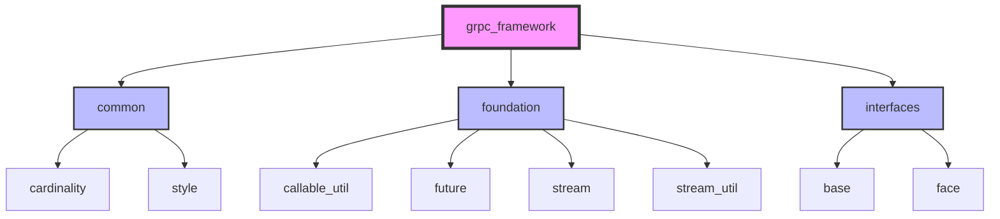
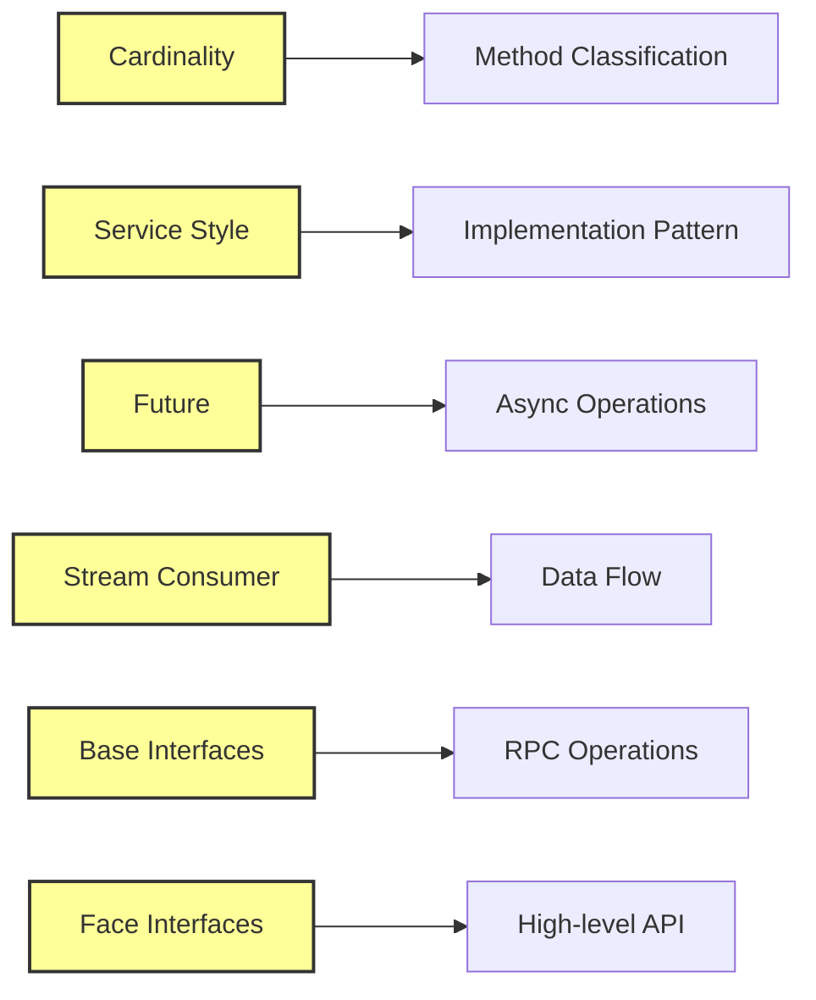
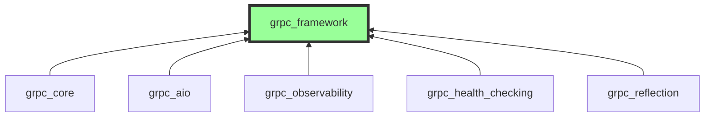

# gRPC Framework Module Documentation

## Overview

The `grpc_framework` module provides the foundational abstractions and interfaces for the gRPC Python implementation. It serves as the core framework layer that defines the fundamental concepts, patterns, and contracts used throughout the gRPC system. This module establishes the architectural foundation upon which higher-level gRPC functionality is built.

## Purpose and Scope

The grpc_framework module is designed to:

- Define abstract interfaces and base classes for RPC operations
- Establish cardinality and service style classifications
- Provide foundational utilities for stream processing and future-based asynchronous operations
- Create a layered architecture that separates concerns between different aspects of RPC handling
- Enable extensibility and pluggability through well-defined interfaces

## Architecture Overview

The grpc_framework module is organized into several key sub-modules, each serving a specific purpose in the overall architecture:



### Core Components Relationships



## Sub-modules

### 1. Common Module
The `common` sub-module provides fundamental enumerations and classifications used throughout the framework:

- **[grpc_framework_common](grpc_framework_common.md)**: Defines cardinality and service style enumerations
  - `Cardinality`: Classifies RPC methods by streaming semantics (UNARY_UNARY, UNARY_STREAM, STREAM_UNARY, STREAM_STREAM)
  - `Service`: Defines control flow styles (INLINE, EVENT)

### 2. Foundation Module
The `foundation` sub-module provides core utilities and abstractions:

- **[grpc_framework_foundation](grpc_framework_foundation.md)**: Contains foundational utilities
  - `callable_util`: Utilities for working with callables and exception handling
  - `future`: Abstract Future interface for asynchronous operations
  - `stream`: Consumer interface for stream processing
  - `stream_util`: Helper utilities for stream processing including transforming and thread-switching consumers

### 3. Interfaces Module
The `interfaces` sub-module defines the core abstract interfaces:

- **[grpc_framework_interfaces](grpc_framework_interfaces.md)**: Defines the layered interface architecture
  - `base`: Low-level base interfaces for RPC operations
  - `face`: High-level interfaces for user-facing API

## Key Design Patterns

### 1. Layered Architecture
The framework employs a layered approach with clear separation of concerns:

```
┌─────────────────────────────────────┐
│           Face Layer               │  <- High-level user API
├─────────────────────────────────────┤
│           Base Layer               │  <- Low-level operations
├─────────────────────────────────────┤
│        Foundation Layer            │  <- Utilities and abstractions
├─────────────────────────────────────┤
│         Common Layer               │  <- Shared enumerations
└─────────────────────────────────────┘
```

### 2. Interface Segregation
The framework uses abstract base classes to define contracts while allowing multiple implementations:

- **Future**: Abstract interface for asynchronous computation results
- **Consumer**: Abstract interface for stream processing
- **Operator**: Abstract interface for operation participation
- **Servicer**: Abstract interface for service implementations

### 3. Cardinality-Based Method Classification
RPC methods are classified based on their streaming semantics:

- **UNARY_UNARY**: Single request, single response
- **UNARY_STREAM**: Single request, stream of responses
- **STREAM_UNARY**: Stream of requests, single response
- **STREAM_STREAM**: Stream of requests, stream of responses

## Integration with gRPC Core

The grpc_framework module serves as the foundation for higher-level gRPC functionality:



The framework interfaces are implemented by the core gRPC library to provide concrete functionality while maintaining the abstract contracts defined in the framework.

## Usage Patterns

### 1. Service Implementation
Services implement the framework interfaces to handle RPC calls:

- Implement `Servicer` interface for service-side handling
- Use `ServicerContext` for RPC context and metadata
- Handle different cardinality patterns based on method type

### 2. Client Invocation
Clients use framework interfaces to invoke RPCs:

- Use `GenericStub` or `DynamicStub` for RPC invocation
- Work with different multi-callable types based on cardinality
- Handle responses through `ResponseReceiver` interfaces

### 3. Stream Processing
Stream-based RPCs use consumer patterns:

- Implement `Consumer` interface for stream handling
- Use utility consumers for transformation and threading
- Handle stream termination and error conditions

## Error Handling

The framework defines comprehensive error handling through:

- **AbortionError**: Base class for RPC abortion conditions
- **Outcome**: Describes operation termination reasons
- **Completion**: Aggregates completion values
- Exception logging utilities in callable_util

## Threading and Concurrency

The framework provides threading support through:

- **ThreadSwitchingConsumer**: Enables thread-safe stream processing
- **Future**: Abstract interface for asynchronous operations
- Thread-safe implementations of core interfaces

## Extensibility

The framework is designed for extensibility through:

- Abstract base classes that can be implemented
- Plugin interfaces for custom behavior
- Protocol options for implementation-specific features
- Custom metadata and context objects

## Related Documentation

- [grpc_core](grpc_core.md): Core gRPC functionality built on this framework
- [grpc_aio](grpc_aio.md): Async/await support built on framework interfaces
- [grpc_observability](grpc_observability.md): Observability features using framework patterns
- [grpc_testing](grpc_testing.md): Testing utilities for framework-based implementations

## Summary

The grpc_framework module provides the essential foundation for the entire gRPC Python ecosystem. Its well-designed interfaces and abstractions enable consistent, extensible, and maintainable RPC implementations while supporting various programming paradigms and use cases.