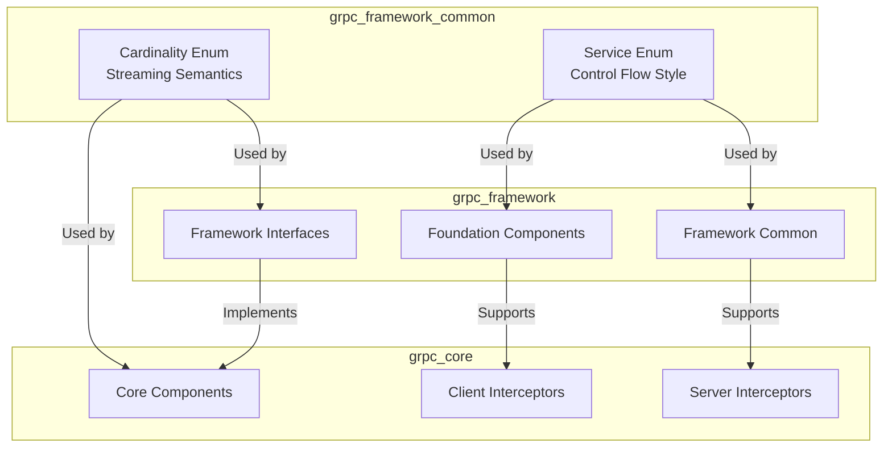
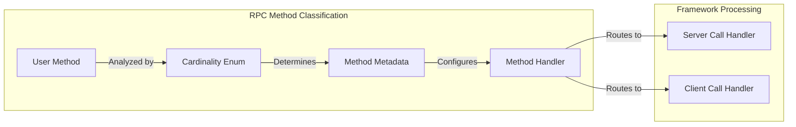
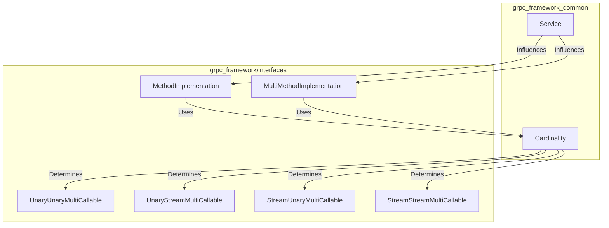
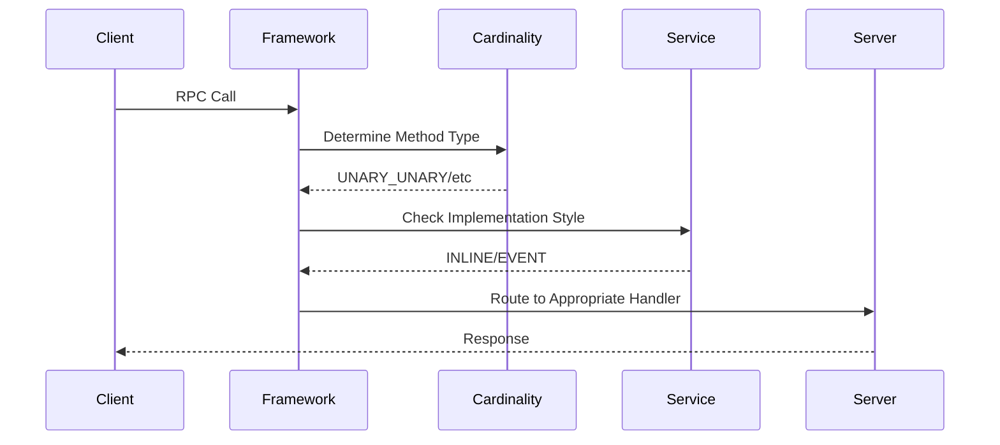
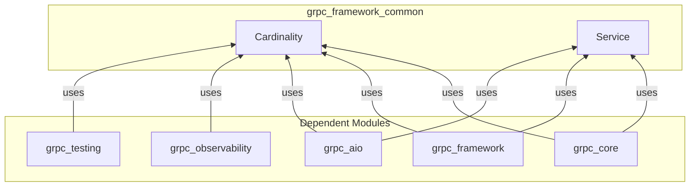
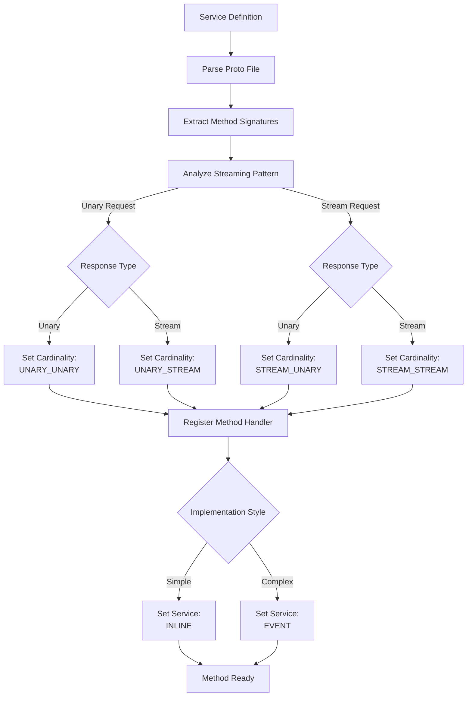

# gRPC Framework Common Module Documentation

## Introduction

The `grpc_framework_common` module provides fundamental abstractions and enumerations that define the core semantics of gRPC services and methods. This module serves as the foundation for understanding and classifying RPC methods based on their streaming behavior and control flow patterns. It contains essential enums that are used throughout the gRPC framework to categorize and handle different types of RPC operations.

## Module Architecture

### Core Components

The module consists of two primary components:

1. **Cardinality** - Defines the streaming semantics of RPC methods
2. **Service** - Describes the control flow style of RPC method implementations

### Architecture Overview



## Component Details

### Cardinality Enum

The `Cardinality` enum is a fundamental classification system for RPC methods based on their streaming behavior. It defines four distinct patterns that cover all possible combinations of request and response streaming.

#### Definition
```python
@enum.unique
class Cardinality(enum.Enum):
    """Describes the streaming semantics of an RPC method."""
    
    UNARY_UNARY = "request-unary/response-unary"
    UNARY_STREAM = "request-unary/response-streaming"
    STREAM_UNARY = "request-streaming/response-unary"
    STREAM_STREAM = "request-streaming/response-streaming"
```

#### Cardinality Values

| Value | Description | Request Pattern | Response Pattern | Use Case |
|-------|-------------|-----------------|------------------|----------|
| `UNARY_UNARY` | Single request, single response | Unary | Unary | Standard RPC calls, simple function calls |
| `UNARY_STREAM` | Single request, multiple responses | Unary | Streaming | Server-side streaming, data feeds |
| `STREAM_UNARY` | Multiple requests, single response | Streaming | Unary | Client-side streaming, batch operations |
| `STREAM_STREAM` | Multiple requests, multiple responses | Streaming | Streaming | Bidirectional streaming, real-time communication |

#### Usage in gRPC Framework



### Service Enum

The `Service` enum defines the control flow patterns for implementing RPC methods, determining how the service logic is structured and executed.

#### Definition
```python
@enum.unique
class Service(enum.Enum):
    """Describes the control flow style of RPC method implementation."""
    
    INLINE = "inline"
    EVENT = "event"
```

#### Service Values

| Value | Description | Execution Pattern | Use Case |
|-------|-------------|-------------------|----------|
| `INLINE` | Synchronous execution | Immediate response | Simple, fast operations |
| `EVENT` | Asynchronous execution | Event-driven response | Complex, long-running operations |

## Integration with gRPC Ecosystem

### Relationship with Framework Interfaces



### Integration with Core gRPC Components

The enums defined in this module are extensively used throughout the gRPC core system:

1. **Method Registration**: When services are registered, their methods are classified using `Cardinality`
2. **Call Handling**: The framework uses cardinality to determine appropriate call handlers
3. **Interceptor Chains**: Interceptors use cardinality information to process requests correctly
4. **Service Implementation**: The `Service` enum guides how service methods should be implemented

### Data Flow Architecture



## Dependencies and Relationships

### Upstream Dependencies

The `grpc_framework_common` module is a foundational component with no internal dependencies on other gRPC modules. It provides pure abstractions that are used by:

- [grpc_framework.md](grpc_framework.md) - Framework interfaces and foundation
- [grpc_core.md](grpc_core.md) - Core gRPC functionality
- [grpc_aio.md](grpc_aio.md) - Async I/O support

### Downstream Usage



## Process Flow

### Method Classification Process



## Best Practices

### Using Cardinality

1. **Method Design**: Choose the appropriate cardinality based on your use case:
   - Use `UNARY_UNARY` for simple request-response operations
   - Use `UNARY_STREAM` for server-to-client data streaming
   - Use `STREAM_UNARY` for client-to-server data streaming
   - Use `STREAM_STREAM` for bidirectional real-time communication

2. **Performance Considerations**:
   - Streaming methods (`*_STREAM`) are more memory-efficient for large data transfers
   - Unary methods (`UNARY_*`) are simpler to implement and debug

### Using Service

1. **Implementation Style**:
   - Use `INLINE` for fast, synchronous operations
   - Use `EVENT` for operations that may take time or require asynchronous processing

2. **Error Handling**:
   - Inline services should handle errors immediately
   - Event services can implement complex error recovery mechanisms

## Summary

The `grpc_framework_common` module provides the essential building blocks for understanding and implementing gRPC services. By defining clear enumerations for streaming semantics and control flow patterns, it enables the framework to handle diverse RPC scenarios consistently and efficiently. These abstractions are fundamental to the entire gRPC ecosystem, influencing how services are defined, implemented, and executed across all supported programming languages and platforms.

The module's simplicity belies its importance - every gRPC method, from the simplest unary call to the most complex bidirectional streaming scenario, is classified and handled according to the patterns defined in this foundational module.