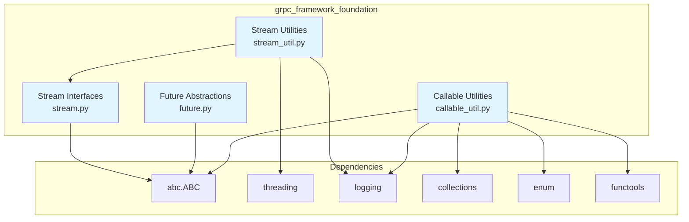
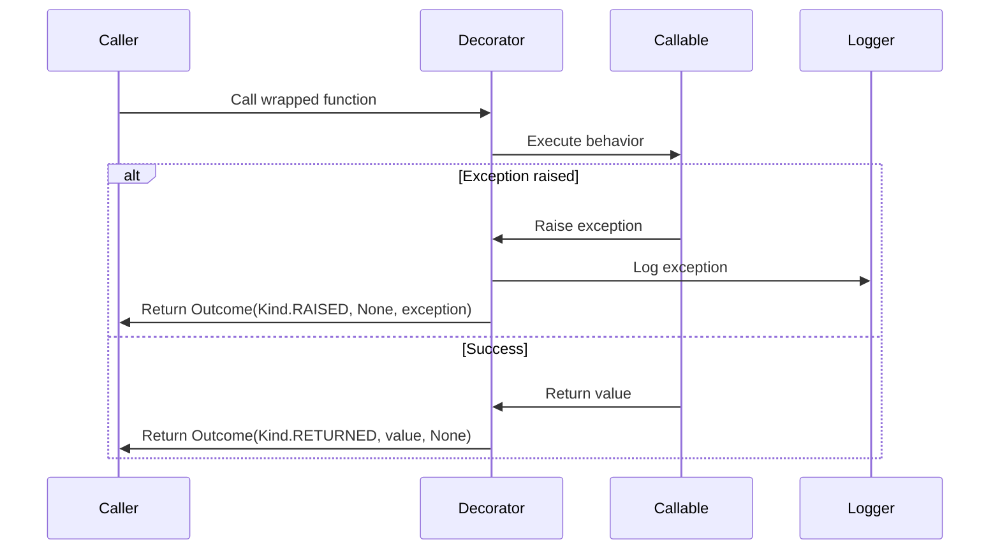
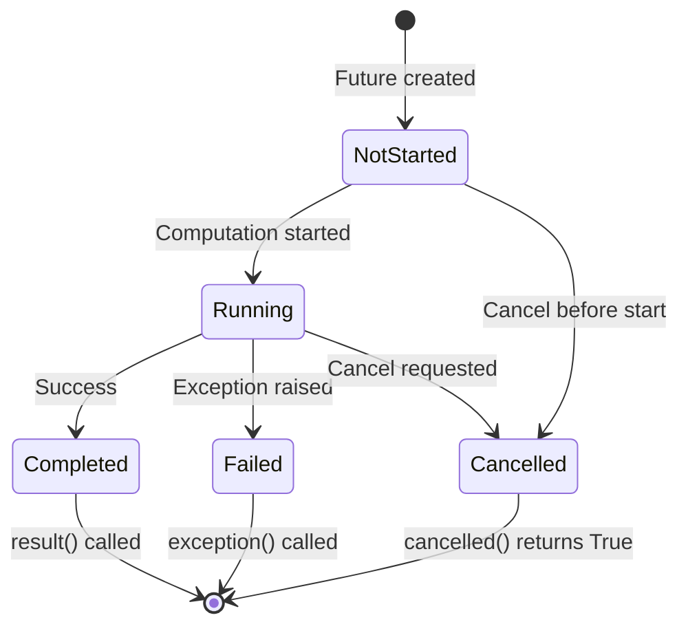
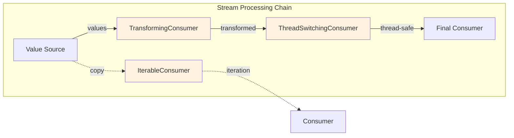
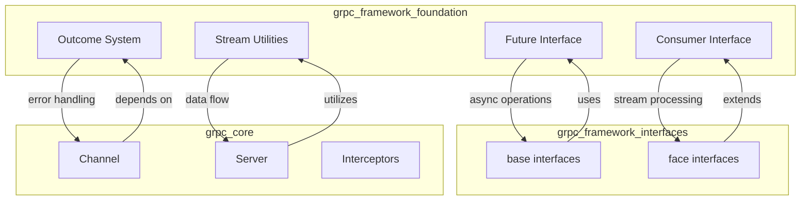
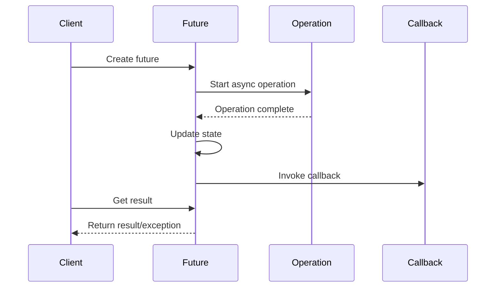
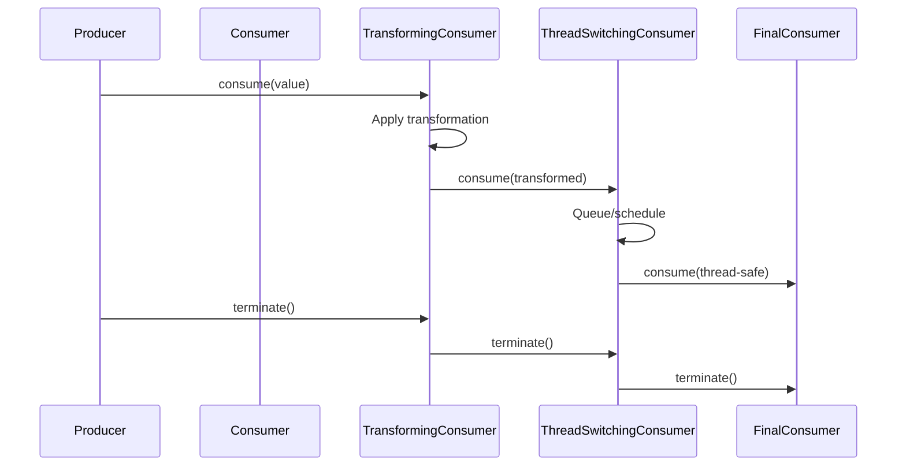
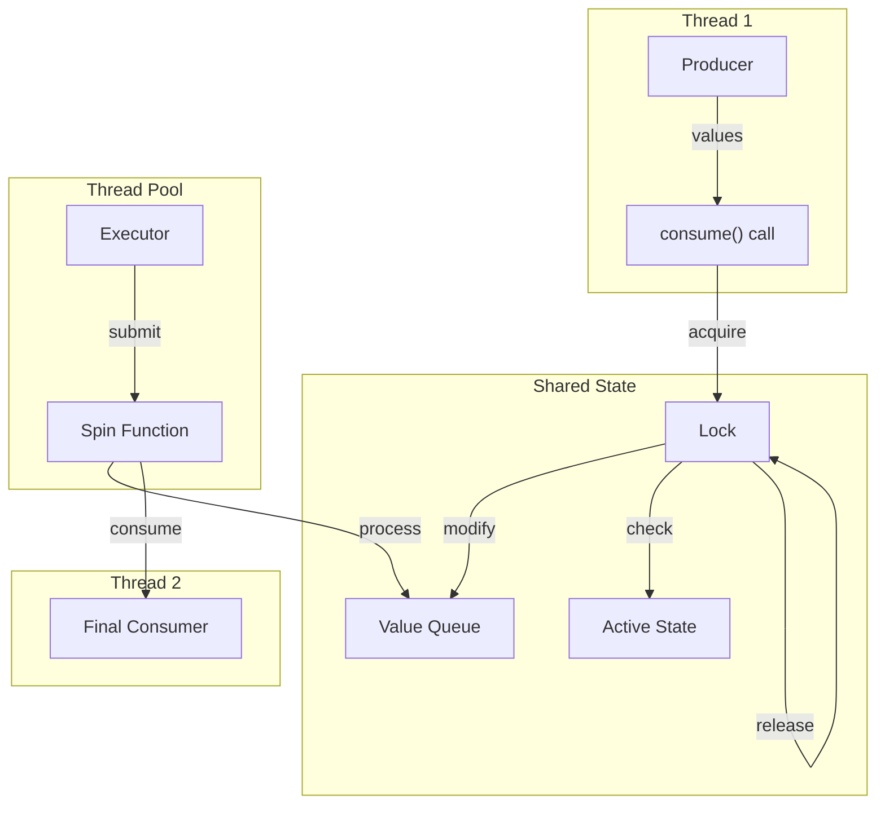
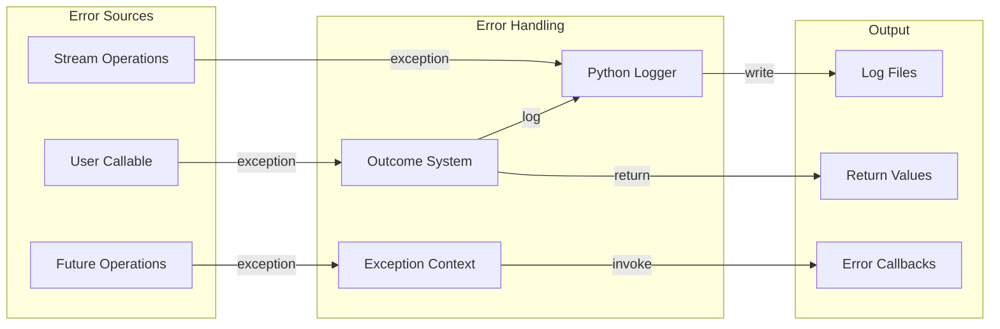
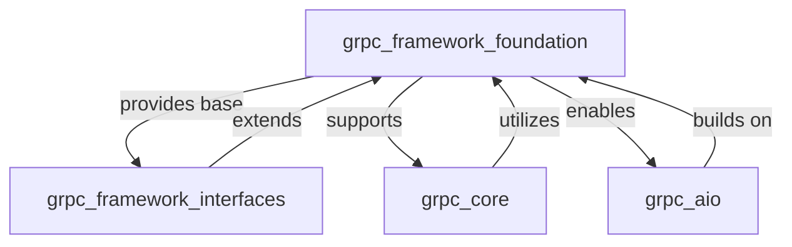

# gRPC Framework Foundation Module Documentation

## Introduction

The `grpc_framework_foundation` module provides the fundamental building blocks and utilities that underpin the gRPC framework architecture. This module contains core abstractions and utilities for handling asynchronous operations, stream processing, and callable management that are essential for the higher-level gRPC functionality.

The foundation module serves as the bedrock upon which the gRPC framework's more complex features are built, offering abstract interfaces and concrete implementations for common patterns like futures, streams, and callable utilities.

## Module Architecture

### Core Components Overview

The grpc_framework_foundation module consists of four primary component groups:

1. **Callable Utilities** (`callable_util.py`) - Exception handling and outcome management for callable operations
2. **Future Abstractions** (`future.py`) - Abstract future interface for asynchronous computation management
3. **Stream Interfaces** (`stream.py`) - Core consumer interface for stream processing
4. **Stream Utilities** (`stream_util.py`) - Concrete implementations and decorators for stream processing

### Architecture Diagram



## Component Details

### Callable Utilities (callable_util.py)

The callable utilities module provides mechanisms for handling callable operations with proper exception management and outcome tracking.

#### Key Components

- **Outcome**: Abstract base class representing the result of a callable operation
- **Outcome.Kind**: Enum distinguishing between successful returns and exceptions
- **with_exceptions_logged()**: Decorator that wraps callables with exception logging
- **call_logging_exceptions()**: Direct function for calling with exception logging

#### Outcome Management Flow



### Future Abstractions (future.py)

The future module defines an abstract interface for representing asynchronous computations, designed to be compatible with Python's various future implementations while providing a standardized interface.

#### Key Features

- **Abstract Base Class**: `Future` provides a complete interface for asynchronous computation management
- **Exception Compatibility**: Defines custom `TimeoutError` and `CancelledError` classes
- **Standard Methods**: Includes `cancel()`, `result()`, `exception()`, `traceback()`, and `add_done_callback()`
- **Non-blocking Operations**: Most methods are designed to not block, with optional timeout parameters

#### Future State Management



### Stream Interfaces (stream.py)

The stream module defines the fundamental `Consumer` interface for processing finite streams of values or objects.

#### Consumer Interface

The `Consumer` abstract base class provides three key methods:
- **consume(value)**: Accepts a single value from the stream
- **terminate()**: Signals that no more values will be supplied
- **consume_and_terminate(value)**: Supplies a final value and terminates

This interface forms the foundation for all stream processing within the gRPC framework.

### Stream Utilities (stream_util.py)

The stream utilities module provides concrete implementations and decorators for the `Consumer` interface, enabling various stream processing patterns.

#### Key Implementations

1. **TransformingConsumer**: Applies a transformation function to values before passing them downstream
2. **IterableConsumer**: Collects consumed values for iteration, enabling pull-based consumption
3. **ThreadSwitchingConsumer**: Provides thread-safe, asynchronous processing with serialization

#### Stream Processing Architecture



## Component Interactions

### Integration with gRPC Framework

The foundation components integrate with higher-level gRPC framework modules:



### Data Flow Patterns

#### Asynchronous Operation Flow



#### Stream Processing Flow



## Usage Patterns

### Exception Handling Pattern

```python
from grpc.framework.foundation import callable_util

# Wrap a function with exception logging
@callable_util.with_exceptions_logged("Error in user function")
def user_function(data):
    # Function implementation
    return process_data(data)

# Direct call with exception logging
outcome = callable_util.call_logging_exceptions(
    risky_operation, "Operation failed", arg1, arg2
)

if outcome.kind == callable_util.Outcome.Kind.RETURNED:
    print(f"Success: {outcome.return_value}")
else:
    print(f"Failed: {outcome.exception}")
```

### Future Implementation Pattern

```python
from grpc.framework.foundation import future

class MyFuture(future.Future):
    def __init__(self):
        self._done = False
        self._result = None
        self._exception = None
        self._callbacks = []
    
    def cancel(self):
        # Implementation
        pass
    
    def result(self, timeout=None):
        # Implementation
        pass
    
    # Other abstract methods...
```

### Stream Processing Pattern

```python
from grpc.framework.foundation import stream, stream_util

# Create a processing chain
transforming = stream_util.TransformingConsumer(
    transformation=lambda x: x * 2,
    downstream=final_consumer
)

thread_safe = stream_util.ThreadSwitchingConsumer(
    sink=transforming,
    pool=thread_pool_executor
)

# Use the chain
thread_safe.consume(value)
thread_safe.terminate()
```

## Thread Safety and Concurrency

### ThreadSwitchingConsumer Design

The `ThreadSwitchingConsumer` provides thread-safe stream processing through:

1. **Lock-based Synchronization**: Uses threading.Lock for thread-safe operations
2. **Queue Management**: Maintains an internal queue for values
3. **Executor Integration**: Works with thread pool executors for asynchronous processing
4. **State Management**: Tracks active state and spinning status

### Concurrency Patterns



## Error Handling and Logging

### Exception Management Strategy

The foundation module implements a comprehensive exception handling strategy:

1. **Outcome-based Error Tracking**: All callable operations return Outcome objects
2. **Exception Logging**: Automatic logging of exceptions with context messages
3. **Graceful Degradation**: Operations continue even when individual components fail
4. **Traceback Preservation**: Full traceback information is maintained for debugging

### Logging Integration



## Integration with Other Modules

### Relationship to grpc_framework_interfaces

The foundation module provides the underlying implementations for higher-level interfaces:

- **[grpc_framework_interfaces](grpc_framework_interfaces.md)**: Uses foundation futures and streams as base implementations
- **[grpc_core](grpc_core.md)**: Utilizes foundation components for channel and server operations
- **[grpc_aio](grpc_aio.md)**: Extends foundation patterns for async/await support

### Dependency Chain



## Best Practices

### When to Use Foundation Components

1. **Custom Implementations**: When implementing custom gRPC components
2. **Stream Processing**: For complex data processing pipelines
3. **Async Operations**: When building asynchronous systems
4. **Error Handling**: For robust exception management

### Performance Considerations

1. **ThreadSwitchingConsumer**: Use judiciously due to thread overhead
2. **IterableConsumer**: Be mindful of memory usage with large streams
3. **Future Callbacks**: Keep callbacks lightweight to avoid blocking
4. **Exception Logging**: Configure appropriate log levels for production

### Common Pitfalls

1. **Future State**: Always check state before calling blocking methods
2. **Stream Termination**: Ensure proper termination to prevent resource leaks
3. **Thread Safety**: Use ThreadSwitchingConsumer when cross-thread access is needed
4. **Exception Handling**: Don't suppress exceptions without proper logging

## Testing and Debugging

### Testing Strategies

1. **Mock Futures**: Use mock implementations for testing async code
2. **Stream Verification**: Test consumer chains with known input sequences
3. **Exception Injection**: Test error handling with injected exceptions
4. **Threading Tests**: Verify thread safety with concurrent access tests

### Debugging Tools

1. **Outcome Inspection**: Use Outcome objects to trace execution paths
2. **Stream Tracing**: Add logging consumers to debug stream processing
3. **Future State**: Monitor future states during async operations
4. **Thread Analysis**: Use thread dumps to debug concurrency issues

This foundation module provides the essential building blocks for robust, scalable gRPC applications, offering both the flexibility for custom implementations and the reliability needed for production systems.