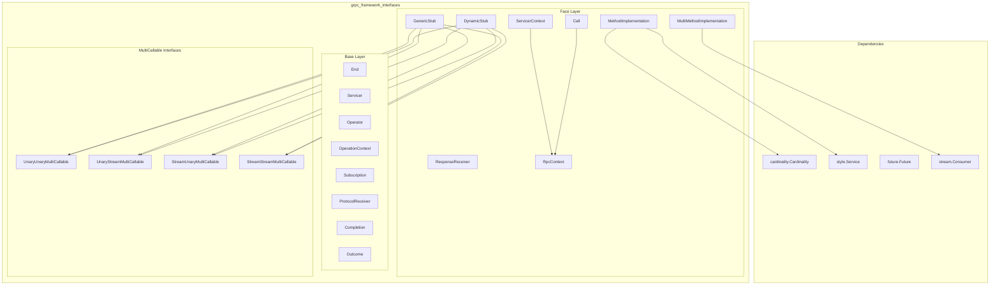
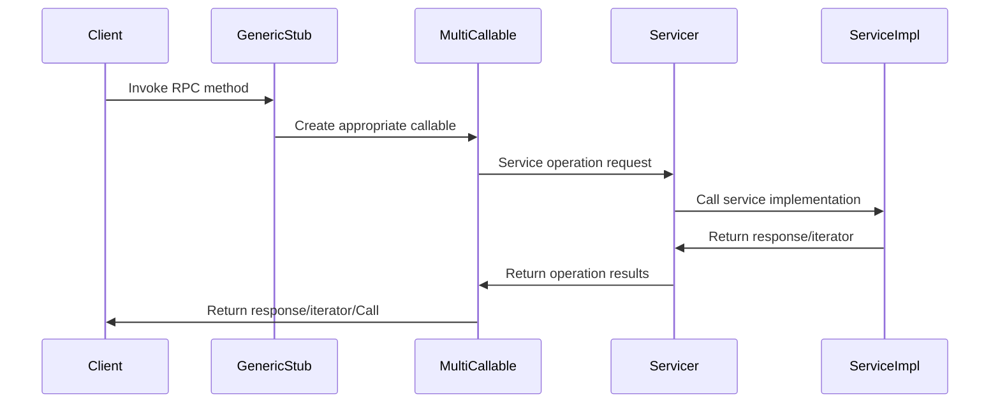
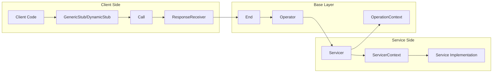
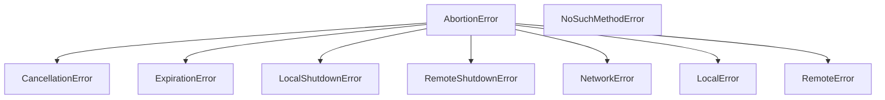
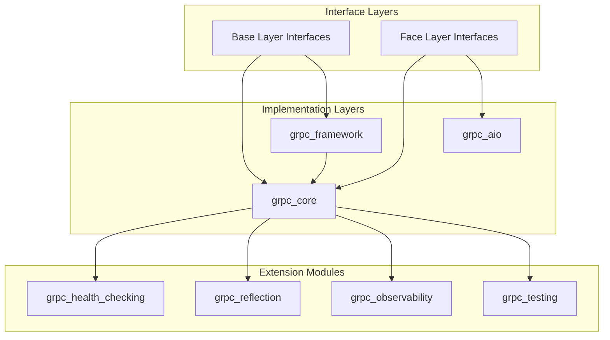

# gRPC Framework Interfaces Module Documentation

## Introduction

The `grpc_framework_interfaces` module provides the foundational interface definitions for the gRPC framework's layered architecture. This module defines the core abstractions that enable the separation of concerns between different layers of the RPC framework, particularly the Base layer and the Face layer. These interfaces establish contracts for operation management, service handling, and RPC invocation patterns across the gRPC ecosystem.

The module is organized into two primary interface layers:
- **Base Layer Interfaces**: Low-level operation abstractions for generic data exchange
- **Face Layer Interfaces**: High-level RPC-specific abstractions for remote procedure calls

## Architecture Overview



## Core Components

### Base Layer Interfaces

#### OperationContext
Provides operation-related information and actions for managing the lifecycle of operations.

**Key Responsibilities:**
- Monitor operation outcomes and termination status
- Manage operation timeouts and time remaining
- Handle operation cancellation and failure reporting
- Register termination callbacks

**Core Methods:**
- `outcome()`: Returns the operation's outcome or None if ongoing
- `add_termination_callback()`: Registers callbacks for operation termination
- `time_remaining()`: Returns remaining time before timeout
- `cancel()`: Cancels the operation if not terminated
- `fail()`: Indicates operation failure with an exception

#### Operator
Interface for participating in operations by advancing them through different stages.

**Key Responsibilities:**
- Progress operations by exchanging data payloads
- Manage metadata communication (initial and terminal)
- Handle flow control through allowance mechanisms
- Coordinate operation completion

**Core Methods:**
- `advance()`: Progresses the operation with optional metadata, payload, completion, or allowance

#### Servicer
Interface for service implementations to handle incoming operations.

**Key Responsibilities:**
- Service operations based on group and method identifiers
- Manage operation subscriptions and value acceptance
- Handle unrecognized method errors
- Coordinate with operation contexts

**Core Methods:**
- `service()`: Services an operation with group, method, context, and output operator

#### End
Common entry-point interface for both sides of an operation.

**Key Responsibilities:**
- Start and stop service operations
- Commence new operations with various parameters
- Manage operation statistics and idle actions
- Handle graceful shutdown with timeout periods

**Core Methods:**
- `start()`: Starts service of operations
- `stop()`: Stops service with grace period
- `operate()`: Commences a new operation
- `operation_stats()`: Reports terminated operation statistics
- `add_idle_action()`: Adds actions for idle periods

#### Subscription
Describes customer code's interest in values from the other side of an operation.

**Attributes:**
- `kind`: Subscription type (NONE, TERMINATION_ONLY, FULL)
- `termination_callback`: Callable for operation termination
- `allowance`: Callable for flow control
- `operator`: Operator for receiving values
- `protocol_receiver`: ProtocolReceiver for protocol objects

#### Outcome
Represents the outcome of an operation with termination details.

**Attributes:**
- `kind`: Termination type (COMPLETED, CANCELLED, EXPIRED, etc.)
- `code`: Application-specific code value
- `details`: Application-specific details value

### Face Layer Interfaces

#### RpcContext
Provides RPC-related information and actions, serving as the base for Call and ServicerContext.

**Key Responsibilities:**
- Monitor RPC activity status
- Manage RPC timeouts and time remaining
- Handle RPC cancellation
- Register abortion callbacks
- Access protocol-specific context

#### Call
Invocation-side utility object for RPCs, extending RpcContext.

**Key Responsibilities:**
- Access service-side metadata (initial and terminal)
- Retrieve RPC codes and details
- Block until values are available
- Provide comprehensive RPC information

#### ServicerContext
Service-side context object for method implementations, extending RpcContext.

**Key Responsibilities:**
- Access invocation-side metadata
- Accept and transmit service-side metadata
- Set RPC codes and details
- Coordinate bidirectional communication

#### GenericStub
Affords RPC invocation via generic methods for all RPC patterns.

**Key Responsibilities:**
- Support all four RPC patterns (unary-unary, unary-stream, stream-unary, stream-stream)
- Provide blocking, future, and event-driven invocation styles
- Handle metadata and protocol options
- Manage timeouts and error handling

#### DynamicStub
Affords RPC invocation via attribute access to methods.

**Key Responsibilities:**
- Provide attribute-based method access
- Support method scoping to single groups
- Return appropriate MultiCallable objects
- Enable intuitive RPC invocation

#### ResponseReceiver
Invocation-side object for accepting RPC output.

**Key Responsibilities:**
- Receive initial metadata from service-side
- Accept response values
- Handle completion with terminal metadata, code, and details

### MultiCallable Interfaces

#### UnaryUnaryMultiCallable
Supports unary-request-unary-response RPC invocation in multiple styles.

**Invocation Styles:**
- Synchronous: `__call__()`
- Asynchronous Future: `future()`
- Event-driven: `event()`

#### UnaryStreamMultiCallable
Supports unary-request-stream-response RPC invocation.

**Invocation Styles:**
- Iterator-based: `__call__()`
- Event-driven: `event()`

#### StreamUnaryMultiCallable
Supports stream-request-unary-response RPC invocation.

**Invocation Styles:**
- Synchronous: `__call__()`
- Asynchronous Future: `future()`
- Event-driven: `event()`

#### StreamStreamMultiCallable
Supports stream-request-stream-response RPC invocation.

**Invocation Styles:**
- Iterator-based: `__call__()`
- Event-driven: `event()`

## Data Flow Architecture



## Component Interactions



## Error Handling

The module defines a comprehensive error hierarchy for handling RPC failures:



## Integration with gRPC Framework

The interfaces module serves as the foundation for the entire gRPC framework architecture:



## Usage Patterns

### Service Implementation Pattern
```python
class MyServicer(Servicer):
    def service(self, group, method, context, output_operator):
        # Handle incoming operation
        if method == "MyMethod":
            return Subscription(
                kind=Subscription.Kind.FULL,
                operator=my_operator,
                protocol_receiver=my_protocol_receiver
            )
        else:
            raise NoSuchMethodError(code, details)
```

### Client Invocation Pattern
```python
# Using GenericStub
stub = GenericStub()
response = stub.blocking_unary_unary(
    group="MyGroup",
    method="MyMethod", 
    request=request,
    timeout=30.0
)

# Using DynamicStub
response = stub.MyMethod(request, timeout=30.0)
```

## Relationship to Other Modules

- **[grpc_framework_common](grpc_framework_common.md)**: Provides cardinality and service style definitions used by MethodImplementation
- **[grpc_framework_foundation](grpc_framework_foundation.md)**: Supplies stream utilities and future implementations used by MultiMethodImplementation
- **[grpc_core](grpc_core.md)**: Implements these interfaces to provide the core gRPC functionality
- **[grpc_aio](grpc_aio.md)**: Provides asynchronous implementations of similar interface patterns

## Key Design Principles

1. **Layer Separation**: Clear separation between low-level operations (Base) and high-level RPC (Face)
2. **Flexibility**: Support for multiple invocation styles (blocking, future, event-driven)
3. **Extensibility**: Abstract base classes allow for custom implementations
4. **Type Safety**: Comprehensive type hints and abstract method definitions
5. **Error Handling**: Structured error hierarchy for different failure modes
6. **Flow Control**: Built-in support for backpressure and allowance mechanisms

## Thread Safety Considerations

- OperationContext methods are thread-safe for monitoring operation status
- Operator implementations must handle concurrent calls appropriately
- Subscription objects should be immutable once created
- End objects manage their own thread safety for operation lifecycle

This module provides the essential contract definitions that enable the gRPC framework's layered architecture, ensuring consistent behavior across different implementations while maintaining flexibility for various use cases and deployment scenarios.