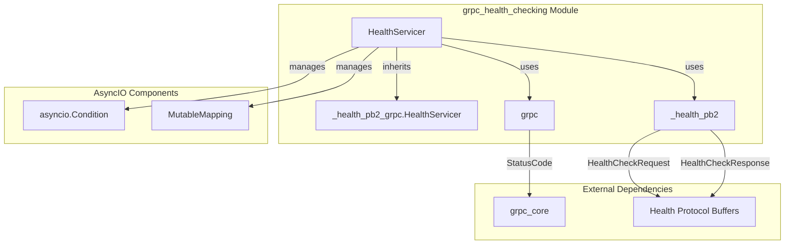
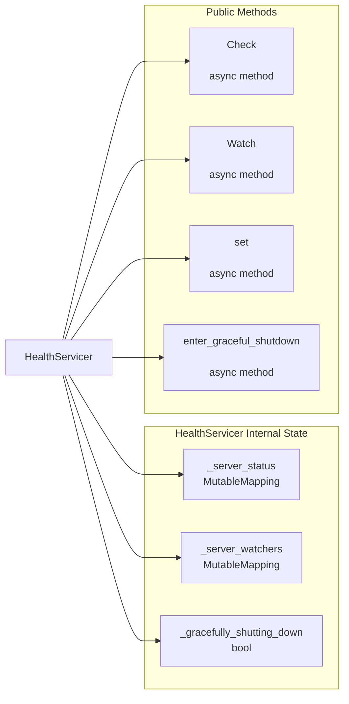
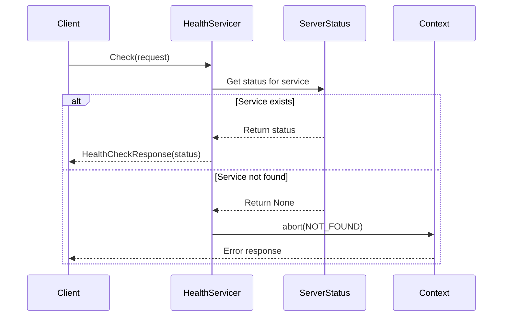
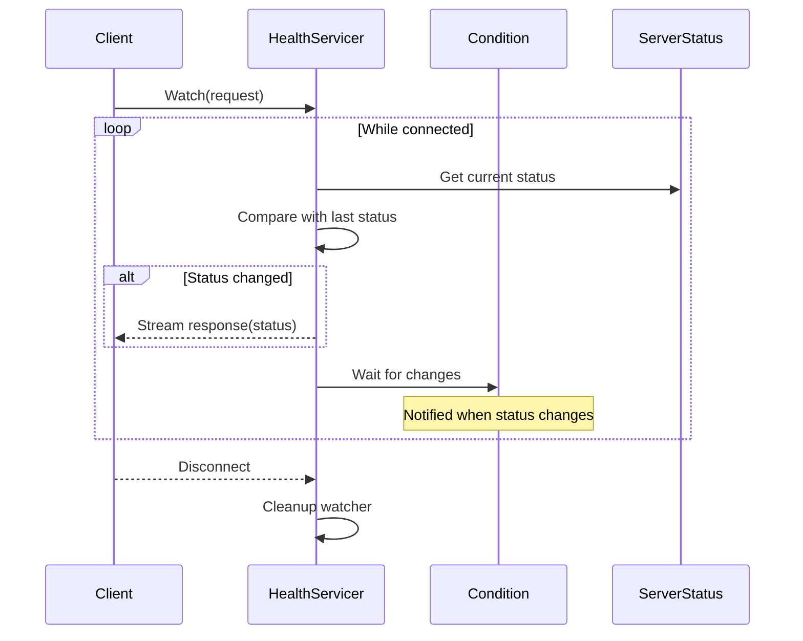
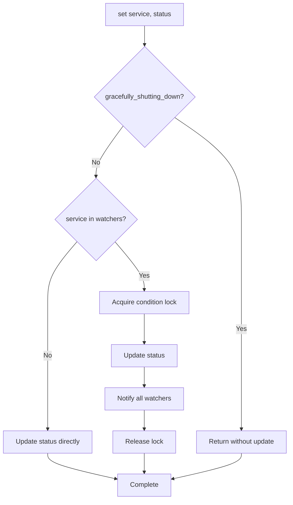
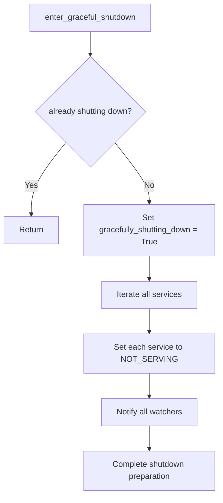
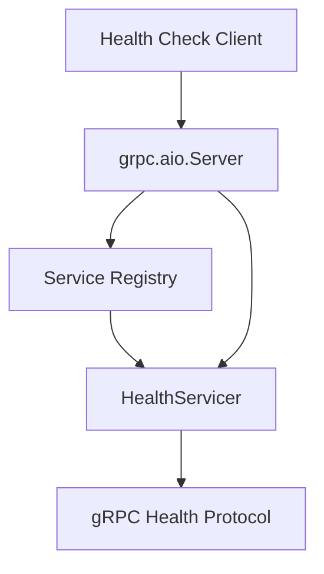

# gRPC Health Checking Module

The grpc_health_checking module provides a standardized health checking service for gRPC servers, implementing the gRPC Health Checking Protocol. This module enables clients to monitor the health status of gRPC services and receive real-time updates when service states change.

## Overview

The health checking module implements an async/await pattern-based health servicer that supports both one-time health checks and continuous health state monitoring through streaming. It provides a reference implementation that gRPC servers can integrate to expose their health status to clients and load balancers.

## Architecture

### Core Components



### Component Relationships



## Data Flow

### Health Check Request Flow



### Health Watch Streaming Flow



## Service Status Management

### Status States

The health checking service supports the following status states as defined in the HealthCheckResponse protocol:

- **SERVING**: Service is healthy and accepting requests
- **NOT_SERVING**: Service is unhealthy and not accepting requests  
- **SERVICE_UNKNOWN**: Service status is unknown (used as default for Watch operations)

### Status Update Process



## Graceful Shutdown Support

The module provides graceful shutdown functionality that ensures all services report as NOT_SERVING during server shutdown:



## Integration with gRPC Server

The HealthServicer integrates with the gRPC server framework through inheritance from the generated HealthServicer base class:



**Integration Flow:**
1. **Server Registration**: The gRPC server registers the HealthServicer with the service registry
2. **Protocol Implementation**: HealthServicer implements the gRPC Health Protocol interface
3. **Client Routing**: Health check clients connect to the gRPC server, which routes health check requests to the HealthServicer
4. **Service Registration**: The service registry manages the HealthServicer instance and makes it available to handle incoming health check RPCs

## Key Features

### AsyncIO Support
- Full async/await pattern implementation
- Non-blocking health status updates
- Efficient watcher notification using asyncio.Condition

### Real-time Monitoring
- Streaming Watch method for continuous health monitoring
- Automatic status change detection
- Efficient polling mechanism with condition variables

### Service Management
- Per-service health status tracking
- Support for multiple services on a single server
- Graceful shutdown coordination

### Error Handling
- Proper gRPC status code responses
- Service not found handling
- Context-aware error propagation

## Dependencies

The grpc_health_checking module depends on:

- **grpc_core**: For base gRPC functionality, status codes, and server integration ([grpc_core.md](grpc_core.md))
- **Protocol Buffers**: For health check request/response message definitions
- **AsyncIO**: For asynchronous operation support

## Usage Patterns

### Basic Health Check Server Setup
```python
# Server-side integration
health_servicer = HealthServicer()
server = grpc.aio.server()
health_pb2_grpc.add_HealthServicer_to_server(health_servicer, server)

# Setting service status
await health_servicer.set("my_service", health_pb2.HealthCheckResponse.SERVING)
```

### Client Health Check
```python
# Client-side health check
async with grpc.aio.insecure_channel('localhost:50051') as channel:
    health_stub = health_pb2_grpc.HealthStub(channel)
    response = await health_stub.Check(
        health_pb2.HealthCheckRequest(service="my_service")
    )
```

### Continuous Health Monitoring
```python
# Streaming health watch
async for response in health_stub.Watch(
    health_pb2.HealthCheckRequest(service="my_service")
):
    print(f"Service status: {response.status}")
```

## Thread Safety and Concurrency

The HealthServicer is designed for async concurrency:
- Uses asyncio.Condition for thread-safe status updates
- Implements proper locking for watcher notifications
- Supports multiple concurrent Check and Watch operations
- Safe for use in high-concurrency gRPC server environments

## Performance Considerations

- **Memory Efficiency**: Uses defaultdict for watcher management to avoid unnecessary allocations
- **Notification Optimization**: Only notifies watchers when status actually changes
- **Streaming Efficiency**: Watch method uses efficient async iteration
- **Graceful Cleanup**: Properly removes watchers when clients disconnect