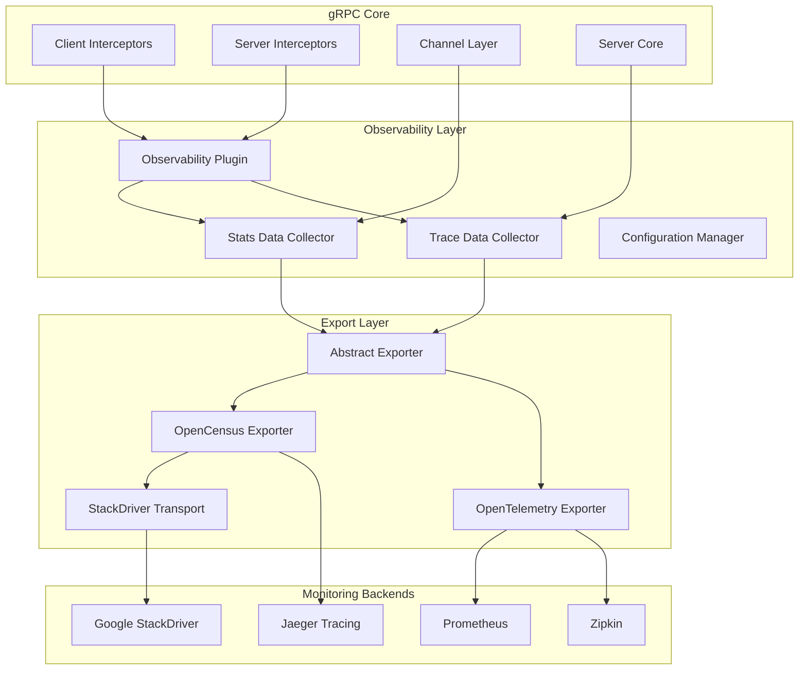
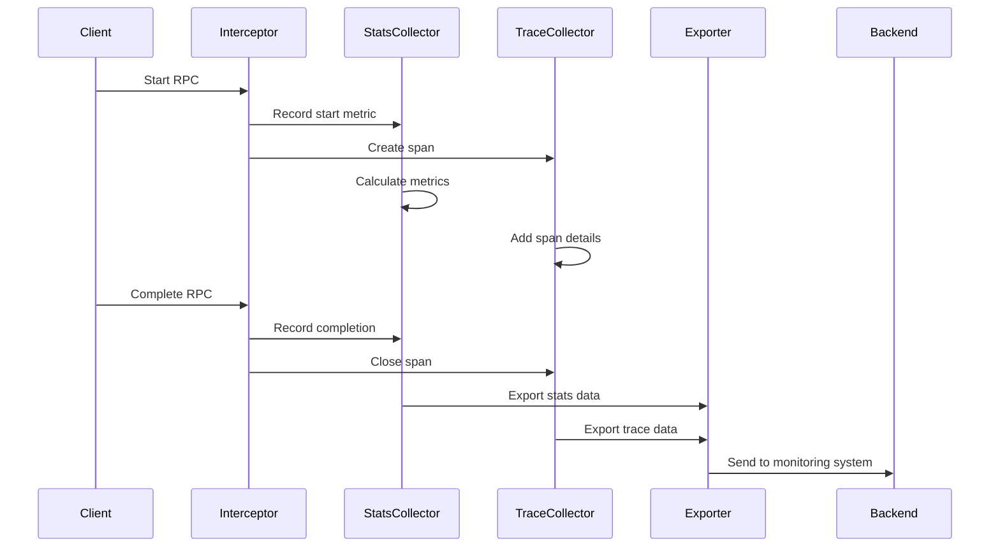
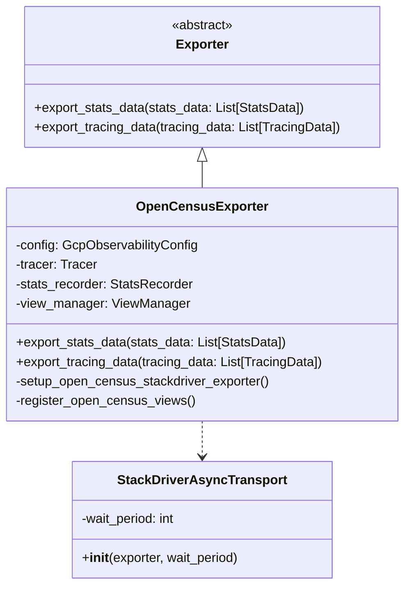
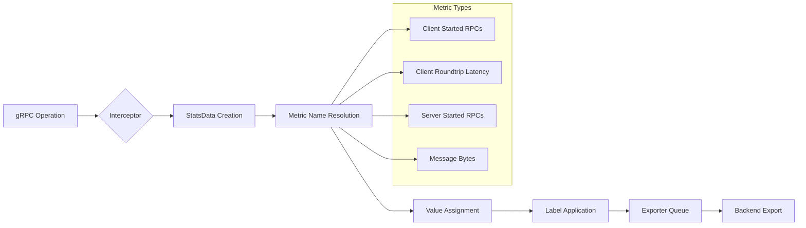
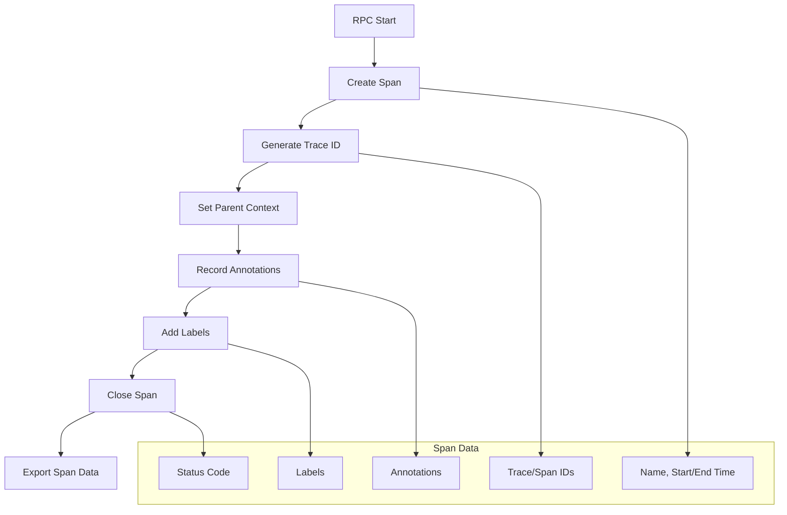

# gRPC Observability Module Documentation

## Introduction

The `grpc_observability` module provides comprehensive monitoring, tracing, and metrics collection capabilities for gRPC applications. It implements a pluggable observability framework that integrates with popular monitoring systems like OpenCensus, OpenTelemetry, and Stackdriver, enabling developers to gain deep insights into their gRPC services' performance, behavior, and health.

This module serves as the central hub for collecting, processing, and exporting telemetry data from gRPC client and server operations, supporting both synchronous and asynchronous gRPC implementations.

## Architecture Overview

The observability module is built around a flexible plugin-based architecture that separates data collection from data export, allowing seamless integration with various monitoring backends.



## Core Components

### 1. Data Collection Framework

The module provides two primary data collection mechanisms:

#### StatsData Collection
- **Purpose**: Collects quantitative metrics about RPC operations
- **Scope**: Client-side and server-side metrics including latency, throughput, error rates
- **Integration**: Works with gRPC interceptors to capture metrics at key operation points

#### TracingData Collection  
- **Purpose**: Captures distributed tracing information for request flow analysis
- **Scope**: End-to-end request tracing across service boundaries
- **Integration**: Creates spans for RPC operations with timing and status information



### 2. Plugin Architecture

The module implements a flexible plugin system that allows runtime configuration of observability features:

#### OpenTelemetry Plugin
- **Purpose**: Provides OpenTelemetry-compatible metrics and tracing
- **Features**: 
  - Meter provider integration for metrics collection
  - Label injection for custom dimensions
  - Method and target filtering to control cardinality
  - Plugin option extensibility

#### OpenCensus Integration
- **Purpose**: Maintains backward compatibility with OpenCensus
- **Features**:
  - StackDriver exporter for Google Cloud monitoring
  - Stats recording and view management
  - Trace context propagation
  - Configurable sampling rates

### 3. Export Framework

The abstract exporter interface provides a consistent API for different monitoring backends:



## Data Flow Architecture

### Metrics Collection Flow



### Tracing Data Flow



## Integration Points

### gRPC Core Integration

The observability module integrates with gRPC core through:

1. **Client Interceptors**: Capture outgoing RPC metrics and create client-side spans
2. **Server Interceptors**: Capture incoming RPC metrics and create server-side spans  
3. **Channel Layer**: Monitor connection states and transport-level metrics
4. **Server Core**: Track server lifecycle and request processing metrics

### Configuration Management

The module supports comprehensive configuration through:

- **Environment Variables**: Runtime configuration of export intervals, sampling rates
- **Config Objects**: Programmatic configuration of plugins, exporters, and filters
- **Label Management**: Dynamic label injection and metadata exchange

## Supported Metrics

### Client-Side Metrics
- `grpc.client.attempt.started`: Number of client call attempts started
- `grpc.client.attempt.duration`: End-to-end time for client call attempts
- `grpc.client.attempt.sent_total_compressed_message_size`: Compressed bytes sent
- `grpc.client.attempt.rcvd_total_compressed_message_size`: Compressed bytes received

### Server-Side Metrics
- `grpc.server.call.started`: Number of server calls started
- `grpc.server.call.duration`: End-to-end time for server calls
- `grpc.server.call.sent_total_compressed_message_size`: Compressed bytes sent
- `grpc.server.call.rcvd_total_compressed_message_size`: Compressed bytes received

## Plugin Development

### Creating Custom Exporters

Developers can create custom exporters by implementing the abstract `Exporter` base class:

```python
class CustomExporter(Exporter):
    def export_stats_data(self, stats_data: List[StatsData]) -> None:
        # Custom stats export logic
        pass
    
    def export_tracing_data(self, tracing_data: List[TracingData]) -> None:
        # Custom trace export logic
        pass
```

### Extending OpenTelemetry Plugin

The OpenTelemetry plugin can be extended through plugin options:

```python
class CustomPluginOption(OpenTelemetryPluginOption):
    # Custom plugin functionality
    pass

plugin = OpenTelemetryPlugin(
    plugin_options=[CustomPluginOption()],
    meter_provider=custom_meter_provider
)
```

## Performance Considerations

### Sampling Configuration
- Configurable trace sampling rates to balance detail vs. overhead
- Stats collection can be selectively enabled/disabled
- Label filtering to control metric cardinality

### Export Optimization
- Batch export operations to reduce network overhead
- Configurable export intervals (default: 20 seconds)
- Asynchronous transport mechanisms for non-blocking exports

### Memory Management
- Efficient data structures for metrics collection
- Configurable buffer sizes for export queues
- Automatic cleanup of expired trace data

## Security and Privacy

### Data Sanitization
- Configurable label filtering to exclude sensitive information
- Support for label serialization/deserialization for secure metadata exchange
- Option to replace method names with generic identifiers

### Access Control
- Plugin-specific identifier tracking for data isolation
- Configurable target filtering to control metric exposure
- Support for secure transport in export operations

## Dependencies

The module integrates with several external systems:

- **[grpc_core](grpc_core.md)**: Core gRPC functionality and interceptor framework
- **[OpenCensus](https://opencensus.io/)**: Legacy metrics and tracing support
- **[OpenTelemetry](https://opentelemetry.io/)**: Modern observability standard
- **Google Cloud StackDriver**: Cloud-native monitoring and tracing backend

## Best Practices

### Configuration
1. Use appropriate sampling rates to balance visibility and performance
2. Configure label filters to control metric cardinality
3. Set reasonable export intervals based on your monitoring requirements

### Plugin Usage
1. Register global plugins early in application lifecycle
2. Use context managers for temporary plugin activation
3. Implement proper cleanup in plugin destructors

### Performance
1. Enable only required metrics to minimize overhead
2. Use batch export for high-throughput scenarios
3. Monitor export queue sizes to detect bottlenecks

### Security
1. Sanitize sensitive data in labels and annotations
2. Use secure transport for export operations
3. Implement access controls for monitoring data

## Troubleshooting

### Common Issues
1. **Missing Metrics**: Check plugin registration and configuration
2. **Export Failures**: Verify network connectivity and credentials
3. **High Memory Usage**: Adjust sampling rates and buffer sizes
4. **Incomplete Traces**: Ensure proper context propagation

### Debug Information
- Enable debug logging for export operations
- Monitor export queue depths and processing times
- Check for configuration conflicts between plugins
- Verify integration with target monitoring systems