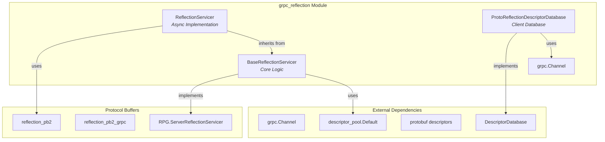
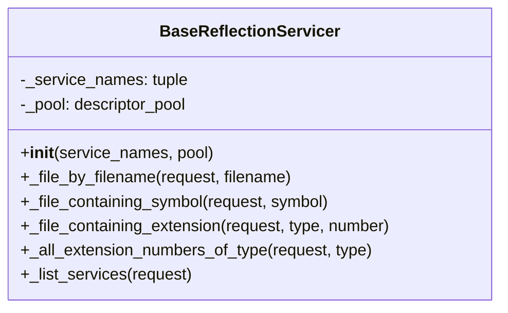
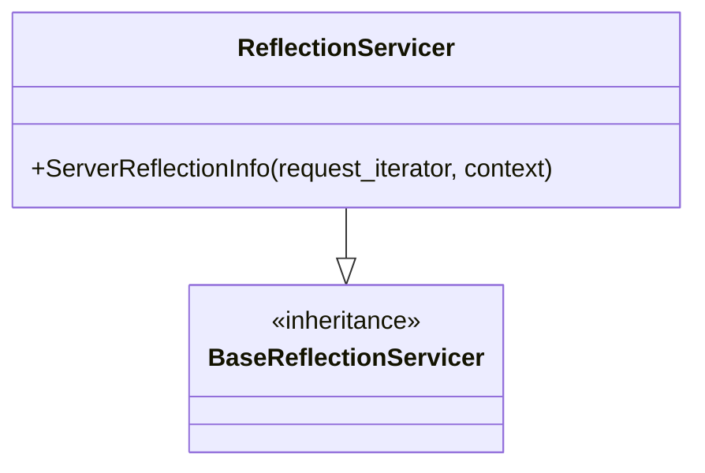
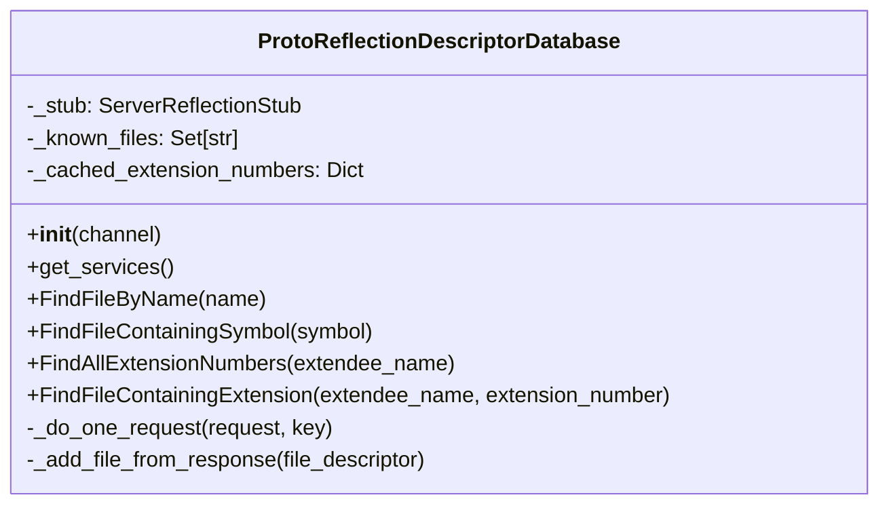
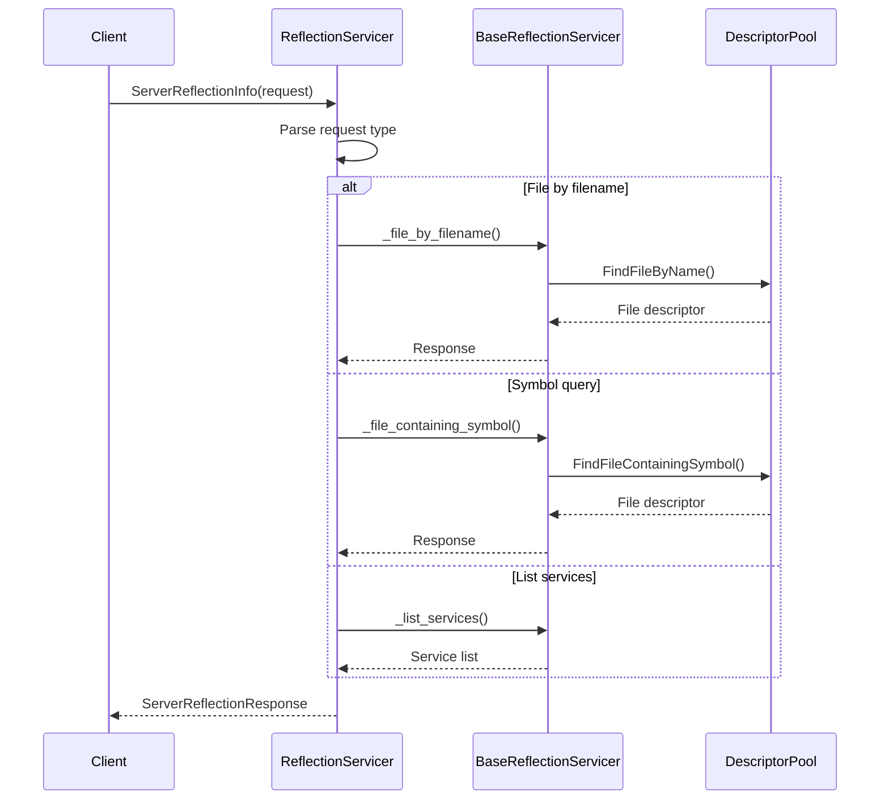
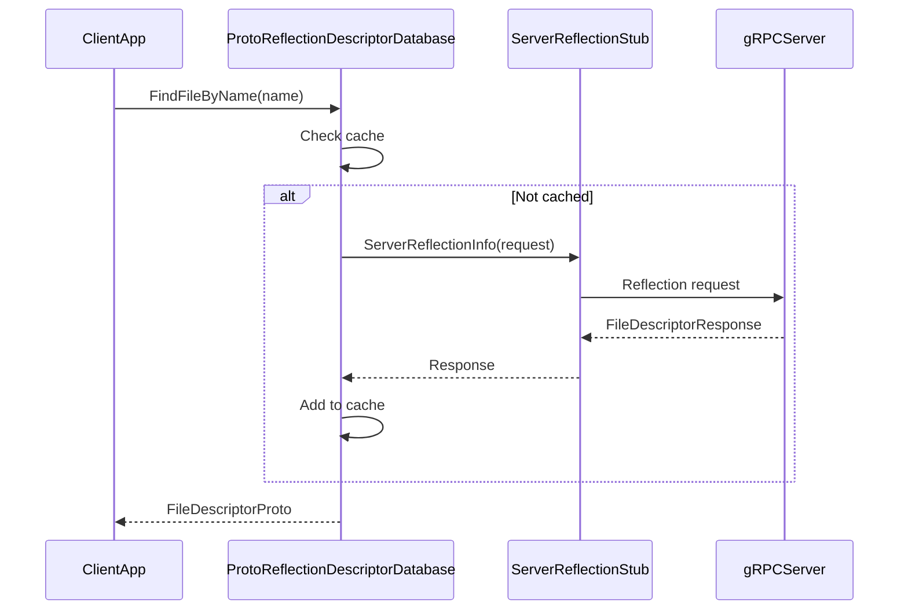
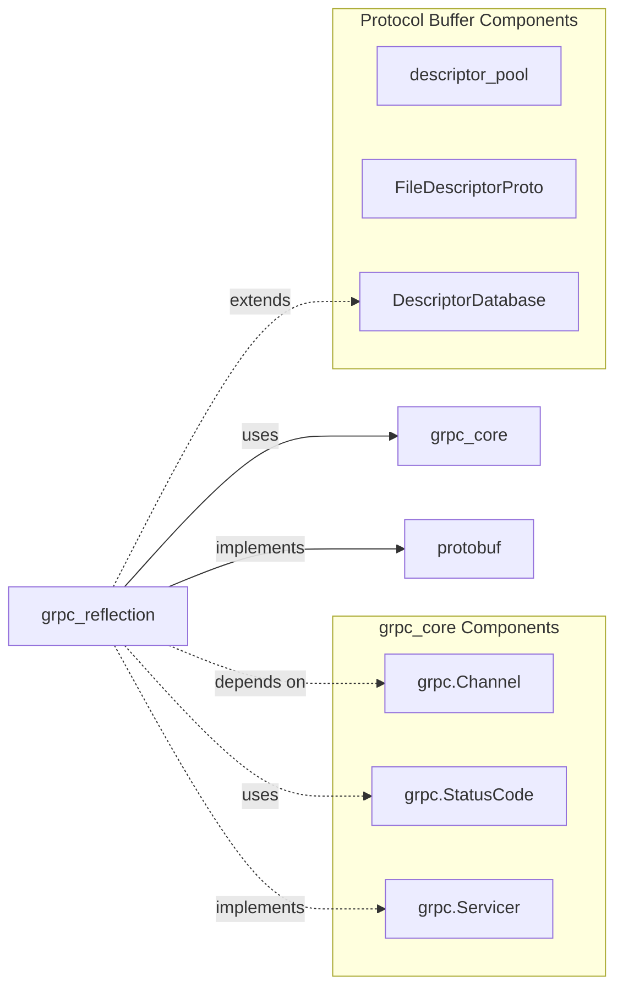
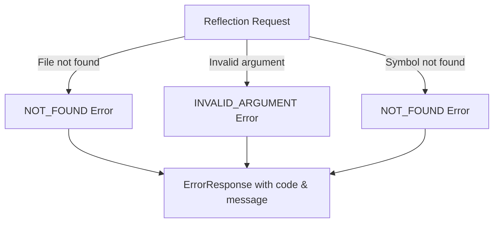

# gRPC Reflection Module Documentation

## Introduction

The `grpc_reflection` module provides server reflection capabilities for gRPC services, enabling clients to discover service definitions and protocol buffer descriptors at runtime. This module implements the gRPC Server Reflection Protocol, allowing dynamic clients to query service metadata without requiring pre-compiled protocol buffer definitions.

## Module Overview

The reflection module is part of the gRPC Python ecosystem and provides both synchronous and asynchronous implementations for exposing service metadata. It enables clients to:

- Discover available services on a gRPC server
- Retrieve protocol buffer file descriptors
- Query symbols, extensions, and service definitions
- Build dynamic clients that adapt to server capabilities

## Core Architecture

### Component Structure



### Key Components

#### 1. BaseReflectionServicer
The foundational class that implements the core reflection logic. It provides methods for:
- File descriptor retrieval by filename
- Symbol-based file descriptor queries
- Extension number discovery
- Service listing functionality

#### 2. ReflectionServicer (Async)
Asynchronous implementation of the reflection service, extending BaseReflectionServicer to handle async RPC calls. It processes reflection requests and returns appropriate responses.

#### 3. ProtoReflectionDescriptorDatabase
Client-side component that implements the DescriptorDatabase interface. It queries reflection-enabled servers to build a local database of protocol buffer descriptors.

## Detailed Component Analysis

### BaseReflectionServicer



**Key Methods:**
- `_file_by_filename()`: Retrieves file descriptors by filename
- `_file_containing_symbol()`: Finds files containing specific symbols
- `_file_containing_extension()`: Locates extension definitions
- `_all_extension_numbers_of_type()`: Discovers extension numbers
- `_list_services()`: Lists available services

### ReflectionServicer (Async)



**Core Functionality:**
- Processes async reflection request streams
- Routes requests to appropriate handler methods
- Returns error responses for invalid requests

### ProtoReflectionDescriptorDatabase



**Client-Side Features:**
- Service discovery via `get_services()`
- File descriptor caching
- Extension number caching
- Error handling for missing resources

## Data Flow Architecture

### Server-Side Reflection Flow



### Client-Side Database Building



## Integration with gRPC Ecosystem

### Module Dependencies



### Related Modules

- **[grpc_core](grpc_core.md)**: Provides fundamental gRPC primitives like channels, status codes, and servicer interfaces
- **[grpc_health_checking](grpc_health_checking.md)**: Similar pattern for health checking services
- **[grpc_channelz](grpc_channelz.md)**: Channel introspection capabilities

## Usage Patterns

### Server-Side Setup

```python
# Typical server setup with reflection
from grpc_reflection.v1alpha import reflection
from grpc_reflection.v1alpha._async import ReflectionServicer

# Add reflection service to server
reflection.enable_server_reflection(service_names, server)
```

### Client-Side Usage

```python
# Client using reflection database
from grpc_reflection.v1alpha.proto_reflection_descriptor_database import ProtoReflectionDescriptorDatabase

# Create reflection database
channel = grpc.insecure_channel('localhost:50051')
database = ProtoReflectionDescriptorDatabase(channel)

# Use for service discovery
services = database.get_services()
```

## Error Handling

### Error Response Types



### Error Codes
- `NOT_FOUND`: Resource (file, symbol, extension) not found
- `INVALID_ARGUMENT`: Malformed request or unsupported query type

## Performance Considerations

### Caching Strategy
- **Server-side**: Descriptor pool maintains loaded descriptors
- **Client-side**: Known files and extension numbers are cached
- **Network**: Single request per unique resource query

### Scalability
- Stateless service design
- Efficient descriptor serialization
- Minimal memory footprint for cached data

## Security Implications

### Information Exposure
- Reflection exposes service definitions
- Should be disabled in production unless needed
- Consider access control for sensitive services

### Best Practices
- Use reflection only in development/debugging
- Implement authentication for reflection endpoints
- Limit service exposure in production environments

## Future Enhancements

### Potential Improvements
- Enhanced caching mechanisms
- Batch request processing
- Streaming response optimizations
- Integration with service mesh technologies

### Protocol Evolution
- Support for newer reflection protocol versions
- Enhanced metadata capabilities
- Cross-service dependency resolution

## Conclusion

The `grpc_reflection` module provides essential runtime introspection capabilities for gRPC services. Its dual implementation (sync/async) and client-server architecture enable flexible integration patterns while maintaining compatibility with the broader gRPC ecosystem. The module's design emphasizes performance, caching, and extensibility while providing comprehensive service discovery and descriptor management capabilities.