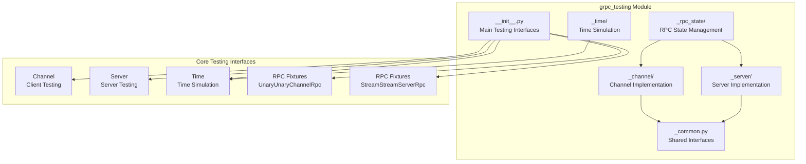
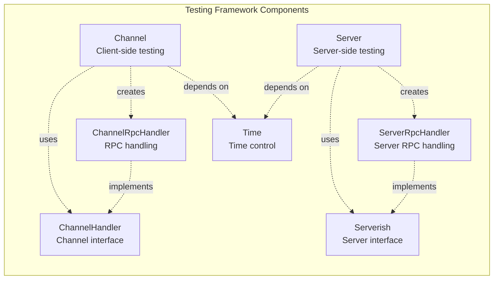
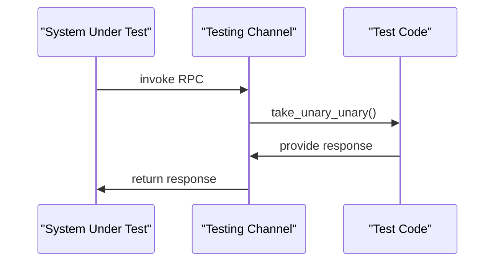
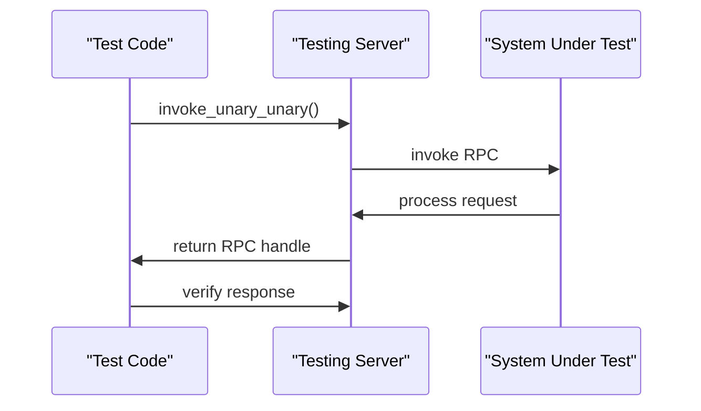
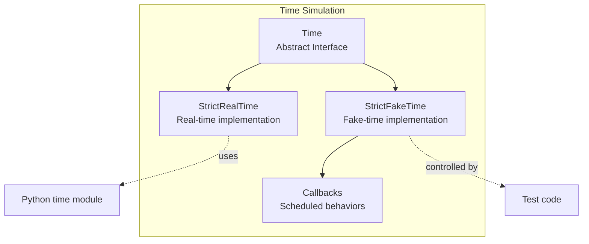
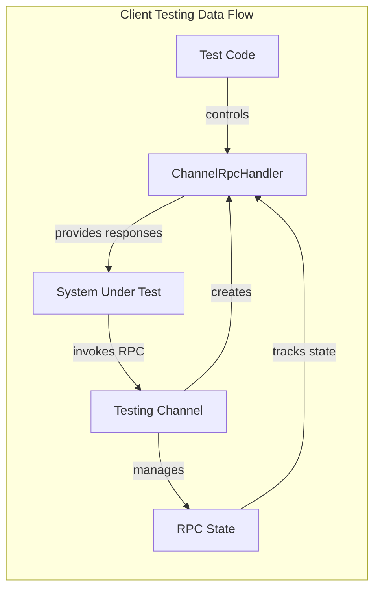
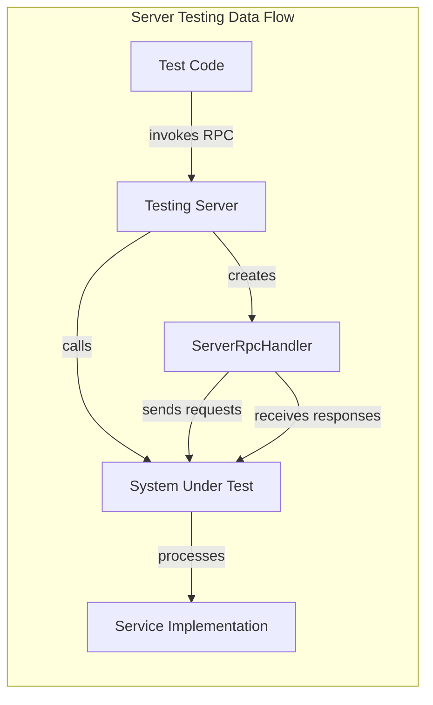
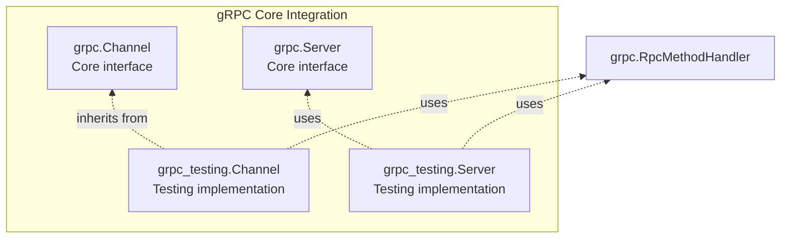
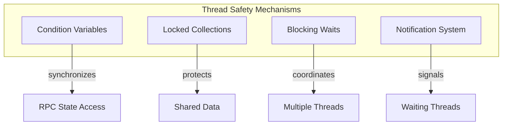

# gRPC Testing Module Documentation

## Introduction

The `grpc_testing` module provides a comprehensive testing framework for gRPC Python applications. It offers mock implementations and testing utilities that enable developers to test gRPC services and clients without requiring actual network connections or running servers. This module is designed to facilitate unit testing, integration testing, and behavior verification of gRPC-based systems.

## Module Purpose

The primary purpose of the grpc_testing module is to provide:

- **Mock Channel and Server implementations** for testing gRPC client and server code
- **RPC fixtures** that allow developers to "play server" or "play client" during tests
- **Time simulation capabilities** for testing time-dependent behaviors
- **Abstract base classes** that define testing interfaces for all RPC patterns
- **Thread-safe testing infrastructure** for concurrent testing scenarios

## Architecture Overview

### Core Architecture



### Component Relationships



## Core Components

### 1. Channel Testing Interface

The `Channel` class provides a mock implementation of `grpc.Channel` for testing client-side code. It allows tests to "play server" by intercepting RPC calls and providing controlled responses.



**Key Methods:**
- `take_unary_unary()`: Intercepts unary-unary RPC calls
- `take_unary_stream()`: Intercepts unary-stream RPC calls
- `take_stream_unary()`: Intercepts stream-unary RPC calls
- `take_stream_stream()`: Intercepts stream-stream RPC calls

### 2. Server Testing Interface

The `Server` class provides a mock server implementation for testing server-side code. It allows tests to "play client" by invoking RPCs and verifying server behavior.



**Key Methods:**
- `invoke_unary_unary()`: Invokes unary-unary RPCs on the service
- `invoke_unary_stream()`: Invokes unary-stream RPCs on the service
- `invoke_stream_unary()`: Invokes stream-unary RPCs on the service
- `invoke_stream_stream()`: Invokes stream-stream RPCs on the service

### 3. RPC Fixtures

The module provides abstract base classes for all RPC patterns, enabling fine-grained control over RPC behavior:

#### Channel RPC Fixtures (Client-side testing)

- **UnaryUnaryChannelRpc**: Controls unary-unary RPCs from client perspective
- **UnaryStreamChannelRpc**: Controls unary-stream RPCs from client perspective
- **StreamUnaryChannelRpc**: Controls stream-unary RPCs from client perspective
- **StreamStreamChannelRpc**: Controls stream-stream RPCs from client perspective

#### Server RPC Fixtures (Server-side testing)

- **UnaryUnaryServerRpc**: Controls unary-unary RPCs from server perspective
- **UnaryStreamServerRpc**: Controls unary-stream RPCs from server perspective
- **StreamUnaryServerRpc**: Controls stream-unary RPCs from server perspective
- **StreamStreamServerRpc**: Controls stream-stream RPCs from server perspective

### 4. Time Simulation

The `Time` abstract class provides time simulation capabilities, crucial for testing time-dependent behaviors like timeouts and deadlines.



**Key Features:**
- `strict_real_time()`: Uses actual system time
- `strict_fake_time()`: Provides controllable fake time
- Callback scheduling with `call_in()` and `call_at()`
- Time advancement with `sleep_for()` and `sleep_until()`

## Common Interfaces

### ChannelRpcHandler Interface

Defines the contract for handling RPCs on the client side:

```python
class ChannelRpcHandler(ABC):
    def initial_metadata(self)  # Get initial metadata
    def add_request(self, request)  # Add request to stream
    def close_requests(self)  # Close request stream
    def take_response(self)  # Get response from server
    def cancel(self, code, details)  # Cancel RPC
    def termination(self)  # Wait for termination
    def is_active(self)  # Check if RPC is active
    def time_remaining(self)  # Get remaining time
    def add_callback(self, callback)  # Add callback
```

### ServerRpcHandler Interface

Defines the contract for handling RPCs on the server side:

```python
class ServerRpcHandler(ABC):
    def send_initial_metadata(self, initial_metadata)  # Send initial metadata
    def take_request(self)  # Get request from client
    def add_response(self, response)  # Add response to stream
    def send_termination(self, trailing_metadata, code, details)  # Terminate RPC
    def add_termination_callback(self, callback)  # Add termination callback
```

## Data Flow Architecture

### Client-Side Testing Flow



### Server-Side Testing Flow



## Integration with gRPC Core

The testing module integrates with the main gRPC Python library through inheritance and interface implementation:



## Usage Patterns

### Basic Client Testing

```python
# Create testing channel
channel = grpc_testing.channel(service_descriptors, time)

# Test client code that makes RPC calls
client = MyClient(channel)
result = client.my_method(request)

# Verify and control the RPC
invocation_metadata, request, rpc = channel.take_unary_unary(method_descriptor)
rpc.terminate(response, trailing_metadata, code, details)
```

### Basic Server Testing

```python
# Create testing server
server = grpc_testing.server_from_dictionary(descriptors_to_servicers, time)

# Invoke RPC on server
rpc = server.invoke_unary_unary(method_descriptor, metadata, request, timeout)

# Verify server behavior
response, trailing_metadata, code, details = rpc.termination()
```

### Time-Dependent Testing

```python
# Use fake time for deterministic testing
time = grpc_testing.strict_fake_time(now)

# Schedule callbacks
time.call_in(callback, delay)
time.sleep_for(duration)

# Control time advancement
time.sleep_until(target_time)
```

## Thread Safety

The testing module is designed with thread safety in mind:

- **Condition Variables**: Used for synchronization in `State` class
- **Thread-safe Collections**: `collections.defaultdict` for managing RPC states
- **Blocking Operations**: Methods like `take_rpc_state()` use proper synchronization



## Error Handling

The testing framework provides comprehensive error handling:

- **Cancellation Support**: All RPC fixtures support cancellation
- **Timeout Handling**: Time simulation enables timeout testing
- **Status Code Testing**: Full control over RPC termination status
- **Metadata Validation**: Test metadata handling in RPCs

## Dependencies

The grpc_testing module has minimal external dependencies:

- **google.protobuf**: For service and method descriptors
- **grpc**: Core gRPC Python library
- **abc**: Abstract base classes
- **threading**: Thread synchronization
- **collections**: Data structures

## Related Modules

The grpc_testing module is part of the broader gRPC Python ecosystem:

- **[grpc_core](grpc_core.md)**: Core gRPC functionality that this module tests
- **[grpc_aio](grpc_aio.md)**: Async gRPC support (testing module focuses on sync)
- **[grpc_framework](grpc_framework.md)**: Lower-level framework interfaces

## Best Practices

### Testing Client Code

1. Use `channel()` to create mock channels
2. Use appropriate `take_*` methods to intercept RPCs
3. Control responses and metadata precisely
4. Test error conditions and edge cases
5. Use fake time for deterministic timeout testing

### Testing Server Code

1. Use `server_from_dictionary()` to create test servers
2. Use `invoke_*` methods to trigger RPCs
3. Verify request processing and response generation
4. Test streaming behaviors with multiple requests/responses
5. Verify proper metadata handling

### Time Testing

1. Use `strict_fake_time()` for deterministic tests
2. Schedule callbacks to simulate time-dependent events
3. Control time advancement explicitly
4. Test timeout and deadline behaviors
5. Ensure callback execution order

## Conclusion

The grpc_testing module provides a comprehensive and flexible testing framework for gRPC Python applications. Its design enables thorough testing of both client and server code, with fine-grained control over RPC behavior, time simulation, and error conditions. The module's thread-safe implementation and abstract interfaces make it suitable for complex testing scenarios while maintaining simplicity for basic use cases.