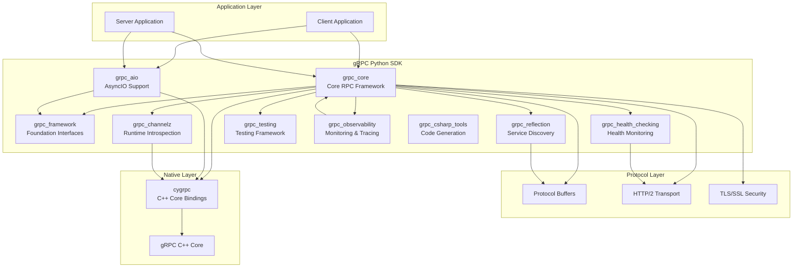

# gRPC Python Repository Overview

## Purpose

The `grpc--grpc` repository is the official Python implementation of gRPC, a high-performance, open-source universal RPC framework. This repository provides the complete Python SDK for building distributed systems and microservices using gRPC's protocol-buffer-based communication model. It enables developers to create both synchronous and asynchronous gRPC services and clients with comprehensive support for all RPC patterns, authentication mechanisms, and advanced features like streaming, health checking, reflection, and observability.

## End-to-End Architecture

## Core Module Documentation

### [grpc_core](grpc_core.md)
The foundational module providing essential RPC interfaces and implementations. Contains the core abstractions for channels, servers, interceptors, authentication, and all four RPC patterns (unary-unary, unary-stream, stream-unary, stream-stream). This module serves as the backbone for all gRPC operations in Python.

### [grpc_aio](grpc_aio.md)
Asynchronous I/O implementation built on Python's asyncio framework. Provides non-blocking RPC operations with full support for concurrent request handling, streaming, and modern async/await patterns. Enables high-performance applications that can handle thousands of concurrent connections.

### [grpc_framework](grpc_framework.md)
Low-level framework abstractions and interfaces that define the architectural foundation. Contains cardinality classifications, stream processing utilities, future-based async operations, and layered interface definitions that enable extensibility and pluggability throughout the gRPC system.

### [grpc_health_checking](grpc_health_checking.md)
Standardized health checking service implementation following the gRPC Health Checking Protocol. Provides both one-time health checks and continuous health state monitoring through streaming, enabling service discovery and load balancing scenarios.

### [grpc_reflection](grpc_reflection.md)
Runtime service discovery and introspection capabilities implementing the gRPC Server Reflection Protocol. Allows clients to query service definitions and protocol buffer descriptors at runtime without requiring pre-compiled stubs, enabling dynamic client creation.

### [grpc_channelz](grpc_channelz.md)
Runtime debugging and introspection utilities implementing the gRPC Channelz protocol. Provides detailed visibility into channel internals, server states, subchannels, and socket-level statistics for comprehensive monitoring and debugging.

### [grpc_testing](grpc_testing.md)
Comprehensive testing framework with mock implementations for unit testing gRPC services. Provides controlled testing environments for both client and server code, including time simulation, RPC fixtures, and thread-safe testing infrastructure.

### [grpc_observability](grpc_observability.md)
Enterprise-grade monitoring, tracing, and metrics collection framework. Integrates with OpenCensus, OpenTelemetry, and Stackdriver to provide distributed tracing, performance metrics, and operational insights across service boundaries.

### [grpc_csharp_tools](grpc_csharp_tools.md)
Build-time tooling for C# projects, providing Protocol Buffer compilation and gRPC service code generation within MSBuild environments. Supports cross-platform development with sophisticated error handling and dependency tracking.

## Key Features

- **Complete RPC Support**: All four fundamental RPC patterns with both synchronous and asynchronous implementations
- **Production-Ready**: Comprehensive authentication, security, load balancing, and error handling
- **Observability**: Built-in support for distributed tracing, metrics collection, and health monitoring
- **Developer Experience**: Rich testing framework, service reflection, and debugging capabilities
- **Performance**: High-performance implementation with connection pooling, streaming, and compression
- **Extensibility**: Plugin-based architecture with interceptor support for cross-cutting concerns
- **Cross-Platform**: Support for Linux, macOS, and Windows with appropriate architecture handling