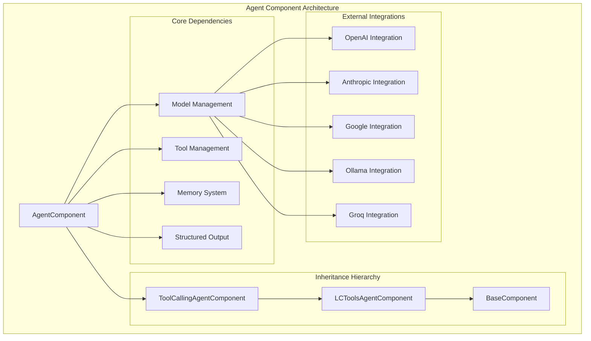
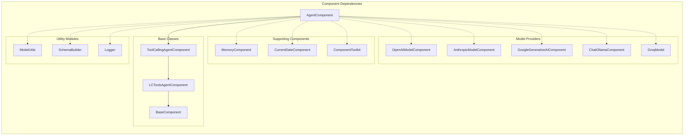
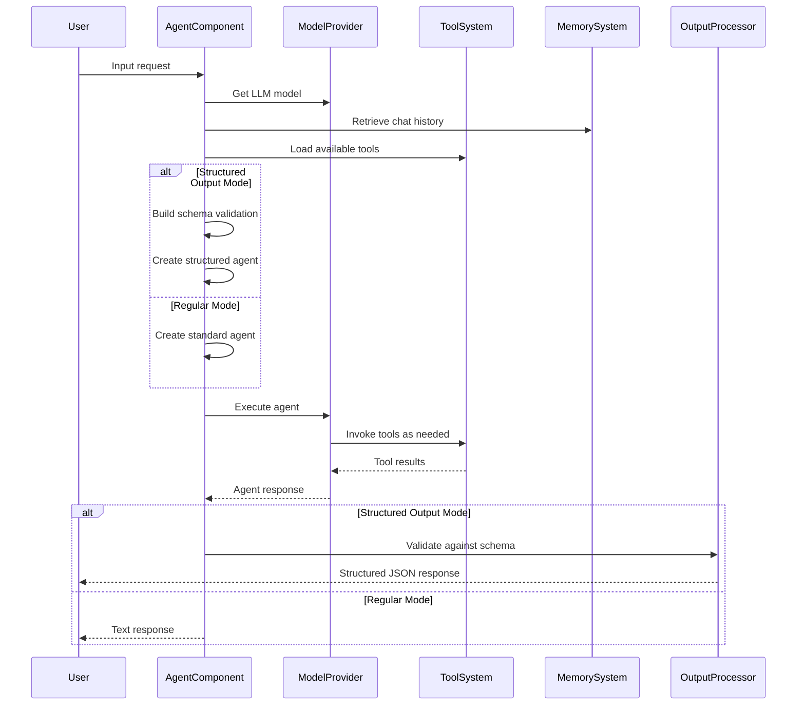
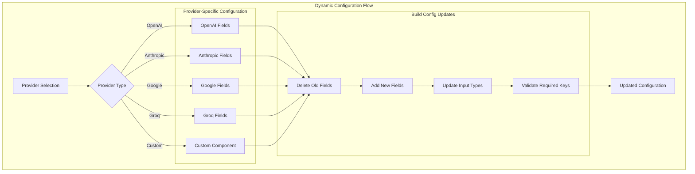

# Agent Component Module Documentation

## Introduction

The agent_component module provides the core implementation for AI agents in the Langflow system. It enables the creation of intelligent agents that can use tools, process natural language, and generate structured outputs. The module serves as a bridge between language models, tools, and the broader component ecosystem, offering a flexible framework for building conversational AI applications.

## Core Architecture

### AgentComponent Class

The `AgentComponent` class is the central component of this module, inheriting from `ToolCallingAgentComponent`. It provides a comprehensive agent implementation with the following key capabilities:

- **Multi-provider LLM Support**: Integration with OpenAI, Anthropic, Google Generative AI, Groq, and custom language models
- **Tool Integration**: Dynamic tool loading and execution capabilities
- **Memory Management**: Chat history retrieval and context management
- **Structured Output**: JSON schema validation and structured response generation
- **Real-time Configuration**: Dynamic build configuration updates based on provider selection

### Key Features

1. **Flexible Model Provider Selection**: Supports multiple LLM providers with dynamic field updates
2. **System Prompt Customization**: Configurable agent instructions and behavior guidelines
3. **Output Schema Validation**: Optional structured output with Pydantic model validation
4. **Tool Integration**: Automatic tool discovery and execution with component toolkit
5. **Memory Integration**: Chat history management with configurable message limits
6. **Current Date Tool**: Optional built-in tool for temporal context

## Architecture Diagram



## Component Relationships



## Data Flow Architecture



## Configuration Management



## Key Methods and Functionality

### Core Agent Methods

#### `get_agent_requirements()`
- **Purpose**: Prepares all necessary components for agent execution
- **Responsibilities**:
  - Retrieves and validates the language model
  - Fetches chat history from memory system
  - Loads and configures available tools
  - Optionally adds current date tool
- **Returns**: Tuple of (llm_model, chat_history, tools)

#### `message_response()`
- **Purpose**: Main method for generating text responses
- **Process**:
  1. Calls `get_agent_requirements()` to prepare components
  2. Sets up agent configuration
  3. Creates and executes agent runnable
  4. Handles various exception types
  5. Returns formatted message response
- **Error Handling**: Comprehensive exception handling with logging

#### `json_response()`
- **Purpose**: Generates structured JSON output with schema validation
- **Special Features**:
  - Creates specialized structured chat agent
  - Combines system prompt, format instructions, and schema information
  - Validates output against user-defined schema
  - Returns structured Data object
- **Fallback**: Falls back to regular agent if structured mode fails

### Configuration Management Methods

#### `update_build_config()`
- **Purpose**: Dynamically updates component configuration based on provider selection
- **Key Features**:
  - Provider-specific field management
  - Real-time configuration updates
  - Input type validation and updates
  - Required field validation
- **Process**: Deletes old provider fields → Adds new provider fields → Updates types → Validates

#### `get_llm()`
- **Purpose**: Retrieves and configures the appropriate language model
- **Process**:
  1. Validates provider selection
  2. Retrieves provider configuration from MODEL_PROVIDERS_DICT
  3. Builds model with appropriate parameters
  4. Handles configuration errors
- **Returns**: Tuple of (configured_model, display_name)

### Output Processing Methods

#### `build_structured_output_base()`
- **Purpose**: Processes and validates structured output against schema
- **Features**:
  - JSON extraction from text content
  - Pydantic model validation
  - Multiple object handling
  - Error reporting for validation failures
- **Returns**: Validated structured data or error information

#### `_preprocess_schema()`
- **Purpose**: Prepares schema for model building
- **Process**: Ensures correct data types and formats for field definitions
- **Returns**: Processed schema ready for BaseModel creation

## Integration Points

### Model Provider Integration
The AgentComponent integrates with multiple LLM providers through a unified interface:

- **OpenAI**: GPT models with tool calling capabilities
- **Anthropic**: Claude models with function calling
- **Google Generative AI**: Gemini models with tool support
- **Groq**: High-performance inference with various models
- **Ollama**: Local model deployment support
- **Custom**: User-defined language models

### Tool System Integration
- **Component Toolkit**: Automatic tool discovery and wrapping
- **Dynamic Tool Loading**: Tools loaded based on graph connections
- **Tool Metadata**: Support for tool descriptions and parameters
- **Callback Integration**: LangChain callback support for tool execution

### Memory System Integration
- **Chat History**: Configurable message retrieval (default: 100 messages)
- **Session Management**: Session-based memory organization
- **Message Filtering**: Prevents message duplication in conversations
- **Memory Component**: Reusable memory management component

## Error Handling and Logging

### Exception Management
The AgentComponent implements comprehensive error handling:

- **ValueError**: Handles invalid configurations and missing requirements
- **TypeError**: Manages type-related issues in model building
- **ValidationError**: Pydantic validation errors for structured output
- **ExceptionWithMessageError**: Custom exception for agent-specific errors
- **Generic Exception**: Logs unexpected errors while allowing propagation

### Logging Strategy
- **Async Logging**: Uses async logger for non-blocking log operations
- **Error Context**: Includes detailed error information and stack traces
- **Provider-Specific Logging**: Logs model initialization and configuration issues
- **Validation Logging**: Records schema validation failures

## Performance Considerations

### Optimization Strategies
1. **Lazy Loading**: Components loaded only when needed
2. **Caching**: Model instances cached to avoid re-initialization
3. **Async Operations**: Non-blocking I/O for better concurrency
4. **Schema Preprocessing**: Schema validation optimized for repeated use

### Resource Management
- **Model Lifecycle**: Proper model initialization and cleanup
- **Memory Management**: Configurable chat history limits
- **Tool Resource Cleanup**: Proper disposal of tool resources
- **Error Recovery**: Graceful degradation on component failures

## Security Considerations

### Input Validation
- **Schema Validation**: Structured output validated against defined schemas
- **Type Checking**: Comprehensive type validation for all inputs
- **Provider Validation**: Model provider selection validated against known providers
- **Tool Validation**: Tool inputs and outputs validated

### Data Protection
- **No Persistent Storage**: Agent doesn't store sensitive data permanently
- **Session Isolation**: Chat history isolated by session ID
- **Tool Access Control**: Tools accessed through controlled interfaces
- **Error Sanitization**: Sensitive information not exposed in error messages

## Usage Examples

### Basic Agent Configuration
```python
# Agent with OpenAI model
agent = AgentComponent()
agent.set(
    agent_llm="OpenAI",
    system_prompt="You are a helpful assistant",
    tools=[calculator_tool, search_tool]
)
```

### Structured Output Configuration
```python
# Agent with schema validation
agent = AgentComponent()
agent.set(
    output_schema=[
        {"name": "answer", "type": "str", "description": "The answer"},
        {"name": "confidence", "type": "float", "description": "Confidence score"}
    ],
    format_instructions="Extract answer and confidence"
)
```

### Custom Model Integration
```python
# Agent with custom language model
agent = AgentComponent()
agent.set(
    agent_llm="Custom",
    # Custom model passed as input
)
```

## Related Documentation

- [Base Agents Module](base_agents.md) - Core agent functionality and interfaces
- [LLM Models Module](llm_models.md) - Language model integrations
- [Component System](component_system.md) - Base component architecture
- [Memory System](memory.md) - Chat memory and session management
- [Tools Module](tools.md) - Tool integration and execution
- [Graph System](graph_system.md) - Vertex and graph management

## Future Enhancements

### Planned Features
1. **Enhanced Tool Discovery**: Automatic tool detection and categorization
2. **Multi-modal Support**: Integration with vision and audio models
3. **Advanced Memory**: Long-term memory and knowledge base integration
4. **Streaming Support**: Real-time response streaming
5. **Agent Orchestration**: Multi-agent conversation support

### Performance Improvements
1. **Model Pooling**: Shared model instances across components
2. **Caching Layer**: Response caching for common queries
3. **Parallel Tool Execution**: Concurrent tool execution support
4. **Optimized Schema Validation**: Faster JSON schema processing

This documentation provides a comprehensive overview of the agent_component module, its architecture, and its role within the broader Langflow system. The module serves as a critical bridge between users, language models, and tools, enabling sophisticated AI agent capabilities with robust error handling and flexible configuration options.