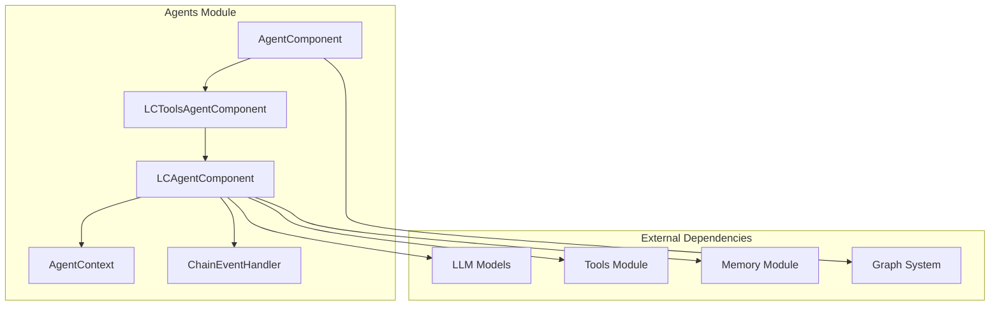
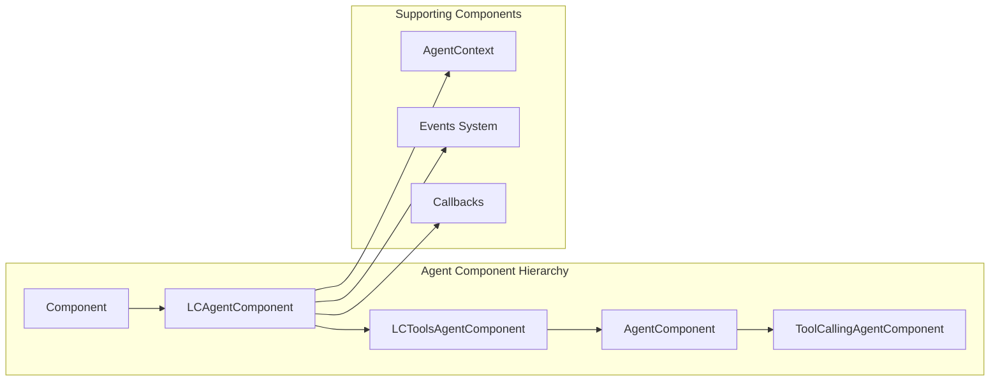
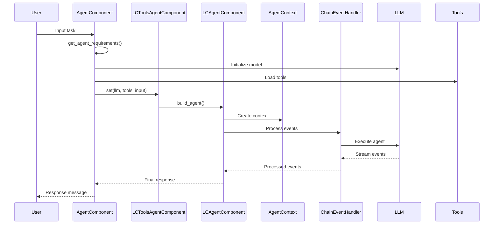
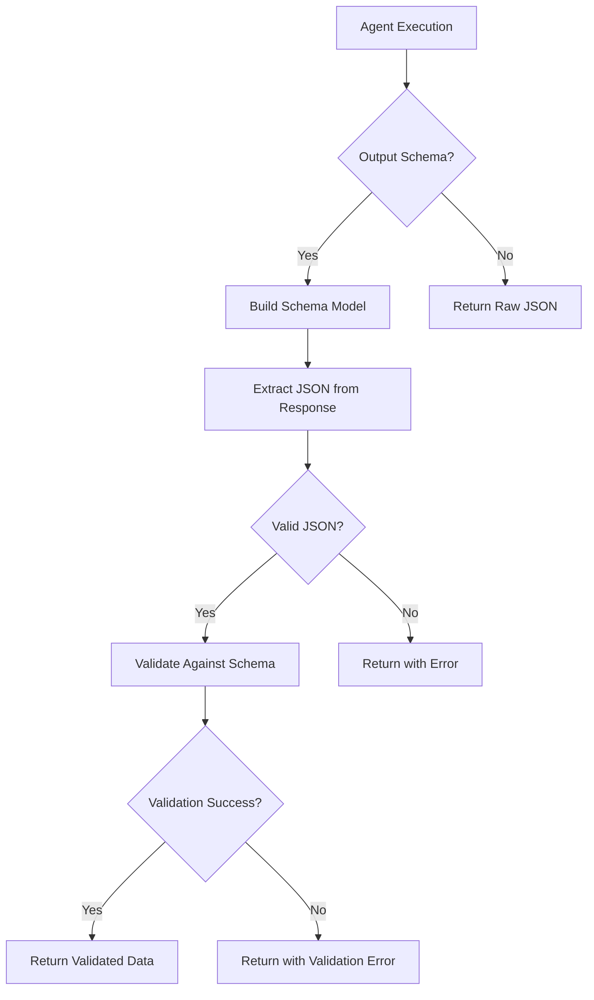

# Agents Module Documentation

## Overview

The agents module is a core component of the Langflow system that provides intelligent agent capabilities for conversational AI and task automation. This module implements a flexible agent framework that supports multiple language model providers, tool integration, structured output generation, and comprehensive event handling.

## Purpose

The agents module serves as the primary interface for creating and managing AI agents that can:
- Process natural language inputs and generate intelligent responses
- Integrate with various tools and external services
- Maintain conversation context and memory
- Generate structured outputs with schema validation
- Handle complex multi-step reasoning tasks
- Support multiple LLM providers (OpenAI, Anthropic, Google, Groq, Ollama)

## Architecture

### High-Level Architecture

### Component Relationships

## Core Components

### 1. AgentComponent
The main agent implementation that provides a complete agent with LLM integration, tool support, and structured output capabilities. This is the primary component users interact with when creating agents.

**Key Features:**
- Multi-provider LLM support (OpenAI, Anthropic, Google, Groq, Ollama)
- Tool integration and management
- Structured output generation with schema validation
- Memory and chat history management
- Real-time build configuration updates

**Detailed Documentation:** [AgentComponent Documentation](agent_component.md)

### 2. LCToolsAgentComponent
Base component for LangChain-compatible agents with tool support. Provides the foundation for building agents that can use tools and maintain conversation context.

**Key Features:**
- LangChain agent executor integration
- Tool validation and management
- Agent runnable creation
- Error handling and parsing

**Detailed Documentation:** [Base Agents Documentation](base_agents.md)

**File:** `src/lfx/src/lfx/base/agents/agent.py`

### 3. LCAgentComponent
Abstract base class for all LangChain-based agents. Defines the core interface and common functionality for agent components.

**Key Features:**
- Agent execution lifecycle
- Input validation and processing
- Chat history integration
- Event processing and callbacks

**Detailed Documentation:** [Base Agents Documentation](base_agents.md)

**File:** `src/lfx/src/lfx/base/agents/agent.py`

### 4. AgentContext
Manages the context and state for agent operations, including tool information, LLM state, and conversation history.

**Key Features:**
- Context serialization and management
- Tool and LLM state tracking
- Conversation history maintenance
- Data representation conversion

**Detailed Documentation:** [Base Agents Documentation](base_agents.md)

**File:** `src/lfx/src/lfx/base/agents/context.py`

### 5. ChainEventHandler
Handles agent events during execution, including tool usage, chain events, and streaming responses.

**Key Features:**
- Event processing for agent lifecycle
- Tool start/end/error handling
- Chain streaming support
- Message content management

**Detailed Documentation:** [Base Agents Documentation](base_agents.md)

**File:** `src/lfx/src/lfx/base/agents/events.py`

## Data Flow

### Agent Execution Flow

### Structured Output Flow

## Integration Points

### LLM Models Integration
The agents module integrates with various LLM providers through the [llm_models module](llm_models.md):
- OpenAI GPT models
- Anthropic Claude models
- Google Generative AI
- Groq models
- Ollama local models

### Tools Integration
Agents can utilize tools from the [tools module](tools.md):
- Python REPL for code execution
- Calculator for mathematical operations
- Google Search API
- Custom component tools

### Memory Integration
Conversation history and memory management through the [memory module](memory.md):
- Chat history retrieval
- Message filtering
- Session management

### Graph System Integration
Integration with the [graph_system](graph_system.md) for workflow execution:
- Vertex and edge management
- Session handling
- Component connectivity

## Configuration

### AgentComponent Inputs
- `agent_llm`: Model provider selection
- `system_prompt`: Agent instructions
- `tools`: List of available tools
- `output_schema`: Structured output validation
- `n_messages`: Chat history length
- `max_iterations`: Agent execution limits

### Build Configuration
The AgentComponent supports dynamic build configuration updates based on the selected LLM provider, automatically adjusting available inputs and options.

## Error Handling

The agents module implements comprehensive error handling:
- **ExceptionWithMessageError**: Custom exception for agent failures with message context
- **ValidationError**: Schema validation failures
- **Tool Validation**: Tool name and input validation
- **LLM Error Handling**: Provider-specific error management

## Best Practices

1. **Tool Naming**: Use only alphanumeric characters, underscores, and dashes
2. **Schema Design**: Define clear output schemas for structured responses
3. **Memory Management**: Configure appropriate chat history lengths
4. **Error Handling**: Implement proper error handling for production use
5. **Provider Selection**: Choose appropriate LLM providers based on task requirements

## Related Documentation

- [LLM Models Module](llm_models.md) - Language model integrations
- [Tools Module](tools.md) - Available tools and utilities
- [Memory Module](memory.md) - Conversation and context management
- [Graph System](graph_system.md) - Workflow and component management
- [Component System](component_system.md) - Base component framework