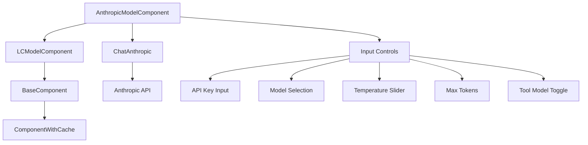
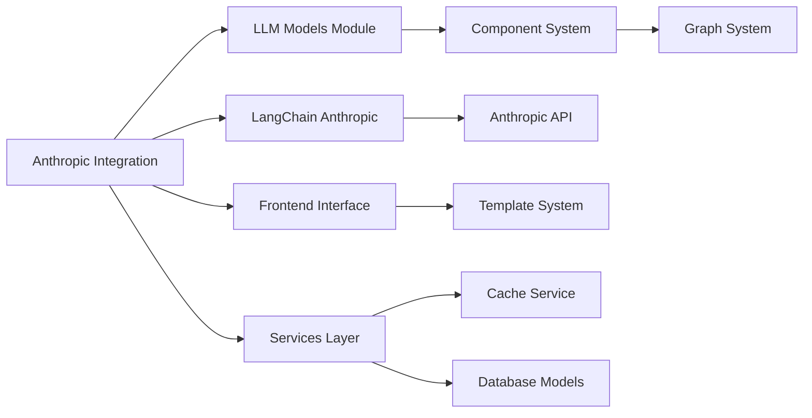
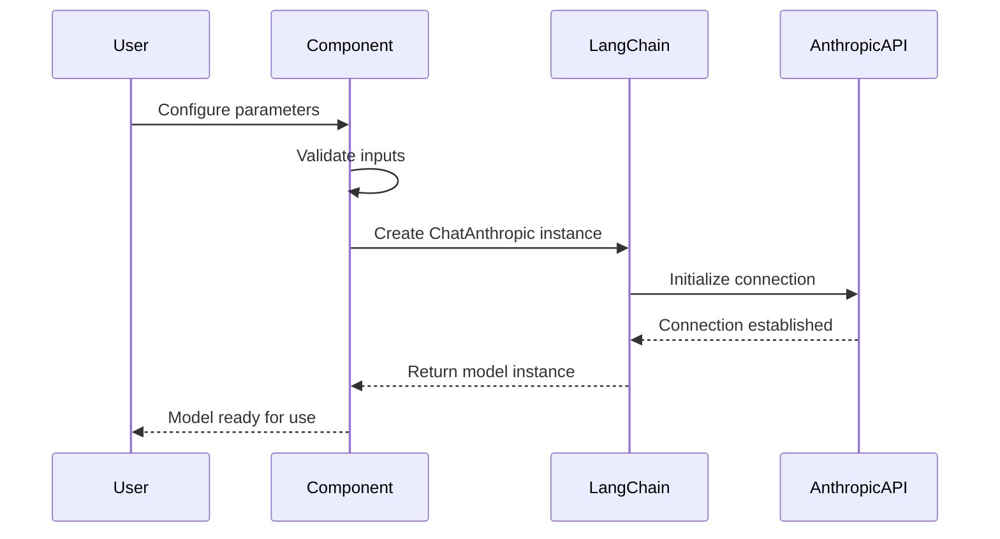
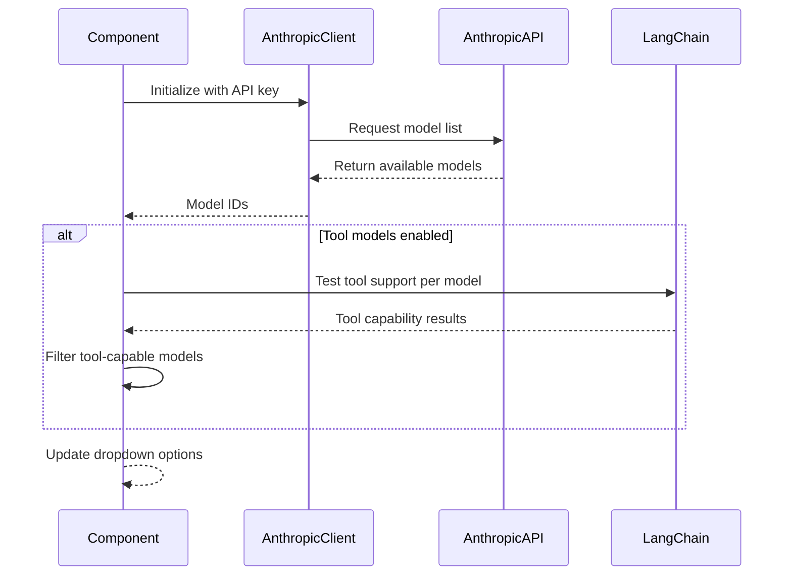

# Anthropic Integration Module

## Introduction

The Anthropic Integration module provides seamless integration with Anthropic's Claude language models through LangChain. This module enables Langflow users to leverage Anthropic's state-of-the-art language models for text generation, conversation, and tool-calling capabilities within their workflows.

## Core Functionality

The module is built around the `AnthropicModelComponent` class, which serves as a comprehensive interface to Anthropic's Messages API. It provides:

- **Model Selection**: Dynamic model discovery and selection from available Anthropic models
- **Authentication**: Secure API key management for Anthropic services
- **Parameter Control**: Fine-grained control over model parameters (temperature, max tokens)
- **Tool Support**: Intelligent filtering of models based on tool-calling capabilities
- **Streaming**: Real-time response streaming for enhanced user experience
- **Error Handling**: Comprehensive error handling with meaningful user feedback

## Architecture

### Component Hierarchy



### System Integration



## Component Details

### AnthropicModelComponent

The primary component that encapsulates all Anthropic model functionality:

**Key Features:**
- **Dynamic Model Discovery**: Automatically fetches available models from Anthropic API
- **Tool-Aware Filtering**: Intelligently filters models based on tool-calling support
- **Real-time Configuration**: Updates model options based on user selections
- **Error Recovery**: Graceful fallback to default models when API calls fail

**Input Configuration:**
```python
inputs = [
    # Base model inputs (inherited from LCModelComponent)
    max_tokens,           # Token limit control
    model_name,           # Model selection dropdown
    api_key,              # Secure API key input
    temperature,          # Response randomness control
    base_url,             # Custom API endpoint
    tool_model_enabled,   # Tool support toggle
]
```

## Data Flow

### Model Building Process



### Model Discovery Flow



## Dependencies

### Internal Dependencies

The module relies on several core Langflow systems:

- **[Component System](component_system.md)**: Inherits from `LCModelComponent` and `BaseComponent`
- **[Graph System](graph_system.md)**: Integrates with vertex-based workflow execution
- **[Services Layer](services.md)**: Utilizes caching and service management
- **[Schema Types](schema_types.md)**: Handles content blocks and data types

### External Dependencies

- **langchain-anthropic**: Core LangChain integration for Anthropic models
- **anthropic**: Official Anthropic Python client library
- **requests**: HTTP client for API communications
- **pydantic**: Data validation and serialization

## Configuration Options

### Model Parameters

| Parameter | Type | Default | Description |
|-----------|------|---------|-------------|
| `model_name` | string | "claude-3-haiku-20240307" | Selected Anthropic model |
| `max_tokens` | integer | 4096 | Maximum tokens to generate |
| `temperature` | float | 0.1 | Response randomness (0.0-1.0) |
| `api_key` | string | required | Anthropic API authentication |
| `base_url` | string | "https://api.anthropic.com" | Custom API endpoint |
| `tool_model_enabled` | boolean | false | Filter for tool-capable models |

### Advanced Features

**Dynamic Model Updates:**
- Real-time model list refresh based on API availability
- Tool capability detection and filtering
- Custom API endpoint support for enterprise deployments

**Error Handling:**
- Graceful degradation when API calls fail
- Meaningful error messages for common issues
- Automatic fallback to default model list

## Integration Patterns

### Workflow Integration

The component integrates seamlessly into Langflow workflows:

1. **Standalone Usage**: Direct text generation and conversation
2. **Agent Integration**: As part of tool-using agents
3. **Chain Composition**: Combined with other processing components
4. **Memory Integration**: Stateful conversations with memory components

### Frontend Integration

- **Template System**: Uses `FrontendNode` for UI generation
- **Real-time Updates**: Dynamic field updates based on user input
- **Validation**: Client-side validation of API keys and parameters
- **Responsive UI**: Adaptive interface for different screen sizes

## Best Practices

### API Key Management
- Store API keys securely using environment variables
- Use the built-in secret input field for key entry
- Rotate keys regularly for security

### Model Selection
- Choose models based on specific use case requirements
- Consider token limits and pricing for large-scale applications
- Test tool capabilities before deploying agent workflows

### Performance Optimization
- Enable streaming for better user experience
- Set appropriate max_tokens to control costs
- Use caching for repeated model calls

## Error Handling

### Common Issues

**API Connection Errors:**
- Invalid API keys
- Network connectivity issues
- Rate limiting from Anthropic

**Model Availability:**
- Model deprecation
- Regional availability restrictions
- Tool capability mismatches

**Validation Errors:**
- Invalid parameter combinations
- Out-of-range values
- Missing required fields

### Error Recovery

The component implements comprehensive error handling:
- Automatic fallback to default models
- Clear error messages for debugging
- Graceful degradation of functionality

## Security Considerations

- API keys are handled securely through secret input fields
- No logging of sensitive authentication data
- Support for custom API endpoints in enterprise environments
- Validation of all user inputs before API calls

## Future Enhancements

Potential improvements to the module:
- Support for Anthropic's latest model features
- Enhanced tool-calling capabilities
- Batch processing for multiple requests
- Advanced parameter tuning options
- Integration with Anthropic's safety features

## Related Documentation

- [LLM Models Module](llm_models.md) - Overview of all LLM integrations
- [Component System](component_system.md) - Base component architecture
- [Graph System](graph_system.md) - Workflow execution framework
- [Services Layer](services.md) - System services and caching