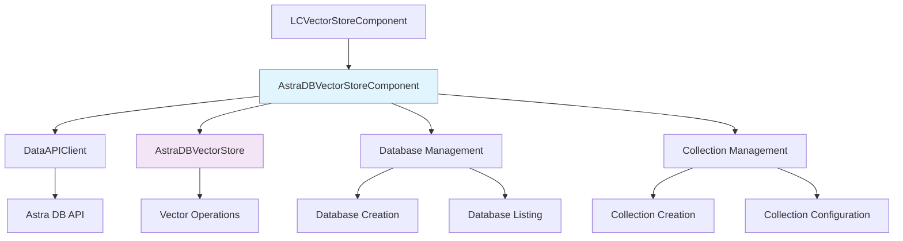
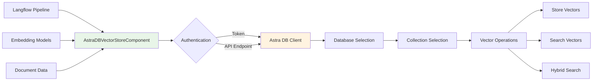
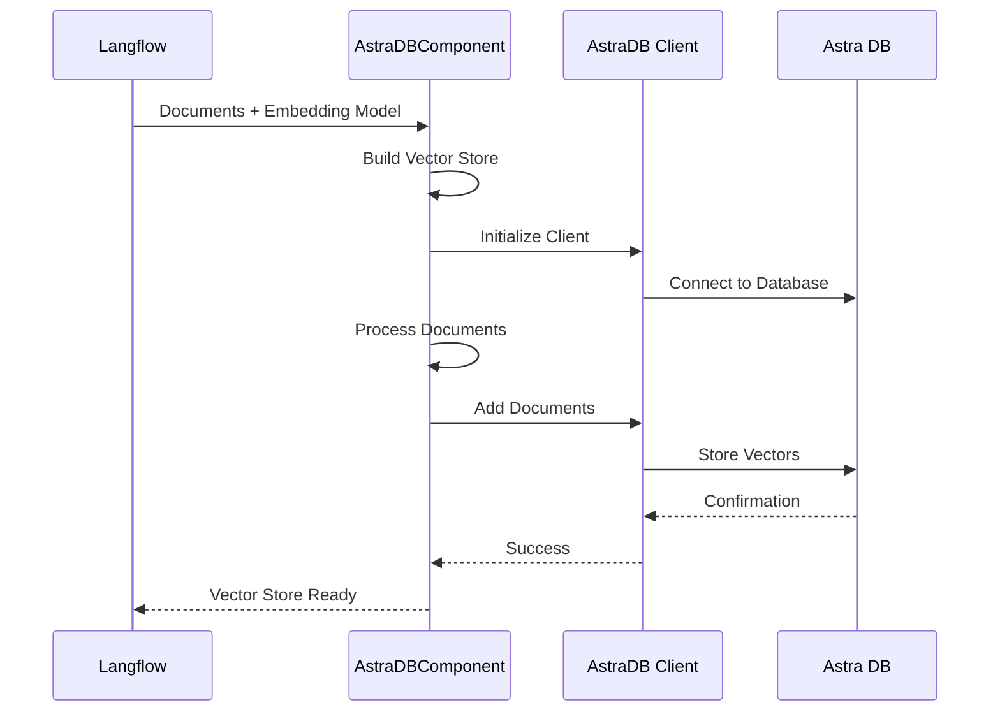
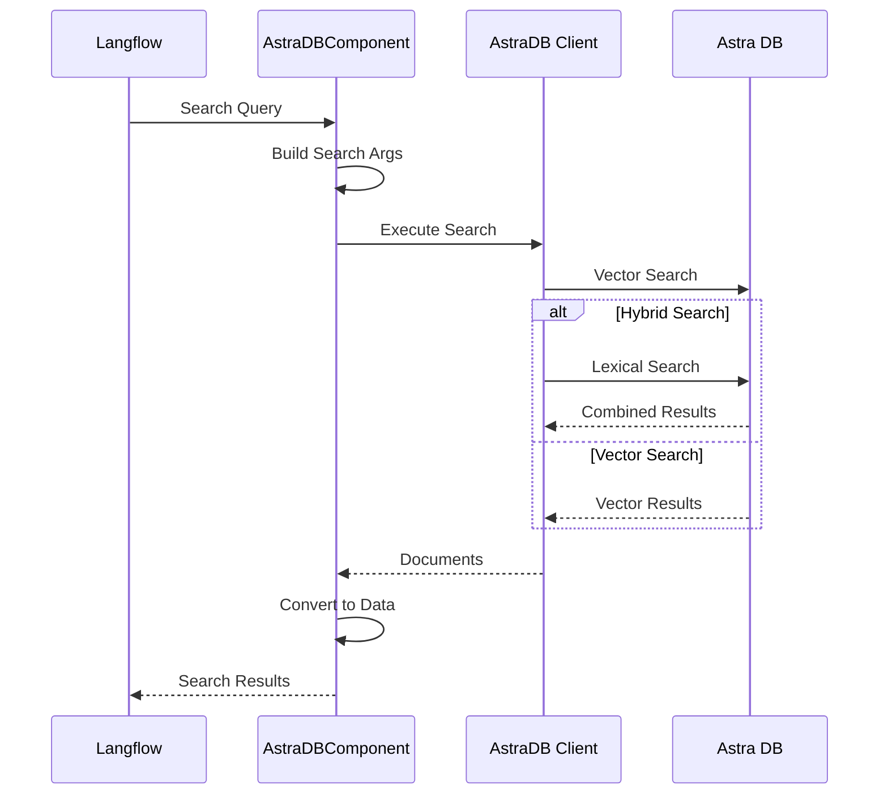

# AstraDB Vector Store Module

## Introduction

The AstraDB Vector Store module provides a comprehensive integration with DataStax Astra DB for vector storage and similarity search operations. This module enables Langflow users to leverage Astra DB's managed vector database capabilities for storing, indexing, and retrieving vector embeddings with support for both pure vector search and hybrid search (combining vector and lexical search).

## Core Purpose

The AstraDB Vector Store component serves as a bridge between Langflow's data processing pipeline and Astra DB's vector storage infrastructure, providing:

- **Vector Storage**: Store and manage vector embeddings in Astra DB collections
- **Similarity Search**: Perform vector similarity searches with configurable search methods
- **Hybrid Search**: Combine vector and lexical search for enhanced retrieval accuracy
- **Database Management**: Create and manage Astra DB databases and collections
- **Embedding Integration**: Support for both built-in and external embedding models

## Architecture

### Component Hierarchy



### Integration Architecture



## Core Components

### AstraDBVectorStoreComponent

The main component that extends `LCVectorStoreComponent` to provide Astra DB-specific functionality:

```python
class AstraDBVectorStoreComponent(LCVectorStoreComponent):
    """Astra DB Vector Store integration for Langflow."""
    
    display_name: str = "Astra DB"
    description: str = "Ingest and search documents in Astra DB"
    name = "AstraDB"
    icon: str = "AstraDB"
```

#### Key Features:

- **Authentication Management**: Token-based authentication with Astra DB
- **Database Operations**: Create, list, and manage Astra DB databases
- **Collection Management**: Create and configure vector collections
- **Vector Operations**: Store, search, and retrieve vectors
- **Hybrid Search**: Support for combined vector and lexical search
- **Real-time Configuration**: Dynamic UI updates based on user selections

## Data Flow

### Vector Storage Flow



### Search Flow



## Configuration Options

### Authentication
- **Token**: Astra DB Application Token for authentication
- **Environment**: API environment (prod, test, dev)
- **API Endpoint**: Direct API endpoint (optional, supersedes database selection)

### Database Configuration
- **Database Name**: Target database selection with real-time refresh
- **Keyspace**: Optional keyspace within the database
- **Cloud Provider**: Cloud provider selection for new databases
- **Region**: Geographic region selection

### Collection Configuration
- **Collection Name**: Target collection for vector storage
- **Embedding Provider**: Built-in embedding generation service
- **Embedding Model**: Model selection for vector generation
- **Dimensions**: Vector dimension configuration

### Search Configuration
- **Search Method**: Vector Search or Hybrid Search
- **Search Type**: Similarity, Similarity with threshold, or MMR
- **Number of Results**: Result count configuration
- **Score Threshold**: Minimum similarity threshold
- **Reranker**: Post-retrieval reranking service
- **Lexical Terms**: Additional search keywords

## Advanced Features

### Hybrid Search

The component supports hybrid search combining vector similarity with lexical search:

```python
# Hybrid search configuration
hybrid_search_mode = HybridSearchMode.DEFAULT if self.search_method == "Hybrid Search" else HybridSearchMode.OFF

vector_store = AstraDBVectorStore(
    hybrid_search=hybrid_search_mode,
    # ... other parameters
)
```

### Collection Auto-detection

Automatic detection of collection properties and configuration:

```python
autodetect_params = {
    "autodetect_collection": autodetect,
    "content_field": self.content_field,
    "ignore_invalid_documents": self.ignore_invalid_documents,
}
```

### Document Management

Support for document deletion based on metadata fields:

```python
if documents and self.deletion_field:
    delete_values = list({doc.metadata[self.deletion_field] for doc in documents})
    collection.delete_many({f"metadata.{self.deletion_field}": {"$in": delete_values}})
```

## Dependencies

### External Dependencies
- **astrapy**: Astra DB Python client library
- **langchain-astradb**: LangChain integration for Astra DB
- **langchain-core**: Core LangChain functionality

### Internal Dependencies
- **[base_vectorstore](base_vectorstore.md)**: Base vector store functionality
- **[component_system](component_system.md)**: Component framework
- **[schema_types](schema_types.md)**: Data schema definitions
- **[io_components](io_components.md)**: Input/output handling

## Error Handling

The component implements comprehensive error handling for:

- **Authentication Errors**: Invalid tokens or connection issues
- **Database Errors**: Database creation and connection failures
- **Collection Errors**: Collection creation and configuration issues
- **Vector Store Errors**: Document storage and retrieval failures
- **Search Errors**: Query execution and result processing issues

## Performance Considerations

### Caching
- Vector store instances are cached to avoid repeated initialization
- Database and collection metadata are cached for performance

### Batch Operations
- Documents are processed in batches for efficient storage
- Search operations support pagination and result limiting

### Connection Management
- Database connections are reused across operations
- Client instances are maintained for the component lifecycle

## Security

### Authentication
- Token-based authentication with Astra DB
- Secure token storage and handling
- Environment-specific API endpoints

### Data Protection
- Metadata filtering for access control
- Document-level security through metadata
- Secure connection to Astra DB services

## Integration Examples

### Basic Vector Storage
```python
# Configure Astra DB component
component = AstraDBVectorStoreComponent(
    token="your-astra-token",
    database_name="my-database",
    collection_name="my-collection",
    embedding_model=embedding_component
)

# Store documents
vector_store = component.build_vector_store()
```

### Hybrid Search Configuration
```python
# Configure hybrid search
component.search_method = "Hybrid Search"
component.reranker = "nvidia/nv-rerank-qa-mistral-4b:1"
component.lexical_terms = "additional keywords"

# Perform search
results = component.search_documents()
```

### Database and Collection Creation
```python
# Create new database
await component.create_database_api(
    new_database_name="new-db",
    cloud_provider="Amazon Web Services",
    region="us-east-2",
    token=token
)

# Create new collection
await component.create_collection_api(
    new_collection_name="new-collection",
    embedding_generation_provider="NVIDIA",
    embedding_generation_model="nv-embed-qa-4",
    dimension=1024
)
```

## Related Documentation

- [Base Vector Store](base_vectorstore.md) - Core vector store functionality
- [Component System](component_system.md) - Component framework and lifecycle
- [Embedding Models](embeddings.md) - Embedding model integrations
- [Graph System](graph_system.md) - Graph execution and data flow
- [Schema Types](schema_types.md) - Data schema and type definitions