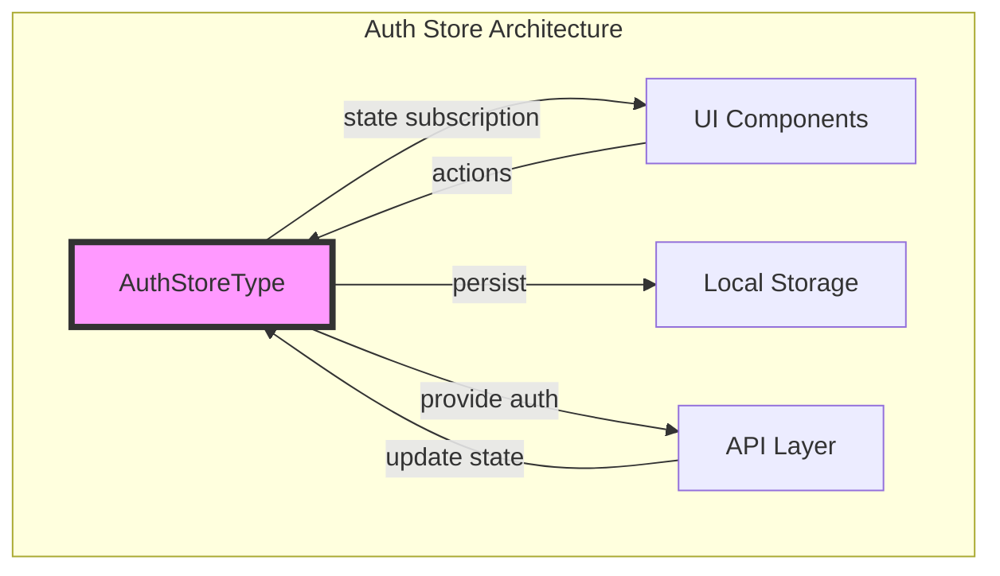
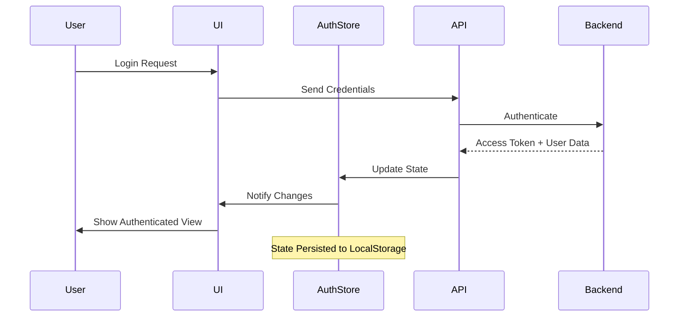
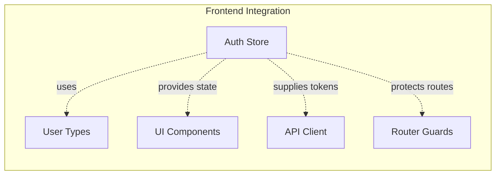

# Auth Store Module Documentation

## Introduction

The auth_store module provides centralized authentication state management for the Langflow frontend application. Built on top of Zustand state management library, this module handles user authentication, authorization, and session management across the frontend application. It serves as the single source of truth for authentication-related data and provides reactive state updates to all components that depend on authentication status.

## Architecture Overview

The auth_store module implements a centralized authentication state management pattern using Zustand, a lightweight state management solution for React applications. The architecture follows a unidirectional data flow pattern where authentication state is managed centrally and distributed to consuming components through reactive subscriptions.



## Core Components

### AuthStoreType Interface

The `AuthStoreType` interface defines the complete authentication state structure and associated actions. This interface serves as the contract for all authentication-related operations within the frontend application.

**Key Properties:**
- `isAdmin`: Boolean flag indicating administrative privileges
- `isAuthenticated`: Boolean flag indicating current authentication status
- `accessToken`: JWT or session token for API authentication
- `userData`: Complete user profile information
- `autoLogin`: Flag for automatic login functionality
- `apiKey`: API key for programmatic access
- `authenticationErrorCount`: Counter for tracking authentication failures

**Key Methods:**
- `setIsAdmin()`: Updates administrative status
- `setIsAuthenticated()`: Updates authentication status
- `setAccessToken()`: Updates access token
- `setUserData()`: Updates user profile data
- `setAutoLogin()`: Configures auto-login behavior
- `setApiKey()`: Updates API key
- `setAuthenticationErrorCount()`: Updates error tracking
- `logout()`: Performs complete logout operation

## Data Flow Architecture



## Component Dependencies

The auth_store module integrates with several other system components:

### Frontend Dependencies
- **User Types**: References the `Users` type from the frontend API types for user data structure
- **UI Components**: Provides authentication state to all components requiring user context
- **API Layer**: Supplies authentication tokens for API requests

### Integration Points


## State Management Pattern

The auth_store implements a predictable state management pattern with the following characteristics:

### State Immutability
All state updates are performed through dedicated setter methods, ensuring immutable state transitions and preventing direct state mutations.

### Reactive Updates
Components subscribing to the auth store receive automatic updates when authentication state changes, enabling reactive UI updates without manual refresh operations.

### Persistence Strategy
Authentication state is persisted to browser localStorage to maintain user sessions across page refreshes and browser restarts, with appropriate security considerations for sensitive data.

## Security Considerations

### Token Management
- Access tokens are stored in memory and localStorage with appropriate expiration handling
- Tokens are automatically included in API requests through the API client layer
- Token refresh mechanisms are handled at the API layer level

### Error Handling
- Authentication error tracking helps implement rate limiting and security measures
- Failed authentication attempts are logged and counted for security monitoring
- Error states are clearly communicated to users while maintaining security

### Session Management
- Logout operations perform complete state cleanup
- Session timeout handling is implemented at the application level
- Cross-tab session synchronization ensures consistent authentication state

## Usage Patterns

### Basic Authentication Flow
```typescript
// Authentication state access
const { isAuthenticated, userData, accessToken } = useAuthStore();

// Authentication actions
const { setIsAuthenticated, setUserData, setAccessToken } = useAuthStore();

// Login process
const handleLogin = async (credentials) => {
  const response = await api.login(credentials);
  setAccessToken(response.token);
  setUserData(response.user);
  setIsAuthenticated(true);
};
```

### Protected Route Implementation
```typescript
// Route protection based on authentication state
const ProtectedRoute = ({ children }) => {
  const { isAuthenticated } = useAuthStore();
  
  if (!isAuthenticated) {
    return <Navigate to="/login" />;
  }
  
  return children;
};
```

## Integration with System Architecture

The auth_store module serves as a foundational component in the Langflow frontend architecture, integrating with multiple system layers:

### API Integration
Provides authentication tokens to all API requests, ensuring secure communication with the backend services. The API layer automatically retrieves tokens from the auth store and includes them in request headers.

### Component System
Supplies authentication context to the component system, enabling components to render conditionally based on user permissions and authentication status.

### Router Integration
Works with the frontend routing system to implement protected routes, role-based access control, and automatic redirects based on authentication state.

## Error Handling and Recovery

### Authentication Failures
The module implements comprehensive error handling for authentication failures:
- Network errors during authentication requests
- Invalid credentials handling
- Token expiration and refresh failures
- Server-side authentication errors

### Recovery Mechanisms
- Automatic retry logic for transient failures
- Graceful degradation when authentication services are unavailable
- Clear user feedback for authentication issues
- Fallback to anonymous mode when authentication fails

## Performance Considerations

### State Optimization
The auth store is designed for optimal performance:
- Minimal state footprint to reduce memory usage
- Efficient subscription mechanisms to prevent unnecessary re-renders
- Selective state updates to minimize component updates

### Caching Strategy
- User data caching to reduce API calls
- Token validation caching to avoid redundant verification
- Permission caching for role-based access control

## Testing and Development

### Mock Implementation
The module supports mock implementations for development and testing:
- Mock authentication for development environments
- Test user fixtures for unit testing
- Simulated authentication flows for integration testing

### Development Tools
- State inspection tools for debugging authentication issues
- Time-travel debugging support through Zustand devtools
- Authentication state visualization for development

## Future Enhancements

### Planned Features
- Multi-factor authentication support
- OAuth provider integration
- Advanced session management
- Enhanced security monitoring
- Biometric authentication support

### Scalability Considerations
- Support for multiple authentication providers
- Distributed session management
- Advanced role-based access control
- Integration with enterprise identity providers

## Related Documentation

- [Frontend Core Module](frontend_core.md) - Understanding the broader frontend architecture
- [Database Models](database_models.md) - User model and authentication data structures
- [API Schemas](core_api.md) - API authentication and user management endpoints
- [Services](services.md) - Backend authentication services integration

## Conclusion

The auth_store module provides a robust, scalable foundation for authentication management in the Langflow frontend application. Its centralized state management approach ensures consistent authentication behavior across all components while maintaining security and performance standards. The module's design supports future enhancements and integration with advanced authentication mechanisms as the application evolves.