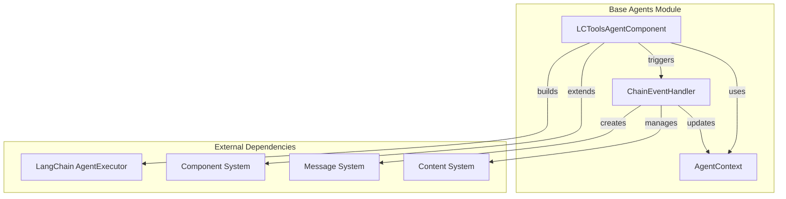
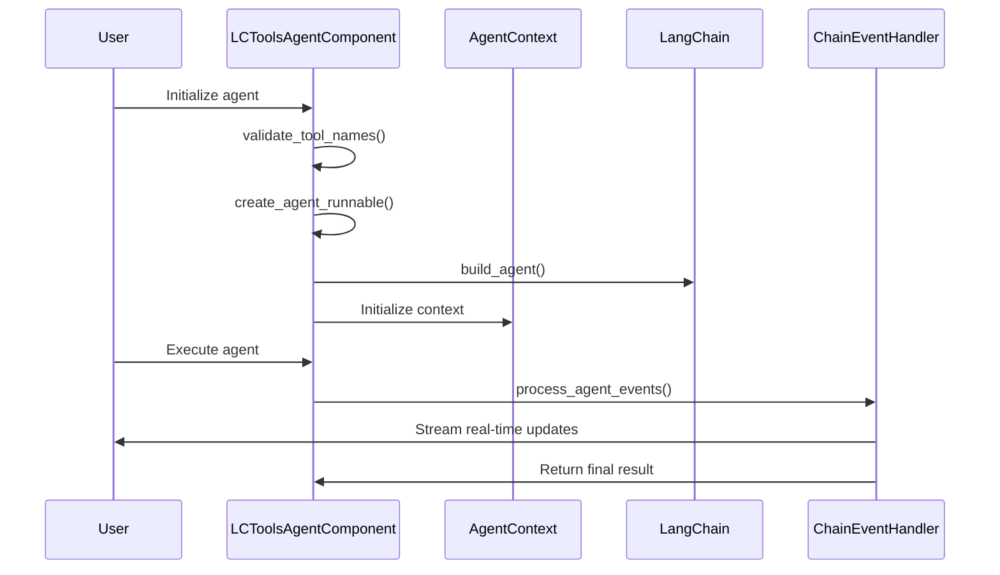
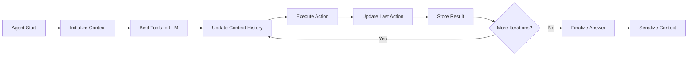
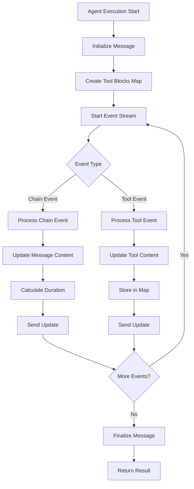
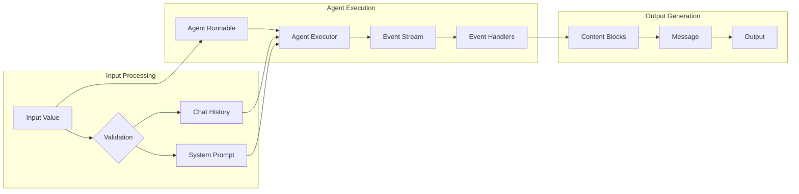
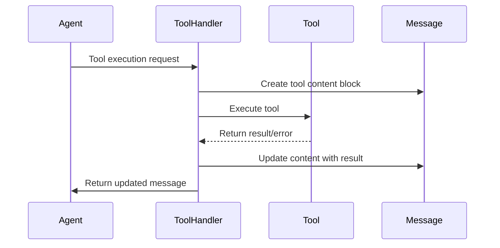

# Base Agents Module Documentation

## Introduction

The base_agents module provides the foundational framework for building AI agents within the Langflow system. It defines the core abstractions and infrastructure for creating language model-based agents that can interact with tools, process events, and maintain context throughout their execution lifecycle. This module serves as the backbone for all agent implementations in the system, offering a standardized approach to agent construction, execution, and event handling.

## Architecture Overview

The base_agents module is built around three core components that work together to provide a comprehensive agent framework:

### Core Components

1. **LCToolsAgentComponent** - The primary agent component that integrates with LangChain's agent framework
2. **AgentContext** - Manages agent state, context history, and execution metadata
3. **ChainEventHandler** - Processes and manages agent execution events in real-time

### Architecture Diagram



## Component Details

### LCToolsAgentComponent

The `LCToolsAgentComponent` is the central class that provides the foundation for creating tool-enabled AI agents. It extends the base `Component` class and integrates with LangChain's agent framework to provide a standardized interface for agent construction and execution.

#### Key Features

- **Tool Integration**: Automatically handles tool binding and validation
- **Agent Execution**: Manages the complete agent lifecycle from creation to execution
- **Error Handling**: Provides robust error handling with parsing error recovery
- **Event Streaming**: Supports real-time event processing and streaming
- **Context Management**: Integrates with AgentContext for state management

#### Input Configuration

```python
_base_inputs = [
    MessageInput(name="input_value", display_name="Input", tool_mode=True),
    BoolInput(name="handle_parsing_errors", display_name="Handle Parse Errors", value=True),
    BoolInput(name="verbose", display_name="Verbose", value=True),
    IntInput(name="max_iterations", display_name="Max Iterations", value=15),
    MultilineInput(name="agent_description", display_name="Agent Description"),
]
```

#### Agent Construction Flow



### AgentContext

The `AgentContext` class manages the state and context information for agent execution. It provides a structured way to track the agent's progress, maintain conversation history, and serialize context for persistence or debugging.

#### Context Structure

```python
class AgentContext(BaseModel):
    tools: dict[str, Any]              # Available tools
    llm: Any                          # Language model instance
    context: str = ""                 # Current context
    iteration: int = 0                # Current iteration
    max_iterations: int = 5           # Maximum iterations
    thought: str = ""                 # Agent's thought process
    last_action: Any = None           # Last action taken
    last_action_result: Any = None    # Result of last action
    final_answer: Any = ""            # Final answer
    context_history: list[tuple]      # Historical context
```

#### Context Management Flow



### ChainEventHandler

The `ChainEventHandler` provides a comprehensive event processing system that handles real-time agent execution events. It processes different types of events including chain start/end, tool execution, and streaming events.

#### Event Types and Handlers

| Event Type | Handler Function | Purpose |
|------------|------------------|---------|
| `on_chain_start` | `handle_on_chain_start` | Process agent input |
| `on_chain_end` | `handle_on_chain_end` | Handle agent completion |
| `on_chain_stream` | `handle_on_chain_stream` | Process streaming output |
| `on_tool_start` | `handle_on_tool_start` | Track tool execution start |
| `on_tool_end` | `handle_on_tool_end` | Record tool results |
| `on_tool_error` | `handle_on_tool_error` | Handle tool failures |

#### Event Processing Flow



## Integration with System Components

### Component System Integration

The base_agents module integrates deeply with the [component_system](component_system.md) to provide:

- **Base Component Extension**: LCToolsAgentComponent extends the base Component class
- **Tool Integration**: Uses ComponentToolkit for tool management
- **Input/Output Handling**: Leverages the component I/O system for configuration

### Graph System Integration

Integration with the [graph_system](graph_system.md) provides:

- **Vertex Execution**: Agents execute as vertices in the graph
- **Edge Data Flow**: Handles data flow between graph components
- **Session Management**: Maintains session context across graph execution

### Message System Integration

The module works with the message system to provide:

- **Real-time Updates**: Streams execution progress via messages
- **Content Management**: Uses ContentBlock and ContentTypes for structured output
- **Error Handling**: ExceptionWithMessageError for graceful error reporting

## Data Flow Architecture

### Agent Execution Data Flow



### Tool Execution Flow



## Configuration and Usage

### Basic Agent Configuration

```python
# Agent inputs are automatically configured through the base inputs
agent_inputs = {
    "input_value": "User input message",
    "handle_parsing_errors": True,
    "verbose": True,
    "max_iterations": 15,
    "tools": [tool1, tool2, ...]  # For LCToolsAgentComponent
}
```

### Tool Validation

The system automatically validates tool names to ensure they conform to the required pattern:
- Only letters, numbers, underscores, and dashes
- No spaces allowed
- Pattern: `^[a-zA-Z0-9_-]+$`

### Agent Execution Parameters

| Parameter | Type | Default | Description |
|-----------|------|---------|-------------|
| `handle_parsing_errors` | bool | True | Enable parsing error recovery |
| `verbose` | bool | True | Enable verbose logging |
| `max_iterations` | int | 15 | Maximum execution iterations |
| `agent_description` | str | See DEFAULT_TOOLS_DESCRIPTION | Agent description for tool mode |

## Error Handling

### ExceptionWithMessageError

The module provides a specialized exception type that maintains association with the agent message for proper cleanup and error reporting:

```python
class ExceptionWithMessageError(Exception):
    def __init__(self, agent_message: Message, message: str):
        self.agent_message = agent_message
        super().__init__(message)
```

### Error Recovery

The system implements multiple layers of error handling:

1. **Tool Validation**: Pre-execution validation of tool names
2. **Parsing Error Handling**: Automatic recovery from parsing errors
3. **Event Processing Errors**: Graceful handling of event stream errors
4. **Message Cleanup**: Proper cleanup of failed message states

## Performance Considerations

### Event Processing Optimization

- **Duration Calculation**: Uses `perf_counter()` for accurate timing
- **Content Streaming**: Efficient streaming of large content blocks
- **Memory Management**: Proper cleanup of temporary data structures

### Context Management

- **Serialization**: Efficient context serialization for persistence
- **History Management**: Maintains context history with timestamps
- **Memory Usage**: Optimized storage of context data

## Extension Points

### Custom Agent Implementation

To create a custom agent, extend `LCToolsAgentComponent` and implement:

```python
class MyCustomAgent(LCToolsAgentComponent):
    def create_agent_runnable(self) -> Runnable:
        # Implement custom agent creation logic
        pass
```

### Event Handler Customization

Custom event handlers can be added to the event processing system:

```python
# Add custom chain event handler
CHAIN_EVENT_HANDLERS["on_custom_event"] = my_custom_handler

# Add custom tool event handler  
TOOL_EVENT_HANDLERS["on_custom_tool_event"] = my_custom_tool_handler
```

## Related Documentation

- [Component System](component_system.md) - Base component framework
- [Graph System](graph_system.md) - Graph execution framework
- [LLM Models](llm_models.md) - Language model integrations
- [Tools](tools.md) - Tool system for agent capabilities
- [Memory](memory.md) - Memory management for agents
- [Schema Types](schema_types.md) - Data structures and types

## Summary

The base_agents module provides a robust foundation for building AI agents within the Langflow ecosystem. Through its three core components - LCToolsAgentComponent, AgentContext, and ChainEventHandler - it offers a comprehensive framework for agent construction, state management, and real-time event processing. The module's integration with the broader system components ensures seamless operation within the Langflow architecture while providing extensive customization and extension capabilities for developers.