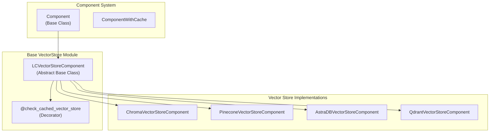
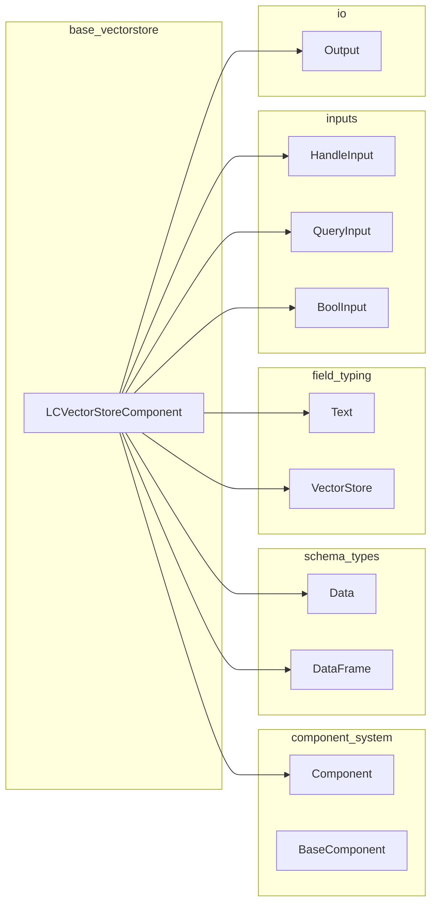
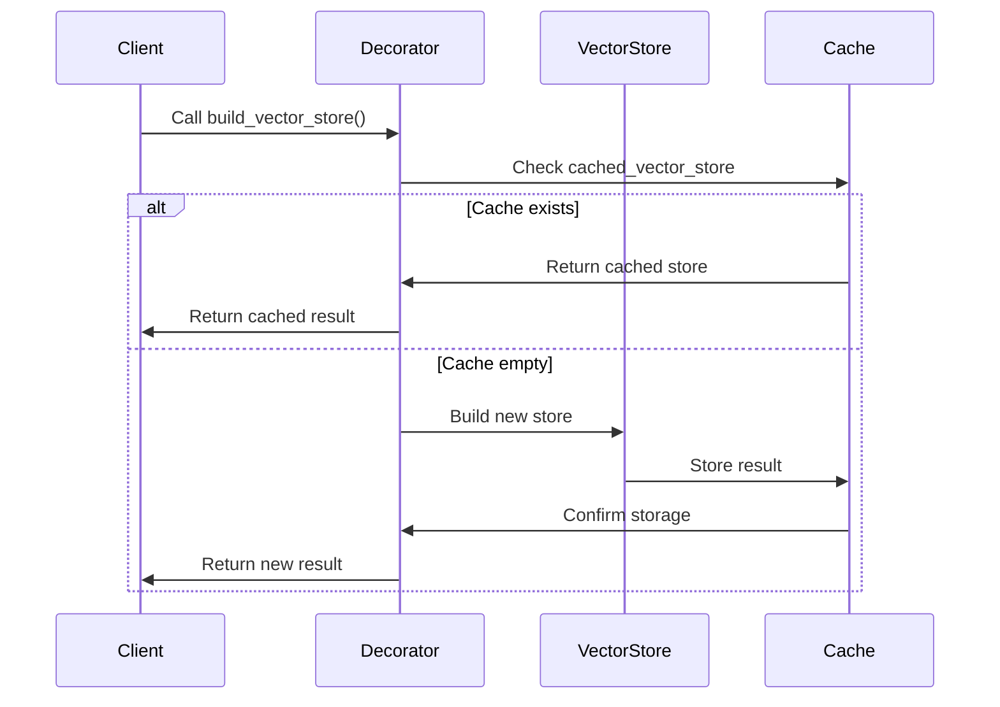
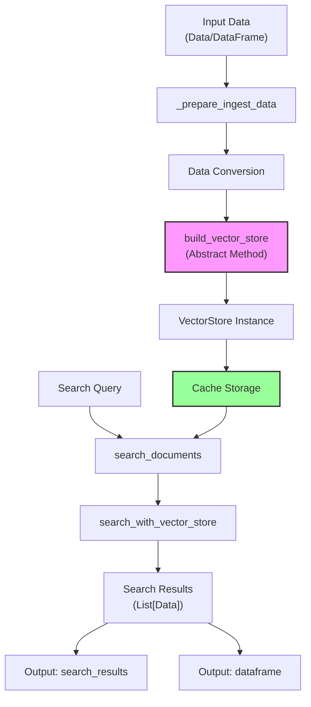
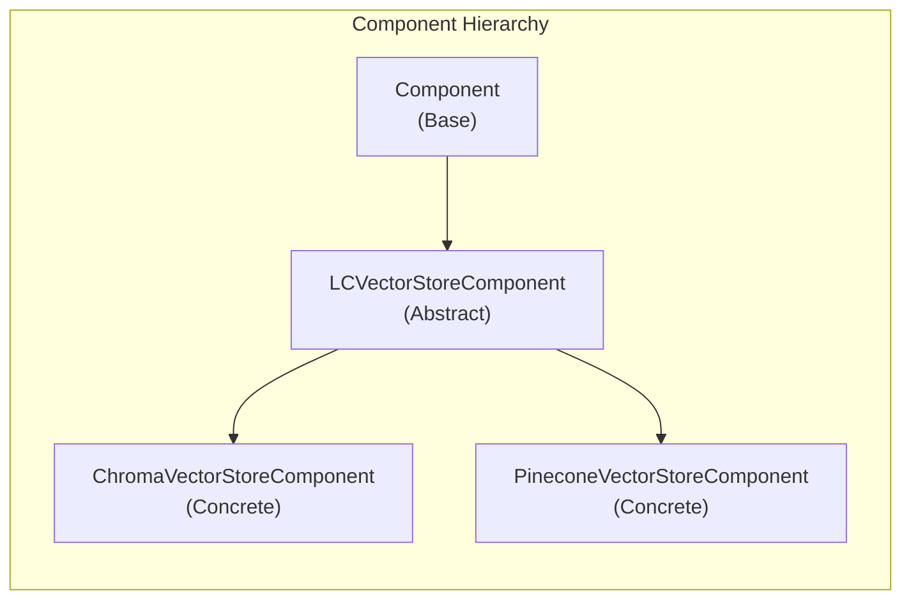
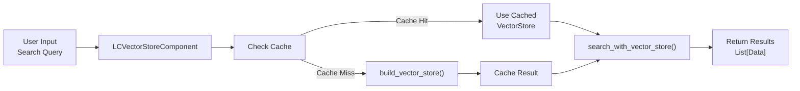

# Base VectorStore Module Documentation

## Introduction

The base_vectorstore module provides the foundational infrastructure for vector store components in the Langflow system. It defines the abstract base class `LCVectorStoreComponent` that serves as a template for all vector store implementations, ensuring consistent behavior and interfaces across different vector store providers like Chroma, Pinecone, AstraDB, and Qdrant.

This module is critical for enabling semantic search, document retrieval, and similarity matching capabilities within the Langflow ecosystem, providing a standardized way to interact with various vector database backends.

## Architecture Overview

### Core Component Structure



### Module Dependencies



## Component Details

### LCVectorStoreComponent

The `LCVectorStoreComponent` is an abstract base class that provides the core functionality for all vector store components. It inherits from the base `Component` class and implements common vector store operations.

#### Key Features

1. **Caching Mechanism**: Implements intelligent caching to ensure vector stores are built only once per component execution
2. **Search Operations**: Provides standardized search functionality across all vector store implementations
3. **Data Ingestion**: Handles data ingestion from various sources (Data, DataFrame)
4. **Output Management**: Defines standard outputs for search results and data frames

#### Class Definition

```python
class LCVectorStoreComponent(Component):
    _cached_vector_store: VectorStore | None = None
    trace_type = "retriever"
```

#### Input Configuration

| Input Name | Type | Description | Advanced |
|------------|------|-------------|----------|
| `ingest_data` | HandleInput | Data to be ingested into the vector store | No |
| `search_query` | QueryInput | Query for similarity search | No |
| `should_cache_vector_store` | BoolInput | Enable/disable vector store caching | Yes |

#### Output Configuration

| Output Name | Method | Description |
|-------------|--------|-------------|
| `search_results` | `search_documents` | Results from similarity search |
| `dataframe` | `as_dataframe` | Search results as DataFrame |

### Caching Mechanism

The module implements a sophisticated caching system using the `@check_cached_vector_store` decorator:



### Data Flow Architecture



## Key Methods

### Abstract Methods

#### `build_vector_store()`
- **Purpose**: Abstract method that must be implemented by subclasses
- **Returns**: `VectorStore` instance
- **Decorator**: `@check_cached_vector_store`
- **Description**: Builds and returns the specific vector store implementation

### Concrete Methods

#### `search_documents()`
- **Purpose**: Performs similarity search on the vector store
- **Returns**: `List[Data]` - Search results
- **Process**:
  1. Retrieves or builds vector store
  2. Validates search query
  3. Calls `search_with_vector_store()`
  4. Updates component status

#### `search_with_vector_store()`
- **Purpose**: Executes the actual search operation
- **Parameters**:
  - `input_value`: Search query text
  - `search_type`: Type of search to perform
  - `vector_store`: Vector store instance
  - `k`: Number of results (default: 10)
- **Returns**: `List[Data]` - Converted search results

#### `_prepare_ingest_data()`
- **Purpose**: Normalizes input data for ingestion
- **Returns**: `List[Any]` - Processed data ready for vector store
- **Handles**: DataFrame to Data conversion, list normalization

#### `as_dataframe()`
- **Purpose**: Converts search results to DataFrame format
- **Returns**: `DataFrame` - Search results as DataFrame

## Integration with Other Modules

### Component System Integration

The base_vectorstore module integrates with the [component_system](component_system.md) through inheritance:



### Vector Store Implementations

The module serves as the foundation for specific vector store implementations:

- **Chroma VectorStore**: [chroma_vectorstore](chroma_vectorstore.md)
- **Pinecone VectorStore**: [pinecone_vectorstore](pinecone_vectorstore.md)
- **AstraDB VectorStore**: [astradb_vectorstore](astradb_vectorstore.md)
- **Qdrant VectorStore**: [qdrant_vectorstore](qdrant_vectorstore.md)

### Schema Integration

The module utilizes schema types for data handling:

- **Data Schema**: [schema_types](schema_types.md) - For search results and document handling
- **DataFrame Schema**: [schema_types](schema_types.md) - For tabular output format

## Usage Patterns

### Basic Implementation Pattern

```python
class MyVectorStoreComponent(LCVectorStoreComponent):
    @check_cached_vector_store
    def build_vector_store(self) -> VectorStore:
        # Implementation specific to your vector store
        vector_store = MyVectorStore(
            # configuration parameters
        )
        return vector_store
```

### Search Flow



## Error Handling

The module implements several validation mechanisms:

1. **Output Validation**: Ensures required output methods are defined
2. **Input Validation**: Validates search queries and input data
3. **Subclass Validation**: Enforces decorator usage on `build_vector_store` method

## Performance Considerations

1. **Caching**: Reduces redundant vector store builds
2. **Lazy Loading**: Vector stores are built only when needed
3. **Memory Management**: Cached stores are scoped to component execution

## Extension Points

1. **Custom Vector Stores**: Implement `LCVectorStoreComponent` for new providers
2. **Search Parameters**: Override `get_retriever_kwargs()` for custom search behavior
3. **Data Processing**: Extend `_prepare_ingest_data()` for custom data handling

## Related Documentation

- [Component System](component_system.md) - Base component architecture
- [Vector Store Implementations](vector_stores.md) - Specific vector store components
- [Schema Types](schema_types.md) - Data structures and types
- [Graph System](graph_system.md) - Vertex and graph integration