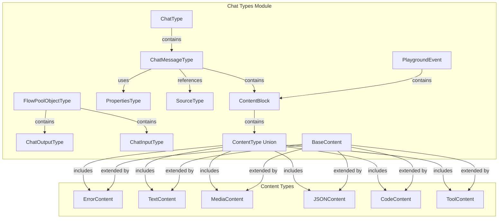
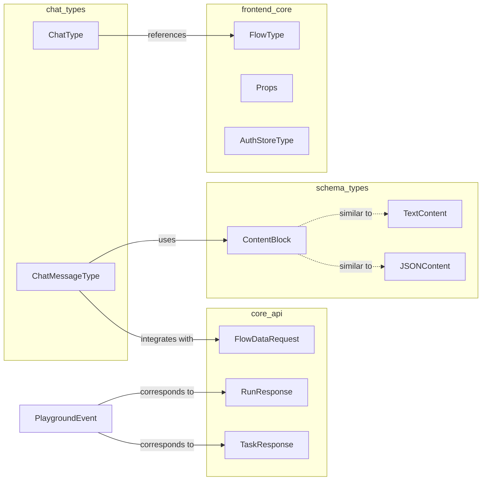
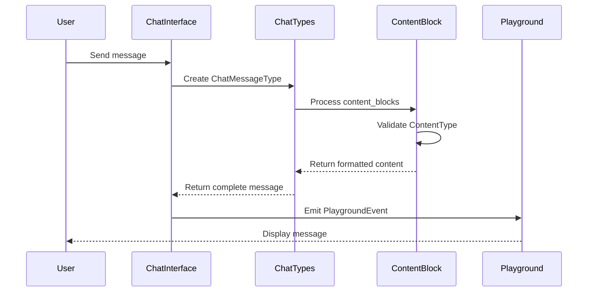
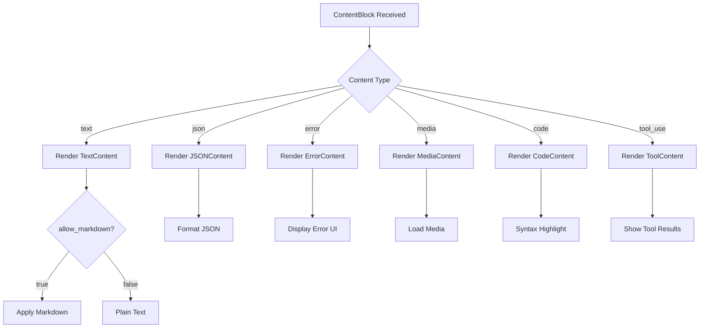

# Chat Types Module Documentation

## Overview

The chat_types module defines the core TypeScript interfaces and types for handling chat functionality in the Langflow frontend. It provides a comprehensive type system for chat messages, content blocks, and playground events, serving as the foundation for real-time communication and content rendering in the chat interface.

## Purpose and Core Functionality

The chat_types module serves as the central type definition system for:

- **Chat Message Management**: Defining the structure of chat messages, including metadata, content, and properties
- **Content Block System**: Supporting rich content types (text, JSON, media, code, tools, errors) within chat messages
- **Playground Events**: Handling real-time events for the interactive playground environment
- **Flow Integration**: Connecting chat functionality with the flow system for workflow execution

## Architecture

### Component Hierarchy



### Dependencies and Integration



## Core Components

### ChatType
Defines the basic chat structure containing a flow reference.

```typescript
export type ChatType = { flow: FlowType };
```

**Purpose**: Links chat functionality to workflow execution through the FlowType from the frontend_core module.

### ChatMessageType
The primary interface for chat messages with comprehensive metadata support.

```typescript
export type ChatMessageType = {
  message: string | Object;
  template?: string;
  isSend: boolean;
  thought?: string;
  files?: Array<{ path: string; type: string; name: string } | string>;
  prompt?: string;
  chatKey?: string;
  componentId?: string;
  id: string;
  timestamp: string;
  stream_url?: string | null;
  sender_name?: string;
  session?: string;
  edit?: boolean;
  icon?: string;
  category?: string;
  properties?: PropertiesType;
  content_blocks?: ContentBlock[];
};
```

**Key Features**:
- **Flexible Content**: Supports both string and Object message types
- **Rich Media**: File attachments with metadata
- **Streaming Support**: Real-time content delivery via stream_url
- **Component Integration**: Links to specific components via componentId
- **Content Blocks**: Rich content rendering through ContentBlock array
- **Session Management**: Session tracking for multi-user scenarios

### Content Block System

#### BaseContent
Abstract base interface for all content types with common properties.

```typescript
export interface BaseContent {
  type: string;
  duration?: number;
  header?: {
    title?: string;
    icon?: string;
  };
}
```

#### Content Type Implementations

**TextContent**: Plain text content with markdown support
```typescript
export interface TextContent extends BaseContent {
  type: "text";
  text: string;
}
```

**JSONContent**: Structured data content
```typescript
export interface JSONContent extends BaseContent {
  type: "json";
  data: Record<string, any>;
}
```

**ErrorContent**: Error information with debugging details
```typescript
export interface ErrorContent extends BaseContent {
  type: "error";
  component?: string;
  field?: string;
  reason?: string;
  solution?: string;
  traceback?: string;
}
```

**MediaContent**: Media file handling
```typescript
export interface MediaContent extends BaseContent {
  type: "media";
  urls: string[];
  caption?: string;
}
```

**CodeContent**: Code snippet display
```typescript
export interface CodeContent extends BaseContent {
  type: "code";
  code: string;
  language: string;
  title?: string;
}
```

**ToolContent**: Tool execution results
```typescript
export interface ToolContent extends BaseContent {
  type: "tool_use";
  name?: string;
  tool_input: Record<string, any>;
  output?: any;
  error?: any;
}
```

#### ContentBlock
Container for organizing multiple content types within a single message.

```typescript
export interface ContentBlock {
  title: string;
  contents: ContentType[];
  allow_markdown: boolean;
  media_url?: string[];
  component: string;
}
```

### PlaygroundEvent
Real-time event system for the interactive playground environment.

```typescript
export interface PlaygroundEvent {
  event_type: "message" | "error" | "warning" | "info" | "token";
  background_color?: string;
  text_color?: string;
  allow_markdown?: boolean;
  icon?: string | null;
  sender_name: string;
  content_blocks?: ContentBlock[] | null;
  files?: string[];
  text?: string;
  timestamp?: string;
  token?: string;
  id?: string;
  flow_id?: string;
  sender?: string;
  session_id?: string;
  edit?: boolean;
}
```

**Event Types**:
- **message**: Standard chat messages
- **error**: Error notifications
- **warning**: Warning messages
- **info**: Informational messages
- **token**: Token streaming events for real-time responses

## Data Flow

### Message Processing Flow



### Content Block Rendering Flow



## Integration with Other Modules

### Frontend Core Integration
The chat_types module integrates with [frontend_core](frontend_core.md) through:
- **FlowType**: Links chat messages to workflow execution
- **Props**: Component properties for chat interface rendering
- **AuthStoreType**: User authentication and session management

### Schema Types Integration
Content blocks in chat_types mirror the structure defined in [schema_types](schema_types.md):
- **ContentBlock**: Similar to backend content block definitions
- **TextContent**: Corresponds to backend text content types
- **JSONContent**: Matches backend JSON content handling

### Core API Integration
Chat messages correspond to API responses from [core_api](core_api.md):
- **FlowDataRequest**: Chat messages trigger flow execution
- **RunResponse**: Execution results become chat content
- **TaskResponse**: Background tasks update chat status

## Usage Examples

### Creating a Chat Message with Content Blocks

```typescript
const chatMessage: ChatMessageType = {
  message: "Processing your request",
  isSend: false,
  id: "msg-123",
  timestamp: new Date().toISOString(),
  sender_name: "AI Assistant",
  content_blocks: [
    {
      title: "Analysis Results",
      contents: [
        {
          type: "json",
          data: { accuracy: 0.95, confidence: "high" }
        },
        {
          type: "text",
          text: "The analysis completed successfully with high confidence."
        }
      ],
      allow_markdown: true,
      component: "data-analyzer"
    }
  ]
};
```

### Handling Playground Events

```typescript
const tokenEvent: PlaygroundEvent = {
  event_type: "token",
  sender_name: "AI Assistant",
  token: "Hello",
  flow_id: "flow-456",
  session_id: "session-789"
};

const messageEvent: PlaygroundEvent = {
  event_type: "message",
  sender_name: "AI Assistant",
  content_blocks: [
    {
      title: "Response",
      contents: [
        {
          type: "text",
          text: "Here's my response to your question."
        }
      ],
      allow_markdown: true,
      component: "chat-response"
    }
  ]
};
```

## Best Practices

### Content Block Organization
- Use descriptive titles for content blocks
- Group related content within the same block
- Leverage markdown support for better formatting
- Include appropriate icons and headers for visual clarity

### Message State Management
- Maintain consistent timestamp formatting
- Use unique IDs for message tracking
- Implement proper session management for multi-user scenarios
- Handle file attachments with proper validation

### Error Handling
- Provide detailed error content with solutions
- Include component and field information for debugging
- Use appropriate error types for different failure scenarios
- Maintain user-friendly error messages

### Performance Considerations
- Implement virtual scrolling for large chat histories
- Use streaming for long-running operations
- Optimize content block rendering for complex data
- Cache frequently accessed content types

## Related Documentation

- [Frontend Core](frontend_core.md) - Core frontend types and interfaces
- [Schema Types](schema_types.md) - Backend schema definitions
- [Core API](core_api.md) - API request/response types
- [Graph System](graph_system.md) - Workflow execution integration
- [Component System](component_system.md) - Component integration details