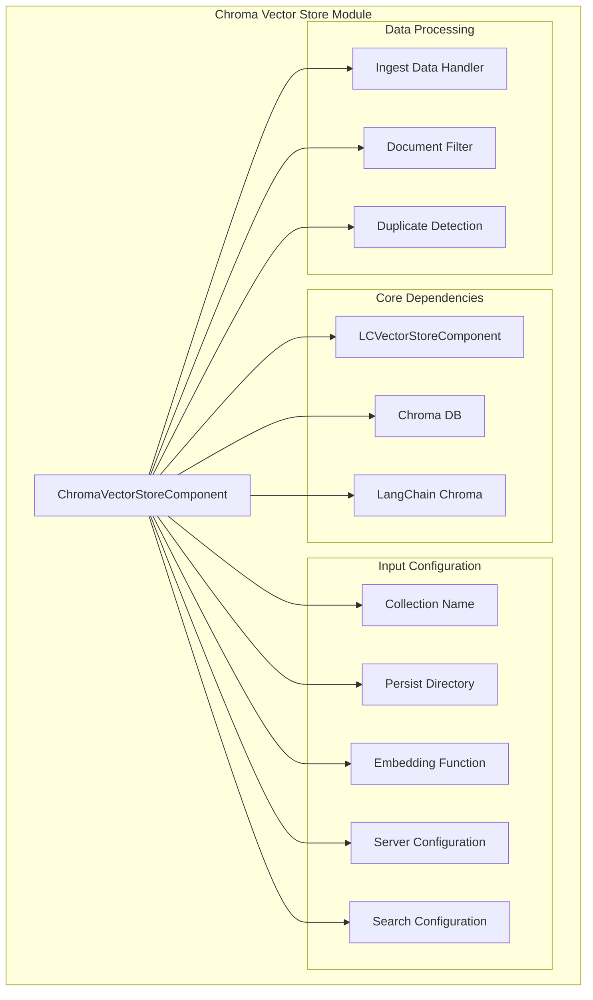
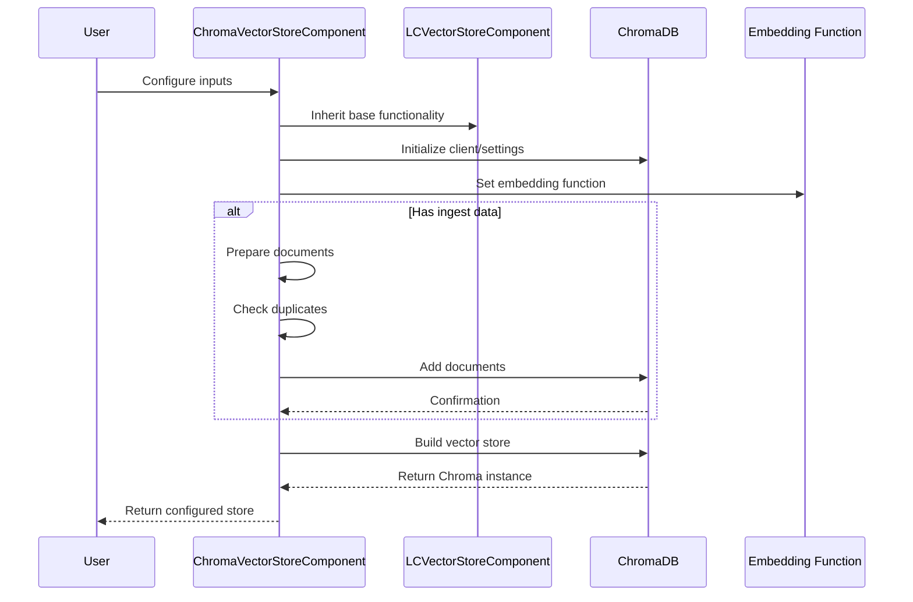
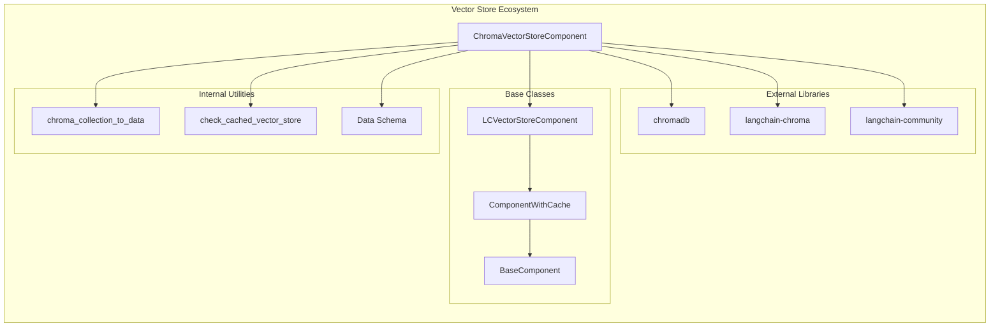
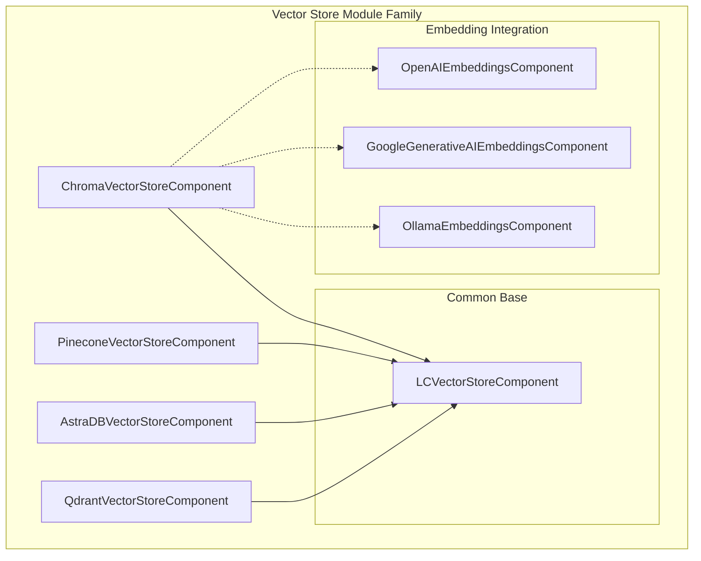

# Chroma Vector Store Module

## Introduction

The Chroma Vector Store module provides a powerful vector storage and retrieval system built on top of ChromaDB, a popular open-source embedding database. This module enables efficient similarity search, document storage, and retrieval operations within the Langflow ecosystem, supporting both local persistence and remote server configurations.

## Architecture Overview



## Component Structure

### Core Component: ChromaVectorStoreComponent

The `ChromaVectorStoreComponent` is the main class that implements vector storage functionality with the following key features:

- **Collection Management**: Organizes documents into named collections
- **Persistence Support**: Local file system persistence with configurable directories
- **Server Integration**: Remote ChromaDB server connectivity with full configuration options
- **Duplicate Handling**: Intelligent duplicate detection and prevention
- **Search Capabilities**: Support for similarity search and Maximum Marginal Relevance (MMR)
- **Document Processing**: Automated metadata filtering and document preparation

## Data Flow Architecture



## Configuration Options

### Basic Configuration
- **Collection Name**: Name of the Chroma collection (default: "langflow")
- **Persist Directory**: Local directory for data persistence
- **Embedding**: Required embedding function for vector generation

### Advanced Server Configuration
- **CORS Allow Origins**: Cross-origin resource sharing settings
- **Server Host**: Remote ChromaDB server hostname
- **HTTP Port**: Server HTTP port (default: 8000)
- **gRPC Port**: Server gRPC port
- **SSL Enabled**: Enable/disable SSL encryption

### Search and Storage Options
- **Search Type**: Similarity or MMR (Maximum Marginal Relevance)
- **Number of Results**: Results to return per search (default: 10)
- **Allow Duplicates**: Toggle duplicate document handling
- **Limit**: Maximum records to check for duplicates

## Integration Dependencies



## Key Features

### 1. Flexible Deployment Options
- **Local Mode**: File-based persistence for development and small deployments
- **Server Mode**: Remote ChromaDB server for production environments
- **Hybrid Mode**: Local development with server migration capabilities

### 2. Intelligent Document Management
- **Duplicate Detection**: Configurable duplicate checking based on document content
- **Metadata Filtering**: Automatic complex metadata filtering to prevent ChromaDB errors
- **Batch Processing**: Efficient bulk document insertion

### 3. Advanced Search Capabilities
- **Similarity Search**: Standard cosine similarity-based retrieval
- **MMR Search**: Maximum Marginal Relevance for diverse result sets
- **Configurable Results**: Adjustable number of returned documents

### 4. Error Handling and Validation
- **Import Validation**: Graceful handling of missing dependencies
- **Document Validation**: Type checking and schema validation
- **Metadata Protection**: Automatic filtering of problematic metadata

## Usage Patterns

### Basic Local Usage
```python
# Configure with local persistence
component = ChromaVectorStoreComponent()
component.collection_name = "my_collection"
component.persist_directory = "./chroma_data"
component.embedding = my_embedding_function
```

### Server Deployment
```python
# Connect to remote ChromaDB server
component.chroma_server_host = "chroma.example.com"
component.chroma_server_http_port = 8000
component.chroma_server_ssl_enabled = True
```

### Advanced Search Configuration
```python
# Configure MMR search with custom parameters
component.search_type = "MMR"
component.number_of_results = 20
component.allow_duplicates = False
component.limit = 1000
```

## Component Relationships



## Performance Considerations

### Scalability
- **Local Mode**: Suitable for up to ~1M vectors depending on hardware
- **Server Mode**: Scales to billions of vectors with proper infrastructure
- **Memory Usage**: Efficient memory utilization through lazy loading

### Optimization Strategies
- **Batch Processing**: Process documents in batches for better performance
- **Index Tuning**: Configure ChromaDB indexing parameters for specific use cases
- **Duplicate Checking**: Disable duplicate checking for improved ingestion speed when appropriate

## Error Handling

### Common Issues and Solutions
1. **Import Errors**: Ensure `langchain-chroma` is installed
2. **Connection Issues**: Verify server configuration and network connectivity
3. **Metadata Errors**: Automatic filtering handles most complex metadata issues
4. **Permission Errors**: Check persist directory permissions for local mode

## Related Modules

- **[base_vectorstore.md](base_vectorstore.md)**: Base vector store functionality and common interfaces
- **[embeddings.md](embeddings.md)**: Embedding model integration options
- **[component_system.md](component_system.md)**: Component framework and lifecycle management
- **[pinecone_vectorstore.md](pinecone_vectorstore.md)**: Alternative vector store implementation
- **[qdrant_vectorstore.md](qdrant_vectorstore.md)**: Another vector store alternative with different features

## Future Enhancements

- **Multi-tenancy**: Support for isolated collections per user/organization
- **Advanced Filtering**: Enhanced metadata-based filtering capabilities
- **Performance Monitoring**: Built-in metrics and performance tracking
- **Backup/Restore**: Automated backup and recovery mechanisms