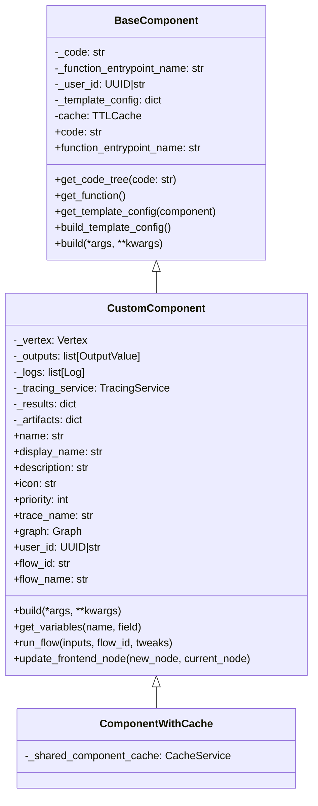
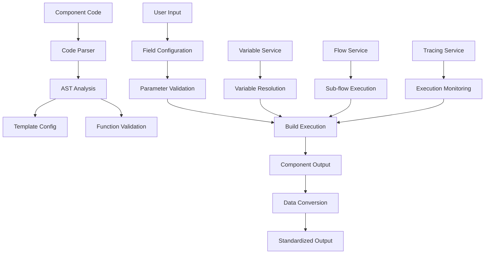
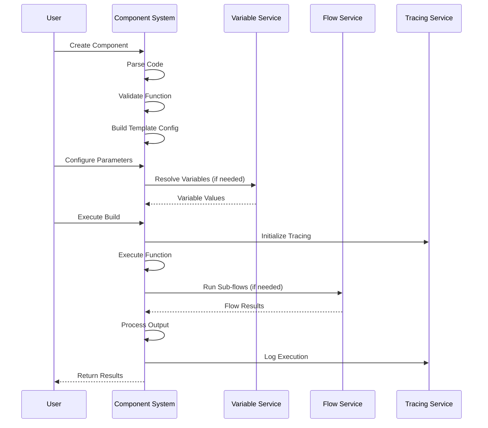
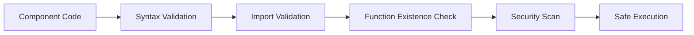
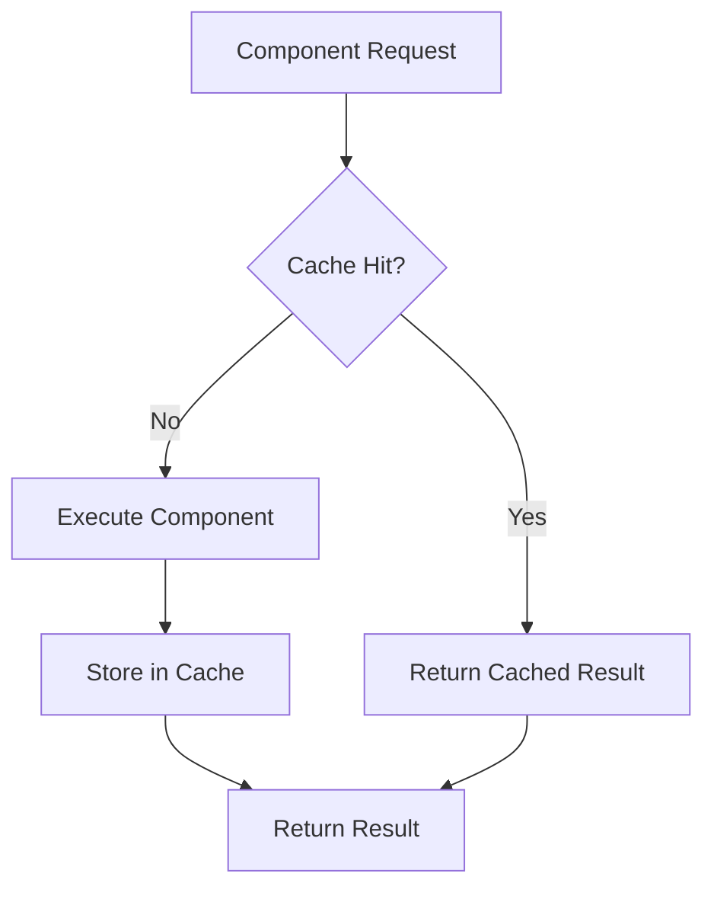

# Component System Module Documentation

## Introduction

The component_system module is the foundation of Langflow's extensible architecture, providing the core infrastructure for creating, managing, and executing custom components. This module implements a hierarchical component system that enables users to build reusable, configurable components that can be integrated into complex data processing workflows.

The module's primary purpose is to abstract the complexity of component development while providing powerful features like code validation, caching, template configuration, and integration with the broader Langflow ecosystem including graph execution, variable management, and tracing services.

## Architecture Overview

The component_system module is built around three core classes that form an inheritance hierarchy:

1. **BaseComponent** - Abstract foundation providing core component functionality
2. **CustomComponent** - Extends BaseComponent with Langflow-specific features
3. **ComponentWithCache** - Adds caching capabilities to the component system



## Core Components

### BaseComponent

The `BaseComponent` class serves as the abstract foundation for all components in the system. It provides essential functionality for code management, validation, and template configuration.

**Key Responsibilities:**
- Code parsing and validation
- Template configuration management
- Function entrypoint handling
- Caching infrastructure

**Core Properties:**
- `code`: The Python code that defines the component's behavior
- `function_entrypoint_name`: The name of the main function (defaults to "build")
- `field_config`: Configuration for component fields and parameters

**Key Methods:**
- `get_code_tree()`: Parses component code into an AST representation
- `get_function()`: Validates and returns the executable function
- `build_template_config()`: Generates template configuration from component code

### CustomComponent

The `CustomComponent` class extends BaseComponent with Langflow-specific functionality, making it the primary class for user-defined components.

**Extended Capabilities:**
- Graph and vertex integration
- Variable management and retrieval
- Flow execution and management
- Tracing and logging support
- Frontend node integration
- Data conversion utilities

**Integration Points:**
- **Graph System**: Integrates with the graph execution engine through vertex relationships
- **Variable Service**: Provides secure access to user-defined variables
- **Flow Management**: Enables execution of other flows as sub-processes
- **Tracing Service**: Supports observability and debugging

### ComponentWithCache

A specialized component that adds caching capabilities to improve performance for expensive operations.

**Caching Features:**
- Shared component cache service integration
- Automatic cache management
- Performance optimization for repeated operations

## Data Flow Architecture



## Component Lifecycle



## Integration with Other Modules

### Graph System Integration

The component_system module integrates closely with the [graph_system](graph_system.md) module:

- **Vertex Integration**: Components are executed within graph vertices
- **Edge Data Flow**: Components receive input through graph edges
- **Graph Context**: Access to graph-level configuration and context
- **Flow Control**: Components can control graph execution flow (start/stop branches)

### Database Models Integration

Components interact with [database_models](database_models.md) for:

- **User Context**: User ID association for security and personalization
- **Flow Metadata**: Access to flow configuration and metadata
- **Variable Storage**: Secure storage and retrieval of user variables

### Services Integration

The module leverages various [services](services.md) for:

- **Variable Service**: Secure variable management with encryption
- **Storage Service**: File and data storage operations
- **Tracing Service**: Execution monitoring and debugging
- **Cache Service**: Performance optimization

## Key Features

### Code Validation and Security



The system implements multiple layers of validation:
- Syntax validation using Python AST
- Import restriction to prevent malicious code
- Function existence verification
- Security scanning for dangerous operations

### Template Configuration System

Components support dynamic template configuration that enables:
- Runtime field configuration
- Frontend integration
- Parameter validation
- Type inference and conversion

### Variable Management

Secure variable management with:
- User-scoped variable access
- Encrypted storage
- Request-level variable overrides
- Asynchronous retrieval

### Flow Integration

Components can:
- Execute other flows as sub-processes
- Pass parameters and receive results
- Handle flow lifecycle management
- Support both synchronous and asynchronous execution

## Error Handling

The module implements comprehensive error handling:

- **ComponentCodeNullError**: Raised when component code is missing
- **ComponentFunctionEntrypointNameNullError**: Raised when function entrypoint is not specified
- **ValidationError**: Raised during code validation
- **ImportError**: Raised for restricted or invalid imports

## Performance Optimization

### Caching Strategy



- **TTL Cache**: Time-based cache expiration
- **Shared Cache**: Cross-component cache sharing
- **Size Limits**: Configurable cache size limits

### Asynchronous Operations

- Async variable retrieval
- Non-blocking flow execution
- Concurrent sub-flow processing

## Security Considerations

### Code Execution Security

- Sandboxed execution environment
- Import restrictions
- Function validation
- Resource limits

### Data Security

- User-scoped data access
- Encrypted variable storage
- Secure file operations
- Audit logging

## Usage Patterns

### Basic Component Creation

```python
# Component code structure
class MyComponent(CustomComponent):
    display_name = "My Custom Component"
    description = "A custom component example"
    
    def build(self, input_data):
        # Component logic here
        return processed_data
```

### Advanced Features

- **Variable Access**: Secure retrieval of user variables
- **Flow Integration**: Execute sub-flows within components
- **Data Conversion**: Convert between different data formats
- **Frontend Integration**: Dynamic template configuration

## Best Practices

1. **Code Organization**: Keep component code focused and modular
2. **Error Handling**: Implement proper error handling in component code
3. **Performance**: Use caching for expensive operations
4. **Security**: Avoid unsafe operations and imports
5. **Documentation**: Provide clear descriptions and examples

## Future Enhancements

The component_system module is designed for extensibility with planned enhancements:

- Enhanced security sandboxing
- Improved performance monitoring
- Advanced caching strategies
- Extended integration capabilities
- Enhanced debugging tools

## Conclusion

The component_system module provides a robust foundation for building extensible, secure, and performant custom components within the Langflow ecosystem. Its hierarchical design, comprehensive feature set, and tight integration with other system modules make it a critical component of the overall architecture.