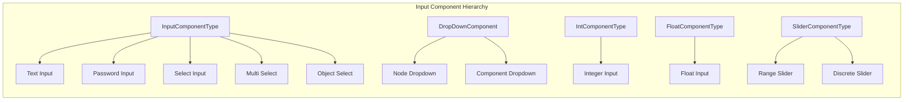
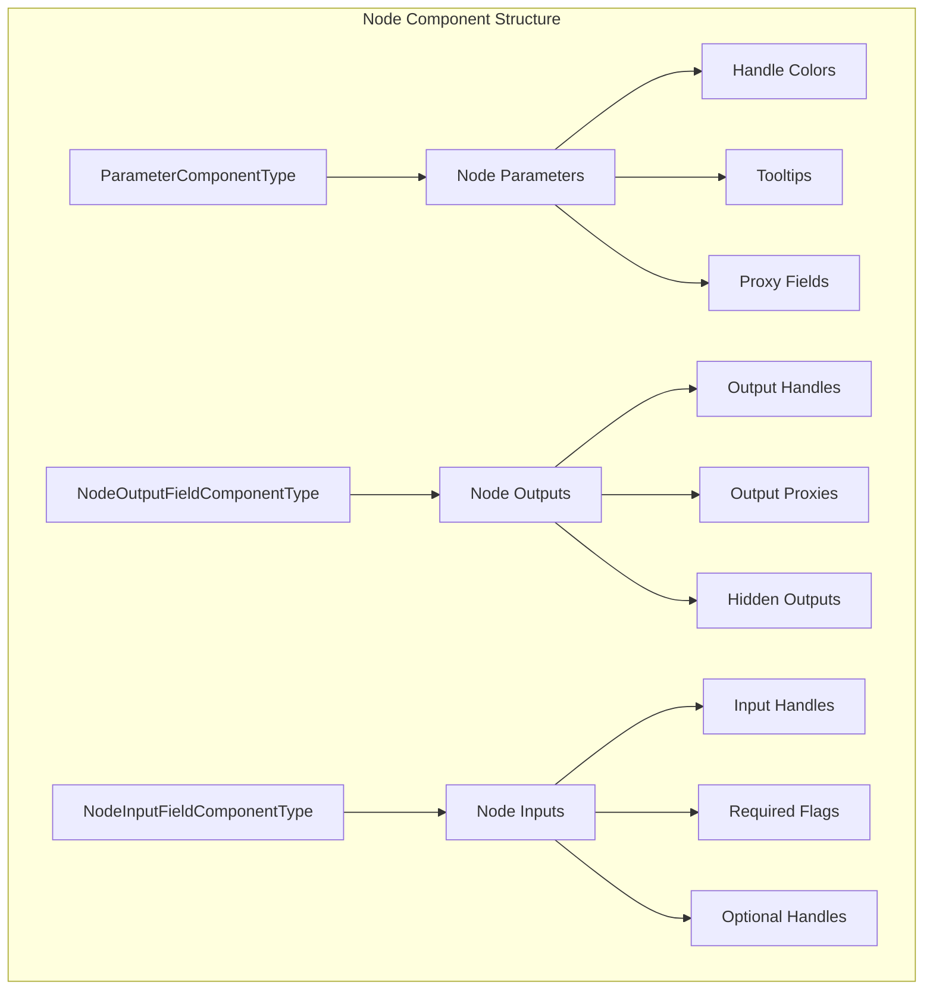
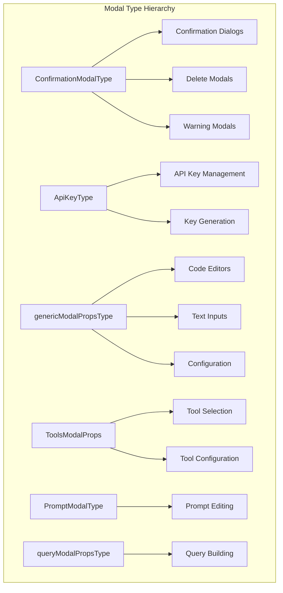
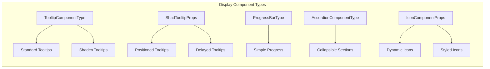
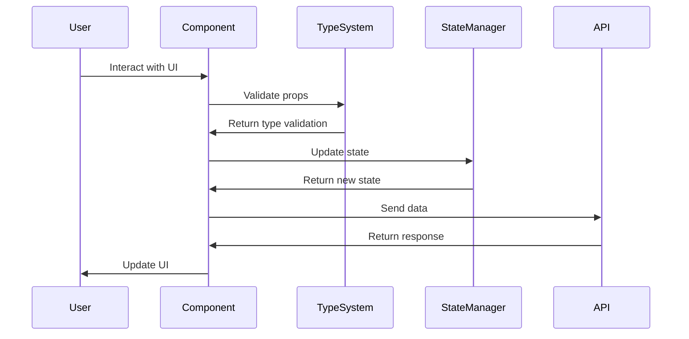
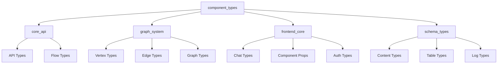

# Component Types Module Documentation

## Introduction

The `component_types` module serves as the central TypeScript type definitions repository for the Langflow frontend component system. It provides comprehensive type definitions for all UI components, form elements, modal dialogs, and interactive elements used throughout the Langflow visual programming interface. This module acts as the bridge between the visual node-based interface and the underlying component logic, ensuring type safety and consistency across the frontend application.

## Architecture Overview

The component_types module is structured as a collection of TypeScript type definitions that support the visual component system in Langflow. It defines the interfaces and types needed for rendering nodes, handling user interactions, managing component states, and facilitating communication between different parts of the frontend application.

```mermaid
graph TB
    subgraph "Component Types Module"
        CT[component_types/index.ts]
        
        CT --> InputTypes[Input Component Types]
        CT --> NodeTypes[Node Component Types]
        CT --> ModalTypes[Modal Component Types]
        CT --> DisplayTypes[Display Component Types]
        CT --> FormTypes[Form Component Types]
        CT --> ChatTypes[Chat Component Types]
        CT --> FlowTypes[Flow Management Types]
        
        InputTypes --> ICT[InputComponentType]
        InputTypes --> DCT[DropDownComponent]
        InputTypes --> ICT2[IntComponentType]
        InputTypes --> FCT[FloatComponentType]
        InputTypes --> SCT[SliderComponentType]
        
        NodeTypes --> PCT[ParameterComponentType]
        NodeTypes --> NOFCT[NodeOutputFieldComponentType]
        NodeTypes --> NIFCT[NodeInputFieldComponentType]
        
        ModalTypes --> CMT[ConfirmationModalType]
        ModalTypes --> AKT[ApiKeyType]
        ModalTypes --> GMP[genericModalPropsType]
        ModalTypes --> TMP[ToolsModalProps]
        
        DisplayTypes --> TCT[TooltipComponentType]
        DisplayTypes --> PBT[ProgressBarType]
        DisplayTypes --> ACT[AccordionComponentType]
        DisplayTypes --> ICT3[IconComponentProps]
        
        FormTypes --> IPT[InputProps]
        FormTypes --> LST[loginInputStateType]
        FormTypes --> SUIT[signUpInputStateType]
        FormTypes --> PUT[patchUserInputStateType]
        
        ChatTypes --> CIT[ChatInputType]
        ChatTypes --> CMP[chatMessagePropsType]
        ChatTypes --> CVP[chatViewProps]
        ChatTypes --> CTP[chatTriggerPropType]
        
        FlowTypes --> FST[FlowSettingsPropsType]
        FlowTypes --> NTP[nodeToolbarPropsType]
        FlowTypes --> HFT[headerFlowsType]
    end
    
    subgraph "External Dependencies"
        RF[ReactFlow]
        React[React]
        API[API Types]
        Chat[Chat Types]
        Flow[Flow Types]
    end
    
    CT -.-> RF
    CT -.-> React
    CT -.-> API
    CT -.-> Chat
    CT -.-> Flow
```



## Core Component Types

### Input Component Types

The module defines comprehensive types for various input components used in the visual interface:



**Key Input Types:**

- **InputComponentType**: Base type for text inputs with support for passwords, options, and various input modes
- **DropDownComponent**: Handles dropdown selections with loading states and metadata support
- **IntComponentType/FloatComponentType**: Numeric inputs with range specifications
- **SliderComponentType**: Visual slider controls with customizable labels and buttons

### Node Component Types

Node component types define the structure for visual nodes in the flow editor:



**Key Node Types:**

- **ParameterComponentType**: Defines parameter inputs with color coding, tooltips, and proxy support
- **NodeOutputFieldComponentType**: Handles node output fields with support for multiple outputs and proxies
- **NodeInputFieldComponentType**: Manages node input fields with validation and handle management

### Modal Component Types

Comprehensive modal type definitions for various UI dialogs:



### Display Component Types

Types for various display and presentation components:



## Data Flow and Component Interactions



## Integration with Other Modules

The component_types module integrates with several other key modules in the Langflow system:

### Core API Integration
- **Flow Data Types**: References flow management types from the core_api module
- **API Response Types**: Integrates with API response schemas for type safety
- **Validation Types**: Uses validation types from the base API module

### Graph System Integration
- **Node Data Types**: References vertex and node data types from the graph_system
- **Edge Types**: Integrates with edge data types for connection handling
- **Graph Structure**: Supports graph-level component organization

### Frontend Core Integration
- **Chat Types**: References chat message types for conversational interfaces
- **Component Props**: Integrates with base component prop definitions
- **State Management**: Supports state management type definitions



## Key Features and Capabilities

### Type Safety
- Comprehensive TypeScript definitions for all UI components
- Strict typing for component props and state
- Integration with external libraries (React Flow, React)

### Component Modularity
- Modular type definitions that can be composed together
- Support for component inheritance and extension
- Flexible type composition for complex components

### Form Handling
- Complete form input type definitions
- Validation support through type constraints
- Support for various input modes (text, numeric, select, etc.)

### Modal Management
- Type-safe modal component definitions
- Support for various modal use cases
- Integration with state management patterns

### Node-Based Interface Support
- Specialized types for visual programming nodes
- Support for input/output handle management
- Color coding and visual feedback types

## Usage Patterns

### Component Development
Developers use these types when creating new components:

```typescript
// Example usage pattern
import type { InputComponentType, NodeDataType } from '@/types/components';

const MyInputComponent: React.FC<InputComponentType> = (props) => {
  // Component implementation
};
```

### Type Composition
Types can be composed to create more specific component interfaces:

```typescript
// Combining multiple types
interface CustomNodeProps extends NodeDataType {
  customField: string;
  componentProps: InputComponentType;
}
```

### Form Validation
Types support form validation and error handling:

```typescript
// Using types for validation
const validateInput = (input: InputComponentType): boolean => {
  if (input.required && !input.value) {
    return false;
  }
  return true;
};
```

## Dependencies and External Libraries

The component_types module depends on several external libraries and internal modules:

### External Dependencies
- **React**: Core React types for component definitions
- **React Flow**: Types for node-based interface components
- **TypeScript**: Language-level type system

### Internal Dependencies
- **API Types**: Schema definitions from the API layer
- **Flow Types**: Node and graph structure types
- **Chat Types**: Message and conversation types
- **Component Constants**: Enumeration and constant definitions

## Best Practices and Guidelines

### Type Definition Guidelines
1. **Use specific types**: Prefer specific types over generic ones
2. **Maintain consistency**: Follow naming conventions and patterns
3. **Document complex types**: Add comments for complex type definitions
4. **Avoid circular dependencies**: Structure types to prevent circular imports

### Component Development Guidelines
1. **Type props explicitly**: Always define prop types for components
2. **Use type composition**: Compose existing types rather than redefining
3. **Handle optional properties**: Properly handle optional and nullable properties
4. **Maintain backward compatibility**: Consider type changes carefully

## Future Considerations

### Potential Enhancements
- **Generic type support**: Enhanced generic type definitions
- **Performance optimizations**: Type definitions for performance-critical components
- **Accessibility types**: Enhanced accessibility support in type definitions
- **Internationalization**: Types supporting multi-language interfaces

### Evolution Path
The component_types module will continue to evolve with:
- New component type definitions as the UI expands
- Enhanced type safety features
- Better integration with emerging frontend technologies
- Support for new interaction patterns and user experiences

## References

- [Core API Documentation](core_api.md)
- [Graph System Documentation](graph_system.md)
- [Frontend Core Documentation](frontend_core.md)
- [Schema Types Documentation](schema_types.md)

---

*This documentation covers the component_types module's role in providing comprehensive TypeScript type definitions for the Langflow frontend component system, ensuring type safety and consistency across the visual programming interface.*