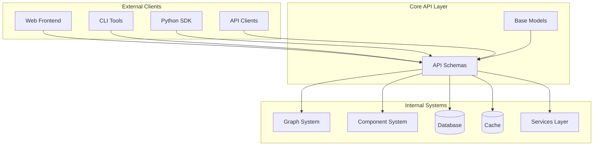
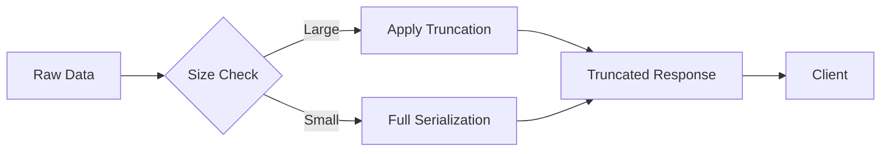

# Core API Module Documentation

## Overview

The `core_api` module serves as the central API layer for Langflow, providing the primary interface for client applications to interact with the system. This module defines the data schemas, request/response models, and API contracts that govern how external clients communicate with Langflow's backend services.

## Purpose

The core API module acts as the contract layer between Langflow's internal systems and external consumers, offering:

- **Standardized Data Exchange**: Consistent request/response schemas across all API endpoints
- **Type Safety**: Pydantic-based models ensuring data validation and serialization
- **Feature Configuration**: Centralized configuration management and feature flag handling
- **Authentication & Authorization**: API key management and user authentication schemas
- **Flow Management**: Schemas for creating, updating, and executing flows
- **Real-time Communication**: Support for streaming responses and chat-based interactions

## Architecture



## Core Components

### API Schemas (`schemas.py`)

The main schema definitions for all API operations:

#### Request Schemas
- **ApiKeyCreateRequest**: Handles API key creation requests
- **FlowDataRequest**: Manages flow data submission with nodes and edges
- **CustomComponentRequest**: Processes custom component code submissions
- **UpdateTemplateRequest**: Handles template updates
- **SimplifiedAPIRequest**: Provides simplified API access for common operations

#### Response Schemas
- **RunResponse**: Contains execution results and session information
- **InitResponse**: Returns flow initialization data
- **ComponentListRead**: Provides component listing information
- **TaskResponse**: Handles asynchronous task responses
- **BuiltResponse**: Confirms successful build operations
- **ConfigResponse**: Delivers system configuration and feature flags

#### Specialized Response Types
- **ChatResponse**: Manages chat-based interactions with streaming support
- **FileResponse**: Handles file upload/download operations
- **VertexBuildResponse**: Provides detailed vertex execution results
- **ResultDataResponse**: Contains comprehensive execution results with logs and artifacts

#### Advanced Response Models

**ResultDataResponse**
- **Purpose**: Comprehensive container for vertex execution results
- **Key Features**:
  - `results`: Arbitrary execution results with automatic serialization
  - `outputs`: Structured output values from vertex execution
  - `logs`: Execution logs organized by vertex ID
  - `artifacts`: Additional execution artifacts
  - `timedelta` & `duration`: Performance metrics
  - `used_frozen_result`: Cache utilization tracking
- **Serialization**: Implements intelligent truncation based on system limits

**VertexBuildResponse**
- **Purpose**: Detailed response for individual vertex builds
- **Key Features**:
  - `id`: Vertex identifier
  - `valid`: Build validation status
  - `data`: Embedded ResultDataResponse with execution details
  - `params`: Vertex parameters as JSON
  - `timestamp`: UTC timestamp of build completion
  - `inactivated_vertices`: List of vertices skipped during execution
  - `next_vertices_ids`: Vertices queued for execution
  - `top_level_vertices`: Root vertices in the execution graph

**ChatResponse**
- **Purpose**: Real-time chat interaction responses
- **Key Features**:
  - `intermediate_steps`: Detailed execution steps for transparency
  - `type`: Message type validation (start, stream, end, error, info, file)
  - `files`: Associated file attachments
  - `is_bot`: Bot identification flag
- **Validation**: Strict type checking for message categorization

### Base Models (`base.py`)

Foundational models used across the API:

- **CacheResponse**: Standardizes cache operation responses
- **ValidatePromptRequest**: Handles prompt validation requests
- **FrontendNodeRequest**: Manages frontend node configuration
- **CodeValidationResponse**: Provides code validation results

## Key Features

### 1. Data Validation and Serialization

The module uses Pydantic's advanced features for robust data handling:

```python
# Example: Custom serialization with truncation
@model_serializer(mode="plain")
def serialize_model(self) -> dict:
    return {
        "results": self.serialize_results(self.results),
        "outputs": serialize(self.outputs, max_length=get_max_text_length()),
        # ... additional fields
    }
```

### 2. Feature Flag Management

Centralized configuration through `ConfigResponse`:

```python
class ConfigResponse(BaseModel):
    feature_flags: FeatureFlags
    serialization_max_items_length: int
    frontend_timeout: int
    auto_saving: bool
    # ... additional configuration options
```

### 3. Streaming Support

Built-in support for real-time data streaming:

```python
class StreamData(BaseModel):
    event: str
    data: dict
    
    def __str__(self) -> str:
        return f"event: {self.event}\ndata: {orjson_dumps(self.data)}\n\n"
```

### 4. MCP (Model Context Protocol) Integration

Modern AI model integration support:

```python
class MCPSettings(BaseModel):
    id: UUID
    mcp_enabled: bool | None = None
    action_name: str | None = None
    action_description: str | None = None
```

## Integration Points

### Database Models
The API schemas integrate with database models for persistent data management:
- [Flow Management](database_models.md#flowread)
- [User Management](database_models.md#usercreate)
- [API Key Management](database_models.md#apikey)

### Graph System
Flow execution schemas connect to the graph processing system:
- [Graph Vertices](graph_system.md#vertex)
- [Edge Management](graph_system.md#edgedata)
- [Graph Execution](graph_system.md#graphdata)

### Component System
Custom component handling integrates with the component framework:
- [Base Components](component_system.md#basecomponent)
- [Custom Components](component_system.md#customcomponent)
- [Component Caching](component_system.md#componentwithcache)

### Services Layer
API responses are generated using various backend services:
- [Cache Service](services.md#cacheservice)
- [Settings Management](services.md#service)
- [Feature Flags](services.md#servicemanager)

## Usage Patterns

### 1. Flow Execution
```python
# Request
flow_data = FlowDataRequest(nodes=[...], edges=[...])

# Response
run_response = RunResponse(outputs=[...], session_id="uuid")
```

### 2. Component Management
```python
# Request
custom_component = CustomComponentRequest(code="...", frontend_node={...})

# Response
component_response = CustomComponentResponse(data={...}, type="component")
```

### 3. Configuration Retrieval
```python
# Response
config = ConfigResponse.from_settings(settings, auth_settings)
```

### 4. Advanced Response Processing
```python
# Vertex execution with detailed results
vertex_response = VertexBuildResponse(
    id="vertex_123",
    valid=True,
    data=ResultDataResponse(
        results={"output": "processed_data"},
        outputs={"result": OutputValue(type="text", value="Hello World")},
        logs={"vertex_123": [Log(message="Execution started", level="info")]},
        duration="150ms",
        used_frozen_result=False
    ),
    timestamp=datetime.now(timezone.utc)
)
```

## Data Flow and Serialization

### Intelligent Data Truncation

The Core API implements sophisticated serialization to handle large data structures:



### Performance Metrics Integration

Every vertex execution includes performance tracking:
- **Execution Time**: `timedelta` and `duration` fields
- **Cache Efficiency**: `used_frozen_result` flag
- **Resource Usage**: Integrated with logging system
- **Memory Management**: Automatic cleanup of large objects

### Streaming Data Support

Real-time data streaming for chat interfaces:
```python
class StreamData(BaseModel):
    event: str  # Event type (start, stream, end, error)
    data: dict  # Event payload
    
    def __str__(self) -> str:
        return f"event: {self.event}\ndata: {orjson_dumps(self.data)}\n\n"
```

## Error Handling

The module provides structured error responses through various error schemas:

- **CustomComponentResponseError**: Handles custom component errors with detailed tracebacks
- **Validation Errors**: Pydantic-based validation with detailed field-level error messages
- **Build Status**: Enumeration of possible build states (SUCCESS, FAILURE, STARTED, IN_PROGRESS)

## Security Considerations

### API Key Management
- Secure API key generation and validation
- Support for multiple authentication methods (none, apikey, oauth)
- OAuth 2.0 integration for third-party authentication

### Data Serialization
- Configurable serialization limits to prevent resource exhaustion
- Automatic truncation of large data structures
- Safe serialization of arbitrary Python objects

## Performance Optimizations

### Serialization Limits
Configurable limits for data serialization:
- `serialization_max_text_length`: Maximum text length in serialized responses
- `serialization_max_items_length`: Maximum number of items in collections
- `frontend_timeout`: Client-side timeout configuration

### Caching Support
Built-in cache response models for efficient data retrieval and reduced database load.

## Future Enhancements

The module is designed to support:
- Additional authentication providers
- Enhanced streaming capabilities
- More granular feature flags
- Advanced validation rules
- Performance monitoring integration

## Related Documentation

- [Graph System](graph_system.md) - Flow execution and vertex management
- [Component System](component_system.md) - Custom component development
- [Database Models](database_models.md) - Data persistence layer
- [Services](services.md) - Backend service layer
- [Schema Types](schema_types.md) - Common data types and structures