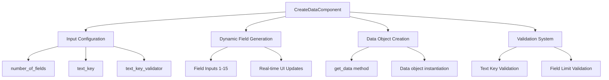
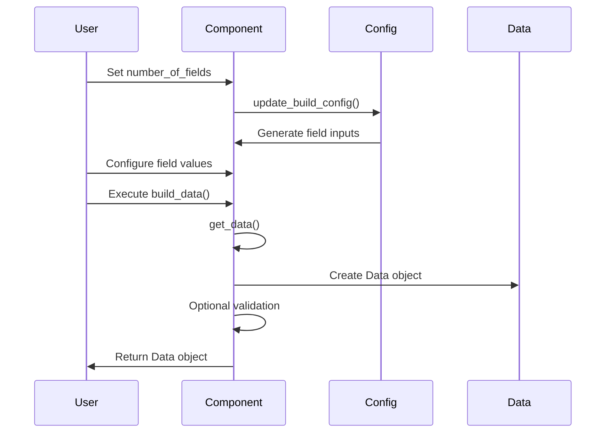
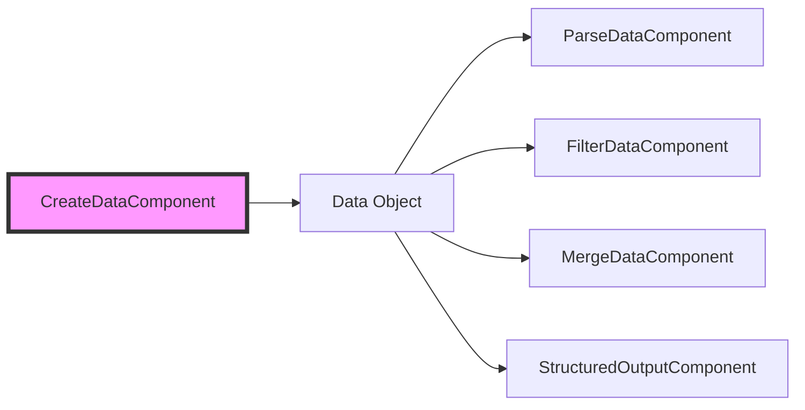
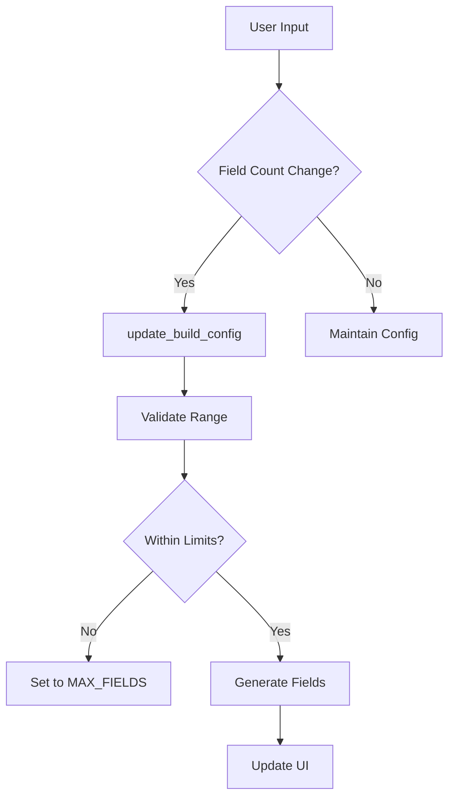

# Data Creation Module Documentation

## Introduction

The data_creation module provides a dynamic data generation component that allows users to create structured data objects with customizable fields. This module is part of the data_processing subsystem and serves as a foundational component for data manipulation workflows in the Langflow system.

## Core Component: CreateDataComponent

### Overview

The `CreateDataComponent` is a versatile component that enables dynamic creation of `Data` objects with a specified number of fields. It provides real-time configuration updates and validation capabilities, making it suitable for various data generation scenarios.

### Key Features

- **Dynamic Field Generation**: Create data objects with up to 15 configurable fields
- **Real-time Configuration**: Updates the component interface based on the number of fields specified
- **Text Key Validation**: Optional validation to ensure specified text keys exist in the data
- **Data Type Support**: Accepts both Message and Data types as field inputs
- **Legacy Support**: Maintains backward compatibility with existing implementations

### Component Architecture

### Component Interface

#### Inputs

| Input Name | Type | Description | Advanced |
|------------|------|-------------|----------|
| `number_of_fields` | IntInput | Number of fields to create (1-15) | No |
| `text_key` | MessageTextInput | Key for text content identification | Yes |
| `text_key_validator` | BoolInput | Enable text key validation | Yes |
| `field_{i}_key` | DictInput | Dynamic field inputs (generated) | No |

#### Outputs

| Output Name | Type | Description |
|-------------|------|-------------|
| `data` | Data | The created data object |

### Data Flow

### Key Methods

#### `update_build_config(build_config, field_value, field_name)`

Dynamically updates the component configuration based on the number of fields specified:

- Validates field count against `MAX_FIELDS` limit (15)
- Preserves existing field configurations when reducing field count
- Generates new `DictInput` fields for additional fields
- Handles real-time UI updates

#### `build_data()`

Main execution method that:

- Retrieves data from component attributes
- Creates a new `Data` object with the specified text key
- Performs optional text key validation
- Updates component status

#### `get_data()`

Extracts and processes data from component attributes:

- Iterates through component attributes
- Handles `Data` objects by extracting text content
- Returns a dictionary of field key-value pairs

#### `validate_text_key()`

Validates that the specified text key exists in the data:

- Checks against available data keys
- Raises `ValueError` if key not found
- Provides helpful error message with available keys

### Integration with Data Processing Pipeline

The CreateDataComponent serves as the entry point for data processing workflows, generating data objects that can be consumed by other processing components.

### Dependencies

The CreateDataComponent relies on several core systems:

- **[Component System](component_system.md)**: Inherits from `Component` base class
- **[Schema Types](schema_types.md)**: Uses `Data` schema for data representation
- **[Field Typing](field_typing.md)**: Utilizes `RangeSpec` for input validation
- **[Input System](inputs.md)**: Leverages various input types (IntInput, DictInput, etc.)

### Configuration Management

### Error Handling

The component implements comprehensive error handling:

- **Field Limit Validation**: Prevents exceeding 15 fields with user-friendly error message
- **Text Key Validation**: Ensures specified text keys exist in the data
- **Type Conversion**: Safely handles field value conversions
- **Configuration Preservation**: Maintains existing field settings during updates

### Use Cases

1. **Dynamic Form Generation**: Create data structures based on user-specified field counts
2. **Data Template Creation**: Generate reusable data templates for workflows
3. **API Response Mocking**: Create sample data for testing and development
4. **Data Transformation**: Prepare data structures for downstream processing

### Best Practices

1. **Field Naming**: Use descriptive field names for better data understanding
2. **Text Key Selection**: Choose appropriate text keys for data identification
3. **Validation Usage**: Enable text key validation for data integrity
4. **Performance Consideration**: Limit field count to necessary fields for optimal performance

### Related Components

- **[ParseDataComponent](data_parsing.md)**: Processes and extracts data from various sources
- **[FilterDataComponent](data_filtering.md)**: Filters data based on specified criteria
- **[MergeDataComponent](data_merging.md)**: Combines multiple data objects
- **[StructuredOutputComponent](structured_output.md)**: Generates structured output from data

### API Reference

For detailed API documentation, see the [Data Processing API Reference](data_processing_api.md).

---

*This documentation is part of the [Data Processing Module](data_processing.md). For information about other modules, see the [Module Index](index.md).*