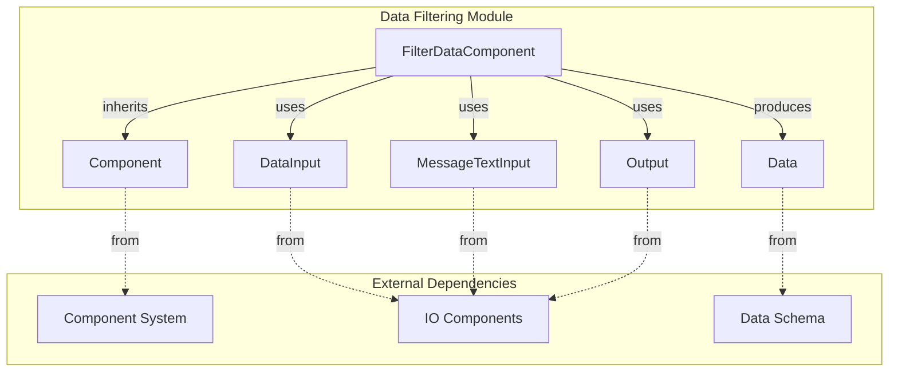
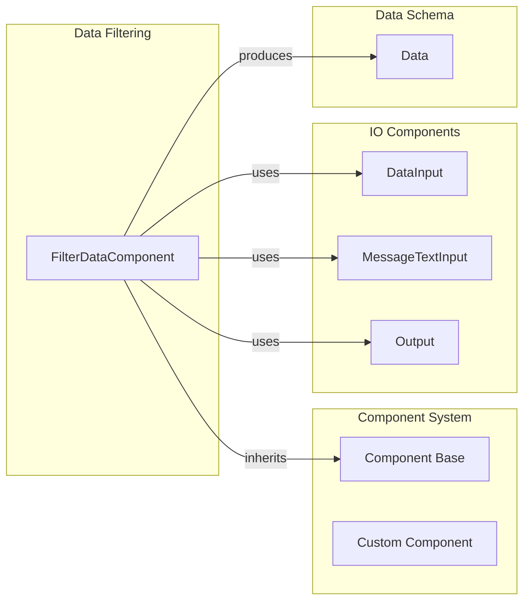
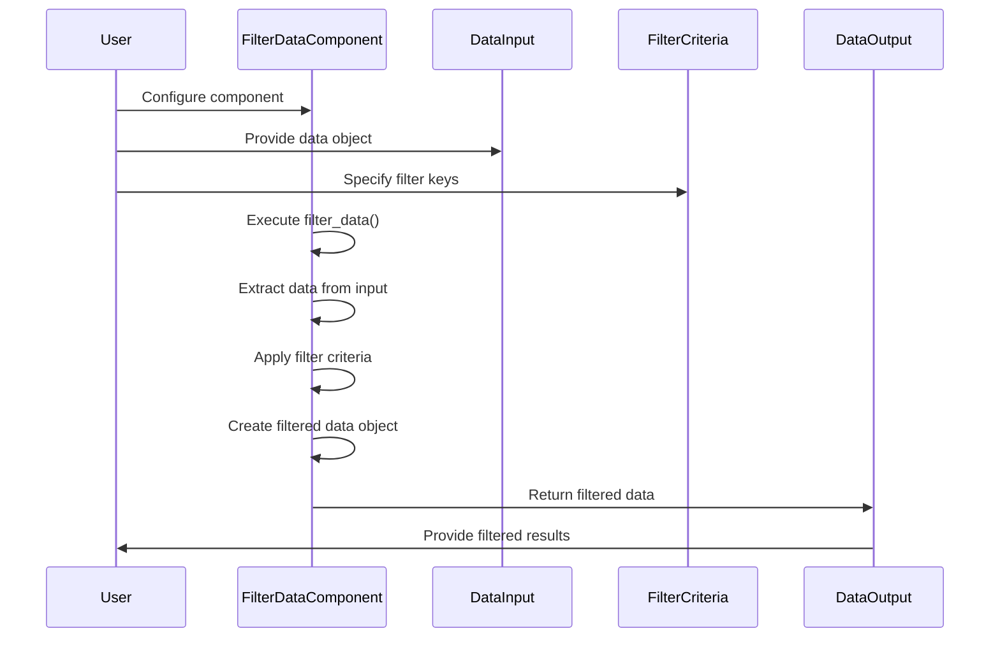
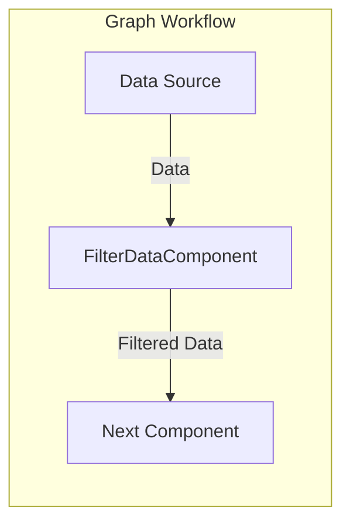
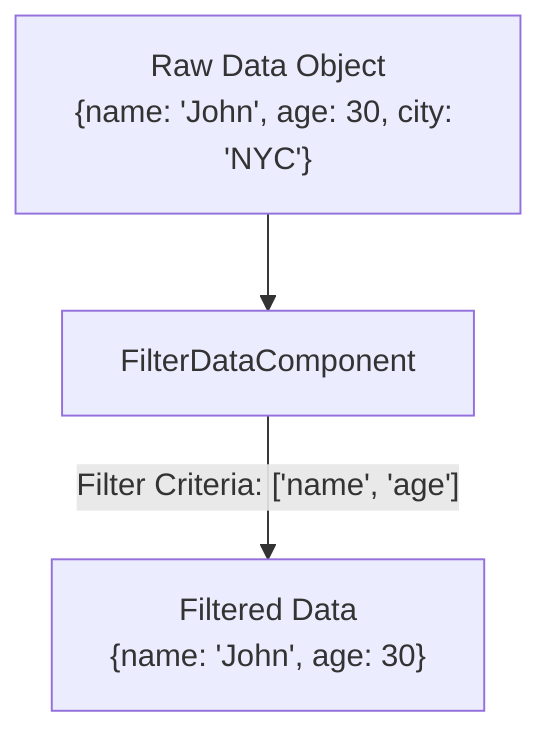
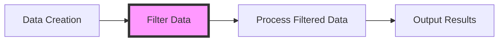

# Data Filtering Module

## Introduction

The Data Filtering module provides functionality to filter data objects based on specified criteria within the Langflow system. This module is part of the data processing pipeline and enables users to extract specific fields from complex data structures, making it an essential component for data transformation workflows.

## Overview

The Data Filtering module implements a single core component, `FilterDataComponent`, which provides a user-friendly interface for filtering data objects based on a list of keys. This component is designed to work seamlessly with Langflow's data processing ecosystem and integrates with the broader graph-based workflow system.

## Architecture

### Component Architecture



### Module Dependencies



## Core Components

### FilterDataComponent

The `FilterDataComponent` is the primary component of the data filtering module. It provides functionality to filter data objects based on specified criteria.

**Key Properties:**
- **Display Name**: "Filter Data"
- **Description**: "Filters a Data object based on a list of keys."
- **Icon**: "filter"
- **Status**: Beta (Legacy)
- **Name**: "FilterData"

**Inputs:**
1. **Data Input** (`data`)
   - Display Name: "Data"
   - Purpose: Data object to filter
   - Type: DataInput

2. **Filter Criteria** (`filter_criteria`)
   - Display Name: "Filter Criteria"
   - Purpose: List of keys to filter by
   - Type: MessageTextInput (List)

**Outputs:**
1. **Filtered Data** (`filtered_data`)
   - Display Name: "Filtered Data"
   - Method: `filter_data()`
   - Type: Data

## Data Flow



## Implementation Details

### Filter Logic

The filtering process follows these steps:

1. **Input Validation**: The component receives filter criteria as a list of strings
2. **Data Extraction**: Extracts the data from the input Data object or uses an empty dictionary
3. **Filtering**: Creates a new dictionary containing only key-value pairs where the key exists in the filter criteria
4. **Output Generation**: Creates a new Data object with the filtered data

### Code Structure

```python
def filter_data(self) -> Data:
    # Extract filter criteria and data
    filter_criteria: list[str] = self.filter_criteria
    data = self.data.data if isinstance(self.data, Data) else {}
    
    # Apply filtering logic
    filtered = {key: value for key, value in data.items() if key in filter_criteria}
    
    # Create and return filtered data object
    filtered_data = Data(data=filtered)
    self.status = filtered_data
    return filtered_data
```

## Integration with Langflow System

### Graph Integration

The FilterDataComponent integrates with Langflow's graph system as a vertex node:



### Component Classification

- **Type**: Processing Component
- **Category**: Data Processing
- **Legacy Status**: Marked as legacy with beta flag
- **Integration**: Compatible with Langflow's component framework

## Usage Patterns

### Basic Filtering



### Workflow Integration



## Related Modules

The Data Filtering module is part of the broader data processing ecosystem:

- **[data_creation](data_creation.md)**: Creates data objects that can be filtered
- **[data_parsing](data_parsing.md)**: Parses data before or after filtering
- **[data_merging](data_merging.md)**: Merges filtered data with other datasets
- **[structured_output](structured_output.md)**: Formats filtered data for output

## Dependencies

### Internal Dependencies
- **Component System**: Inherits from base Component class
- **IO Components**: Uses DataInput, MessageTextInput, and Output classes
- **Data Schema**: Utilizes Data class for input/output

### External Dependencies
- **Custom Component Framework**: Integration with LFX custom component system
- **Graph System**: Compatible with vertex-based graph execution

## Configuration

### Component Properties
- **Beta Status**: Component is marked as beta, indicating potential changes
- **Legacy Flag**: Marked as legacy, suggesting future deprecation
- **Icon**: Uses "filter" icon for visual identification

### Input Configuration
- **Data Input**: Accepts any Data object
- **Filter Criteria**: Supports list-based key filtering
- **Validation**: Basic type checking for Data objects

## Best Practices

1. **Data Validation**: Ensure input data is properly formatted before filtering
2. **Filter Criteria**: Use specific key names to avoid unexpected results
3. **Error Handling**: Component handles missing data gracefully by defaulting to empty dictionary
4. **Performance**: Filtering is performed in-memory for optimal performance

## Limitations

1. **Legacy Status**: Component is marked as legacy, indicating potential future removal
2. **Beta Features**: May contain experimental features subject to change
3. **Key-Based Only**: Supports only key-based filtering, no complex query support
4. **Data Type**: Limited to Data object types, no direct support for other data structures

## Future Considerations

Given the legacy status of this component, users should:
- Consider migrating to newer filtering solutions when available
- Monitor deprecation notices in future Langflow releases
- Evaluate alternative data processing components for new implementations