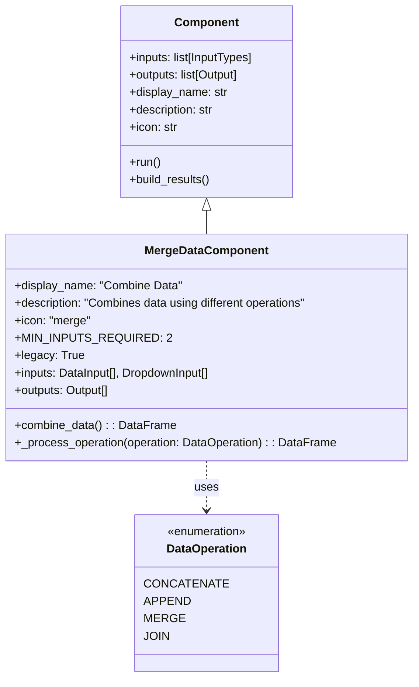
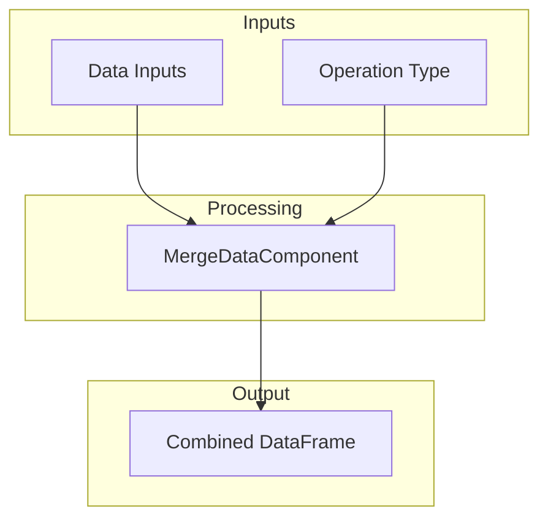
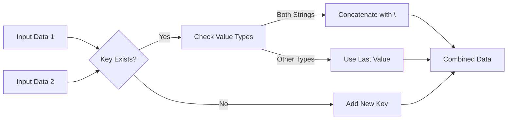
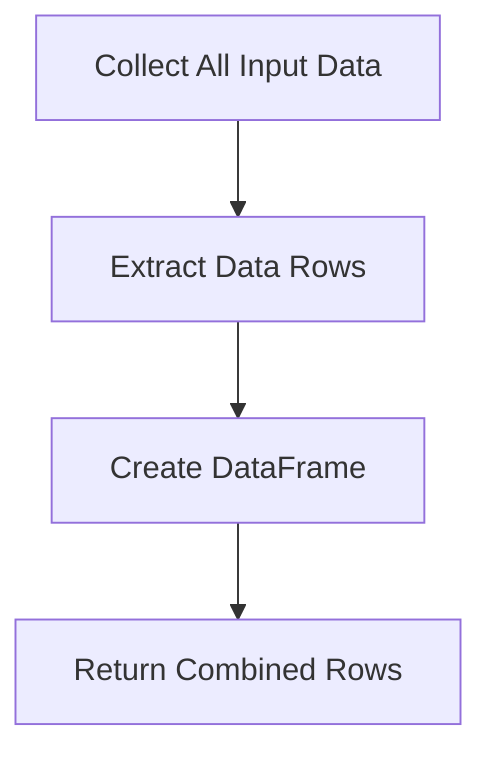
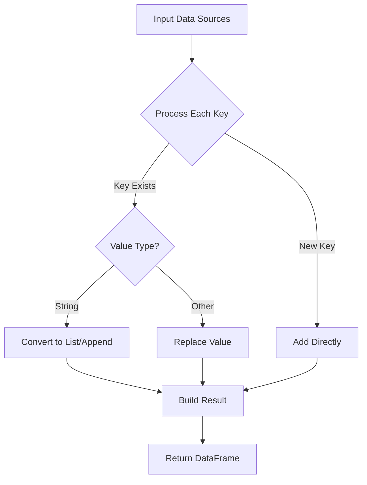
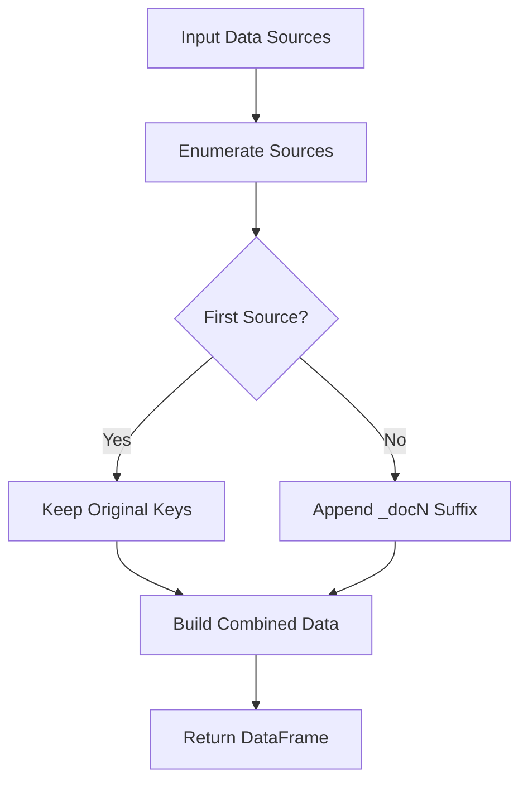
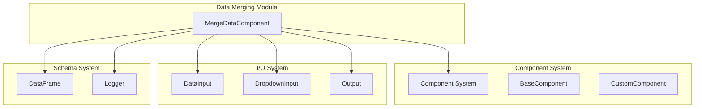
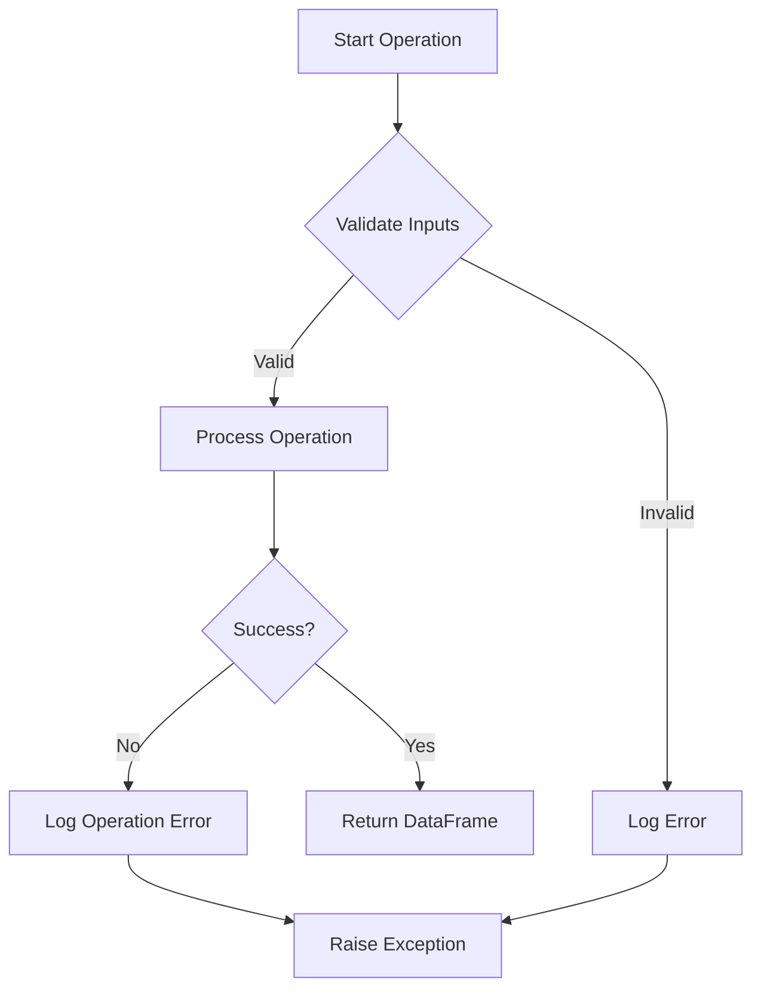

# Data Merging Module Documentation

## Overview

The data_merging module provides data combination and consolidation capabilities within the Langflow data processing ecosystem. It enables users to merge, concatenate, append, and join multiple data sources through a unified interface, supporting various data transformation workflows in AI and machine learning pipelines.

## Purpose and Core Functionality

The primary purpose of the data_merging module is to provide flexible data combination operations that can handle diverse data structures and formats. It serves as a critical component in data preprocessing pipelines, allowing users to consolidate information from multiple sources before feeding it to downstream AI models or analysis tools.

### Key Features

- **Multiple Merge Operations**: Supports four distinct data combination strategies
- **DataFrame Integration**: Native integration with the DataFrame schema for structured data handling
- **Flexible Input Handling**: Accepts multiple data inputs with automatic type detection
- **Error Handling**: Comprehensive error management with detailed logging
- **Legacy Support**: Maintains backward compatibility with existing workflows

## Architecture and Component Structure

### Core Component: MergeDataComponent

The `MergeDataComponent` is the central component of the data_merging module, inheriting from the base `Component` class and implementing specialized data combination logic.

### Input/Output Architecture

## Data Operations

### 1. Concatenate Operation
Combines data by merging key-value pairs, with special handling for string concatenation using newline separators.

**Process Flow:**

### 2. Append Operation
Creates a DataFrame with rows from each input data source, preserving the original structure.

**Process Flow:**

### 3. Merge Operation
Combines data with intelligent handling of duplicate keys, converting values to lists when necessary.

**Process Flow:**

### 4. Join Operation
Creates unique keys by appending document indices, preventing key collisions.

**Process Flow:**

## Dependencies and Integration

### Component System Integration

The data_merging module integrates with several key systems:

### Related Modules

- **[component_system](component_system.md)**: Provides the base Component class and custom component framework
- **[data_processing](data_processing.md)**: Parent module containing other data manipulation components
- **[schema_types](schema_types.md)**: Defines DataFrame and other data structure schemas

## Error Handling and Validation

### Input Validation
- **Minimum Input Requirement**: Enforces at least 2 data inputs
- **Type Validation**: Validates input data types before processing
- **Operation Validation**: Ensures selected operation is valid

### Error Management

## Usage Patterns

### Basic Usage
The component accepts multiple data inputs and applies the selected operation to produce a combined DataFrame output.

### Advanced Patterns
- **Chaining Operations**: Connect multiple MergeDataComponents for complex data transformations
- **Conditional Merging**: Use with conditional logic components for dynamic data combination
- **Data Validation**: Combine with data validation components for quality assurance

## Performance Considerations

### Memory Management
- Efficient handling of large datasets through streaming operations
- Memory-conscious data structure creation
- Automatic cleanup of intermediate results

### Processing Optimization
- Early validation to prevent unnecessary processing
- Optimized data structure operations for each merge type
- Minimal object creation during combination operations

## Extension Points

### Custom Operations
The module can be extended by:
- Adding new operations to the `DataOperation` enum
- Implementing custom `_process_operation` logic
- Creating specialized input validation rules

### Integration Points
- Custom DataFrame implementations
- Specialized logging and monitoring
- Extended error handling strategies

## Configuration

### Component Properties
- **display_name**: "Combine Data"
- **description**: "Combines data using different operations"
- **icon**: "merge"
- **legacy**: True (maintains backward compatibility)
- **MIN_INPUTS_REQUIRED**: 2

### Input Configuration
- **data_inputs**: List of DataInput objects, required, minimum 2 items
- **operation**: DropdownInput with operation selection, defaults to CONCATENATE

### Output Configuration
- **combined_data**: Single Output returning DataFrame result

## Best Practices

1. **Input Validation**: Always validate data inputs before processing
2. **Operation Selection**: Choose the appropriate operation based on data structure
3. **Error Handling**: Implement proper error handling for production workflows
4. **Performance Monitoring**: Monitor processing times for large datasets
5. **Data Quality**: Ensure data consistency across input sources

## Troubleshooting

### Common Issues
- **Insufficient Inputs**: Ensure at least 2 data inputs are provided
- **Type Mismatches**: Verify data types are compatible with selected operation
- **Memory Issues**: Consider processing large datasets in chunks

### Debug Information
- Detailed error logging for operation failures
- Component status tracking throughout processing
- Input validation feedback for configuration issues